## scroll-view

scroll-y 纵向滚动

滚动条距离顶部的距离

scroll-top="{{**scrollTop**}}" 

js中的data数据

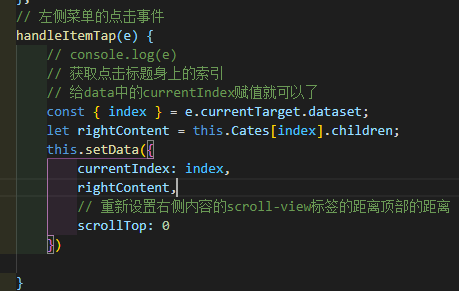

- 定位

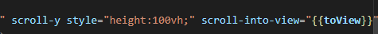

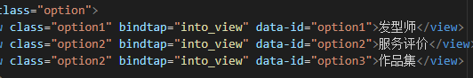

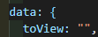

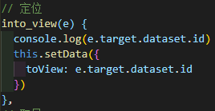

- 给定位的地方加id

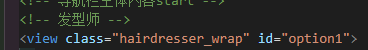

## 标题选项卡

效果

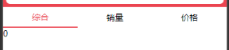

步骤：

- 创建自定义组件Tabs

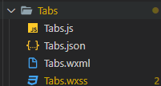

- 需要的页面引入自定义组件

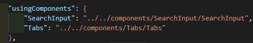

- 在html里面调用自定义组件，并给一个值传递给子组件

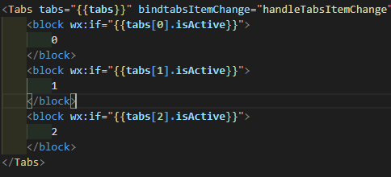

- 在页面的js中写好数据

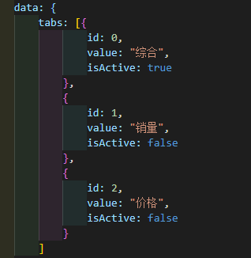

- 子组件Tabs.js中写好对应传来的数据

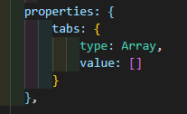

- 在子组件Tabs.wxml中渲染数据

- 对页面进行添加样式

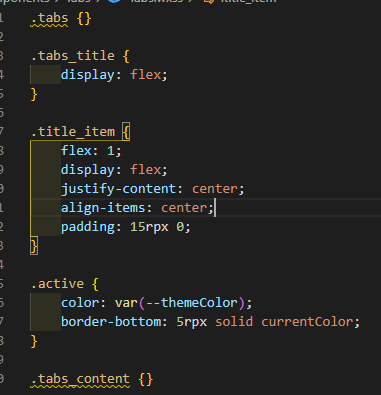

- 实现点击时下标active选择

  wxml中

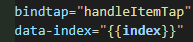

​		js中

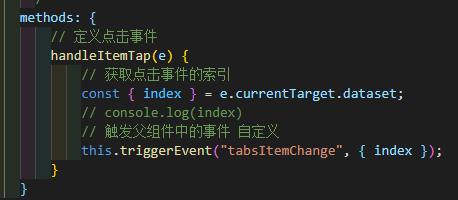

- 将传过去触发的事件回给父页面

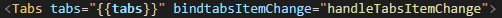

- 给父页面的js实现点击效果

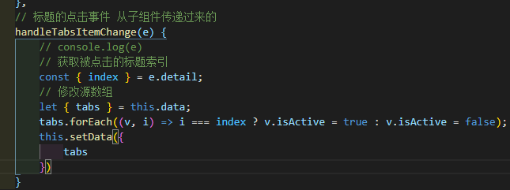

- 给Tabs.wxml中内容加入榻槽，用于给父页面传递内容

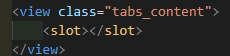

- 父页面接受传递过来的内容

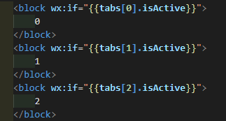

## 页面跳转

- 跳转页面传参数

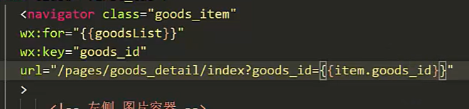

- 要跳的页面js

获取跳转的参数id

onload里面获取

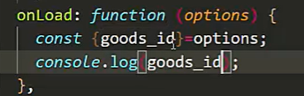

用id发送请求，url地址，和data中要传递的参数

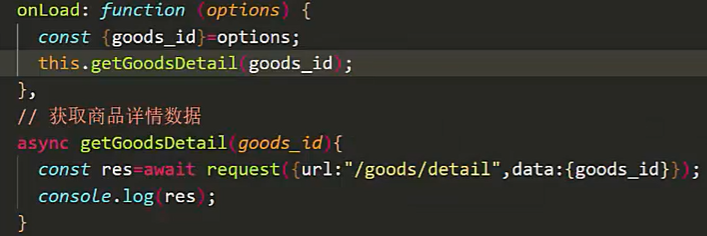

获取数据

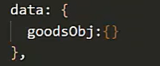

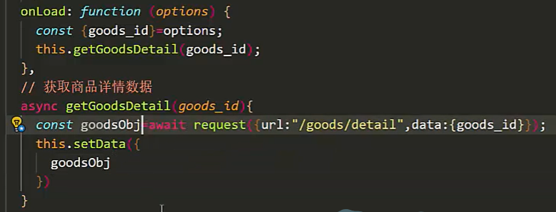

## 轮播图点击预览

swiper-item中轮播图点击预览事件，需要bindtap

## 获取收货地址

button绑定点击事件

获取权限状态

wx.getSetting

wx.chooseAddress获取收货地址

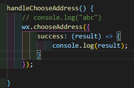

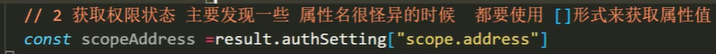

用户以前拒绝过授予权限，诱导用户打开 wx.openSetting

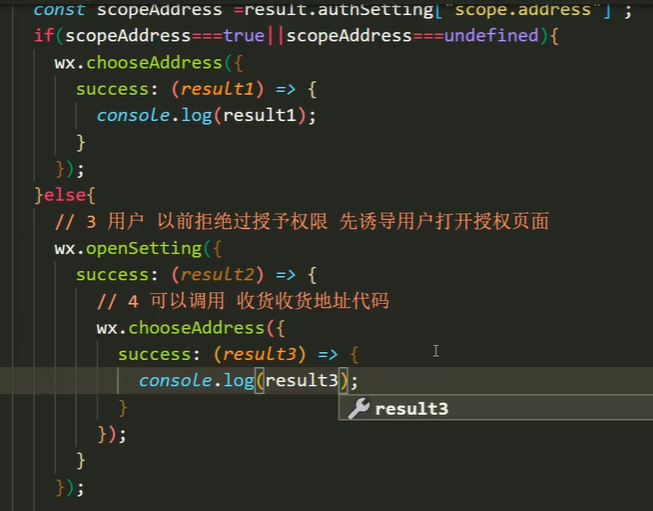

es7

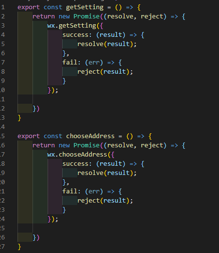

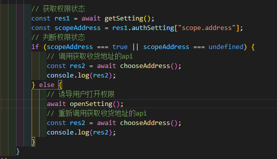

## 更改图片格式

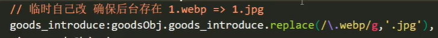

