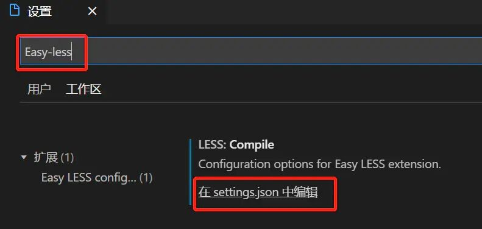
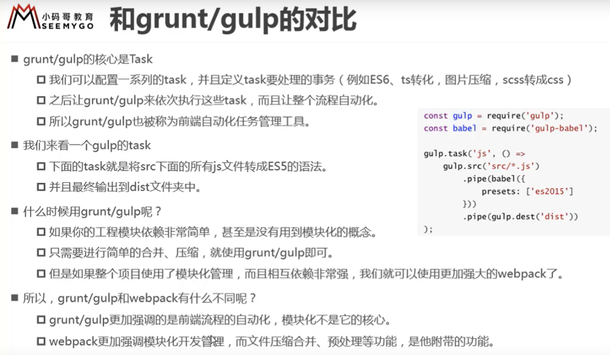

# HTML

## 通用

### HTML的优先级别

优先级由高到低：!important>行内样式>ID选择器>类选择器>标签选择器>继承样式

### 通用类名

```css
头部：					header
内容：					content/container
页脚/尾部：		 footer
导航：					nav
侧栏：					sidebar
栏目：					column
滚动：					scroll
登录条：			  loginbar
标志：					logo
广告：					banner
页面主体：			 main
热点：					hot
新闻：					news
下载：					download
子导航：			 subnav
菜单：					menu
子菜单：			 submenu
搜索：				  search
友情链接：      friendlink
版权：		      copyright
```

### 标签语义化

概念：根据内容的结构化（内容语义化），选择合适的标签（代码语义化）
含义：
         1:网页结构合理
    2:有利于seo:和搜索引擎建立良好沟通，有了良好的结构和语义，网页内容自然容易被搜索引擎抓取；
    3:方便其他设备解析（如屏幕阅读器、盲人阅读器、移动设备）
    4:便于团队开发和维护
注意事项：
         1：尽可能少的使用无语义的标签div和span；
         2：在语义不明显时，既可以使用div或者p时，尽量用p。要使用有语义的标签。
         3：不要使用纯样式标签，如：b、font、u等，改用css设置。
         4：需要强调的文本，可以包含在strong或者em标签中strong默认样式是加粗（不要用b），em是斜体（不用i）；

### 图标字体 icontfont

一般使用阿里巴巴的图库：www.icontfont.cn

## 标签

### meta

语法：<meta charset="utf-8"> 防止页面乱码           charset:字符集    utf-8:编码格式

作用：是HTML语言头部的一个辅助性标签，我们可以定义页面编码语言、搜索引擎优化、自动刷新并指向新的页面、控制页面缓冲、响应式视窗等

注意：该标签中的关键字不是给用户看的

### link

1、 链接外部文件，比如css文件

2、 设置网页图标

### 列表`ul、ol、il`

有序列表ol>li      无序列表:ul>li      自定义列表:dl>dt>dd   (dt中只能包含行内元素span/a)

列表项的标志类型：list-style-type: decimal;

列表标志位置：list-style-position: inside;//包含向右缩进到文本内部

列表项图像：list-style-image: url(arr.gif);

### 表格table

- cellspacing 设置td与td之间的距离

- cellpadding 设置内容与td左侧的距离

- caption:表格标题

- 合并边框border-collaspe:collapse;

- 文本对齐： text-align 属性设置水平对齐方式 ；vertical-align 属性设置垂直对齐方式
- 给tr或者td设置align属性，可以让其内容居中
- 合并单元格： ☞ 横向合并：colspan         ☞ 纵向合并：rowspan

> 注意：   给table标签设置align属性，只能让整个标签居中，内容不会居中；

```html
表格结构：<thead></thead>		<tbody></tbody>		<tfoot></tfoot>
```


### form

- 作用：收集用户数据

- 组成：提示信息 | 表单控件    | 表单域

**1、表单域：<form></form>**

- action : 设置后台处理数据的后台程序    
- method：提交数据给后台程序的方式
- get提交数据： 会将数据显示在地址栏中
- post提交数据： 会通过后台提交数据（安全性）

2、**表单控件**


分组控件和标题如下：


### 内联框架iframe

### animation

@keyframes关键帧动画

### 盒子模型 `div`

**盒子边框问题：**

原本两个盒子都占有边距，如果相邻，则需要把右盒子定义margin:（负值边框宽度）;

**盒子大小计算问题：**

原本盒子大小是盒子内容（即是定义的宽度width跟高度height）+盒子边框大小（盒子边距border）
如果想改变盒子计算方式，让其总大小为盒子内容大小，则需定义 box-sizing:border-box;

**计算盒子宽度：calc()函数**

### `input`

#### 清除输入框历史记录

- ：`autocomplete='off'`禁用自动完成功能，清除input框输入存留历史值，防止下拉历史值显示。`<input type="text" autocomplete="off"/>`

#### 使input文本框不可编辑的3种方法

1. disabled 属性规定应该禁用 input 元素，被禁用的 input 元素，不可编辑，不可复制，不可选择，不能接收焦点,后台也不会接收到传值。设置后文字的颜色会变成灰色。disabled 属性无法与 `<input type="hidden"> `一起使用。

   ```vue
   <input type="text" disabled="disabled" />
   ```

2. readonly 属性规定输入字段为只读可复制，但是，用户可以使用Tab键切换到该字段，可选择,可以接收焦点，还可以选中或拷贝其文本。后台会接收到传值. readonly 属性可以防止用户对值进行修改。

   readonly 属性可与 `<input type="text"> `或` <input type="password">` 配合使用。

   ```vue
   <input type="text" readonly="readonly">
   ```

3. readonly unselectable="on" 该属性跟disable类似，input 元素，不可编辑，不可复制，不可选择，不能接收焦点，设置后文字的颜色也会变成灰色，但是后台可以接收到传值。

   ```vue
   <input type="text"  readonly  unselectable="on" >
   ```

### 弹性模型 `display：flex`

- 可在不同方向排列元素；重新排列元素的显示顺序；更改元素的对齐方式；动态地将元素装入容器。

- > 弹性布局默认不改变项目的宽度，但是它默认改变项目的高度。如果项目没有显式指定高度，就将占据容器的所有高度。


## H5

### 变形transform（旋转、缩放、移动、倾斜）

- 旋转rotate(<angle>)    //angle为旋转角度，用deg作单位，如为负数，则表示逆时针旋转
- 缩放`scale(x,y)     scaleX(x)      scaleY(y)      //x,y为缩放倍数，值>1为放大，值<1为缩小
- 移动translate(x,y)      translateX(x)  translate(y)   //x,y为x轴y轴移动的距离
- 扭曲skew(x,y)     skewX(x)      skewY(y)      //x,y为数值，以deg作单位，水平/垂直
- 矩阵matrix(n,n,n,n,n,n)      matrix3d(n,n,n,n,n,n,n,n,n,n,n,n,n,n,n,n)      //2d为6值，3d为16值
- 3D  translate3d(x,y,z)    scale3d(x,y,z)    rotate3d(x,y,z,angle)
- perspective(n)     // 为3D 转换元素定义透视视图

```css
{//解决transform的兼容性问题    transform多个属性可以并写且不区分前后
	transform:rotate(7deg) scale(2,2) translate(100px,100px);
	-ms-transform:rotate(7deg) scale(2,2) translate(100px,100px); /* IE 9 */
	-moz-transform:rotate(7deg) scale(2,2) translate(100px,100px); /* Firefox */
	-webkit-transform:rotate(7deg) scale(2,2) translate(100px,100px); /* Safari and Chrome */
	-o-transform:rotate(7deg) scale(2,2) translate(100px,100px); /* Opera */
}
```

### canvas画布

rect(上,右,下,左) 裁剪

```js
var canvas = document.getElementById("canvas");
canvas.width = 800;
canvas.height = 600;
canvas.style.border = "1px solid #000";

// 创建画笔
var context = canvas.getContext("2d");

//绘制圆形
/*  context.arc(x,y,radius,startAngle,endAngle,bAntiClockwise);	
	x,y表示圆心，radius表示半径
	startAngle开始的度数（弧度）,endAngle结束的度数
	bAntiClockwise：true表示逆时针,false顺时针	*/

context.arc(400,300,100,Math.PI/3,3*Math.PI/2,true);
context.arc(200,300,100,0,2*Math.PI,false);
context.moveTo(100,100);
context.lineTo(400,100);
context.lineTo(400,200);
context.lineTo(100,200);
context.closePath();
// context.stroke();
// context.rect(100,100,300,100);
// context.strokeRect(100,100,300,100);
//裁剪区域clip():没有描边的路径
context.clip();
// 填充矩形
context.fillRect(0,0,800,600);
```

### SVG

### 滤镜：filter（过渡效果）

```css
// filter:函数(); 
filter:blur(5px);  //blur模糊处理，数值越大越模糊
Filter : .8s ; //代表过渡时间为0.8s
```

## CSS

介绍

- css指的是层叠样式表，也称级联样式表。
- CSS引入方式：行内式、嵌入式、链接式。

### **CSS优先级**

- !important > 内联样式 > id > class > 标签 > 通配符 > 继承 > 默认
- 内联样式'1000'；ID选择器'100'；类、伪类和属性选择器'10'；标签选择器和伪元素选择器'1'；通用选择器(*)、子选择器(>)、相邻同胞选择器(+)权值为0；且在同权重下，前面的会被后面的样式覆盖。

### 图片模糊处理

`filter:blur(2px);`：bulr里面的数字越高就越模糊

### **图片背景background**

```css
//背景平铺
background-repeat:repeat|no-repeat|repeat-x|repeat-y;

//背景图片位置	方位名词有：top|center|bottom|left|right
background-position:x y;

//背景图像固定
background-attachment:scroll|fixed;

//背景复合写法background:背景颜色 背景图片地址 背景平铺 背景图像滚动 背景图片位置
background:transprent url('img.jpg') repeat-y fixed top;	//背景透明，图像固定，图片在位置上方，向y轴平铺
```

### **边框:border**

- border:border-width | border-style | border-color;

- border-collapse控制浏览器绘制表格边框方式。border-collapse:collapse;//表示香菱边框合并一起。

- 边框会额外增加盒子的实际大小。解决方案：①测量盒子时不量边框；②如果测量时包含边框，则需width/height减去边框宽度。


```css
//CSS绘制三角形
.triangle{
    width:0;
    height:0;
    border-right:100px solid transparent;
    border-left:100px solid transparent;
    border-bottom:100px solid #3f6a6a;
}

//HTML
<div>用边框绘制三角形</div>
<div class="triangle"><div>
```

### **内边距:padding**

内边距为设置边框与内容之间的距离。

- 问题：当给盒子指定padding值后，内容和边框有了距离，添加了内边距；padding影响了盒子实际的大小。
- 解决方案：如果保证盒子跟效果图大小保持一致，则让width/height减去多出的内边距大小。

### 外边距margin

外边距为控制盒子和盒子之间的距离。

**外边距让块级盒子水平居中的条件：**

- ①盒子必须制定宽度width；
- ②盒子的左右外边距都设置为值auto。

**使用margin属性定义块元素的垂直边距时，可能会出现外边距的合并**，主要有两种情况：

- ①相邻元素垂直外边距的合并（尽量不给上下相邻两盒子都设置外边距）；
- ②嵌套块元素垂直外边距的塌陷
  - 1.可为父元素定义上边框；
  - 2.可为父元素定义上内边距；
  - 3.可谓父元素添加overflow:hidden。

**清除内外边距：padding:0;margin:0;**

**事先定义盒模型的尺寸解析方式box-sizing**

- box-sizing:content-box | border-box | inherit
- content-box：默认值，实际的宽度和高度=border+padding+设置内容的宽高;
- border-box:设置的内容宽度=实际的宽度和高度；
- inherit：此值使元素继承父元素的盒模型模式。

### 浮动float

#### **清除浮动方式**

```css/html
//1.额外标签法也称隔墙法，是W3C推荐做法；
<div style="clear:both"></div>

//2.父级添加overflow属性；(会无法显示溢出部分)
overflow:hidden/scroll/auto;

//3.父级添加after伪元素；双伪元素清除浮动
.clearfix:before,.clearfix:after{
	content:'';
	display:table;
}
.clearfix:after{
	clear:both;
}
.clearfix{
	zoom:1;
}

//4.父级添加双伪元素。
.clearfix:after{
	content:'';
	display:block;
	height:0;
	cleat:both;
	visibility:hidden;
}
.clearfix{
	zoom:1;
}
```

- 定位：position:relative | absolute | fixed;

  - 定位叠放次序：z-index:（数值越大，盒子越靠上）---只有定位的盒子才能使用

### 元素的显示模式转换display

`display:block/inline/inline-block;`


### lang属性

设置lang属性的好处：

- 根据lang属性来设定不同语言的css样式，或者字体
- 告诉搜索引擎做精确的识别
- 让语法检查程序做语言识别
- 帮助翻译工具做识别
- 帮助网页阅读程序做识别等等 

### font属性

font顺序 : font-style | font-variant | font-weight | font-size | line-height | font-family

-->翻译为样式、异体、粗细、大小/行高（一般设置为size+10px）、字体系列

**注**：简写时，font-size和line-height只能通过斜杠/组成一个值，不能分开写。其中不需要设置的属性可省略（取默认值为normal），但必须保留font-size和font-family属性，否则font属性将不起作用。

**`600<=font-weight<=900`时，字体会自动加粗**

`p {font: italic bold 20px/24px "微软雅黑";}`

### 文本属性text

```
1、字间距：letter-spacing和word-spacing
	-->letter-spacing为每个字符之间的空白距离，word-spacing为单词之间的空白距离

2、行高：line-height（一般设置为size+10px）

3、文本书写方向：direction：规定文本的方向 / 书写方向。
	-->ltr 默认。文本方向从左到右。      rtl 文本方向从右到左

4、文本轮廓：text-shadow:2px 2px 2px #fff
		-->X轴，Y轴，模糊程度(不可是负值)，阴影颜色 ；4个参数中，X和Y是必须的

5、添加到文本的修饰：text-decoration（下划线、上划线、删除线等）
text-decoration: underline/overline/line-through

5、文本排列：text-align:left/center/right

7、段落首行缩进：text-indent

8、控制文本大小写：text-transform

9、指定元素内的空白怎样处理：white-space: pre/nowrap
```

#### 内容超出以后显示省略点

```css
display:block;
white-space:nowrap;
overflow:hidden;
text-overflow:ellipsis;

//两行超出隐藏
overflow: hidden;
text-overflow:ellipsis;
display:-webkit-box;
-webkit-box-orient:vertical;
-webkit-line-clamp:2;
word-wrap: break-word;	//换行（不设置，会不换行，从而导致只显示一行）
line-height: 30rpx;
height: 60rpx;	// 一般来说，应设定高度=行高*显示的行数,防止超出的文字露出
```

**注意**

1. **内容超出显示的，通过省略号来显示，需要制定高度和行高，防止超出的文字露出（**应设定 高度 = 行高*显示的行数）
2. 给p::after添加渐变背景可避免文字只显示一半。
3. 由于ie6-7不显示content内容，所以要添加标签兼容ie6-7（如：`<span>…<span/>`）；兼容ie8需要将::after替换成:after。

#### 内容超出换行显示

当内容过多时如果是英文不会造成换行，如果希望内容换行，在标签的样式中加入`word-wrap:break-word;`
如果是中文会造成换行，如果不希望内容换行，在标签的样式中加入`white-space:nowrap;`

```css
word-break:normal;
display:block;
word-wrap:break-word;
overflow: hidden;
```

### 盒子阴影`box-shadow`

div盒子添加 box-shadow 属性，多边阴影需要用逗号隔开

```css
语法：box-shadow: h-shadow v-shadow blur spread color inset;
```


```css
//添加阴影最常见写法：
div{ box-shadow: 10px 5px #888888; }

// 例1、三边阴影
div{ box-shadow: 0 0 0 gray,
        		5px 5px 5px gray,
        		0 5px 5px gray,
        		-5px 5px 5px gray; }	

// 例2、内阴影：塌陷
div{ box-shadow: 0 0 15px black inset; }
```


### 计量单位

#### **CSS常见单位**

```
1. px：绝对单位。像素的大小是固定的，页面按照精准样式展示。

2. em：相对单位。基准点为父节点字体的大小，值不固定，会继承父级元素的字体大小，代表倍数；
em = 希望得到的像素大小 / 父元素字体像素大小
浏览器的默认字体高都是 16px，未经调整的浏览器显示1em=16px。

3. ex：相对长度单位。相对于字符**“x”的高度。通常为字体高度的一半**。

4. rem：相对单位，值并不是固定的，始终是基于根元素 <html> 的，也代表倍数。

5. vw：viewpoint width，视窗宽度，1vw等于视窗宽度的1%。

6. vh：viewpoint height，视窗高度，1vh等于视窗高度的1%。

7. %:百分比
```

#### **字体尺寸**

```
1. xx-small最小
2. x-small较小
3. small小
4. medium中等
5. large大
6. x-large较大
7. xx-large最大
```

#### **单行文字垂直居中**

如故宫行高小于盒子高度，文字会偏上，如果行高大于盒子高度，则文字偏下。

### CSS选择器

- 简单选择器：{根据名称、id、类来选取元素}
- 组合选择器：{根据他们之间的特定关系来选取元素}
- 伪类选择器：{根据特定的状态选取元素}
- 伪元素选择器：{选取元素的一部分并设置其样式}
- 属性选择器：{根据属性或属性值来获取元素}，如 a[target]

#### 样式选择器

```
1、td[title="a"]
	-->title属性值为a的td元素会被选择

2、td[title~="c"]  
	-->title属性值包含“c，且c前后只能有空格”的td元素会被选择

3、td[title|="h"]  
	-->title属性值为“h开头，且h只能为独立单词，后面可跟连字符”的td元素会被选择

4、td[title^="l"]
	-->title属性值为“l开头”的td元素会被选择

5、td[title$="o"]
	-->title属性值为“o结尾”的td元素会被选择

6、td[title*="x"]
	-->title属性值“包含x”的td元素会被选择
```

#### 属性选择器

```
1、CSS并集选择器    

2、CSS交集选择器 

3、CSS派生选择器
	-->	子代：p > em{}    
		兄弟：p+em{} p    
		后代：p em{}      
		元素1~元素2：

4、CSS伪类选择器    
	-->必须按顺序写：a:link，a:visited， a:hover，	a:active；还有其他伪类：li:first-child       input:focus

5、伪元素选择器
	-->h1:before，h2:afte， p:first-line

6、兄弟选择器：
-->元素1~元素2：第1 个元素之后所有的元素2 都会被选择，且这些元素和第一个元素拥有同一个父元素（两个元素之间不一定要相邻）
```

## 定位

1. 作用： 通过定位可以移动元素位置。
2. 使用场景：当页面中出现盒子压盒子的效果时，推荐使用定位。
3. 特点：定位体现的是元素之间的层级关系
4. 分类：静态定位      绝对定位       相对定位       固定定位
5. 定位问题：要设置坐标，必须先脱离文档流（即设置定位）

### 静态定位

 语法：  position: static;
以下语法不能使用：  left: 10px； top: ;  bottom: ;   right:;
特点：
		◇ 静态定位不能移动元素位置
		◇ 静态定位的元素就是标准流元素的显示方式

### 绝对定位

语法： position: absolute;
绝对定位的位置移动特点：
		☞如果一个元素设置了绝对定位，如果该元素的父元素设置了静态定位或者没有定位，那么当前子元素是以body(浏览器)左上角为参照进行位置移动。
		☞如果一个子元素设置了绝对定位，如果该子元素的父元素设置了除静态定位以外的其他定位，那么当前绝对定位的子元素会以父元素左上角为参照进行位置移动。
特点：
		☞ 绝对定位的元素脱标不占位置
		☞ 绝对定位可以实现模式转换

### 相对定位

语法：position: relative;
特点：
		 ☞ 相对定位元素是以元素原来的位置为参照设置定位。
		☞ 相对定位的元素占位置。
		☞ 不能实现模式转换
		☞ 一般情况下要设置 子绝父相

### 固定定位

语法：position: fixed;
特点：
		☞固定定位的元素脱标不占位置
		☞固定定位的元素可以实现模式转换
		☞ 固定定位的元素始终是以body(浏览器)可视区域（在可以看到的区域内，滑动到下面，还是固定在那个位置）为参照设置定位。

### z-inde

定位元素的特点：

​       ☞ 只有（除静态定位）定位的元素有层级关系

​       ☞ 通过z-index属性改变层级关系

​    层级关系特点：

​       ☞ 当给一个元素设置了定位，那么该元素默认的层级z-index值是auto(0)

​       ☞ 当z-index值相同的情况下，那么最后的定位元素层级要高于前面的定位元素。【后来居上原则】

​       ☞ 当z-index值不同的情况下，那么z-index值越大该元素的层级越高。

​       ☞ 如果元素的父元设置了z-index值,那么父元素的z-index值越大，那么该元素的层级越高。

越高的显示在越在上层。

### 定位盒子居中

盒子居中：margin: 0 auto;==》标准流的盒子居中显示

绝对定位的盒子居中显示：

​    Left:50%;       父元素高度的一半

​    Margin-left:元素自己宽度的一半

### vertical-align属性

☞ text-align   水平对齐
☞ vertical-align  垂直对齐
☞ 默认行内块元素（img,input）,有默认的vertical-align属性值。table标签也可以设置。
vertical-align: baseline(默认值)       top(顶部对齐)      middle(中部对齐)      bottom(底部对齐)

### 网页布局如何规避脱标流

1. 网页布局优先考虑标准流
2. 然后考虑使用浮动
3. 最后使用定位
4. 元素模式转换必须使用display

###  CSS元素的可见性(把元素隐藏起来)

```css
overflow:hidden;	//将溢出的部分隐藏
visibility:hidden;	//元素隐藏（隐藏的内容占位置一般用于)
display:none;		//元素隐藏（隐藏的内容不占位置一般用于导航栏部分内容的隐藏)
display:block;		//显示元素
```

## 案例

### logo内容移除

1. 将a标签的背景background作为logo使用，所以点击图片也可以跳转。
2. 可以在logo中设置文字，但是要将文字移除给用户更好的体验。
3. （1）使用text-ident设置一个负值来移除logo中的内容，使用em也可以。
   （2）字体大小调为0    font-size:0px;
   （3）文字设置为透明色   color:transparent;

### 精灵图

首先精灵图是一张普通的图片,并且图片上**包含了若干张背景图片**
作用：设置元素的背景图片,为了减少网络 (http) 请求图片的次数
使用：
		1.先将精灵图作为盒子的背景图片
		2.通过background-position 在水平方向和垂直方向移动背景图片（移动距离可以用ps测（推荐），QQ截图也可以等

```css
background-position: left 10px top 15px;
//水平方向移动的距离 = 所显示图片在精灵图中的横坐标
//垂直方向移动的距离 = 所显示图片在精灵图中的纵坐标
```

### 滑动门

作用：可以制作导航（使用背景图片制作）
注意：使用背景图片导航的内容区域不能设置固定宽度，不然无法随内容变化。一定要使用内容将导航撑开

1. 制作网页导航
2. 滑动门导航使用背景图片制作
3. 内容只能定义高度，不能定义宽度（为了随内容增多也不会溢出）

### css样式优惠券

```css
// 横线
.grad1 {
    width: 250px;
    height: 100px;
    background: radial-gradient(circle at right top, transparent 10px,  #28A4F2 0) top left / 60px 51% no-repeat,
      radial-gradient(circle at right bottom, transparent 10px,  #28A4F2 0) bottom left /60px 51% no-repeat,
      radial-gradient(circle at left top, transparent 10px, #eeeeee 0) top right /190px 51% no-repeat,
      radial-gradient(circle at left bottom, transparent 10px, #eeeeee 0) bottom right /190px 51% no-repeat;
    filter: drop-shadow(3px 3px 3px rgba(0,0,0,.3));
}
```

```css
//竖向
.grad2 {	
    width: 100px;
    height: 120px;
	background:
                    radial-gradient(circle at left bottom, transparent 10px, #28A4F2 0) top left /60px 30px no-repeat,
                    radial-gradient(circle at right bottom, transparent 10px, #28A4F2 0) top right /60px 30px no-repeat,
                    radial-gradient(circle at left top, transparent 10px, #EFEFF4 0) bottom left /60px 90px no-repeat,
                    radial-gradient(circle at right top, transparent 10px, #EFEFF4 0) bottom right /60px 90px no-repeat;
   filter: drop-shadow(3rpx 3rpx 3rpx rgba(0,0,0,.3));
}

```


## 问题

### **图片自动为父元素大小**

设置图片高度为：inherit，就是让图片高度为父元素高度

### **为什么第一个子元素设置margin-top父元素会跟着移动**

问题：有时当我们设置子元素的margin-top，但是却发现子元素没有出现上外边距的效果，反而是父元素出现了上外边距的效果

原因：边距重叠：一个盒子和其子孙的边距重叠。根据规范，一个盒子如果没有上补白和上边框，那么它的上边距应该和其文档流中的第一个孩子元素的上边距重叠。

解决方案1、为父元素设置padding。2、为父元素设置border。3、为父元素设置 overflow: hidden 。4、父级或子元素使用浮动或者绝对定位absolute

### 文字环绕图片

把图片浮动，为防止文字/单词超出内容框，需要给文字设置word-break:break-all;

### 消除父代与子代间距

- **table消除 td 之间的间距：**

  有两种方式可以实现

  1.`<table cellspacing="0">   `

  2.css 的`border-collapse:collapse`样式

- **消除两个 li 之间重叠的边距：**

  `margin-left：-（减去定义的border边距）px;`

### **DIV的高度随着内容的增加而增加**


### 页面或者按钮为什么会抖一下？

**（1）节点位置样式引起的**

这个很好弄，就是两者用差不多一样的CSS样式，保证位置不会因为在切换导致变化。还有一点就是要注意加载图片有的时候会引起这种状况。还有就是选择一些有自适应的框架组件，比如说小程序里面图片的image组件中的mode属性，每次切换一下会计算一下适应的方位，这种计算的也会导致会抖一下，因为会出现这种“抖动”。

**（2）boder-box引起的**

boder-box这个属性可以避免很多兼容性的问题，就是那种一个手机一个样的尴尬情况。

他主要的作用就是让这个 div 或者 view 的 boder 边框和 padding 的距离向里面扩展。使这个 div 不会拉伸所在的父节点。但是也会遇到问题，就是我遇到一个“抖动“问题，就是由于状态切换的两个css样式都是设置的boder-box，但是一个有边框一个没有。切换的时候就会出现“抖动”，因为boder会向里面“挤”，还是那种东南西北都往里挤你设置的边框宽度的距离。

（3）由于设置了横向滑动条 over-flow:auto; 的原因.

解决方法:1.去掉滑动条    2.或者将弹出层或父级div宽度加大点. 不要刚刚好.

### CSS解决border影响元素宽高的问题（box-sizing属性）

​    一、按照变化修改元素的宽高属性（不推荐）

​    二、将 box-sizing 设置为 border-box ，然后给元素添加border宽度

### 把文字下滑线与文字距离宽一点

```css
text-decoration:none;border:1px solid;
```

### 内容框的输入法不能转换，固定输入法：`ime-mode:disabled； `

语法： me-mode : auto | active | inactive | disabled
参数：
	auto : 不影响IME的状态。与不指定ime-mode属性时相同
	active : 指定所有使用IME输入的字符。即激活本地语言输入法。用户仍可以撤销激活IME
	inactive : 指定所有不使用IME输入的字符。即激活非本地语言。用户仍可以撤销激活IME
	disabled : 完全禁用IME。对于有焦点的控件（如输入框），用户不可以激活IME

解析：我们给输入项添加属性style并将其值置为'ime-mode:disabled'，这样当在输入该项数据时就不能进行输入法转换了。如果当前是中文输入法输入的仍是英文字母。

### table隐藏tr/td时，显示错乱问题

1、当表格为多列的情况下，属性为”display:block”行的内容宽度仅与第一列宽度相同，也就是说无论你使colspan的属性值为多少，剩余列的空间都不进行解析。 

2、同一行反复的在”display:none;”与”display:block;”两个状态间切换时，表格的底部会持续的产生多余的空白空间以至于造成页面布局的扭曲。

解决方法： 

1、用`display:table-row`属性来调试，发现者FireFox下正常了(只针对单列显示,多列会出现换行情况.如果多列建议第二个方法)，但IE是不支持改属性的，怎么办呢？用JS来做判断，然后做兼容吧。 

2、另外一个很简单也很可行的方法，就是用` display: ' '`

### 取消表单项聚焦时产生的黄色边框

```css
input,button,select,textarea{ outline:none;}
textarea{ font-size:13px; resize:none;}
```

### CSS隐藏页面元素

- `opacity:0`：本质上是将元素的透明度将为0，就看起来隐藏了，但是依然占据空间且可以交互
- `visibility:hidden`: 与上一个方法类似的效果，占据空间，但是不可以交互了
- `overflow:hidden`: 这个只隐藏元素溢出的部分，但是占据空间且不可交互
- `display:none`: 这个是彻底隐藏了元素，元素从文档流中消失，既不占据空间也不交互，也不影响布局
- `z-index:-9999`: 原理是将层级放到底部，这样就被覆盖了，看起来隐藏了
- `transform: scale(0,0)`: 平面变换，将元素缩放为0，但是依然占据空间，但不可交互

## meta标签详解

### HTML5前

- `<meta>`标签是HTML语言头部的一个辅助性标签
- 作用：可以定义页面编码语言、搜索引擎优化、自动刷新并指向新的页面、控制页面缓冲、响应式视窗等


	属性								值									描述
	charset( H5 New)	character_set				定义文档的字符编码。
	content						text								定义与 http-equiv 或 name 属性相关的元信息。
	http-equiv				content-type				属性关联到 HTTP 头部。
										default-style		
										refresh	把 content
	name							application-name		把content 属性关联到一个名称。		
										author
										description
										generator
										keywords	
	scheme(H5 删除)		format/URI					HTML5不支持。 定义用于翻译 content 属性值的格式。
	整体来看，HTML5之前，meta标签只有两个主要属性，分别是 name 属性和 http-equiv 属性。 HTML5新添加"charset".

#### name

​	name属性主要用于描述网页，对应属性是 content ，以便于搜索引擎机器人查找、分类（目前几乎所有的搜索引擎都使用网上机器人自动查找meta值来给网页分类）。
​	语法：`<meta name="参数" content="参数值" />`

1.Keywords（为搜索引擎提供的关键字列表）

```
<meta name="keywords" content="程序员,程序猿,攻城狮"/>
```

2.Description（告诉搜索引擎你的网站主要内容）

```
<meta name="description" content="meta标签是HTML中的一个重要标签，位于HTML文档头部的<HEAD>标签和<title>标签间"/>
```

3.robots（机器人向导）

```
说明：robots用来告诉搜索机器人哪些页面需要索引，哪些页面不需要索引。
语法：<meta name="robots" content=""/>

content的参数值有all,none,index,noindex,follow,nofollow，默认值是all。
参数说明：
	all：文件将被检索，且页面上的链接可以被查询； 
	none：文件将不被检索，且页面上的链接不可以被查询； 
	index：文件将被检索； 
	follow：页面上的链接可以被查询； 
	noindex：文件将不被检索，但页面上的链接可以被查询； 
	nofollow：文件将被检索，但页面上的链接不可以被查询；
```

4.author（标注网页的作者）

```
<meta name="author" content="TG,TG@qq.com"/>
```

5.copyright（标注版权）

```
<meta name="copyright" content="本网站版权归TG所有"/>
```

6.generator（说明网站采用什么编辑器制作）

```
<meta name="generator" content="你所用的编辑器"/>
```

7.revisit-after（网站重访）

```
<meta name="revisit-after" content="7days"/>
```

#### http-equiv

​	http-equiv类似于HTTP的头部协议，它回应给浏览器一些有用的信息，以帮助正确和精确地显示网页内容。
​	与之对应的属性值为content，content中的内容其实就是各个参数的变量值。

```
语法：<meta http-equiv="参数"  content="参数值"/>
```

**参数说明：**
	1.Expires（期限）

````
说明：指定网页在缓存中的过期时间，一旦网页过期，必须到服务器上重新传输。
语法：<meta http-equiv="expires" content="Wed, 26 Feb 1997 08:21:57 GMT"/>

注意：必须使用GMT的时间格式，或者直接设为0（数字表示多久后过期
````

2.Pragma（cache模式）

```
说明：禁止浏览器从本地计算机的缓存中访问页面内容。
语法：<meta http-equiv="Pragma" content="no-cache"/>

注意：网页不保存在缓存中，每次访问都刷新页面。这样设定，访问者将无法脱机浏览。
```

3.Refresh（自动刷新并指向新页面）

```
<meta http-equiv="refresh"content="5; url=http://www.baidu.com/"/>
	其中的5表示5秒后自动刷新并调整到URL新页面。
```

4.Set-Cookie（cookie设定）

```
说明：浏览器访问某个页面时会将它存在缓存中，下次再次访问时就可从缓存中读取，以提高速度。
当你希望访问者每次都刷新你广告的图标，或每次都刷新你的计数器，就要禁用缓存了。
如果网页过期，那么存盘的cookie将被删除。
	
语法：<meta http-equiv="Set-Cookie"  content="cookievalue=xxx; expires=Wednesday,21-Oct-98 16:14:21 GMT; path=/">

注意：必须使用GMT的时间格式
```

5.Window-target（显示窗口的设定）

```
说明：强制页面在当前窗口以独立页面显示
语法：<meta http-equiv="Window-target" content="_top"/>
可以用来防止别人在框架里调用你的页面。
```

6.content-Type（显示设定页面使用的字符集）

```
<meta http-equiv="content-Type" content="text/html;charset=utf-8"/>
	
其他参数值：
	GB2312				简体中文
	BIG5					繁体中文
	iso-2022-jp		日文
	ks_c_5601			韩文
	ISO-8859-1		英文
	UTF-8					世界通用的语言编码；
在HTML5中，我们一般都是：<meta charset="utf-8"/>
```

7.content-Language（显示语言的设定）

```
<meta http-equiv="Content-Language" content="zh-cn"/>
```

8.http-equiv="imagetoolbar"

```
<meta http-equiv="imagetoolbar" content="false"/>
指定是否显示图片工具栏，当为false代表不显示，当为true代表显示。
```

### HTML 5新增

#### name

1.viewport（屏幕的缩放）

```
说明：能优化移动浏览器的显示（屏幕的缩放）

语法：<meta name="viewport" content="width=device-width, initial-scale=1.0,maximum-scale=1.0, user-scalable=no"/>

参数值：
width viewport的宽度[device-width | pixel_value]width如果直接设置pixel_value数值，大部分的安卓手机不支持，但是ios支持；   
height – viewport 的高度 （范围从 223 到 10,000 ）   
user-scalable [yes | no]是否允许缩放   
initial-scale [数值] 初始化比例（范围从 > 0 到 10）   
minimum-scale [数值] 允许缩放的最小比例   
maximum-scale [数值] 允许缩放的最大比例   
```

2.format-detection（忽略电话号码和邮箱）

```
语法：
<meta name="format-detection" content="telephone=no">//忽略页面中的数字识别为电话号码
<meta name="format-detection" content="email=no"/>//忽略页面中的邮箱格式识别为邮箱
也可以写成：
<meta name="format-detection" content="telphone=no, email=no"/>  
```

3、浏览器内核控制：国内浏览器很多都是双内核（webkit和Trident），webkit内核高速浏览，IE内核兼容网页和旧版网站。而添加meta标签的网站可以控制浏览器选择何种内核渲染。（仅限360浏览器）

```
<meta name="renderer" content="webkit|ie-comp|ie-stand">
若页面需默认用极速核，增加标签：<meta name="renderer" content="webkit">
若页面需默认用ie兼容内核，增加标签：<meta name="renderer" content="ie-comp">
若页面需默认用ie标准内核，增加标签：<meta name="renderer" content="ie-stand">
```

```
各渲染内核的技术细节
内核			   			Webkit	  	IE兼容	  IE标准
内核版本		  		Chrome45   	IE6/7	  	IE9/IE10/IE11(取决于用户的IE)
HTML5支持		    	YES	       	NO	    	YES
ActiveX控件支持	   NO		 			YES	   		YES
```

4、WebApp全屏模式

```
<meta name="apple-mobile-web-app-capable" content="yes" /> 
<!-- 启用 WebApp 全屏模式 -->
```

5、隐藏状态栏/设置状态栏颜色：只有在开启WebApp全屏模式时才生效。content的值为default | black | black-translucent 。

```
<meta name="apple-mobile-web-app-status-bar-style" content="black-translucent" />
```

6、不同浏览器

```
<!-- 针对手持设备优化，主要是针对一些老的不识别viewport的浏览器，比如黑莓 -->  
<meta name="HandheldFriendly" content="true">  

<!-- 微软的老式浏览器 -->  
<meta name="MobileOptimized" content="320">  

<!-- uc强制竖屏 -->  
<meta name="screen-orientation" content="portrait">  

<!-- QQ强制竖屏 -->  
<meta name="x5-orientation" content="portrait">  

<!-- UC强制全屏 -->  
<meta name="full-screen" content="yes">  

<!-- QQ强制全屏 -->  
<meta name="x5-fullscreen" content="true">  

<!-- UC应用模式 -->  
<meta name="browsermode" content="application">  

<!-- QQ应用模式 -->  
<meta name="x5-page-mode" content="app">  

<!-- windows phone 点击无高光 -->  
<meta name="msapplication-tap-highlight" content="no">
```

#### http-equiv

```
1、优先使用 IE 最新版本和 Chrome
<meta http-equiv="X-UA-Compatible" content="IE=edge,chrome=1" />  

<!-- 关于X-UA-Compatible -->  
<meta http-equiv="X-UA-Compatible" content="IE=6" ><!-- 使用IE6 -->  
<meta http-equiv="X-UA-Compatible" content="IE=7" ><!-- 用于在IE8版本浏览器中使用IE7渲染来避免出错 -->  
<meta http-equiv="X-UA-Compatible" content="IE=8" ><!-- 使用IE8 -->


2、转码申明：用百度打开网页可能会对其进行转码（比如贴广告），避免转码可添加如下meta
<meta http-equiv="Cache-Control" content="no-siteapp" />
```

#### charset

	<meta charset="UTF-8">
	其他参数值：
	GB2312				简体中文
	BIG5					繁体中文
	iso-2022-jp		日文
	ks_c_5601			韩文
	ISO-8859-1		英文
	UTF-8					世界通用的语言编码；
	在HTML5中，我们一般都是：<meta charset="utf-8"/>

# JS

## JS理念

### JS是什么？

- 解析执行，轻量级解析型，一行一行解析的。

- 是一种运行在客户端的脚本语言，不需编译，运行过程中由js解释器(js引擎)逐行进行解释并执行；
- js来源：借鉴了c语言、java语言等-->(简化式)函数式编程+（简化式）面向对象编程；
- ES6既是一个历史名词，也是泛指5.1版本后的js的下一个标准。

#### js组成

- ECMAScript(js语法规范)、Web API（BOM页面文档对象模型、DOM浏览器对象模型）。
- BOM:onload页面加载事件、window顶级对象；定时器；location、history
- DOM:获取页面元素、注册事件；属性、样式操作；节点属性、节点层级；动态创建元素

#### js引入方式

行内式、内嵌式、外部引入式。

#### js输出方式

alert（浏览器警示框）、console.log（控制台打印）、prompt（浏览器输入框）

#### JS特点：

- 解释性：C语言为编译性
- 基于对象：什么是对象
- 事件驱动：onclick、onmouseover、onmouseout
- 跨平台性：只跟浏览器有关
- 安全性：不允许访问硬盘，不能对网络文件进行修改和删除

#### Document 和 body 之间的区别

整体和部分的关系，body只包含网页的局部

### 事件循环`Event Loop`与JS循环机制

#### 浏览器事件循环


1. 首先执行同步代码，这属于宏任务
2. 当执行完所有同步代码后，执行栈为空，查询是否有异步代码需要执行
3. 执行所有微任务
4. 当执行完所有微任务后，如有必要，会渲染页面
5. 然后开始下一轮`Event Loop`，执行宏任务的异步代码，即`setTimeout`中的回调函数

**以上整体为一次`Tick`**

- 异步任务：挂起加入到`Task`队中，等执行栈空了，再执行。
- 本质上来说JS中的同步还是异步行为，微任务的异步队列中，同样由主执行栈执行。
- 不同的任务源会被分配到不同的`Task`队列中，任务源分为微任务(task)和宏任务(jobs)。
- 微任务包括`process.nextTick、promise、MutationObserver`；
- 宏任务包括`script、setTimeout、setInterval、setImmediate、I/O、UI rendering`

```js
console.log('script start')
async function async1() {
  await async2()
  console.log('async1 end')
}
async function async2() {
  console.log('async2 end')
}
async1()
setTimeout(function () {
  console.log('setTimeout')
}, 0)
new Promise(resolve => {
  console.log('Promise')
    resolve()
})
  .then(function () {
    console.log('promise1')
  })
  .then(function () {
    console.log('promise2')
  })
console.log('script end')

/* script start
async2 end
Promise
script end
promise1
promise2
async1 end
setTimeout */
```

#### 浏览器与Node的事件循环(Event Loop)的区别

https://blog.csdn.net/Fundebug/article/details/86487117

### 抽象语法树`AST`

- 抽象语法和抽象语法树就是**源代码的抽象语法结构的树状表现形式**
- 浏览器通过`javascript Parser`解析器将js代码转化为抽象语法树来进行下一步的分析等其他操作。所以将js转化为抽象语法树更利于程序的分析。
- 常用的`javascript Parser`：esprima、traceur、acorn、shift。

**抽象语法树的作用**

- 代码语法的检查，代码风格的检查，代码的格式化，代码的高亮，代码错误提示，代码自动补全等等

  > 如：JSLint、JSHint 对代码错误或风格的检查，发现一些潜在的错误
  > IDE的错误提示，格式化，高亮，自动补全等等
  > 代码的混淆压缩
  > 如：UglifyJS2等

- 优化变更代码，改变代码结构达到想要的结构

  > 代码打包工具webpack，rollup等等
  > CommonJS、AMD、CMD、UMD等代码规范之间的转化
  > CoffeeScript、TypeScript、JSX等转化为原生Javascript

### 一次js请求的缓存处理

- `DNS`缓存：短时间内多次访问某个网站，在限定时间内，不用多次访问DNS服务器
- `CDN`缓存：内容分发网络，就近节点获取
- 浏览器缓存：浏览器在用户磁盘上，对最新请求过的文档进行了存储
- 服务器缓存：将需要频繁访问的Web页面和对象保存在离用户更近的系统中，当再次访问这些对象时加快访问速度。

## DOM

### script属性

```js
<script type="text/javascript" src=""  async></script>
//async:异步		defer：延时执行
//注意： 该属性指的是浏览器将外部js文件下载完成后，立马执行。
```

**1、节点元素：**父（parent）、子（child）和同胞（sibling）

**2、元素的属性**（包括对应标签的属性）

- 非表单元素的属性：id、src、title、href、alt
- 表单元素的属性：name、value、type、disabled、checked、selected
- 超链接-->取消默认行为的执行 ：return false;

### DOM节点属性

**nodeName**	--> nodeName 属性规定节点的名称，仅只读

- 元素节点的 nodeName 与标签名相同
- 属性节点的 nodeName 与属性名相同
- 文本节点的 nodeName 始终是 #text
- 文档节点的 nodeName 始终是 #document

**nodeType** 	-->  nodeType 属性返回节点的类型。仅只读

| 元素类型 | NodeType |
| -------- | -------- |
| 元素     | 1        |
| 属性     | 2        |
| 文本     | 3        |
| 注释     | 8        |
| 文档     | 9        |

**nodeValue** 	-->  nodeValue 属性规定节点的值

- 元素节点的 nodeValue 是 undefined 或 null
- 文本节点的 nodeValue 是文本本身
- 属性节点的 nodeValue 是属性值

### DOM方法

get(获取)、set(设置)、remove(移除)、create(创建)、insert(插入)、replace(替代)、append(添加)

- getElementById(id) - 获取带有指定 id 的节点（元素）
- appendChild(node) - 插入新的子节点（元素）
- removeChild(node) - 删除子节点（元素）
- createAttribute() - 创建属性节点

### DOM属性

- innerHTML - 节点（元素）的文本值
- parentNode - 节点（元素）的父节点
- childNodes - 节点（元素）的子节点
- attributes - 节点（元素）的属性节点

因为不可以直接输出自定义的属性，所以有了以下方法

- 获取标签对应的属性：getAttribute(“”); //属性可以是自定义，也可以是本身已有的
- 设置标签属性的值setAttribute(“属性名”，“属性值”);
- 移除标签属性 removeAttribute(“属性名”);

### DOM访问

- document.getElementById
- document.getElementByClassName
- document.getElementsByTagName
- document.getElementsByName

因为id是单数，所以不用s，name等可以多个，为复数，所以需要s

H5中query查询Selector选择器：querySelctor()

querySelctorAll(标签名/类名/id名等等)

### DOM修改（操作样式）

**操作样式：**设置类样式class 、设置行内样式style

```js
document.getElementById('ul').style.color = "lightgray";
```

**动态创建元素**（innerHTML、document.write、inerText）:动态创建元素优点-->提高网页性能，降低流量使用

**innerHTML 和 innerText 区别**

- innerHTML 返回的是标签内的html内容，包含里层的html标签
- inerText 返回的是标签的文本值，不包含html标签
- innerHTML 和 innerText，如果两个都写，下面的内容会把上面的内容覆盖

**document.write()**      //比如弹出新框的在线客服

当页面加载时，会产生输出流，这个输出流在页面加载完毕时关闭

如果输出流关闭后执行document.write()，它会开启一个新的输出流，页面会被覆盖

使用建议：使用document.write只可以在页面加载中，可以使用在弹出新窗口时

**innerHTML**

在设置时会覆盖原来的内容，但是可以通过+=去解决

**inerHTML 和 document.write 区别**

- innerHTML 是将内容写入某个DOM节点，不会导致页面全部重绘
- document.write 是直接将内容写入页面的内容流，会导致页面全部重绘

### DOM事件

onclick：点击事件				onfocus：获取聚焦事件    

onblur：失去焦点事件		onkeyup 当键盘弹起时   

onload用户进入页面			onunload用户离开页面


**事件三要素：**

事件源(触发的事件的元素 btn)-->事件名称(click )-->  事件处理程序(function)


```js
var li = document.getElementById('ul');
li. firstChild;			//获取第一个子节点	li.lastChild;			//最后的子节点
li.firstElementChild;	//获取第一个子元素	li.lastElementChild;	//最后的子元素
li.children;			//获取所有子元素	li.parentNode;			//获取父元素
li.childNodes；			//获取所有子节点
li.nextSibling;			//下一个兄弟节点		li.nextElementSibling;	//下一个兄弟元素（有兼容问题）
li.previousSibling;		//下一个兄弟节点		li.previousElementSibling;//下一个兄弟元素（有兼容问题）

```

### DOM实例


### DOM event 对象

Event对象代表事件的状态，比如事件在其中发生的元素、键盘按键的状态、鼠标的位置、鼠标按钮的状态。

事件句柄（Event Handlers）-àdom事件

鼠标/键盘属性


```js
var oEvent=ev||event;   //此为兼容各个浏览器，在需要获取和事件相关的信息时使用
```

- 获取键盘按下或弹起的按键
- 获取鼠标的位置坐标
- 获取出发改事件的元素
- 获取事件名称
- 获取事件当前的传播阶段
- 获取事件生成的日期时间

## BOM

使用 window 下的成员  window 可以省略

window.document

对话框：window.alert();   window.prompt();  window.confirm();

```js
//  window 对象本身具有name和top两个属性 其中top属性是只读的
var name = 123;	var top = 123;
console.log(typeof name);
console.log(top);
```

### **onload && onunload**

onload 页面加载完毕执行 （DOM元素加载完毕，当外部文件加载完毕）

onload = function () {}     

当关闭网页的时候执行    onunload = function () {}

### mouseover、mouseente

- onmouseover、onmouseout：鼠标经过时自身触发事件，经过其子元素时也触发该事件；（父亲有的东西，儿子也有）
- onmouseenter、onmouseleave：鼠标经过时自身触发事件，经过其子元素时不触发该事件。（父亲的东西就是父亲的，不归儿子所有）

> 总结：这四个事件两两配对使用，onmouseover、onmouseout一对，onmouseenter、onmouseleave一对，不能混合使用。

### 定时器

**1.  定时器setTimeout**

```js
//设置定时器：
var timer = setTimeout(function () {
   location.href = 'http://www.baidu.com'//location：跳转网页
  }, 5000); 	// 5秒以后跳转

//清除定时器：
clearTimeout(timer);
```

**2.  间隔定时器setInterval**

```js
// 间隔时间内做
var timerId = setInterval(function () {
  var date = new Date();
  console.log(date);
}, 1000);		//隔1秒做这个实践
clearInterval(timerId);
```

**3.  倒计时定时器**

```js
getInterval(start,end)
setInterval(函数，时间)
```

**定时器执行的原理，先后顺序**

1. setTimeout允许设置一个超时对象，超时后执行这个对象，但是只执行一次，无周期
2. setInternval允许设置一个超时对象，超时后执行这个对象，周期等于超时对象指定的时间，周期为无限循环

```js
// 案例：
setTimeout("alert('定时器!')",0);alert("测试");		//运行先出现测试，然后再出现定时器
```

原因:：JS是单线程的，会先阻塞等待定时器执行完后再执行下面的语句，

异步机制：浏览器的多线程—>对于浏览器来说，JS的执行只不过是在浏览器众多现成中的一条，称之为JS引擎线程，而浏览器其他线程则是通过JS引擎在执行过程到某个特定的功能后指定给浏览器的对应线程。

JS引擎线程先执行回调函数块，然后执行点击事件回调，接着是执行定时器的线程，最后再执行其他的线程。

案例中JS先读取到 setTimeout 定时器，，这个时候就会执行浏览器的线程，然后跳过定时器继续执行，这时就看到弹出框的内容为测试，然后因为定时器的时间为0，所以一执行定时器线程就会即可将弹出框为定时器字样的任务添加到主线程（JS引擎线程）的队列之后，等待JS引擎的调用，这个时候我们看到的结果是先弹出测试，然后再弹出定时器

另外要注意在 HTML5 规范中规定定时器的定时时间不能小于4ms，如果是小于4ms，则默认为4ms，所以在这个例子中的0，默认的是4ms，但是这个在不通过的浏览器中的表现是不同的，但是这个一般在项目中是没有什么印象的，这个只是仅做了解即可。


定时器在项目中除了可以作为定时的作用外还可以用来做耗时代码的优化：
 我们假设有这样的一个场景，就是在某个页面中要渲染50万个节点，这个时候对于一般的项目中，直接渲染是不可取的，因为这个时候会占用过多的内存，导致浏览器出现了卡死的状态，用户误以为是页面卡死而 直接关闭浏览器或者杀死进程，即使是用户不关闭页面这样给用户的体验也是不好的，这个时候我们要怎样来解决这个问题呢，我们可以利用定时器来优化这个问题首先我们可以把50万个节点分成多组，每组渲染  的节点数不要过多，然后通过setInterval来进行循环这个既不阻塞JS引擎线程的运行，又不可以提高渲染的消耗时间。从而达到最终的优化渲染。

如果是项目中有对个定时器的参与那么记得在一个定时器执行结束的时候记得要调用clearInterval或clearTimeout这两个方法来清除定时器，以免定时器之间互相干扰出现一些抓摸不定的现象

### location 对象

location 属性 href（跳转地址） search（） hash

location 方法 assign reload（重新加载） replace

### **history对象**  

作用：抑制页面后退back()/抑制页面前进forward()   //使后退   /前进按钮失效

```js
// back()      加载 history 列表中的前一个 URL   window.history.back() 

//forward()     加载 history 列表中的下一个 URL window.history.forward()

 // go()        加载 history 列表中的某个具体页面 window.history.go(-1)   //负数为后退，正数为前进，数字为前进/后退数

//History.pushState()方法用于在历史中添加一条记录。
window.history.pushState({page:1},“title”, '?page=1');

//History.replaceState()方法用来修改 History 对象的当前记录
history.replaceState({page:1},“title”, '?page=2');

state：一个与指定历史记录相关联的状态对象，当popstate事件触发时，会把该对象传入回调函数。如果不需要用到，可以传null。
title：页面的标题。但当前大多数浏览器都不支持或忽略这个值。可以传null。
url：添加或修改的history的网址。为了安全性，必须保持与当前URL同一个域。 
简而言之，两个方法的区别只是pushState添加一个最新的历史记录，而replaceState则是把当前的页面的历史记录替换掉。他们最大的特点是添加或替换历史记录后，浏览器地址栏会变成你传的地址，而页面并不会重新载入或跳转。
```

### popstate事件

当活动历史记录条目更改时，将触发popstate事件。如果被激活的历史记录条目是通过对history.pushState()的调用创建的，或者受到对history.replaceState()的调用的影响，popstate事件的state属性包含历史条目的状态对象的副本。

需要注意的是调用history.pushState()或history.replaceState()不会触发popstate事件。只有在做出浏览器动作时，才会触发该事件，如用户点击浏览器的回退按钮（或者在Javascript代码中调用history.back()或者history.forward()方法）

不同的浏览器在加载页面时处理popstate事件的形式存在差异。页面加载时Chrome和Safari通常会触发(emit )popstate事件，但Firefox则不会。


### **Navigator对象**

-->包含有关浏览器的信息

```js
navigator.userAgent	User-agent用户代理	//浏览器F12中network的（request-Headers）最底下。
navigator.appCodeName 		//返回浏览器的代码名
navigator.appName 			//返回浏览器的名称
navigator.appVersion 		//返回浏览器的平台和版本信息  
navigator.cookieEnabled 	//返回指明浏览器中是否启用 cookie 的布尔值  
navigator.platform 			//返回运行浏览器的操作系统平台  
navigator.userAgent 		//返回由客户机发送服务器的user-agent 头部的值 
navigator.javaEnabled() 	//指定是否在浏览器中启用Java  
navigator.taintEnabled() 	//规定浏览器是否启用数据污点(data tainting) 
```

## 方法

- toSource()返回该对象的源代码。 
- toString()把逻辑值转换为字符串，并返回结果。 
- valueOf() 返回 Boolean 对象的原始值。
- tagName返回元素的标签名    // document.children[0].tagName;//会返回HTML

**1、NaN属性：-->用于引用特殊的非数字值**

(英译为： Not a Number  ，表示不是一个数字)

isNaN() 来判断一个值是否是数字。原因是 NaN 与所有值都不相等，包括它自己。  

==>  isNaN(x)-->true:代表不是数字；false:代表是数字

**2、prompt()方法-->用于显示可提示用户进行输入的对话框**

```js
prompt("请输入您的姓名"); //接受用户输入的信息
```

**3、confirm()方法（确认框）-->可以通过这个来判断用户是否确定输入数据**

```js
//函数返回值是布尔型的，点击确定，返回值为true，点击取消返回值为false
// 1、主要用于删除单挑信息确认
function del() { 
 var msg = "您真的确定要删除吗？\n\n请确认！"; 
 if (confirm(msg)==true){ 
 	return true; 
 }else{return false;} 
}

// 2、JS删除确认框
<a href="javascript:if(confirm('确定删除吗?'))location='jb.php?id='">删除</a>

// 3、主要用于批量的确认提示
<input
  name="Submit"
  type="submit"
  class="inputedit"
  value="删除"
  onclick="{
      if(confirm('确定纪录吗?')){
        this.document.formname.submit();
        return true;
      }
      return false;
    }"
/>
<input
  name="按钮" 
  type="button" 
  ID="ok" 
  onclick="{
    if(confirm('确定删除吗?')){
      window.location='Action.asp?Action=Del&TableName=Item&ID=<%=ID%>';
      return true;
    }
    return false;
  }" 
  value="删除栏目"
/>
```

### 转义字符

（在输出字符串时候要是想带上引号，需要运用到转义字符）

```js
 \" -->转双引号			\' -->转单引号
 \r -->回车符			\n -->换行符
```

### console

```js
// 1、浏览器控制台打印出信息.输出获取元素对应的标签内容
console.log(x);

// 2、可以显示一个对象的所有属性和方法
console.dir(x);

// 3、typeof不能获取对象的具体类型,获取对象类型始终返回object
console.log(typeof x); 

// 4、认为构造函数就是对象的类型
console.log(arr.constructor);	

//5、会计算里边运行代码所需事件
console.time(x);-->在里边运行的代码-->console.timeEnd(x);	
```

### void关键字

```js
void 0 = undefined     // 一般用void 0替代undefined，除了防止被重写，还可减少字节

javascript:void()    // void会执行()里面的语句或表达式，返回值为undefined

javascript:void(0)   // 为执行js函数，0表示不执行函数，返回数值为undefined

javascript:void fun()  //此为执行fun函数，括号内可传参
```

### new

| 调用new的过程  |      自己实现new       |           new操作符具体干了什么            |
| :------------: | :--------------------: | :----------------------------------------: |
| 新生成一个对象 |     创建一个空对象     |   创建一个空对象，并且this变量引用该对象   |
|   链接到原型   |      获取构造函数      |             继承了该函数的原型             |
|    绑定this    |    设置空对象的原型    |     属性和方法被加入到this的引用对象中     |
|   返回新对象   | 绑定this并执行构造函数 | 新创建的对象由this所引用，最后隐式返回this |

```js
function create() {
  //创建一个空对象
  let obj = new Object();
  //获取构造函数
  let Constructor = [].shift.call(arguments);
  //链接到原型
  obj.__proto__ = Constructor.prototype;
  //绑定this值
  let result = Constructor.apply(obj, arguments);//使用apply，将构造函数中的this指向新对象，这样新对象就可以访问构造函数中的属性和方法
  //返回新对象
  return typeof result === "object" ? result : obj;//如果返回值是一个对象就返回该对象，否则返回构造函数的一个实例对象
}
```


## 数据类型

push() 方法可向数组的末尾添加一个或多个元素，并返回新的长度。

通过typeof运算符来确定JS变量的数据类型

```js
typeof "Bill"                 // 返回 "string"
typeof 3.14                   // 返回 "number"
typeof NaN                    // 返回 "number"
typeof false                  // 返回"boolean"
typeof [1,2,3,4]              // 返回 "object"
typeof {name:'Bill', age:62}  // 返回 "object"
typeof new Date()             // 返回 "object"
typeof function () {}        //返回"function"
typeof myCar                 //返回"undefined" 
typeof null                   // 返回 "object"
```

### `undefine`与`null`

`null`是一个表示”无”的**对象**，转为数值时为0；`undefined`是一个表示”无”的**原始值**，转为数值时为NaN。
`null`表示”没有对象”，即该处不应该有值
（1） 作为函数的参数，表示该函数的参数不是对象。
（2） 作为对象原型链的终点。
`undefined`表示”缺少值”，就是此处应该有一个值，但是还没有定义
（1）变量被声明了，但没有赋值时，就等于undefined。
（2) 调用函数时，应该提供的参数没有提供，该参数等于undefined。
（3）对象没有赋值的属性，该属性的值为undefined。
（4）函数没有返回值时，默认返回undefined。

### 数据类型转换

**转换为字符串类型：**x.toString()或String(x)

```js
String(x)         // 从数值变量 x 返回字符串
String(123)       // 从数值文本 123 返回字符串
String(100 + 23)  // 从表达式中的数值返回字符串
```

```js
x.toString()
(123).toString()
(100 + 23).toString()
```

**转换为数字类型：**Number(x)、paseIntI(x)、paseFloat(x)

- Number(x)：特点：通过该方法转化的数字类型保留原来值的内容
- paseIntI(x)：特点：通过该方法只能保留整数部分（返回的是一个整数）
- paseFloat(x)：特点：可以保留原来值内容，如果是非数字的字符串，直接保留数字部分

**转换为布尔类型：**Boolean(x)

### **数字Number**


### **字符串String**

- 数字0、NaN、空字符串""、false、undefined、null都会被识别为false。
- undefined：未定义或未初始化的变量，都为undefined。
- undefined和null的区别：如果变量为null，说明变量存在，只不过值是空值null。


### 计算精度问题

- 浮点数精度问题：浮点数值最高精度是17位小数，但进行算数计算时其精确度远不如整数。

```js
const result = 0.1 + 0.2；	//结果为0.30000000000000004
const mul = 0.07*100;		//结果为7.000000000000001
```

### 数组

- 数组转换
  - 将string数组转换为number数组：`strArr.map(Number);`
  - 将number数组转换为string数组：`numArr.map(String);`

### 可变参 arguments

- 虽然arguments对象并不是一个数组，但是访问单个参数的方式与访问数组元素的方式相同.
- 在js中 不需要明确指出参数名，就能访问它们。
- arguments是一个伪数组，存放所有的参数

```js
function test() {
 let s = "";
 for (let i=0;i<arguments.length;i++){
 	console.log(arguments[i]);
 	s += arguments[i] + ",";
 }
 return s;
}
test("name","age");	//输出name,age
```

```js
//不定长可变参
function sum(...num){//可以给多个参数到sum函数里面
    console.log(num);
}
sum(1,2,3,4,5,6,7,8,9,0);
```

### JSON

- JSON指的是JavaScript对象表示法（javascript object notation）

- JSON是轻量级的文本数据交互格式，并不是编程语言

- JSON独立于语言存在

- JSON具有自我描述性，更容易理解

- JSON可以将JavaScript对象中表示的一组数据转换为字符串，然后就可以在函数之间轻松地传递这个字符串，或者在异步应用程序中将字符串从Web客户机传递给服务器端程序。


**对象结构和数组结构**

Json简单说就是JavaScript中的对象和数组

- 对象表示为键值对，数据由逗号分隔，属性值的类型可以是数字、字符串、数组、对象
- 花括号保存对象，`{key:value,key:value,...}`
- 方括号保存数组，`['a', 'b', 'c']`

**JSON与对象的区别**

JSON 是 JavaScript 对象的字符串表示法，它使用文本表示一个 JS 对象的信息，本质是一个字符串。

```
var obj = {a: 'Hello', b: 'World'}; //是一个对象，注意键名也可以用引号包裹
var json = '{"a": "Hello", "b": "World"}'; //是一个 JSON 字符串，本质是一个字符串
```

**JSON 和 JavaScript 对象互转**

从JSON字符串转换为JavaScript 对象，使用 `JSON.parse() `方法：

```
var obj = JSON.parse('{"a": "Hello", "b": "World"}');
//结果是 {a: 'Hello', b: 'World'}
```

从JavaScript 对象转换为JSON字符串，使用` JSON.stringify() `方法：

```
var json = JSON.stringify({a: 'Hello', b: 'World'});
//结果是 '{"a": "Hello", "b": "World"}'
```

## 函数

#### `encodeURIComponent() `

encodeURIComponent() 函数可把字符串作为 URI 组件进行编码。

该方法不会对 ASCII 字母和数字进行编码，也不会对这些 ASCII 标点符号进行编码： - _ . ! ~ * ' ( ) 。

其他字符（比如 ：;/?:@&=+$,# 这些用于分隔 URI 组件的标点符号），都是由一个或多个十六进制的转义序列替换的。

```js
let url="http://w3cschool.cc/my test.php?name=ståle&car=saab";
let a = encodeURIComponent(url);
console.log(a);	// http%3A%2F%2Fw3cschool.cc%2Fmy%20test.php%3Fname%3Dst%C3%A5le%26car%3Dsaab
```


## 对象

### 对象操作

- 对象由属性(事物的特征，常用名词)和方法（事务的行为，常用动作，通常是继承的属性）组成。

- 创建对象三种方式：对象直接法、关键字 new 和 Object.create() 函数来创建对象。

- 删除对象中的某个属性

  - 方法1：`delete obj.name;`，但它的工作比其“替代”设置慢100倍`object[key] = undefined`

    > 删除`delete`是删除对象的属性没有任何剩菜剩下的唯一真正的方法。

  - 方法2：`obj.name=undfined;`但其属性还在，只是内容为空

  ```js
  let obj = {
    name: "willy",
    age: "age",
  }
  obj.name = undefined;
  console.log(obj); // { name: undefined, age: 'age' }
  delete obj.age;
  console.log(obj)  // { name: undefined }
  ```

- 在数组中使用`delete`，null会在数组中留下空缺，而且长度不变。

  ```js
  let array = [1,2,3];
  delete array[2];
  ```

  

### this

```js
// 函数中this --> window对象
function fn(){
    console.log(this);
}
fn();
//方法中this --> 是调用该方法的独享
var obj = {
    name: 'zs',
    say: function(){
        console.log(this);
    }
}
obj.say();
//构造函数中this --> 当前对象

//事件处理函数中this --> 触发事件的对象 事件源
```

### `Math`对象

- Math对象不是构造函数，它具有数学常数和函数的属性和方法。跟数学相关的运算（求绝对值、取整、最大值等）可使用。

```js
Math.PI	//圆周率		Math.abs()	//绝对值
Math.floor()//向下取整	Math.ceil()	//向上取整
Math.round()//四舍五入，注意-3.5 结果为-3
Math.max()	//最大值	Math.min()	//最小值
```

- Date对象是构造函数，需实例化后才能使用，Date实例用来处理日期和时间。

### `Array`对象

#### 数组调用方法

- push() 方法可向数组的末尾添加一个或多个元素，并返回新的长度。
- pop() 方法用于删除并返回数组的最后一个元素。
- unshift() 方法可向数组的开头添加一个或更多元素，并返回新的长度。
- Shift() 方法可向数组的开头删除一个或更多元素，并返回新的长度。
- sort() 方法用于对数组的元素进行排序。
- join() 方法用于把数组中的所有元素放入一个字符串。
- a.concat(b); 把b数组添加到a数组最后面

#### Array prototype函数（数组原型）

- prototype函数允许向Array()对象添加新属性和方法。
- 构造属性时，将为所有数组提供属性及其值，作为默认值。
- 构造方法时，所有数组将使用此方法。

**注意**：

- Array.prototype不是指单个数组，而是指Array()对象本身。
- prototype是一个全局对象构造函数，可用于所有JavaScript对象。

#### 字符串与数组转换

- `split()`方法是将一个字符串按照某一分隔符进行拆分为数组，而`join()`则正好相反。
  `join()`方法用于把数组中的所有元素放入一个字符串，元素是通过指定的分隔符进行分隔的。
- 使用``concat`函数,在字符串后面追加一个或多个字符

```js
let arr = [1,2,3];	
let res = arr.join(",");	// 1,2,3

let str = "13"
let strAdd = srt.concat("-123","-456");
```


## 页面宽高

### `offset、scroll、client`

- 网页可见区域高：document.body.clientHeight
- 网页正文全文高：document.body.scrollHeight

- 网页可见区域高（包括边线的高）：document.body.offsetHeight

- 网页被卷去的高：document.body.scrollTop
- 屏幕分辨率高：window.sreen.height

clientHeight 和 offsetHeight 属性和元素的滚动、位置没有关系它代表元素的高度

**clientHeight/clientWidth**：**包括padding但不包括border、水平滚动条、margin的元素的高度**。对于inline的元素这个属性一直是0，单位px，只读元素。

**offsetHeight/offsetWidth**：**内容+padding+border**.包括padding、border、水平滚动条，但不包括margin的元素的高度。对于inline的元素这个属性一直是0，单位px，只读元素。


**滚动条情况**

当本元素的子元素比本元素高且overflow=scroll时，本元素会scroll。

**scrollHeight/scrollWidth:** 因为子元素比父元素高，父元素不想被子元素撑的一样高就显示出了滚动条，在滚动的过程中本元素

有部分被隐藏了，scrollHeight代表包括当前不可见部分的元素的高度。而可见部分的高度其实就是clientHeight，即scrollHeight>=clientHeight恒成立。在有滚动条时讨论scrollHeight才有意义，在没有滚动条时scrollHeight==clientHeight恒成立。单位px，只读元素。

**scrollTop/scrollLeft:** 代表在有滚动条时，滚动条向下滚动的距离也就是元素顶部被遮住部分的高度。在没有滚动条时scrollTop==0恒成立。单位px，可读可设置。


 **offsetTop/offsetLeft:** 当前元素顶部距离最近父元素(offsetParent)顶部的距离,和有没有滚动条没有关系。单位px，只读元素。(获取的相对于offsetParent的距离)


**offsetParent/parentNode**:最近的脱离文档流的父元素，如果没有脱离文档流的父元素 就是body

## 语法运用

### 获取随机索引值

```js
function getRandomIntInclusive(min,max){
    min = Math.ceil(min);
    max = Math.floor(max);
    return Math.floor(Math.random() * (max -min + 1)) + min;
}
```

### 提取非行间样式

- currentStyle 适用于火狐浏览器
- getComputedStyle 适用于IE浏览器

### 自制滚动条

先把系统滚动条隐藏

根据内容大小设置滚动条高度（设置的滚动条内容高度越高，滚动条越小）

当拖动滚动条时候，移动内容（滚动条跟着鼠标走）

### 局部放大

### 遮罩层

### 定义选择到框内的状态

形如：input[type=text] 选择input标签中的文本类型的

Checkbox的checked 为选中状态

取反则是为非：!   形如：获取的变量.checked=!获取的变量.checked

### 替换内容问题

变量名.replace(“被替换内容”,“替换内容”);

替换类名：变量名.className = 变量名.className.replace(“被替者”,“替换者”);

//只是替换了replace的内容，class中定义的其他类名还是存在的，

比如class="aa bb cc"，当你relpace("aa","dd")，其他两个bb,cc的类名仍然存在

### 阻止事件冒泡

1、阻止事件冒泡在事件结尾处添加cancelBubble=true;
oEvent.cancelBubble = true; //取消事件冒泡（否则点击按钮后，会冒泡到最后一层上即document）

```html
<div id='div' onclick='alert("div");'>
	<ul onclick='alert("ul");'>
		<li onclick='alert("li");'>test</li>
	</ul>
</div>
```

当我点击test的时候，先会弹出 li ->ul ->div。从下往上冒泡。就比如小鱼儿在海底冒泡，小泡泡从海底往海面冒泡，越来越大。html文档中最后的一个泡 document

2、event.stopPropagation()方法
这是阻止事件的冒泡方法，不让事件向documen上蔓延，但是默认事件任然会执行，当你掉用这个方法的时候，如果点击一个连接，这个连接仍然会被打开，

3、event.preventDefault()方法
这是阻止默认事件的方法，调用此方法是，连接不会被打开，但是会发生冒泡，冒泡会传递到上一层的父元素；

4、return false;
阻止浏览器默认事件à在函数结尾处 return false;
这个方法比较暴力，他会同事阻止事件冒泡也会阻止默认事件；写上此代码，连接不会被打开，事件也不会传递到上一层的父元素；可以理解为return false就等于同时调用了event.stopPropagation()和event.preventDefault()


# 网络请求

### HTTP状态码

#### **`1XX`：信息状态码**

- `100 Continue` 继续，一般在发送`post`请求时，已发送了`http header`之后服务端将返回此信息，表示确认，之后发送具体参数信息。

#### **`2XX`：成功状态码**

- `200 OK` 正常返回信息。
- `201 Created` 请求成功并且服务器创建了新的资源。
- `202 Accepted` 服务器已接受请求，但尚未处理。
- `204 No Content` 响应数据没有实体主体部分。

#### **`3XX`：重定向**

- `301 Moved Permanently`请求的网页已永久移动到新位置。
- `302 Found` 临时性重定向。
- `303 See Other` 查看其它地址。与301类似。使用GET和POST请求查看
- `304 Not Modified`自从上次请求后，所请求的资源未修改过。

#### **`4XX`：客户端错误**

- `400 Bad Request` 服务器无法理解请求的格式，客户端不应当尝试再次使用相同的内容发起请求。
- `401 Unauthorized` 请求未授权。
- `403 Forbidden` 禁止访问。
- `404 Not Found` 找不到如何与 URI 相匹配的资源。
- `405 Method Not Allowed` 客户端请求中的方法被禁止。
- `410 Gone` 客户端请求的资源已经不存在。

#### **`5XX`: 服务器错误**

- `500 Internal Server Error`最常见的服务器端错误。
- `501 Not Implemented` 不支持请求功能。
- `502 Bad Gateway` 作为网关或者代理工作的服务器尝试执行请求时，从远程服务器接收到了一个无效的响应。
- `503 Service Unavailable` 服务器端暂时无法处理请求（可能是过载或维护）。
- `504 Gateway Time-out` 网关超时，未及时获取请求。

#### 连接服务器超时

```
服务器连接超时就是在程序默认的等待时间内没有得到服务器的响应。

网络连接超时可能的原因有：
1、网络断开，不过经常显示无法连接。

2、网络阻塞，导致你不能在程序默认等待时间内得到回复数据包。

3、网络不稳定，网络无法完整传送服务器信息。

4、系统问题，系统资源过低，无法为程序提供足够的资源处理服务器信息。

5、设备不稳定，如网线松动、接口没插好等等。

6、网络注册时系统繁忙，无法回应。

7、网速过慢，如使用BT多线程下载，在线收看视频等大量占用带宽的软件，若使用共享带宽还要防范他人恶意占用带宽。

8、计算机感染了恶意软件，计算机病毒，计算机木马等。
```


### webSocket

- `WebSocket`是`HTML5`提供在单个`TCP`上连接进行 **全双工通讯**的协议
- 很多网站为了实现数据推送，所用的技术都是ajax轮询。轮询是在特定的时间间隔，由浏览器主动发起请求，将服务器的数据拉回来。轮询需要不断的向服务器发送请求，会占用很多带宽和服务器资源。WebSocket建立TCP连接后，服务器可以主动给客户端传递数据，能够更好的节省服务器资源和带宽，实现更实时的数据通讯。

```js
// 创建 WebSocket 对象
var Socket = new WebSocket(url, [protocol] ); 

// WebSocket 属性
Socket.readyState // 只读属性readyState表示连接状态
// 0 - 连接尚未建立
// 1 - 连接已建立，可以进行通信
// 2 - 连接正在进行关闭
// 3 - 连接已经关闭或者连接不能打开

// WebSocket 事件
Socket.onopen // 连接建立时触发
Socket.onmessage // 客户端接收服务端数据时触发
Socket.onerror // 通信发生错误时触发
Socket.onclose // 连接关闭时触发

// WebSocket 方法
Socket.send(JSON.stringify()) // 使用连接发送数据	注意：因为数据需要JSON对象格式，所以需要转换
Socket.close() // 关闭连接
```

#### websocket请求数据渲染，导致卡顿的优化

- 原因：websocket发送数据或者接收数据是不会卡死的，只有当接收消息时频繁更改页面数据才会造成卡顿。
- 优化：不要一收到数据就进行渲染，可以利用定时器每秒渲染或者使用DocumentFragment
  1. 降低发送频率
  2. 优化处理过程
  3. 先获取数据，定时处理

### 前端性能优化

- **内容**
  - 减少http请求
  - 减少DNS查询：DNS缓存，将资源分布到恰当数量的主机
  - 减少DOM元素的数量

- **服务器**
  - 使用CDN
  - 配置ETag
    - ETag可让缓存更高效，节省带宽，如果内容没有改变，WEB服务器不需要发送完整的响应；如果内容发生改变，使用ETag有助于防止资源的同时更新相互覆盖。
  - Gzip压缩

- **CSS**
  - 外部 & 顶部引入
  - 不使用CSS表达式
  - link替代@import

- **JS**
  - 外部 & 底部引入
  - 减少DOM访问

- **图片**
  - 优化图片
  - 压缩图片

- **其他**
  - 压缩css和js
  - 用浏览器开发工具监控前端页面的性能
  - 预加载
  - 懒加载及延迟加载
  - 避免404页面及favicon
  - 缓存（HTTP、本地缓存）
  - 首屏性能优化
  - 按需加载
  - 服务器渲染
  - CSS动画优化
  - 避免资源的重定向
- **搜索引擎优化**
  - 对网站的标题、关键字、描述精心设置
  - 网站内容优化：内容与关键字的对应，增加关键字的密度
  - 重要内容`HTML`代码放在最前
  - 重要内容不要用`js`输出：爬虫不会执行js获取内容
  - 少用`iframe`：搜索引擎不会抓取`iframe`中的内容
  - 友情链接
  - `img`非装饰性图片必须加 `alt`
  - 提高网站速度：网站速度是搜索引擎排序的一个重要指标
  - 语义化的`HTML`代码
  - 生成针对搜索引擎友好的网站地图（包含了所有网站链接的文件，这些链接是这个网站中重要的页面，作用是让更多页面能最大化被搜索蜘蛛发现并收录）

### 解决跨域

#### 封装jsonp函数

```js
function handleParam(data) {
    let url = '';
    for (let key in data) {
        let value = data[key] !== undefined ? data[key] : '1'
        url += `&${key}=${encodeURLComponent(value)}`
    }
}

export default function originPJSONP(option) {
    let count = 1;

    //1、从传入的option中提取URL
    const url = option.url;

    //2、在body中添加script标签
    const body = document.getElementsByTagName('body')[0];
    const script = document.createElement('script');

    //3、内部产生一个不重复的callback
    const callback = 'jsonp' + count++;

    //4、监听window上的jsonp的调用
    return new Promise((resolve, reject) => {
        try {
            window[callbak] = function (result) {
                body.removeChild(script);
                resolve(result)
            }
            const params = handleParam(option, data);
            script.src = url + '?callback=' + callback + params;
            body.appendChild(script)
        } catch (e) {
            body.removeChild(script);
            reject(e)
        }
    })
}
```


# ES6

### 面向对象

- 面向对象编程
  - 特性：封装性、继承性、多态性
  - 优点：易维护、易复用、易扩展，由于面向对象有封装、继承、多态的特性，可以设计出低耦合的系统，使系统更加灵活、易于维护。
- 面向过程
  - 优点：性能比面向对象高，适合跟硬件联系很紧密的东西，如单片机。
  - 缺点：没有面向对象易维护、易复用、易扩展

#### `constructor`构造函数

- `constructor()`方法是类的构造函数(默认方法)，用于传递参数，返回实例对象，通过`new`命令生成对象实例时自动调用该方法。如果没显示，类内部会自动创建一个。
- 不可通过构造函数访问实例成员。
- 静态成员只能怪通过构造函数访问

#### 创建、调用类

1. 通过`class`关键字创建类
2. 类中有`constructor函数`(构造函数)，可接受传递来的参数同时返回实例对象；
3. `constructor函数`只要`new`生成实例时，就会自动调用这个函数，如果不写这个函数，类也会自动生成这个函数；
4. 生成实例`new`不能省略；

**注意：类中的方法默认开启局部严格模式`'user strict'`，所以在实例中用this调用其方法会是undefined**

#### 类的继承与`super`

- `super`必须在子类`this`之前调用

- `super`作为函数调用时，代表父类的构造函数。

- > ES6要求，子类的构造函数必须执行一次`super`函数。注意：`super()`作为函数时，`super()`只能在子类的构造函数之中，用在其他地方就会报错。

```index.html
<!DOCTYPE html>
<html lang="en">
<head>
    <meta charset="UTF-8">
    <meta http-equiv="X-UA-Compatible" content="IE=edge">
    <meta name="viewport" content="width=device-width, initial-scale=1.0">
    <title>Document</title>
</head>
<body>
    <button>点击</button>  
<script>
    class Father{
        constructor(name, age) {
            console.log(this)  //constructor里面的 this 指向的是创建的实例对象
            this.name = name;
            this.age = age;
            this.btn = document.querySelector('button');
            //这个this指向的是 btn 这个按钮，因为该按钮调用了sing函数
            this.btn.onclick = this.sing('小星星2号');
        }
        sing(song) {
            console.log(this.name + '唱：' + song);
        }
    }
    class Son extends Father {
        constructor(x, y, study) {
            super(x,y);
            this.x = x;
            this.y = y;
            this.study = study;
						
            this.btn = document.querySelector('button');
            //这个this指向的是 btn 这个按钮，因为该按钮调用了sing函数
            this.btn.onclick = this.sing('大星星');
        }
        sing(song) {
            console.log(this.x + '唱：' + song + "学：" + this.study);
        }
    }
    let willy = new Father('willy', 23);
    willy.sing('小星星1号');
    let son = new Son('son', 22, "es6");
</script>
</body>
</html>
```

### 原型

#### 原型对象`prototype`

- 作用：共享方法；解决构造函数多命名，防止冲突问题。
- 原型对象中有个属性：`constructor`为了让对象/实例获取到创建该对象的构造函数。

- `方法名.prototype.对象名=值/function(){}`
- 原型对象中`this`指向的是实例对象。

#### 对象原型`__proto__`

- 对象都有一个属性`__proto__`指向构造函数的`prototype`原型对象，之所以我们可使用构造函数`prototype`原型对象的属性和方法，就是因为对象有`__proto__`原型存在。
- `__proto__`对象和原型对象`prototype`是等价的。
- `__proto__`对象原型的意义是存在于为对象的查找提供一个方向/路线，但是它是非标准属性，因此实际开发中，不可以使用该属性，它只是内部指向原型对象`prototype`。

```
function Star(name, age){
    this.name = name;
    this.age = age;
}
//很多情况下，需手动的利用constructor这个属性只会原来的构造函数
Star.prototype.sing = function(){
    console.log(this.name+ '我会唱歌');
}
Star.prototype = {
    //如果我们修改了原来的原型对象，给原型对象赋值的是一个对象，则必须手动利用construtor指回原来的构造函数
    constructor: Star,
    song: function() { console.log('song') },
    movie: function() { console.log('movie') }
}
let ldh = new Star('willy', 22);
console.log(ldh.sing);
console.log(ldh.__proto__ === Star.prototype);  //true

console.log(Star.prototype);    //{constructor: [Function: Star], song: [Function: song], movie: [Function: movie]}
console.log(ldh.__proto__);

console.log(Star.prototype.constructor);    //[Function: Star]
console.log(ldh.__proto__.constructor);

console.log(Star.prototype.__proto__ === Object.prototype)  //ture
console.log(Object.prototype.__proto__) //null
```

#### `constructor`构造函数、构造函数原型和对象三者关系

 

#### 原型链


>注意： 当重新设置构造函数的prototype，一定要重新设置constructor属性

#### 扩展内置对象

- 可以通过原型对象，给原来的内置对象进行扩展自定义的方法。如给数组增加自定义求和的功能。

- > 注意：数组和字符串内置对象不能给原型对象覆盖操作 `Array.prototype = {}`，只能是`Array.protype.xxx = function(){}`的方式。

- 案例：贪吃蛇。随机方块

```js
//给数组添加求和方法
//Array.prototype = {sum: function(){}}//这是错误的书写方式
Array.prototype.sum = function() {
    let sum = 0;
    for(let i = 0; i < this.length; i++){
        sum += this[i];
    }
    return sum;
}
let arr = [1, 2, 3];
console.log(arr.sum());

let arr1 = new Array[11, 22, 33];
console.log(arr1.sum());	//66
```

### `proxy`代理对象

- 在我们访问对象前添加一层拦截，可以过滤自定义的操作（代理完成对数据的处理、对构造函数的处理，对数据的验证）
- `let p = new Proxy(target, handler);`
  - 代理实例中没有指定的`handler`，实际就是操作原对象`target`。
  - `target`：需要使用`Proxy`包装的目标对象（可以是任何类型的对象，包括原生数组、函数、甚至是另一个代理）
  - `handler`：一个对象，其属性是当执行一个操作时定义代理的行为函数（可理解为某种触发器）

- **`Reflect`反射**

  - `Reflect`是一个内置对象，它提供拦截`JavaScript`操作的方法。这些方法与`Proxy handlers`的方法相同。

  - > `Reflect`不是一个函数对象，因此它是不可构造的。

  - 因为不是构造函数，所以不能通过`new`来对其进行调用，或作为一个函数来调用。
    `Reflect`的所有属性和方法都是静态的。

**propxy响应式改变数据**

```js
// 模拟vue3中实现响应式
let person = {
    a: "a", b: "b", c: {d: "e"},
};
const p = new Proxy(person, {
    // 读取p某个属性时调用
    get(target, propName) {
        console.log(`读取了p的${propName}属性`);
      	if (propName === 'date')
            target[propName] += "天";
        return target[propName]        
    },
  
    // 修改p某个属性或给p追加属性时调用
    set(target, propName, value) {
        console.log(`修改了p的${propName}`);
      
      	// 字段过滤
      	if (propName === 'age' && typeof value != 'number') {
            // throw Error("age字段必须为number类型");
            console.log("age字段必须为number类型");
        }
      
      	// 返回数据
        // target[propName] = value;
      	return Reflect.set(target, propName, value); // 等同target[propName] = value;
    },
  
    // 删除p的某个属性时调用
    deleteProperty(target, propName) {
        console.log(`删除p的${propName}属性`);
        return delete target[propName]  // 返回的是true || false
    }
})
```


### `Array`的扩展方法

#### 迭代遍历方法：

- 迭代遍历方法有：`forEach()、map()、some()、every()、filter()`

  - > `filter()`和`map()`返回的是一个数组。

- **`forEach()、map()`方法->迭代数组**：**对数组的每个元素执行一次提供的函数**

  - `array.forEach(function(currentValue数组当项的内容, index索引, arr数组本身))`
  - `map()`会**分配内存空间存储新数组并返回**；
  - `forEach()`允许callback更改原始数组的元素，不会返回数据。

- **`filter()`方法->创建数组：主要用于筛选数组**

  - `array.filter(function(currentValue, index, arr))`

  - `filter()`方法**创建一个新的数组**，新数组中的元素时通过检查指定符合条件的所有元素。

  - > 注意：它会直接返回一个新数组

- **`some()、every()`方法->检测数组：查找数组中是否有满足条件的元素**

  - `array.some(function(currentValue, index, arr))`
  - some()方法，遍历数组的每一项，若其中一项为 true，则返回true；
  - every()方法，遍历数组每一项，若全部为true，则返回true.

```js
let arr = [12, 1, 30, 22];
for(let i=0; i<arr.length; i++){
    console.log("for:"+arr[i]);
}

//arr.forEach(console.log)
let sum = 0;
arr.forEach(function(value, index, array){
    array[index] == value;	//true
    sum += value;
})

let newArr = arr.filter(function(value, index){
    return value >= 20;
})
console.log(newArr);

let arr2 = ['a', 'b', 'c'];
let flag = arr2.some(function(value){
    return value == 'a';
})
console.log(flag);
```

#### `forEach()`遍历数组

- `array.forEach((currentVal, index, arr) => {  })`
- 第一参数为遍历的数据，第二参数为遍历数据的序号(可不写)，第三参数为当前遍历的数组(可不写)

```js
let guo = ['西瓜','芒果','橘子','葡萄'];
guo.forEach((x,index)=>{
    console.log(x+'很好吃'+'他的序号是'+index);
})
```

**forEach()跳出本次循环**

1. 可使用`return`语句跳出本次循环，执行下一次循环。
2. `forEach`无法通过正常流程(如break)终止循环，但可通过抛出异常的方式实现终止循环。


#### `map()`遍历数组

- map() 方法按照原始数组元素顺序依次处理元素；返回一个新数组，数组中的元素为原始数组元素调用函数处理后的值。
- `array.map((currentValue,index,arr) => { 语句;有return返回 })`
- **注意：** map() 是原数组的映射；所以不会对空数组进行检测，不会改变原始数组。

```js
let num = [1, 2, 3];
let newNum = num.map((ele, index) => {
  return ele + 3
})
console.log(newNum);  // 4,5,6
```

#### `filter()`遍历数组

- `filter()`方法的return值只返回`true、false`；如果返回`true`，则保留这个数据；如果返回`false`则删除这个数据。

```js
let guo = [4, 8, 15, 98, 68, 73, 64, 16];
let newmap = guo.filter(x => {
    return x >= 60;
})
console.log(newmap) // [ 98, 68, 73, 64 ]
```

`entries(), keys(), values()`遍历数组

- `keys()`是对键名的遍历；
- `values()`是对键值的遍历；
- `entries()`是对键值对的遍历。

##### 三层数组对象取数

```js
let a = [];
this.werkOption.filter(first => {
  first.children.filter((second) => {
    if(second.code = this.werksOrg[i].children[j].code){
      a = second.children;
    }
  })
})
```


####  `new Array().fill()`创建数组并赋值

```js
// 默认 为undefined
let b = new Array(8).fill()
let a = new Array(8).fill(0)	// [0, 0, 0, 0, 0, 0, 0, 0]
```

#### `copyWith()`拷贝数组元素到指定位置

- `array.copyWith(复制到的位置下标, 开始复制的下标, 结束复制的下标)`

- > 使用这个方法，会修改当前的数组

```js
let arr = [0,1,2,3,4,5,6,7,8,9];
arr.copyWithin(0,3,10);
console.log(arr)    // [ 3, 4, 5, 6, 7, 8, 9, 7, 8, 9 ]
```

#### 过滤数组中重复的值

```js
var arr = [1,2,3,4,5];
var resultArr = [];//去重后的数组
var flag;
for (var i in arr){
  flag = true;
  for (var j in resultArr) {
    if (resultArr[j].id == arr[i].id) {
      flag = false;
      break;
    }
  }
  if (flag) {
    resultArr.push(arr[i]);
  }
}
```

#### 对数组对象排序sort()

```js
// 1. 数组排序
var arr1 = [3, 5, 2, 1];
// 从小到大排序
arr1.sort(function (a, b) {
  return a > b ? 1 : -1;	// 得到的结果：[1, 2, 3, 5]
});


// 2. 数组对象的排序
var arr2 = [
    { a : 2, b : 3.2}, 
    { a : 3, b : 1.2}, 
    { a : 4, b : 2.2}, 
    { a : 6, b : 1.2}, 
    { a : 5, b : 3.2}
]
arr2.sort(function(x, y){ // 从小到大按属性b排序
    return x.b > y.b ? 1:-1;
});

// 3. 数组对象根据多个属性排序
// 需求是：先按b属性从小到大排序，如果最小中有重复则再按a属性排序
// 解决理念：在排序时先按b属性排序，如果x.b的大于y.b则将x移到y的右边，如果x.b等于y.b则再通过x.a和y.a进行比较
arr2.sort(function (x, y) {
  if (x.b > y.b) {
    return 1;
  } else if (x.b === y.b) {
    return x.a > y.a ? 1 : -1;
  } else if (x.b < y.b) {
    return -1;
  }
})
```

####  `Cannot read property 'push' of undefined`原因

- 问题代码：`this.listData[current].push(...data); //定义为一个对象`
- 问题原因：当listData为空对象，`{}`由于内部为空而非空数组，导致无法push（**即需要给赋值的变量定义为数组类型**）
- 解决方案：当listData内部为空时赋值为`[]`，push后重新赋值给回listData

```js
let oldList = this.listData[this.current] || [];
oldList.push(...data);
this.listData[this.current] = oldList;
```

#### 平铺数组`flat()、flatMap()`

- `Array.prototype.flat()`用于将嵌套的数组“拉平”，变成一维数组。该方法返回一个新数组，对原数据没有影响

- 可以传参数，平铺几维数组；如果不知道是多少层 可以传`Infinity`

- 如果原数组有空位，flat()方法会跳过空位,但是不过滤`undefined`、`null`、以及空字符串

- `flatMap()`方法对原数组的每个成员执行一个函数，相当于执行`Array.prototype.map()`,然后对返回值组成的数组执行`flat()`方法。该方法返回一个新数组，不改变原数组

  **flatMap()只能展开一层数组**

> 注意：**flat和flatMap方法为ES2019(ES10)方法，目前还未在所有浏览器完全兼容；需要升级浏览器到V71后才可使用**

```js
const a = [1, 2, ['a', 'b', 'c'], [2, ['e', 'r']], [undefined, null, '']];

const b = a.flat(); //[1, 2, "a", "b", "c", 2,['e','r'], undefined, null, ""] 

const c = a.flat(3); // [1, 2, "a", "b", "c", 2, "e", "r", undefined, null, ""]

const d = a.flat(Infinity); // [1, 2, "a", "b", "c", 2, "e", "r", undefined, null, ""]

let e = a.flatMap((x) => [x, x * 2, x + 2]) // [1, 2, 3, 2, 4, 4, Array(3), NaN, "a,b,c2", Array(2), NaN, "2,e,r2", Array(3), NaN, ",,2"]
```


### `Object`的扩展方法

#### `defineProperty()`新增或修改原有属性

- `Object.defineProperty()`定义对象中新属性或修改原有的属性。
- `Object.defineProperty(obj目标对象, prop需定义或修改的属性名字, descriptor目标属性所拥有的特性)`
- 

```js
let obj = {
    id: 1,
    name: 'mi',
    price: 22
};
Object.defineProperty(obj, 'num', {
    value: 1000,
    configurable: true
});
Object.defineProperty(obj,'price',{
    value: 222
})
delete obj.id;
console.log(Object.keys(obj));
console.log(obj)
```

**注意：当重复定义一个属性时，会出现报错**

```js
let obj = {}
// Object.defineProperty
try {
  Object.defineProperty(obj, 'c', {
    get() {
      return 3
    }
  })
  Object.defineProperty(obj, 'c', {
    get() {
      return 4
    }
  })
}catch(err) {
  console.log("Object DefineProperty error",err)
}

// Reflect.defineProperty
const x1 = Reflect.defineProperty(obj, 'c', {
  get() {
    return 3
  }
})
const x2 = Reflect.defineProperty(obj, 'c', {
  get() {
    return 4
  }
})
if(x2) {
  console.log('x2操作成功了')
} else {
  console.log('x2操作失败了');
}
console.log('Reflect.defineProperty 相对于 Object.defineProperty 更具优势，因为不会出现报错信息，只是把相同的覆盖，返回false');
```

#### 过滤数组对象中重复的属性名

- **`Object.key(ObjName对象名)`**：获取对象所有的属性，返回的是一个数组

```js
let list = [
  { name: "willy4", age: 22 },
  { name: "willy1", age: 22 },
  { name: "willy3", age: 22 },
  { name: "willy2", age: 22 },
  { name: "willy1", age: 22 },
  { name: "willy3", age: 22 },
];
let hash = {};
list.reduce((item, next) => {
  let string = next.name;
  hash[string] ? '' : hash[string] = true
},[])
console.log(hash) // { willy4: true, willy1: true, willy3: true, willy2: true }

let newList = Object.keys(hash);
console.log(newList)  // [ 'willy4', 'willy1', 'willy3', 'willy2' ]
```

#### 合并两个对象

1. **遍历赋值**
2. 浅拷贝：**Object.assign(target, ...sources)**
3. 深拷贝：

```js
let obj1 = {'a': 1};
let obj2 = {'a': 1};
let obj3 = {'b': 2};
let copy1 = Object.assign(obj1, obj3);  // { a: 1, b: 2 } { a: 1, b: 2 }  obj1会改变
let copy2 = Object.assign({}, obj2, obj3); // { a: 1 } { a: 1, b: 2 } obj2不会改变
```

#### 对象的拓展运算符 （...）

对象的扩展运算符（`...`）用于取出参数对象的所有可遍历属性，拷贝到当前对象之中。

### this

#### 函数的定义、调用与`this`的指向

所有函数都是Function构造函数的实例对象。


1. 普通函数 this指向window
2. 对象的方法 this指向是对象本身
3. 构造函数  this指向实例对象，原型对象里面的this指向的也是实例对象
4. 绑定事件函数  this指向是函数的调用者
5. 定时器函数 this指向window
6. 立即执行函数 this指向window

```js/html
//1、普通函数 this指向window
function fn() {
    console.log("普通函数this：" + this);
}
window.fn();

//2、对象的方法 this指向是对象本身
let obj = {
    say: function(){
        console.log("对象的方法的this：" + this);
    }
}
obj.say();

//3、构造函数  this指向的是willy实例对象，原型对象里面的this指向的也是willY实例对象
function Star() {}
Star.prototype.sing = function() { }
let willy = new Star();

//4、绑定事件函数  this指向是函数的调用者 btn按钮对象
let btn = document.querySelector("button");
btn.onclick = function() {
    console.log("绑定事件函数的this："+ this);
}
 
//5、定时器函数 this指向window
setTimeout(function(){
    console.log('定时器函数的this：'+ this);
},1000);

//6、立即执行函数 this指向window
(function(){
    console.log("立即执行函数的this：" + this);
}())
```

#### 改变函数内部`this`指向

##### 借用构造函数继承父类型属性、方法-->`call()`

- ES6之前并没有`extends`继承，我们可以通过构造函数+原型对象模拟实现继承，被称为组合继承。

- 核心原理：通过`call()`把父类型的`this`指向子类型的`this`，这样就可实现子类型继承父类型的属性。

- ````js
  function Father(name, age){
      //this指向父构造函数的对象实例
      this.name = name;
      this.age = age;
  }
  Father.prototype.money = function(){
      console.log(1000);
  }
  function Son(name, age){
      //this 指向子构造函数的对象实例
      Father.call(this, name, age);
  }
  // 继承父构造函数的方法->直接赋值：（通过让父子共用相同地址来实现），如果修改子原型对象，父原型对象会跟着改变
  //Son.prototype = Father.prototype;	
  
  //继承父构造函数的方法->new：不会共用相同地址，修改子原型对象，父原型对象不会改变
  Son.prototype = new Father();
  Son.prototype.constructor = Son;    //利用对象形式修改原型对象，需利用constructor指回原来的构造函数
  
  Son.prototype.exam = function() {
      //子构造函数专门的方法
      console.log('儿子要考试~');
  }
  
  let son = new Son('willy',11);
  console.log(son);
  console.log(Father.prototype);
  console.log(Son.prototype.constructor);
  ````

- ES6后通过`extends、super()`来实现继承。

##### 改变函数内部的`this`指向

- `call() `可调用函数，改变函数的this指向，

  主要作用是**实现继承**

- `apply()` 可调用函数，可改变函数的this指向

  但`apply()`的参数必须是数组（伪数组）

  主要应用**借助于数学内置对象求最大最小值**

- `bind() `不会调用函数，但能改变函数内部this指向
  返回的是原函数改变this之后产生的新函数
  **如果有的函数我们不需要立即调用，但又想改变这个函数内部的this指向**，则用bind

```js
//改变函数内this的指向 call() apply() bind()
//1、call() 可调用函数，改变函数的this指向，call()主要作用是实现继承
function Father(name, age, sex) {
    this.name = name;
    this.age = age;
    this.sex = sex;
    console.log(this);  //this通过call()方法调用后指向son
}
function Son(name, age, sex) {
    Father.call(this, name, age, sex);
}
let son = new Son('willy', 22, '男');


/* 2、apply() 可调用函数，可改变函数的this指向，
但是apply()的参数必须是数组（伪数组）
apply()主要应用 借助于数学内置对象求最大最小值 */
let obj = {
    name: 'willy'
}
function fn(arr) {
    console.log(this);
    console.log(arr);
}
fn.apply(obj, ['red']);

let arr = [1, 55, 33, 22, 66];
let max = Math.max.apply(null, arr);
let min = Math.min.apply(null, arr);
console.log(max, min);


/* 3、bind() 不会调用函数，但能改变函数内部this指向
返回的是原函数改变this之后产生的新函数
如果有的函数我们不需要立即调用，但又想改变这个函数内部的this指向，则用bind，如定时器函数  
fun.bind(thisArg, arg1, arg2, ...)  
thisArg:在fun函数运行时指定的this值，argn传递的其他函数，返回值由指定的this值和初始参数改造的原函数拷贝*/
let o = {
    name: 'andy'
}
let f = fn.bind(obj, o);
f();
btn.onclick = function() {
    this.disabled = true;
    setTimeout(function() {
        this.disabled = false;
    }.bind(this),3000);
}
```

#### `call()、bind()、apply()`的区别和使用

**相同点：**

- `call，apply和bind`都是`Function`原型`Function.prototype`中的方法，而所有的函数都是`Function`的实例。
- 都可以改变函数内部的`this`指向。

**区别点：**

- `call()和apply()`会调用函数，并且改变函数内部`this`指向；
- `call()和apply()`传递的参数不一样，`call()`传递参数`aru1、aru2形式`，`apply()`必须数组形式`[arg]`；
- `bind()`不会调用函数，可以改变函数内部`this`指向。

**主要应用场景：**

- `call`主要用做继承。
- `apply`经常跟数组有关，如借助数学对象实现最大值最小值。
- `bind`不调用函数，但会改变`this`指向，如改变定时器内部的`this`指向。

### 严格模式

- 可分`为脚本开启严格模式`和`为函数开启严格模式`两种情况。
- 为脚本开启严格模式：为整个脚本开启严格模式，需要在所有语句之前放一个特定语句**"use strict";**。
- 严格模式的变化：
  - 在全局作用域函数中的`this`指向`window`-->`在全局作用域函数中的this`为`undefined`。
  - 构造函数不加`new`也可以调用，当普通函数，`this`指向全局对象-->如果构造函数不加`new`调用`this`会报错。
  - `new`实例化的构造函数指向创建的对象实例。
  - 定时器中的`this`指向`window`。
  - 事件、对象还是指向调用者。
- 函数变化
  - 函数不能有重名的参数。
  - 函数必须声明在顶层，不允许在非函数的代码块内声明函数。

```js
'use strict';
// 1、变量必须先声明再使用
let num = 19;

// 2、不可随意删除已经声明的变量
// delete num;  //报错

// 3、全局作用域函数下的this是undefined
function fn() {
    console.log(this); //undefined
}
fn();

// 4、构造函数不加new调用，this会报错
function fun() {
    console.log(this); //fun{}
    this.sex = '男';
}
let willy = new fun();
console.log(willy.sex);

// 5、定时器的this还是指向window
setTimeout(function(){
    console.log(this);  //window
},1000);

//函数里面的参数不允许有重名
/* function fna(a,a){console.log(a+a);}  //函数重名，ERROR
fna(1,2); */
```

### 预解释

1. 解释变量和函数（函数解释时只把他当成字符串来解释，调用时才开始翻译）

2. 预解释值发生在当前的作用域下，开始只对 window 下的进行预解释，函数只在执行时才会对函数中的进行预解释

3. 对于带var和function关键字的预解释作用是不一样的

   1）var->在预解释时只是提前声明

   2）function->在预解释时提前的声明和定义都完成了

```js
console.log(num);	//-->undefine
var num = 12;
console.log(num);	//-->12

var obj = {name: "myName", age: 7};
fn(100,200);
function fn(num1,num2){
    var total = num1 + num2;
    console.log(total);
}
```

### JS中内存的分类

**1、内存存储**

- 当对象被需要的时候就会为其分配内存空间，如声明、定义变量的时候
- 在对象已经分配了内存的对象的时候再做对内存的读取操作
- 对象销毁是在这个对象不再被需要的时候，就会释放这个对象的内存，对象就会被销毁
- 全局变量：浏览器关闭的时候就会被销毁

**2. 数据的存储原理**

基本类型在传递过程中传递的是内容

引用类型在传递的时候传递过程中的是地址

注解： -->栈：小而快

**3. 栈内存和堆内存**

- 栈内存：用来提供一个供JS代码执行的环境->作用域（全局作用域/私有作用域）
- 堆内存：用来存储引用数据类型的值->对象存储的是属性名和属性值，函数存储的是代码字符串（JS所有的数据都是存放在堆内存中）

**4. 内存泄露（垃圾回收机制BUG）**

JS中存在垃圾回收机制，其原理是：使用引用计数法，就是语言引擎有一张“引用表”，保存了内存里面所有的资源的引用次数，如下：


但是如果一个值不在需要了，引用数却不为零，垃圾回收机制是无法释放这块内存，从而导致了“内存泄露”，如：


### 作用域

**1. 公有作用域、私有作用域**

外部的为全局变量，内部的为局部变量

**2. var 和没有 var 的区别**

- 加var为局部变量（在方法内），不加var为全局变量（当方法使用后才能生效）
- 全局变量可以不用声明var，函数内变量必须声明var；
- 在定义局部变量时加或不加var关键字没什么影响；但在定义局部变量时如果不加var关键字JS解释程序会将其解释为全局变量。

```js
var a = 1;
function aa(){b=2;};
console.log(a);	//1
//console.log(b); //b uis no defind
aa();
console.log(b); //2
```


#### 块作用域（ES6新增）

- 块作用域由`{}`包括，if语句和for语句里面的`{}`也属于块作用域。
- JS中使用var来声明一个变量时，变量的作用域主要是和函数的定义有关
- 针对于其他块定义来说是没有作用域的，如:`if、for`等


### 闭包

- 闭包指有权访问另一个函数作用域中变量的函数，即一个作用域可以访问另一个函数内部的局部变量。

- 闭包里面函数用自己的作用域，调用外面的变量，在闭包里面执行/改变变量，不会影响外面的变量。

- 闭包主要作用：**延伸了变量的作用范围-->执行完所有调用的函数，才会销毁函数里面的变量**


> 闭包作用：可以读取另一个函数内部的变量；保持函数中变量的值始终保持在内存中。
>
> 闭包缺点：会保持函数中变量的值始终保持在内存中，导致内存泄露；还会在父函数外部改变父函数内部的值；this的指向问题。
>
> 建议：闭包灵活，但不好用，无奈之下才使用

```js
function fn() {
    let num = 10;
    function fun() {
        console.log(num);
    }
    fun();
}
let f = fn();
f();   //延伸变量作用范围，当f()执行完，才会销毁num变量；fun函数可以访问fn函数的作用域，所以fun函数是闭包
//等价： let f = function fun() { console.log(num); }
```

```html
<h1>经典案例：点击li，显示对应的li</h1>
<ul>
    <li>消息1</li>
    <li>消息2</li>
    <li>消息3</li>
    <li>消息4</li>
</ul>
<script>
    //利用动态添加属性的方式
    let lis = document.querySelectorAll('li');
    /* for(let i=0;i<lis.length;i++) {
        lis[i].index = i;
        lis[i].onclick = function() {
            console.log(this.index);
        }
    } */

    //利用闭包获得当前li的索引号
    for(let i = 0; i < lis.length; i++) {
        // 利用for循环创建4个立即执行函数，立即执行函数也成为小闭包
        (function(i) {
            lis[i].onclick =  function() {
                console.log(i);
            }
        })(i);
    }
</script>
```

### 递归遍历多层`json`数据

```js
let data = [{
    id: 1,
    name: '家电',
    goods: [{
        id: 11,
        gname: '冰箱',
        goods: [{
            id: 111,
            gname: '海尔'
        },{
            id: 112,
            gname: '美的'
        }]
    },{
        id: 12,
        gname: '洗衣机'
    }]
},{
    id: 2,
    name: '服饰'
}]
//输入id号，返回数据对象
function getID(json, id) {
    let o = {};
    json.forEach(function(item) {
        if(item.id == id) {
            o = item;
            console.log(item);
        } else if (item.goods && item.goods.length > 0) {
            o = getID(item.goods, id);
        }
    });
    return o;
}
getID(data, 2);
getID(data, 11);
getID(data, 112);
```

### 深拷贝与浅拷贝

- 深拷贝和浅拷贝是只针对`Object`和`Array`这样的引用数据类型的。

- **浅拷贝：**浅拷贝只是拷贝一层，更深层次对象级别的只拷贝引用。（只复制指向某个对象的指针，而不是复制本身，新旧对象还是共享同一块内存）
- **深拷贝：**深拷贝拷贝多层，每一级别的数据都会拷贝。（会另外创造一个一模一样的对象，新对象跟原对象不共享内存，修改新对象不会改变原来对象的值）
- es6新增方法浅拷贝：`Object.assign(targe, ...sources)`

```js
let obj = {
    id: 1,
    name: 'willy',
    msg: {
        age: 17,
        address: '广州'
    }
};
let o = {};
/* console.log('-----浅拷贝------------------');
for(let item in obj) {
    o[item] = obj[item];
}
o.msg.age = 20;
console.log(o, '\n', obj); */

/* console.log('-----es6 浅拷贝 语法糖---------');
Object.assign(o, obj);
o.msg.age = 12;
console.log(o, '\n', obj); */
```

##### 浅拷贝的实现方式

1、Object.assign()

Object.assign()方法可以把任意多个的原对象自身的可枚举属性拷贝给目标对象，然后返回目标对象。但是Object.assign()进行的是浅拷贝，拷贝的是对象的属性的引用，而不是对象本身。

```js
let obj = {a: {a: 'willy', b: 22}};
let initalObj = Object.assign({}, obj);
initalObj.a.a = 'ice';
console.log(obj.a.a);	//ice
```

注意：当object只有一层时为深拷贝。

```
let obj = {a: 'willy'};
let obj2 = Object.assign({}, obj);
obj2.a = 'ice';
console.log(obj); //{a: 'willy'}
```

2、Array.prototype.concat()

```js
let arr = [1, 2, {a: 'willy'}];
let arr2 = arr.concat();
arr2[2].a = 'ice';
console.log(arr[2].a);	//修改新对象会修改到原对象
```

3、Array.prototype.slice()

```js
let arr = [1,3, {a: 'willy'}];
let arr2 = arr.slice();
arr2.a = 'a';
console.log(arr.a);
```

> `Array`的`slice`和`conca`方法不修改原数组，只会返回一个浅复制了原数组中的元素的一个新数组。

##### 深拷贝的实现方式

1、JSON.parse(JSON.stringjfy())

```js
let arr = [1,3, {a: 'willy'}];
let arr4 = JSON.parse(JSON.stringify(arr));
arr4[2].a = 'ice';
console.log(arr[2].a, arr4[2].a);
```

原理：用JSON.stringify将对象转成JSON字符串，再用JSON.parse()把字符串解析成对象，由此新的对象产生了，而且对象会开辟新的栈，实现深拷贝。(只能实现数组或对象深拷贝，不能处理函数)

2、手写递归方法（递归方法实现深度克隆原理：遍历对象、数组直到里面都是基本数据类型，然后再赋值，就是深度拷贝）

```js
let obj = {
    id: 1,
    name: 'willy',
    msg: {
        age: 17,
        address: '广州'
    }
};
let o = {};
console.log('-----深拷贝-------------------');
function deepCopy(newobj, oldobj) { //封装函数
    for(let i in oldobj) {
        let item = oldobj[i];   // 获取属性值
        if(item instanceof Array) { // 判断此值是否为数组
            newobj[i] = [];
            deepCopy(newobj[i], item);
        } else if (item instanceof Object) {// 判断此值是否为对象
            newobj[i] = {};
            deepCopy(newobj[i], item);
        } else {    //属于简单数据类型
            newobj[i] = item;
        }
    }
}
deepCopy(o, obj);
o.msg.age = 12;
console.log(o, '\n', obj);
```

3、函数库lodash

函数库lodash有提供`.cloneDeep`用来作DeepCopy（需要`npm i lodash`安装lodash库）

```js
let _ = require('lodash');
let obj1 = {
    a: 1,
    b: {f: {g: 1}},
    c: [1, 2, 3]
};
let obj2 = _.cloneDeep(obj1);
console.log(obj1.b.f === obj2.b.f);
```

### `let`、`var`、`const`

- 尽量少写`var`，写变量时用`let`，写常量时用`const`
- const：
  - const：一旦声明必须赋值,不能使用null占位；声明后值不能再修改；如果声明的是复合类型数据，可以修改其属性。
  - 常量的含义是指向的对象不能修改，但是可以改变对象内部的属性-->即保存的知识内存的地址，而不是保存内容；栈和堆-->栈有地址的指向，堆存放数据。
- **`let`、`var`、`const`的区别：**
  - var：其作用域为该语句所在的函数内，且存在变量提升现象。
  - let：其作用域为该语句所在的代码块内，不存在变量提升。
  - const：声明的是常量，声明后值不可变。

#### `let`、`var`、`const`叙述

1. var声明的变量会挂载在window上，而let和const声明的变量不会

```js
var a = 100;
console.log(a,window.a);    // 100 100
let b = 10;
console.log(b,window.b);    // 10 undefined
const c = 1;
console.log(c,window.c);    // 1 undefined
```

2. var声明变量存在变量提升，let和const不存在变量提升

```js\
console.log(a); // undefined  ===>  a已声明还没赋值，默认得到undefined值
var a = 100;
console.log(b); // 报错：b is not defined  ===> 找不到b这个变量
let b = 10;
console.log(c); // 报错：c is not defined  ===> 找不到c这个变量
const c = 10;
```

3. let和const声明形成块作用域

```js
if(1){ var a = 100; let b = 10; const c = 1; }
console.log(a); // 100
console.log(b)  // b is not defined
console.log(c)  // c is not defined
```

4. 同一作用域下let和const不能声明同名变量，而var可以

```js
var a = 100;
var a = 10;
let a = 100;
let a = 10; // 报错：识符a已经被声明
```

5. let/const存在 暂存死区

````js
var a = 100;
if(1){
    a = 10;	// Error:a is not defined，当前块作用域存在a变量在此语句调用之后声明
    let a = 1;
}
````

### ES6新增语法

#### **函数和属性增项写法**

```js
const name = 'Kobe';
const age = 17;
//ES5
const obj = {
    name: name,
    age: age,
    run: function(){},
    eat: function(){}
}

//ES6
const obj = {
    name,
    age,
    run(){},
    eat(){}
}
```

#### 值互换

```js
var x = 1;
var y = 2;
[x,y] = [y,x];
```

#### 解构赋值

- 数组解构允许我们按照一一对应的关系从数组中提取值，然后将值赋值给变量。
- 可给数组赋别名。

```js
let [a, b, c, d] = [1, 2, 3];
console.log(a, d);  // 1 undefined

let person = {name: 'willy', age: 20};
let {name: myName, age: myAge} = person;    //赋别名
```

#### 剩余(`rest`)参数

剩余参数语法允许将一个不定数量的参数表示为一个数组。

> 注意：剩余参数之后不能再有其他参数（即只能是最后一个参数），否则会报错。

```js
const sum = (...args) => {
    let total = 0;
    args.forEach(item => total += item );
    console.log(total);
    return total;
}
sum(10, 29, 39);
sum(20, 19);
```

#### arguments

- 使用特殊对象 arguments，开发者无需明确指出参数名，就能访问它们。

- 引用属性 arguments.length检测函数的参数个数

- 用 arguments 对象判断传递给函数的参数个数，即可模拟函数重载

- > 注意：箭头函数无法调用arguments

```js
function doAdd() {
  if(arguments.length == 1) {
    alert(arguments[0] + 5);
  } else if(arguments.length == 2) {
    alert(arguments[0] + arguments[1]);
  }
}
doAdd(10);	//输出 "15"
doAdd(40, 20);	//输出 "60"
```

#### 剩余参数和 `arguments`对象的区别

- 剩余参数只包含那些没有对应形参的实参，而 arguments 对象包含了传给函数的所有实参。
- `arguments`对象不是一个真正的数组，而剩余参数是真正的` Array`实例，也就是说你能够在它上面直接使用所有的数组方法，比如 `sort、map、forEach或pop`。
- `arguments`对象还有一些附加的属性 （如callee属性：返回当前函数的引用(匿名函数可以使用该属性实现递归调用)）。

#### 剩余参数与结构配合

```js
let arr1 = ['a', 'b', 'c'];
let [s1, ...s2] = arr1;
console.log(s2);  //[ 'b', 'c' ]
```

#### 扩展运算符`...`

- 用于取出参数对象中的所有可遍历属性，拷贝到当前对象之中
- 应用
  1. 复制数组 `const a2 = [...a1];`
  2. 合并数组 `[...arr1, ...arr2, ...arr3]`
  3. 与解构赋值结合`const [first, ...rest] = [1, 2, 3, 4, 5]; //...rest:2,3,4,5`

```js
//1. 合并、复制数组
let ary1 = [1, 2, 3],ary2 = [4, 5, 6];
let ary3 = [...ary1, ...ary2];	//等价于 let ary3 = ary1.push(...ary2);
let ary4 = [...ary1];
console.log(ary3, ary4);

//2. 遍历、拷贝数组
let bar = { a: 1, b: 2 };
let baz = { ...bar }; // 等价于 az = Object.assign({}, bar);

//将数组转换为参数数列
function Add(x, y){
    return x + y;
}
const numbers = [4, 38];
let add = Add(...numbers)
console.log(add) // 42

//将伪数组(字符串)转为真正的数组
let a = 'hello';
console.log(a, '=>', ...a);
```

>**注意：如果将扩展运算符用于数组赋值，只能放在参数的最后一位，否则会报错**

#### Array的扩展方法

##### **构造函数方法**

**Array.from()**-->将类数组或可遍历对象转化为真正的数组

```js
const array1 = {
    "0": "1",
    "1": "2",
    "2": "4",
    "length": 3
}
let array11 = Array.from(array1);
let array12 = Array.from(array1, item => item * 2)	//方法还可以接收第二个参数，作用类似于数组的map方法，用来对每个元素进行处理，将处理后的值放入返回的数组
console.log(array11, array12) // [ '1', '2', '4' ] [ 2, 4, 8 ]
```

##### **实例方法**

- **find()**：用于找出第一个符合条件的数组成员，如果没有找到返回undefined
- **findIndex()**：用于找出第一个符合条件的数组成员的位置，如果没什么找到返回-1
- **includes()**：表示某个数组是否包含给定的值，返回布尔值

```js
const aryString1 = [{
    id: 1,
    name: '张三'
}, {
    id: 2,
    name: '李四'
}];
let target = aryString1.find((item,index) => { return item.id == 1 });
console.log(target)   //{id: 1,name: '张三'}

let aryNumber1 = [10, 20, 50];
let index = aryNumber1.findIndex((item,inedx) => {return item > 15});
let result = aryNumber1.includes(10)
console.log(index,result)  // 1 true
```

#### String的扩展方法

- 查找字符串
  - `starsWith()`：表示参数字符串是否在原字符串的头部，返回布尔值
  - `endsWith()`：表示参数字符串是否在原字符串的尾部，返回布尔值
  - `includes()`：返回布尔值，表示是否找到了参数字符串。

- 处理字符串

  - `repeat(n)`：表示将原字符串重复n次，返回一个新的字符串
  - `raw()`：返回一个斜杠都被转义（即斜杠前面再加一个斜杠）的字符串，往往用于模板字符串的处理方法。
  - 字符串补全长度：`String.padStart(n, str)`用于头部补全；`String.padEnd(n, str)`用于尾部补全（第一个参数是字符串补全生效的最大长度，第二个参数是用来补全的字符串）。

- 检索字符串

  - `indexOf()`：返回某个指定的字符串值在字符串中首次出现的位置。如果要检索的字符串值没有出现，则该方法返回 -1。
  - `search() `：用于检索字符串中指定的子字符串，或检索与正则表达式相匹配的子字符串。如果没有找到任何匹配的子串，则返回 -1。
  - `match() `：可在字符串内检索指定的值，或找到一个或多个正则表达式的匹配。
  - `matchAll()`：返回一个正则表达式在当前字符串的所有匹配

- 消除字符串空格

  - `trim()`：两侧去空格;`let str = '  an dy   ';console.log(str.trim());	//an dy`

  - `trimStart()`消除字符串头部的空格;`trimEnd()`消除尾部的空格（注意：返回的都是新字符串，不会修改原始字符串）。

    >除了空格键，这三个方法对字符串头部（或尾部）的 tab 键、换行符等不可见的空白符号也有效。

### 模板字符串

```js
//模板字符串解析变量
let name = `willy`;
let obj = { //模板字符串换行
    name: 'willy',
    age: 22,
    sex: '男'
}
const sayHello = () => `hello, my name is ${name}`; //在模板字符串调用函数
let str = `${name}-->name:${obj.name},age:${obj.age},sex:${obj.sex},${sayHello()}`
console.log(str);

let start = str.startsWith('willy');	//头部是否为willy
let end = str.endsWith('willy');	//尾部是否为willy
let strCpoy = str.repeat(1);	//重复一次
console.log(start, end, strCpoy);    //true true
```

### 数据结构

#### Set数据结构

- `Set数据结构`类似于数组，但是成员值都是唯一、不重复。（可用于**搜索关键词、数组去重**）
- `Set`本身是构造函数，用来生成`Set`数据结构，`Set`函数可以接受一个数组作为参数，用来初始化。
- 实例方法
  - `add(value)`：增加数据
  - `delete(value)`：删除指定数据
  - `has(value)`：返回布尔值，判断Set数据是否有该值
  - `clear()`：清除所有数据，并且没有返回值
- 遍历Set：

```js
//const s = new Set();
const s1 = new Set([1, 2, 3, 4, 2, 1]);	//数组为1,2,3,4
const set = new Set(["a", "b", "a", "b"]);	//{ 'a', 'b' }
const arr = [...set];	//把set结构转换为数组结构 [ 'a', 'b' ]
console.log(set, arr);	//{ 'a', 'b' } [ 'a', 'b' ]

//遍历set数据结构
set.forEach(value => { console.log(value) })	//a b

//遍历器
//遍历器只能用for of来遍历
//.keys()指的是返回键名的遍历器
for (let s of arr.keys()) {
    console.log(s); // 0 1
}
//.values()指的是返回键值的遍历器
for (let x of arr.values()) {
    console.log(x); // a b
}
//.entries()指的是返回键值对的遍历器
for (let y of arr.entries()) {
    console.log(y); // [ 0, 'a' ] [ 1, 'b' ]
}
```

#### `map`数据结构

- `Map`数据结构是为了**解决对象无法使用非字符串作为键**而提出的数据结构。

- `Map`本质上是一个二维数组，其中数组元素是只包含两个元素(键值对)的数组。

  - 设置键值对

    - 设置键值对方法`set(key, value);`
    - 获得值的方法`get(key);`

  - 删除键值对

    - 删除键值对方法`delete(key);`
    - 清空所有数据则用`clear();`

  - 构造Map

    - 构造Map实例`new Map(iterable);`参数是`iterable`对象。由于`entries()`方法产生的形式与Map本身一样，所以可以用Map实例当参数传入；

      ```js
      let m = new Map();
      let m2 = new Map(m.entires());	// 等价 let m3 = new Map(m);
      ```

```js
var m = new Map();
var x = { id: 1 }, y = { id: 2 };
m.set(x, 'foo');
m.set(y, 'bar');
var marr = [...m];
var marr2 = [...m.entries()]; // 效果跟上面的一样；
console.log(marr); // [[{id: 1}, 'foo'], [{id: 2}, 'bar']]; 二维数组；
console.log(marr2[0][1]); // 'foo';

let x = new Map([
    ['acc', 'abcd'],
    [123, { x: '手机', y: '电脑' }],
    [2 > 3, '不正确']
]);
//可以直接使用数组的foreach遍历
x.forEach((x) => {
    console.log(x)
})
console.log(x)
//遍历器
//遍历器只能用for of来遍历
//.keys()指的是返回键名的遍历器
for (let s of x.keys()) {
    console.log(s);
}
//.values()指的是返回键值的遍历器
for (let a of x.values()) {
    console.log(a);
}
//.entries()指的是返回键值对的遍历器
for (let y of x.entries()) {
    console.log(y);
}
```

#### `WeakMap()`数据结构

- `WeakMap`是为了**解决频繁变动对象垃圾回收（GC）**而引入的Map弱引用数据结构。

- 频繁变动的对象免得手动删除引用，而让GC自动回收。

- `WeakMap`的键只能是对象，且对象没有被其他对象引用，只有`WeakMap`可以引用到，则会被垃圾回收机制释放内存，相应的`WeakMap`这一键值对会被删除。（这一特点很适合DOM对象，给DOM对象关联一些信息存储在`WeakMap`中，DOM对象一旦被删除，则其内存会被回收，weakmap的这一键值对会消失）

- 即把键重定义为`null`，会清除之前键的引用，可以释放该出的内存；
  把值定义为`null`，只是清除值的引用，而键还在，所以不会被垃圾回收。

  ```js
  var m = new WeakMap();
  var x = { id: 1 }, y = { id: 2 }, z = { id: 3 }, w = { id: 4 };
  m.set(x, y);
  m.set(z, w);
  x = null; // {id: 1}不再由变量x引用，只有m才能引用，此时，{id: 1}会被垃圾回收，这一键值对会被删除；
  w = null; // 尽管值{id: 4}也不再由w引用，但m对值的引用是强引用，所以{id: 4}不会被回收；
  ```

### symbol

- **symbol** 是一种基本数据类型。`Symbol()`函数会返回**symbol**类型的值，该类型具有静态属性和静态方法。它的静态属性会暴露几个内建的成员对象；它的静态方法会暴露全局的symbol注册，且类似于内建对象类，但作为构造函数来说它并不完整，因为它不支持语法："`new Symbol()`"。

- 每个从`Symbol()`返回的symbol值都是唯一的。一个symbol值能作为对象属性的标识符；这是该数据类型仅有的目的。

- > Symbol不能与其他类型的值进行运算；
  > Symbol可以转换为字符串和布尔值，但不能转为数字。

```js
let s1 = Symbol('foo');
let s2 = Symbol('foo');
console.log(s1 == s2); // false
console.log(s1.toString() == s2.toString());  // true
```

**实例：消除魔术字符串**

魔术字符串是指在代码中多次出现，与代码形成强耦合的某一字符串或数值，不利于将来的修改和维护。
消除魔术字符串 常用的是方法是把他**设置为一个变量**。

```js
const evening= Symbol('星期一');	// 给常用的字符串 定义为变量
function getEating(today,option){
    let food = "tomato";
    switch(today){
        case evening:
           food = option;
           break;
    }
    return food;
}   
console.log(getEating(evening,"noodles"));
```

####  `Symbol.for, Symbol.keyFor()` 重新使用同一个Symbol值

- `**Symbol.for(key)**` 方法会根据给定的键 `key`，来从运行时的 symbol 注册表中找到对应的 symbol，如果找到,则返回它；否则，新建一个与该键关联的 symbol，并放入全局 symbol 注册表中。

- `Symbol.keyFor`方法返回一个已登记的 Symbol 类型值的`key`。

- > 注意：为了防范冲突，最好给要放入 symbol 注册表中的 symbol 带上键前缀。
  > for与keyfor的区别：前者会被登记在全局环境中供搜索，后者不会。

```js
let a = Symbol.for("foo"); // 创建一个 symbol 并放入 symbol 注册表中，键为 "foo"
let b = Symbol.for("foo"); // 从 symbol 注册表中读取键为"foo"的 symbol
console.log(a == b);	// true
Symbol.for("mdn.foo");	// 给加入键前缀 mdn.

Symbol.keyFor(s1) // "foo"
Symbol.keyFor(s2) // undefined
```

 **实例：模块的 Singleton 模式**

Singleton模块指的是调用一个类，任何时候返回的都是同一个实例。

```a.js
// a.js
const NAME_KEY = Symbol.for('name');	// 如果键名使用Symbol方法生成，那么外部将无法引用这个值，导致也就无法改写name的值。
function A() {
    this.name = "willy";
}
if(!global[NAME_KEY]) {
    global[NAME_KEY] = new A();
}
module.exports = global[NAME_KEY];
```

```b.js
// b.js
global[Symbol.for('name')] = { name: 'xili' };	// 调用时，更改a.js里面定义的name属性
const a = require('./a.js');
console.log(a)	// { name: 'xili' }
```


### 高阶函数

- 高阶函数是对其他函数进行操作的函数，它接受函数作为参数或将函数作为返回值输出。
- 函数也是一种数据类型，可作为参数传递给另一个参数使用。如：回调函数。

```html/JS
<div style="width: 200px;height: 200px;position: absolute;background-color: pink;"></div>

<script src="../lib/jquery-3.2.1.js"></script>
<script>
function fn(a, b, callback) {
    console.log(a + b);
    callback && callback();
}
fn(1, 2, function() {
    console.log("我是最后调用的");
});
$("div").animate({left: 500}, function(){
    $("div").css("background","purple");
})
```

#### 箭头函数

- 箭头函数表达式的语法比函数表达式更简洁，**并且没有自己的this**，arguments，super或new.target。箭头函数表达式更适用于那些本来需要匿名函数的地方，并且它不能用作构造函数。

```js
//基础语法
(param1, param2, …, paramN) => { statements } 

//1、函数代码块中只有返回值：(param1) =>{ return expression; }
(param1) => expression
const mul = (num1, num2) => num1 * num2
console.log(mul(20, 30));	//600

// 2、当只有一个参数时，圆括号可省略：(singleParam) => { statements }
singleParam => { statements }

// 3、没有参数的函数应该写成一对圆括号。
() => { statements }

//高级语法
// 1、加括号的函数体返回对象字面量表达式：
params => ({foo: bar})

// 2、支持剩余参数和默认参数
(param1, param2, ...rest) => { statements }
(param1 = defaultValue1, param2, …, paramN = defaultValueN) => { 
statements }

//3、同样支持参数列表解构
let f = ([a, b] = [1, 2], {x: c} = {x: a + b}) => a + b + c;
f();  // 6
```

**箭头函数中的this**

- 箭头函数中的 this 引用的是函数定义位置的上下文this（最近作用域中的 this）。
- 箭头函数中的 this 查找方式是：向外层作用域中，一层层查找this，查到this的定义
- 只要上级或自己是function，this则为匿名函数的window对象；上级和自己都是箭头函数，this则为自定义对象obj

```js
/*  第二个是在第一个里面，所以找的是第一个里面的this
第四个是在aaa函数里面所以找的是obj对象的this   */
const obj = {
    a() {
        setTimeout(function() {
            setTimeout(function() {
                console.log(this);  //window
            })
            setTimeout(() => {
                console.log(this);  //window
            })
        })
        setTimeout(() => {
            setTimeout(function() {
                console.log(this);  //window
            })
            setTimeout(() => {
                console.log(this);  //obj.aaa()
            })
        })
    }
}
obj.a();
```

#### `generator`生成器

- generator 生成器是ES6引入的新数据类型，是 generator 看着像函数，但**可返回多次**。
- generator 与一般函数的区别
  - 一般函数在执行过程中，如果没有遇到`return `语句(函数末尾如果没有`return`，就是银行的`return undefined;`)，控制权无法返回被调用的代码。
  - generator与函数不同的是，generator由`function*`定义，并且除了`return`语句，还可用`yield`返回多次。
- `yield*`表达式用于委托给另一个generator或可迭代对象。其表达式本身的值是当迭代器关闭时返回值(即done为true时)。
- 调用 generator 对象由两个方法：
  - 一是不断地调用generator对象的`next()`方法。
    `next()`方法会执行generator的代码，然后每次遇到`yiedld x;`就返回一个对象`{value:x, done:true/false}`，然后“暂停”。返回的`value`就是`yield`的返回值，`done`表示这个generator是否已经执行结束；如果`done`为`true`，则`value`就是`return`的返回值。
  - 二是用`for...of`循环迭代 generator 对象；这种方式不需要我们判断`done`，提供了一种控制流管理的方法。
- generator应用场景
  1. 每次返回一个值：在同一场合下，函数只能返回一次，所以必须返回一个`Array`；但是换成generator，就**可以一次返回一个数，不断返回多次**。
  2. 用一个对象来保存状态：因为generator可以在执行过程中多次返回，所以它就像一个可记住执行状态的函数。
  3. 可把ajax的异步回调变成同步式ajax，相对传统的 then式，优化了回调地狱。

```js
function fib(max) {
    let
        t,
        a = 0,
        b = 1,
        arr = [0, 1];
    while (arr.length < max) {
        [a, b] = [b, a + b];
        arr.push(b);
    }
    return arr;
}
console.log(fib(5));    // [ 0, 1, 1, 2, 3 ]

function* fibGenerator(max) {
    let
        t,
        a = 0,
        b = 1,
        n = 0;
    while (n < max) {
        yield a;
        [a, b] = [b, a + b];
        n++;
    }
    return;
}
// next()方法循环迭代generator
let f = fibGenerator(5);
let f1 = f.next();
let f2 = f.next();
let f3 = f.next();
let f4 = f.next();
let f5 = f.next();
let f6 = f.next();
let f0 = [f1, f2, f3, f4, f5, f6];
console.log(f0);

// for...of 循环迭代generator
let ff = fibGenerator(5);
for(let x of ff) {
    console.log(x);
}

// while 循环迭代generator
let fff = fibGenerator(5);
res = fff.next();
while(!res.done) {
    let result = res.value;
    console.log("result",result);
    res = fff.next();
}


// 用generator 生成同步式ajax，相对传统的 then，优化了回调地狱
/* try {
    r1 = yield ajax('http://url-1', data1);
    r2 = yield ajax('http://url-2', data2);
    r3 = yield ajax('http://url-3', data3);
    success(r3);
}
catch (err) {
    handle(err);
} */
```

#### `Iterator`迭代器

- `String、Array、TypeArray、Map、Set`都是内置可迭代对象，因为它们原型对象都拥有`Symbol.iterator`方法。
- 用于可迭代对象的语法：`for..of`循环、展开语法(三点)、`yield*(生成器的yield多次返回值)`和解构对象。

```js
/* Array */
let arr = ['a', 'b', 'c'];
let arr1 = arr[Symbol.iterator]();
console.log(arr1.next().value, arr1.next().value, arr1.next().value, arr1.next().value);

/* Map数据机构 */
const map = new Map();
map.set('a', 'willy');
map.set('c', 'cilly');


// 通过 for...of 循环迭代
const iterator1 = map[Symbol.iterator]();
for (let item of iterator1) {
    console.log("for..of循环迭代：" + item);
}

// 通过展开语法 三点运算符 来迭代
const iterator2 = map[Symbol.iterator]();
console.log(...iterator2);

// 通过生成器 yield* 多次返回来迭代
const iterator3 = map[Symbol.iterator]();
function* gen() {
    yield* iterator3;
}
console.log(gen().next(), gen().next(), gen().next());

/* 控制台输出
a b c undefined
for..of循环迭代：a,willy
for..of循环迭代：c,cilly
[ 'a', 'willy' ] [ 'c', 'cilly' ]
{ value: [ 'a', 'willy' ], done: false } { value: [ 'c', 'cilly' ], done: false } { value: undefined, done: true } */
```


### 正则表达式

- 正则表达式通常被用来检索、替换符合某个模式（规则）的文本，还常用于过滤页面内容中的一些敏感词（替换），或从字符串中获取特定部分（提取）等。

- 创建正则表达式：

  - 通过调用`RegExp`对象的构造函数创建：`let 变量名=new RegExp(/表达式/);`
  - 通过字面量创建：`let 变量名=/表达式/;`

- 测试正则表达式：`test()`正则对象方法，用于检测字符串是否符合该规则，为boolean型。`regxObj.test(str要测试的文本)`

- 替换正则表达式：`replace()`用于替换正则表达式的内容。

  `replace(正则表达式/被替换字符串, 替换的字符串);`

  > `replace()`方法只执行一次，所以在正则表达式后面加上`/g`来执行多次。

### Promise对象

- `Promise`是异步编程的一种解决方案。
- 处理异步事件：（如常见的应用场景：网络请求）
  - 封装一个网络请求函数，因不能立即拿到结果，所以往往会传入另一个函数，在数据请求成功时，将数据通过传入的函数回调出去（网络请求复杂，会耗时过长）。
- 什么情况下会用到`Promise`？==》一般情况下进行异步操作时，使用`Promise`对这个异步操作进行封装。
- new：构造函数（1.保存一些状态信息；2.执行传入的函数）

#### Promise对象的特点

1、对象的状态不受外界影响。Promise 对象代表一个异步操作，有三种状态：

- pending: 等待状态，不是成功或失败状态。
- fulfilled: 满足状态，当我们主动回调resolve时，处于该状态，并且会回调`.then()`
- rejected: 拒绝状态，当我们主动回调了reject时，处于该状态，并且会回调`.catch()`

只有异步操作的结果，可以决定当前是哪一种状态，任何其他操作都无法改变这个状态。这也是 Promise 这个名字的由来，它的英语意思就是「承诺」，表示其他手段无法改变。

2、一旦状态改变，就不会再变，任何时候都可以得到这个结果。Promise 对象的状态改变，只有两种可能：从 Pending 变为 Resolved 和从 Pending 变为 Rejected。只要这两种情况发生，状态就凝固了，不会再变了，会一直保持这个结果。就算改变已经发生了，你再对 Promise 对象添加回调函数，也会立即得到这个结果。这与事件（Event）完全不同，事件的特点是，如果你错过了它，再去监听，是得不到结果的。

#### Promise 优缺点

有了 Promise 对象，就可以将异步操作以同步操作的流程表达出来，避免了层层嵌套的回调函数。此外，Promise 对象提供统一的接口，使得控制异步操作更加容易。

Promise 也有一些缺点。首先，无法取消 Promise，一旦新建它就会立即执行，无法中途取消。其次，如果不设置回调函数，Promise 内部抛出的错误，不会反应到外部。第三，当处于 Pending 状态时，无法得知目前进展到哪一个阶段（刚刚开始还是即将完成）。

#### Promise创建

Promise 构造函数包含一个参数和一个带有 resolve（解析）和 reject（拒绝）两个参数的回调。在回调中执行一些操作（例如异步），如果一切都正常，则调用 resolve，否则调用 reject。

```js
new Promise((resolve, reject) => {
    //在执行传入的回调函数时，会传入两个参数resolve, reject，本身又是函数
    setTimeout((data) => {
        resolve(data)
    },1000)
}).then((data) => {	//即回调
    //执行成功后处理的代码 resolve处理
}).catch(err => {
    //捕获抛出异常 reject处理
})
```

```js
new Promise((resolve, reject) => {
    setTimeout(() => {
        // resolve("Nice to meet you!");
        reject("goodbye~");
    },1000)
}).then((data) => {
    console.log(data);
},(err) => {
    console.log(err)
})
```

#### `Promise.prototype.then`方法：链式操作

```js
/*
a 第一次执行处理代码
a111 第二此执行处理代码
a111222 第三次执行处理代码
*/
new Promise((resolve, reject) => {
    setTimeout(() => {
        resolve('a')
    },1000)
}).then(res => {
    console.log(res, "第一次执行处理代码")
    return Promise.resolve(res + '111')
    // return Promise.reject('error message（返回异常）');
    // throw "error message（抛出异常）";
}).then(res => {
    console.log(res, "第二此执行处理代码")
    return Promise.resolve(res + '222')
}).then(res => {
    console.log(res, "第三次执行处理代码")
}).catch(err => {
    console.log(err)
})
```


#### Promise Ajax

```js
function ajax(URL) {
    return new Promise(function (resolve, reject) {
        var req = new XMLHttpRequest(); 
        req.open('GET', URL, true);
        req.onload = function () {
        if (req.status === 200) { 
                resolve(req.responseText);
            } else {
                reject(new Error(req.statusText));
            } 
        };
        req.onerror = function () {
            reject(new Error(req.statusText));
        };
        req.send(); 
    });
}
var URL = "/try/ajax/testpromise.php"; 
ajax(URL).then(function onFulfilled(value){
    document.write('内容是：' + value); 
}).catch(function onRejected(error){
    document.write('错误：' + error); 
});
```

#### `Promise.all`方法，`Promise.race`方法

- Promise.all(arr): 其中arr是多个Promise对象实例，只用当里面的所有实例有返回值时，Promise.all才会有返回值（其值是一个数组）。
- Promise.race(arr): 其中arr是多个Promise对象实例，就是race这个单词的意思一样，意思是哪个跑得快，哪个就输出，当只要有一个Promise实例有返回值时，Promise.race的返回值就是这个值。通常我们再http请求时，做超时判断时可以这样使用，设置一个定时器，当定时器时间到了时就在UI上提醒请求超时。

````js
Promise.all([
    new Promise((resolve, reject) => {
        setTimeout(() => {
            resolve({name:"willy", age: 11})
        },2000)
    }),
    new Promise((resolve, reject) => {
        setTimeout(() => {
            resolve({name:'william', age: 22})
        },3000)
    })
]).then(results => {
    // console.log(results[0],results[1]);
    console.log(results);
})
````

### `async、await`异步函数（阻塞）

- `async`用于申明一个`function`是异步的，而`await`用于等待一个异步方法执行完成（`await`只出现在`async`函数中）

- async 函数返回的是一个 Promise 对象。async 函数（包含函数语句、函数表达式、Lambda表达式）会返回一个 Promise 对象，如果在函数中 return 一个直接量，async 会把这个直接量通过 Promise.resolve() 封装成 Promise 对象。

  ```js
  async function Async() {
      return "hello,async"
}
  const result = Async();
  console.log(result)
  ```
  
  - 在没有`await`配合下，`async`返回`promise`回对象，所以可以配合`then`处理
  
  ```js
  async function Async() {
      return "hello,async"
  }
  Async().then(result => {
      console.log(result);	// hello,async
  })
  ```
  
  - 返回的同样结果，所以和promise对象中then用法一样的效果。结合Promise 的特点——无等待，所以在没有 await 的情况下执行 async 函数，它会立即执行，返回一个 Promise 对象，并且，绝不会阻塞后面的语句。这和普通返回 Promise 对象的函数并无二致。
  
- `await`是个运算符，用于组成表达式，await 表达式的运算结果取决于它等的东西。如果它等到的是一个 Promise 对象，等 Promise 对象 resolve，然后得到 resolve 的值，作为 await 表达式的运算结果。sync 函数调用不会造成阻塞，它内部所有的阻塞都被封装在一个 Promise 对象中异步执行。

- 单一的 Promise 链并不能发现 async/await 的优势，但是，如果需要处理由多个 Promise 组成的 then 链的时候，优势就能体现出来（Promise 通过 then 链来解决多层回调的问题，现在又用 async/await 来进一步优化它)
- **例：假设一个业务，分多个步骤完成，每个步骤都是异步的，而且依赖于上一个步骤的结果**

```js
console.log("假设一个业务，分多个步骤完成，每个步骤都是异步的，而且依赖于上一个步骤的结果");
function takeLongTime(n) {
    return new Promise(resolve => {
        setTimeout(() => resolve(n + 200), n);
    });
}
step1 = (n) => {
    console.log(`step1 with ${n}`);
    return takeLongTime(n);
}
step2 = (m, n) => {
    console.log(`step2 with ${m} and ${n}`);
    return takeLongTime(m, n);
}
step3 = (k, m, n) => {
    console.log(`step3 with ${k}, ${m} and ${n}`);
    return takeLongTime(k + m + n);
}

/* console.log("----------------------分割线--------------------------------");
doIt = () => {
    console.time("Pormise .then()");
    const time1 = 300;
    step1(time1)
        .then(time2 => {
            return step2(time1, time2)
                .then(time3 => [time1, time2, time3]);
        })
        .then(times => {
            const [time1, time2, time3] = times;
            return step3(time1, time2, time3);
        })
        .then(result => {
            console.log(`Pormise .then() result is ${result}`);
            console.timeEnd('Pormise .then()');
        })
    
}
doIt(); */

console.log("----------------------分割线--------------------------------");
async function test() {
    console.time("async && await");
    const time1 = 300;
    const time2 = await step1(time1);
    const time3 = await step2(time1, time2);
    const result = await step3(time1, time2, time3);
    console.log(`async && await result is ${result}`);
    console.timeEnd(`async && await`);
}
test();

/* 输出
假设一个业务，分多个步骤完成，每个步骤都是异步的，而且依赖于上一个步骤的结果
----------------------分割线--------------------------------
step1 with 300
step2 with 300 and 500
step3 with 300, 500 and 500
Pormise .then() result is 1500
Pormise .then(): 1909.204ms
----------------------分割线--------------------------------
step1 with 300
step2 with 300 and 500
step3 with 300, 500 and 500
async && await result is 1500
async && await: 1910.646ms
*/
```

## demo

### 数字位数不够，前面位数补零

```js
function formatZero(num, len) {
  if(String(num).length > len) return num;
  return (Array(len).join(0) + num).slice(-len);
}
let a = formatZero(123456, 5);
let b = formatZero(123, 5);
console.log(a,b); // 123456 '00123'
```

### id自增

**闭包实现id自增**

```js
function next_id(){
    var current_id = 0;
    return function (){
        return ++current_id;
    }
}
var g =  next_id();
for( let i = 0; i < 10; i++ ){
    console.log(g());
}
```

**迭代器generator实现id自增**

```js
function* next_id(){
    let current_id =0;
    while(true) {
        current_id++;
        yield current_id;
    }
}

let g = next_id();

for( var i = 0; i < 10; i++ ){
    console.log( g.next().value )
}
```

### 函数防抖


### 逆向递归--多维数组根据子节点ID查找所有相关联父节点ID


### 数组转树形结构


# JS排序算法

### 冒泡排序

**原理：从第一个元素开始，把当前元素和下一个索引元素进行比较。如果当前元素大，那么就交换位置，重复操作直到比较到最后一个元素**

> 冒泡排序是从低到高（或从高到低）的单向排序。
>
> 注意：一般来说，排好序的元素都是放在数组最后面（因为大的会放后面），所以第二个循环要`-i`


```js
/* 冒泡排序 */
bubbleSort = (arr) => {
  let len = arr.length;
  for (let i = 0; i < len - 1; i++) {
    for (let j = 0; j < len - 1 - i; j++) {	// -i 是因为最后面的元素都已经排好序，不需要再比较
      if (arr[j] > arr[j + 1]) {
        [arr[j], arr[j + 1]] = [arr[j + 1], arr[j]];
      }
    }
  }
    console.log("冒泡排序：", arr);
  return arr;
}
bubbleSort([2, 5, 2, 1, 4, 7, 9, 4, 9, 3, 5, 8, 7]);  // [ 1, 2, 2, 3, 4, 4, 5, 5, 7, 7, 8, 9, 9 ]
```

#### 双向冒泡排序（鸡尾酒排序）

**原理：双向冒泡排序是从2个方向进行排序，“较大气泡从左到右移动，较小气泡从右到左移动”，2边遍历指针相遇时，排序结束。**

```js
/* 鸡尾酒排序 */
// 双向冒泡排序是从2个方向进行排序，奇数趟从低到高，偶数趟从高到底，2边遍历指针相遇时，排序结束。
bothwayBubbleSort = (arr) => {
  let left = 0, right = arr.length - 1;
  while (left < right) {
    for (let i = left + 1; i <= right; i++) { // 较大起泡从左向右移动
      if (arr[left] > arr[i]) {
        [arr[left], arr[i]] = [arr[i], arr[left]];
      }
    }
    left++;
    for (let i = right - 1; i >= left; i--) { // 较小起泡从右向左移动
      if (arr[i] > arr[right]) {
        [arr[right], arr[i]] = [arr[i], arr[right]];
      }
    }
    right--;
  }
  console.log("双向冒泡排序：", arr);
  return arr;
}
bothwayBubbleSort([2, 5, 2, 1, 4, 7, 9, 4, 9, 3, 5, 8, 7]);  // "双向冒泡排序：" [ 1, 2, 2, 3, 4, 4, 5, 5, 7, 7, 8, 9, 9 ]
```

### 选择排序

**原理：遍历数组，设置最小值的索引为 0，如果取出的值比当前最小值小，就替换最小值索引，遍历完成后，将第一个元素和最小值索引上的值交换。如上操作后，第一个元素就是数组中的最小值，下次遍历就可以从索引 1 开始重复上述操作。**


```js
selectionSort = (arr) => {
  let n = 0;
  for (let i = 0; i < arr.length - 1; i++, n++) {
    let minindex = i;
    for (let j = i + 1; j < arr.length; j++) {
      minindex = arr[j] < arr[minindex] ? j : minindex;
    }
    [arr[i], arr[minindex]] = [arr[minindex], arr[i]]
  }
  console.log(n, "选择排序：", arr);
  return arr;
}
selectionSort([2, 5, 2, 1, 4, 7, 9, 4, 9, 3, 5, 8, 7]);	// 12 '选择排序：' [ 1, 2, 2, 3, 4, 4, 5, 5, 7, 7, 8, 9, 9 ]
```

### 插入排序

#### 直接插入排序

**原理：第一个元素默认是已排序元素，取出下一个元素和当前元素比较，如果当前元素大就交换位置。那么此时第一个元素就是当前的最小数，所以下次取出操作从第三个元素开始，向前对比，重复之前的操作。**


```js
/* 插入排序
取后面的数跟前面的数比较，如果比前面的数小，则放到前面去；直到前面没有数比他小为止
如果比前面的数大，则跳出此次，开始下一次循环 */
insertSort = arr => {
  let i = 1;
  for (let i = 1; i < arr.length; i++) {
    for (let j = i; j > 0; j--) {
      if (arr[j] >= arr[j - 1]) {
        break;
      } else {
        [arr[j - 1], arr[j]] = [arr[j], arr[j - 1]];
        console.log("调换顺序的位置：",j,"，值：",arr[j-1],arr[j])
      }

    }
    console.log("插入排序：", arr);
  }
  console.log("插入排序：", arr);
  return arr;
}
insertSort([2, 5, 2, 1, 4, 7, 9, 4, 9, 3, 5, 8, 7]);  // 插入排序： [ 1, 2, 2, 3, 4, 4, 5, 5, 7, 7, 8, 9, 9 ]
```

#### 折半（二分）插入排序

直接插入排序的升级版，插入时与已排序好的序列的中间值（除2向下取整）对比，可缩小一般的对比范围。

```js
function binaryInsertionSort(array){
    var current, i, j, low, high, m;
    for(i = 1; i < array.length; i++){
        low = 0;
        high = i - 1;
        current = array[i];
        
        while(low <= high){            //步骤1&2:折半查找
            m = (low + high)>>1;
            if(array[i] >= array[m]){//值相同时, 切换到高半区，保证稳定性
                low = m + 1;        //插入点在高半区
            }else{
                high = m - 1;        //插入点在低半区
            }
        }
        for(j = i; j > low; j--){     //步骤3:插入位置之后的元素全部后移一位
            array[j] = array[j-1];
        }
        array[low] = current;         //步骤4:插入该元素
    }
    return array;
}
```

`x>>1`是位运算中的右移运算, 表示右移一位, 等同于x除以2再取整, 即`x>>1 == Math.floor(x/2)`.


### 希尔排序

原理：

选择一个增量序列 t1，t2，……，tk，其中 ti > tj, tk = 1；

按增量序列个数 k，对序列进行 k 趟排序；

每趟排序，根据对应的增量 ti，将待排序列分割成若干长度为 m 的子序列，分别对各子表进行直接插入排序。仅增量因子为 1 时，整个序列作为一个表来处理，表长度即为整个序列的长度。


```js
function shellSort(arr) {
  var len = arr.length,
    temp,
    gap = 1;
  // 动态定义间隔序列，也可以手动定义，如 gap = 5；
  while (gap < len / 5) {
    gap = gap * 5 + 1;
  }
  for (gap; gap > 0; gap = Math.floor(gap / 5)) {
    for (var i = gap; i < len; i++) {
      temp = arr[i];
      for (var j = i - gap; j >= 0 && arr[j] > temp; j -= gap) {
        arr[j + gap] = arr[j];
      }
      arr[j + gap] = temp;
    }
  }
  return arr;
}
```

希尔排序，也称递减增量排序算法，是插入排序的一种更高效的改进版本

1. 将数组拆分为若干个子分组, 每个分组由相距一定”增量”的元素组成.
2. 然后对每个子分组应用直接插入排序.
3. 逐步减小”增量”, 重复步骤1,2.
4. 直至”增量”为1, 这是最后一个排序, 此时的排序, 也就是对全数组进行直接插入排序.

增量 = 待分组序列长度 / 2 ，向下取整 （常规）

------

1. 选择一个增量序列 t1，t2，……，tk，其中 ti > tj, tk = 1；
2. 按增量序列个数 k，对序列进行 k 趟排序；
3. 每趟排序，根据对应的增量 ti，将待排序列分割成若干长度为 m 的子序列，分别对各子表进行直接插入排序。仅增量因子为 1 时，整个序列作为一个表来处理，表长度即为整个序列的长度。

```js
function shellSort(arr) {
  for(let gap = Math.floor(arr.length/2); gap > 0; gap = Math.floor(gap/2)) {
    // 内层循环与插入排序的写法基本一致，只是每次移动的步长变为 gap
    for(let i = gap; i < arr.length; i++) {
      let j = i;
      let temp = arr[j];
      for(; j> 0; j -= gap) {
        if(temp >= arr[j-gap]) {
          break;
        }
        arr[j] = arr[j-gap];
      }
      arr[j] = temp;
    }
  }
  return arr;
}
```


### 归并排序

原理：

（1） 把长度为n的输入序列分成两个长度为n/2的子序列；

（2）对这两个子序列分别采用归并排序；

（3） 将两个排序好的子序列合并成一个最终的排序序列。


```js
function mergeSort(arr) {  //采用自上而下的递归方法
  var len = arr.length;
  if (len < 2) {
    return arr;
  }
  var middle = Math.floor(len / 2),
    left = arr.slice(0, middle),
    right = arr.slice(middle);
  return merge(mergeSort(left), mergeSort(right));
}

function merge(left, right) {
  var result = [];
  while (left.length && right.length) {
    // 不断比较left和right数组的第一项，小的取出存入res
    left[0] < right[0] ? result.push(left.shift()) : result.push(right.shift());
  }
  return result.concat(left, right);
}
```

归并排序（Merge sort）是建立在归并操作上的一种有效的排序算法。该算法是采用分治法（Divide and Conquer）的一个非常典型的应用。
将数组拆分为两个子数组, 分别排序, 最后才将两个子数组合并; 拆分的两个子数组, 再继续递归拆分为更小的子数组, 进而分别排序, 直到数组长度为1, 直接返回该数组为止。

归并排序可通过两种方式实现：

1. 自上而下的递归
2. 自下而上的迭代

```js
function mergeSort(arr) {  // 采用自上而下的递归方法
  var len = arr.length;
  if (len < 2) {
    return arr;
  }
  var middle = Math.floor(len / 2),
    left = arr.slice(0, middle),
    right = arr.slice(middle);
  return merge(mergeSort(left), mergeSort(right));
}

function merge(left, right) {
  var result = [];

  while (left.length && right.length) {
    if (left[0] <= right[0]) {
      result.push(left.shift());
    } else {
      result.push(right.shift());
    }
  }

  while (left.length)
    result.push(left.shift());

  while (right.length)
    result.push(right.shift());

  return result;
}
```


### 快速排序

**原理：在数据集之中，找一个基准点，建立两个数组，分别存储左边和右边的数组，利用递归进行下次比较。**


```js
function quickSort(arr) {
  if (!Array.isArray(arr)) return;
  if (arr.length <= 1) return arr;
  var left = [], right = [];
  var num = Math.floor(arr.length / 2);
  var numValue = arr.splice(num, 1)[0];
  for (var i = 0; i < arr.length; i++) {
    if (arr[i] > numValue) {
      right.push(arr[i]);
    } else {
      left.push(arr[i]);
    }
  }
  return [...quickSort(left), numValue, ...quickSort(right)]
}
```

1. 从数列中挑出一个元素，称为 "基准"（pivot）;
2. 重新排序数列，所有元素比基准值小的摆放在基准前面，所有元素比基准值大的摆在基准的后面（相同的数可以到任一边）。在这个分区退出之后，该基准就处于数列的中间位置。这个称为分区（partition）操作；
3. 递归地（recursive）把小于基准值元素的子数列和大于基准值元素的子数列排序；

它将数组拆分为两个子数组, 其中一个子数组的所有元素都比另一个子数组的元素小, 然后对这两个子数组再重复进行上述操作, 直到数组不可拆分, 排序完成。


```js
function quickSort(arr, left, right) {
  var len = arr.length,
    partitionIndex,
    left = typeof left != 'number' ? 0 : left,
    right = typeof right != 'number' ? len - 1 : right;

  if (left < right) {
    partitionIndex = partition(arr, left, right);
    quickSort(arr, left, partitionIndex - 1);
    quickSort(arr, partitionIndex + 1, right);
  }
  return arr;
}

function partition(arr, left, right) {     // 分区操作
  var pivot = left,                      // 设定基准值（pivot）
    index = pivot + 1;
  for (var i = index; i <= right; i++) {
    if (arr[i] < arr[pivot]) {
      swap(arr, i, index);
      index++;
    }
  }
  swap(arr, pivot, index - 1);
  return index - 1;
}

function swap(arr, i, j) {
  var temp = arr[i];
  arr[i] = arr[j];
  arr[j] = temp;
}

// or

function partition2(arr, low, high) {
  let pivot = arr[low];
  while (low < high) {
    while (low < high && arr[high] > pivot) {
      --high;
    }
    arr[low] = arr[high];
    while (low < high && arr[low] <= pivot) {
      ++low;
    }
    arr[high] = arr[low];
  }
  arr[low] = pivot;
  return low;
}

function quickSort2(arr, low, high) {
  if (low < high) {
    let pivot = partition2(arr, low, high);
    quickSort2(arr, low, pivot - 1);
    quickSort2(arr, pivot + 1, high);
  }
  return arr;
}

// or 

// 快排
function quickSort(arr, i, j) {
  if (i < j) {
    let left = i;
    let right = j;
    let pivot = arr[left];
    while (i < j) {
      while (arr[j] >= pivot && i < j) {  // 从后往前找比基准小的数
        j--;
      }
      if (i < j) {
        arr[i++] = arr[j];
      }
      while (arr[i] <= pivot && i < j) {  // 从前往后找比基准大的数
        i++;
      }
      if (i < j) {
        arr[j--] = arr[i];
      }
    }
    arr[i] = pivot;
    quickSort(arr, left, i - 1);
    quickSort(arr, i + 1, right);
    return arr;
  }
}
```


### 堆排序

堆排序（Heapsort）是指利用堆这种数据结构所设计的一种排序算法。堆积是一个近似完全二叉树的结构，并同时满足堆积的性质：即子结点的键值或索引总是小于（或者大于）它的父节点。

1. 大顶堆：每个节点的值都大于或等于其子节点的值，在堆排序算法中用于升序排列；
2. 小顶堆：每个节点的值都小于或等于其子节点的值，在堆排序算法中用于降序排列；

------

1. 比较父节点是否大于叶子节点（把最大的放在父子节点），直到一趟建堆完成，最大的一定在堆顶。
2. 把堆顶和最右下的叶子节点对换，再把右下叶子节点（最大值）抽出。


```js
var len;    // 因为声明的多个函数都需要数据长度，所以把len设置成为全局变量

function buildMaxHeap(arr) {   // 建立大顶堆
  len = arr.length;
  for (var i = Math.floor(len / 2); i >= 0; i--) {
    heapify(arr, i);
  }
}

// 2 * i  非叶子节点
function heapify(arr, i) {     // 堆调整
  var left = 2 * i + 1,
    // 左叶子节点
    right = 2 * i + 2,
    // 右叶子节点
    largest = i;

  if (left < len && arr[left] > arr[largest]) {
    largest = left;
  }

  if (right < len && arr[right] > arr[largest]) {
    largest = right;
  }

  if (largest != i) {
    swap(arr, i, largest);
    heapify(arr, largest);
  }
}

function swap(arr, i, j) {
  var temp = arr[i];
  arr[i] = arr[j];
  arr[j] = temp;
}

function heapSort(arr) {
  buildMaxHeap(arr);

  for (var i = arr.length - 1; i > 0; i--) {
    swap(arr, 0, i);
    len--;
    heapify(arr, 0);
  }
  return arr;
}
```


### 计数排序

计数排序是唯一不基于比较的排序算法。
计数排序不是比较排序，排序的速度快于任何比较排序算法。
适合处理一定范围内的整数排序。
计数排序利用了一个特性, 对于数组的某个元素, 一旦知道了有多少个其它元素比它小(假设为m个), 那么就可以确定出该元素的正确位置(第m+1位)

1. 找出待排序的数组中最大和最小的元素
2. 统计数组中每个值为i的元素出现的次数，存入数组C的第i项
3. 对所有的计数累加（从C中的第一个元素开始，每一项和前一项相加）
4. 反向填充目标数组：将每个元素i放在新数组的第C(i)项，每放一个元素就将C(i)减去1

------

1. 花O(n)时间获取数组A的最小值min，最大值max
2. 开辟新的空间创建新数组B，长度为(`max - min + 1`)
3. B中`index`元素记录的是A中某元素出现的次数
4. 遍历数组B，输出相应的元素及其个数


```js
function countingSort(arr, maxValue) {
  var bucket = new Array(maxValue + 1),
    sortedIndex = 0;
  arrLen = arr.length,
    bucketLen = maxValue + 1;

  for (var i = 0; i < arrLen; i++) {
    if (!bucket[arr[i]]) {
      bucket[arr[i]] = 0;
    }
    bucket[arr[i]]++;
  }

  for (var j = 0; j < bucketLen; j++) {
    while (bucket[j] > 0) {
      arr[sortedIndex++] = j;
      bucket[j]--;
    }
  }

  return arr;
}
```


### 桶排序

桶排序（箱排序）是计数排序的升级版。
它是将数组分配到有限数量的桶子里. 每个桶里再各自排序(因此有可能使用别的排序算法或以递归方式继续桶排序). 当每个桶里的元素个数趋于一致时, 桶排序只需花费O(n)的时间.
桶排序的核心就在于怎么把元素平均分配到每个桶里, 合理的分配将大大提高排序的效率.
当输入的数据可以均匀的分配到每一个桶中的时候最快。


```js
function bucketSort(arr, bucketSize) {
  if (arr.length === 0) {
    return arr;
  }

  var i;
  var minValue = arr[0];
  var maxValue = arr[0];
  for (i = 1; i < arr.length; i++) {
    if (arr[i] < minValue) {
      minValue = arr[i];                // 输入数据的最小值
    } else if (arr[i] > maxValue) {
      maxValue = arr[i];                // 输入数据的最大值
    }
  }

  //桶的初始化
  var DEFAULT_BUCKET_SIZE = 5;            // 设置桶的默认数量为5
  bucketSize = bucketSize || DEFAULT_BUCKET_SIZE;
  var bucketCount = Math.floor((maxValue - minValue) / bucketSize) + 1;
  var buckets = new Array(bucketCount);
  for (i = 0; i < buckets.length; i++) {
    buckets[i] = [];
  }

  //利用映射函数将数据分配到各个桶中
  for (i = 0; i < arr.length; i++) {
    buckets[Math.floor((arr[i] - minValue) / bucketSize)].push(arr[i]);
  }

  arr.length = 0;
  for (i = 0; i < buckets.length; i++) {
    insertionSort(buckets[i]);                      // 对每个桶进行排序，这里使用了插入排序
    for (var j = 0; j < buckets[i].length; j++) {
      arr.push(buckets[i][j]);
    }
  }

  return arr;
}
```


### 基数排序

基数排序是一种非比较型整数排序算法，其原理是将整数按位数切割成不同的数字，然后按每个位数分别比较。由于整数也可以表达字符串（比如名字或日期）和特定格式的浮点数，所以基数排序也不是只能使用于整数。
按照优先从高位或低位来排序有两种实现方案:

- MSD: 由高位为基底, 先按k1排序分组, 同一组中记录, 关键码k1相等, 再对各组按k2排序分成子组, 之后, 对后面的关键码继续这样的排序分组, 直到按最次位关键码kd对各子组排序后. 再将各组连接起来, 便得到一个有序序列. MSD方式适用于位数多的序列.
- LSD: 由低位为基底, 先从kd开始排序，再对kd-1进行排序，依次重复，直到对k1排序后便得到一个有序序列. LSD方式适用于位数少的序列.


```js
function radixSort(array, max) {
  var buckets = [],
    unit = 10,
    base = 1;
  for (var i = 0; i < max; i++, base *= 10, unit *= 10) {
    for (var j = 0; j < array.length; j++) {
      var index = ~~((array[j] % unit) / base);//依次过滤出个位,十位等等数字
      if (buckets[index] == null) {
        buckets[index] = []; //初始化桶
      }
      buckets[index].push(array[j]);//往不同桶里添加数据
    }
    var pos = 0,
      value;
    for (var j = 0, length = buckets.length; j < length; j++) {
      if (buckets[j] != null) {
        while ((value = buckets[j].shift()) != null) {
          array[pos++] = value; //将不同桶里数据挨个捞出来,为下一轮高位排序做准备,由于靠近桶底的元素排名靠前,因此从桶底先捞
        }
      }
    }
  }
  return array;
}
```


# JQ

### 理念

#### load 和 ready 谁先执行？

```js
window.onload = function(){}
$(document).ready(fcuntion(){})
```

**DOM文档加载步骤：**

1. 解析 HTML 结构
2. 加载外部脚本和样式表文件
3. 解析并执行脚本代码
4. 构造 HTML DOM 模型（ready 方法执行）
5. 加载图片、视频等外部文件
6. 页面加载完毕（load 方法执行）

注意：onload 只执行一次，若有多次，则最后一次覆盖前面的

​			ready 可以执行多次，不会覆盖

### 选择器

#### 基本选择器

```js
$("#div1")		//按id属性选择元素
$(".class1") 	//按class属性选择元素
$("div")		//按元素名称选择元素
$("*")			//选择所有元素
$("#div2,span")	//并列选择元素
```

#### 层次选择器

```js
$("body div") //选择body所有的div后代元素
$("body>div") //选择body所有的直接div后代元素
$("#div1+div") //选择id值为div1的元素的后面相邻的兄弟元素
$("#div1~div") //选择id值为div1的元素的后面所有的兄弟元素
```

#### 基本过滤选择器

```js
$("div:first")	//选择第一个div元素
$("div:last")	//选择最后一个div元素
$("div:eq(4)")	//选择第五个div元素
$("div:gt(5)") 	//选择所有索引值大于5的div元素
$("div:lt(5)") 	//选择所有索引值小于5的div元素
$("div:even")	//选择所有索引值为偶数的div元素
$("div:odd")	//选择所有索引值为奇数的div元素
$("div:not(.class1)") //选择不包含class属性值为class1的所有div元素
$(":header")	//选择所有的标题元素
$(":focus")		//选择成为焦点的元素
$(":animated")	//选择所有动画元素
```

#### 内容过滤选择器

```js
$("div:contains(class为class1)") //改变所有包含文本"class为class1"的div元素
$("div:has('.subClass1')") //改变所有包含class值为subClass1子元素的div元素
$("div:empty")//改变所有不包含子元素的div元素
$("div:parent")//改变所有包含子元素的div元素
```

#### 属性过滤选择器

```js
$("div[title]") //改变所有有title属性的div元素
$("div[title=title1]") //改变所有有title属性为title1的div元素
$("div[title!=title1]") //改变所有有title属性不为title1的div元素
$("div[title^=ti]") //改变所有有title属性值以ti开头的div元素
$("div[title$=1]") //改变所有有title属性以1结尾的div元素
$("div[title*=Pre]") //改变所有有title属性值包含Pre的div元素
$("div[id],[title]") //改变包含属性为id和属性为title的div元素
//注意："[],[]"是并集，"[][]"是交集（两个条件间隔一个空格）
```

#### 可见过滤选择器

```js
$("div:visible") //改变所有可见的的div元素
$("div:hidden").show(3000);//显示所有不可见的的div元素背景色
```

#### 子元素过滤选择器

```js
$("div.class1 :nth-child(2)") ;//选择所有class属性值为class1的div元素的第二个子元素
$("div.class1 :first-child") //改变所有class属性值为class1的div元素的第1个子元素
$("div.class1 :last-child") //改变所有class属性值为class1的div元素的最后1个子元素
$("div.class1 :only-child") //改变所有class属性值为class1的div元素的唯一一个子元素
```


# CSS预编译

## TypeScript

### 安装/运行编译

- 安装TypeScript：`npm install typescript -g`
- 安装ts-node：`npm install -g ts-node`
- 通过`npm config ge prefix`配置ts-node的环境
- 编译法①：先通过`tsc filename.ts`转化为js文件，然后通过`node filename.js`运行文件。
- 编译法②：通过安装`ts-node`来借以运行：`ts-node filename.ts`。相对于①会慢一点。

### 概述

- TypeScript = Type + JavaScript(为js添加了类型系统)。
- TypeScript是微软开发的开源编程语言，设计目标是开发大型应用,可以在任何浏览器、计算机、操作系统上运行。
- TypeScript相对JS的优点：类型化思维方式，减少改BUG时间；类型系统提高了代码可读性，并使维护和重构代码更容易。
- TypeScript 是一门静态类型、弱类型的语言，是js的超集（js有的ts都有）。

- 静态类型：一旦定义就不可改变。（类型注解：是一种为变量添加类型约束的方式）
  - let 变量名 : 数据类型 = 赋值;    //静态类型不可改变，写其他类型的值，会报错。
- 优点：代码即注释

### 数据类型

- 常用的基本数据类型：`number / string / boolean / undefined /null / void`
- 除加号外，其他算数运算符值只能是number类型独自使用。其他类型需要将字符串类型转换为number类型。如：console.log(2 - +'1')    //+'1'表示将'1'(string) -->1(number)，即2 - +'1'=2-1=1。

#### **数字**

二进制：0b1010；八进制：0o744；十六进制：0xf00d；都会被通过Number型转化为十进制。

#### **字符串**

使用双引号`"string content"`或单引号`'string content'`表示字符串；还可以使用模板字符串定义多行文本和内嵌表达式，被反引号包围(`)，并且以 ${ expr }  这种形式嵌入表达式。

```
let firstName: string = 'Mike';
let age: number = 12;
let message: string = `Hello, ${firstName},your age is ${age}`;	//通过``包围内容
```

#### **任意值（any）**

如果是一个普通类型，在赋值过程中改变类型是不被允许的；但如果是 `any` 类型，则允许被赋值为任意类型。

弊端：检查变量时不能快速知道类型。（应避免使用）

````
let test1: any = 'seven';
test1 = 7;
````

#### **null 和 undefined **

null和undefined是所有类型的子类型。

#### **void**

void类型像是与any类型相反，它表示没有任何类型。当一个函数没有返回值，通常其返回值类型是void。声明一个void类型的变量没作用，因为只能给它赋undefined和null。

**联合类型**

通过竖线`|`分割每个类型，所以 `number | string | boolean` 表示一个值可以是number,string或boolean。如果一个值是联合类型，我们只能访问此联合类型的所有类型公有的成员。(写不包含在里面类型的数据，会报错)

```
let numberOrString: number |string;
numberOrString = 111;
numberOrString = 'abc';
```

### **数组**

- 数组中只能出现该类型的值，否则会报错。

- 在数组最后添加数组：`数组名[数组名.length] = 值`
- 定义数组：
  - let arrayName: 元素类型[] = [值]
  - let arrayName: Array<元素类型> = [值]

```
//let names: string[] = new Array('abc','def','ijk')
//相当于（更推荐下面的写法）
let names: string[] = ['abc','def','ijk']
names[names.length]="willy"		//在数组最后面添加元素
names[names.length]="willy1"
console.log(names[names.length-1])	//输出最后数组最后一个元素

/*数组泛型 Array<elemType>*/
let fibonacci: Array<number> = [1,2,3,4,5];

/*接口表示数组*/
interface NumberArray{
	[index: number]: number;}
let fibonacci: NumberArray = [1,2,3,4,5];
```

#### **类数组（伪数组）**

类数组（伪数组）不是数组类型，不能赋值给数组，也不调用数组的一些方法。常见的伪数组如 `arguments`。

```
//function sum() { let args: number[] = arguments; }
function sum() {
    let args: {
        [index: number]: number;
        length: number;
        callee: Function;
    } = arguments;
}
```

#### **any在数组中的应用**

如用`any`表示数组中允许出现任意类型

```
let list: any[] = ['xxx',24,{website:'https://willy.com'}];
```

### **元组**

组类型允许表示一个已知元素数量和类型的数组，各元素的类型不必相同。

```
let user: [string, number] = ['Willy', 17];	//长度跟数据类型要一一对应
```

### 接口

```
interface Person {
	name: string;
	age: number;
	getName:(name: string) => void
}
let willy: Person = {
	name: 'willy',
	age: 16,
	getName: (name: string) => {console.log(name)}
}
```

**可选属性**

```
interface Person {
	name: string;
	age?: number;
	getName?:(name: string) => void
}
let willy: Person = {
	name: 'willy'
};
```

**只读属性**

一些对象属性只能在对象刚创建时改其值。可在属性名前用`readonly`来指定只读属性

```
interface Person {
	readonly id: number;
	name: string;
}
let willy: Person = {
	id: 124,
	name: 'willy'
};
//willy.id = 1324;	//ERROR，会报错
```

const和readyonly的区别：const是用来定义变量的；readonly是用来定义属性的

### 函数

在 TypeScript 的类型定义中，`=>` 用来表示函数的定义，左边是输入类型，需要用括号括起来，右边是输出类型。（与ES6中的=>不一致）

```
function sum(x: number, y: number): number { return x + y; }
sum(1, 2);

/*
let mySum = function (x: number, y: number): number {
    return x + y;
};*/
//与上面的一致，=> 用来表示函数的定义，左边是输入类型，需要用括号括起来，右边是输出类型。
let mySum: (x: number, y: number) => number = function (x: number, y: number): number {
    return x + y;
};
```

#### **可选参数**

与接口中的可选属性类似，我们用 `?` 表示可选的参数。

> 可选参数必须接在必须参数后面，（即可选参数后面不允许再出现必须参数，否则会报错）

```
function buildName(firstName: string, lastName?: string) {
    if (lastName) {
        return firstName + ' ' + lastName;
    } else {
        return firstName;}
}
let tomcat = buildName('Tom', 'Cat');	//lastName属性写
let tom = buildName('Tom');	//lastName属性不写
```

#### **参数默认值**

在ES6中，允许给函数的参数添加默认值，TypeScript会将添加了默认值的参数识别为可选参数。

```
function buildName(firstName: string, lastName: string = 'Cat') {
    return firstName + ' ' + lastName;
}
let fun1 = buildName('Tom', 'Cat');
let fun2 = buildName('Tom');
let fun3 = buildName(undefined,'Cat');
let fun3 = buildName('Tom',undefined);
```

#### **类型推论**

在赋值过程中，存在某些变量没有明确被定义，被推测出是一个函数类型：`(x:number, y:number, z?:number)=>number`

```
const myadd = function(x: number, y:number, z:number = 10){
	if(typeof z === 'number') return x*y*z;
	return x*y;
}
const myadd2: (x:number, y:number, z?:number) => number = myadd;
```

### Class类

定义一切事物的抽象特点，包含属性和方法；具有封装、继承、多态的特点。

**封装**

封装了一个类，在引用任何一个类成员时用this来表示我们访问的是类的成员。最后通过new关键字实例封装类。

```
class Animal {
	name: string;
	constructor(name: string){ this.name = name; }
	run() { return `${this.name} is running`; }
}
const snake = new Animal('willy');
console.log(snake.run());	//willy is running
```

**继承**

使用extends关键字，创建子类。通过`new`关键字实例化子类后，可以在其中调用父类与子类的属性和方法。

```
class Animal {
	name: string;
	constructor(name: string){ this.name = name; }
	run() { return `${this.name} is running`; }
}

class Dog extends Animal {
	bark() { return `${this.name} is barking`; }
}
const xiaohua = new Dog('xiaohua');
console.log(xiaohua.run());	//xiaohua is running
console.log(xiaohua.bark()); //xiaohua is barking
```

**多态**

子类重写父类的构造函数，在访问this的属性前，必须调用super()

```
class Animal {
	name: string;
	constructor(name: string){ this.name = name; }
	run() { return `${this.name} is running`; }
}

class Cat extends Animal {
	gender: string;
	constructor(name, gender: string){ 
		super(name);
		this.gender = gender;
	}
	run() { return `Meow, ${this.gender},${super.run()}`; }
}
const maomao = new Cat('maomao','female');
console.log(maomao.run());	//Meow,female,maomao is running
```

**修饰符**

- 修饰符有puiblic、protected、private。
- public修饰符的属性和方法是公有的，任何地方都可以访问到。默认情况下所有属性和方法都是Public修饰。
- 当成员被标记成`private`时，它不能在声明它的类的外部访问。
- 当成员被标记成`protected`时，只有子类和父类里可以访问。和private的区别是成员可继承。

**类中的static**

类中定义`static`的静态成员变量，这些属性存在于类本身上而不是类的实例上。类直接访问属性和方法。

**抽象类**

抽象类作为其他派生类的基类使用，它们一般不会直接被实例化。`abstract`关键字是用于定义抽象类和在抽象类内部定义抽象方法。

```
abstract class Animal {
	readonly name: string;
	constructor(name: string) { this.name = name; }
	abstrat run(): void;
}
class Dog extends Animal {
	run() { return `${this.name} is running`; }
}
const xiaobao = new Dog('xiaobao');
console.log(xiaobao.run());
```

 **类与接口**

接口可以用于对对象的形状进行抽象，也可以对类的一部分行为进行抽象。

①、将类之间共有的特性提取成接口，用implements关键字来实现。

```
/* class Car { switchRadio(){} }
class CellPhone { switchRadio(){} } */
interface Radio { switchRadio(trigger:boolean): void }
class Car implements Radio { switchRadio(){} }
class CellPhone implements Radio { switchRadio(){} }
```

②、接口之间也有继承关系

```
interface Radio { switchRadio(trigger:boolean): void }
interface RadioWithBattery extends Radio { checkBatteryStatus() }
class Car implements Radio{ switchRadio(){} }
class CellPhone implements RadioWithBattery{
	switchRadio(){}
	checkBatteryStatus(){}
}
```

### enum枚举

常量时执行程序中不会改变的值，有些取值是在一定范围内的一系列常量，如一周内的七天等。

```
/*var Direction;
(function (Direction){
	Direction[Direction["Up"] = 0] = "UP";
	Direction[Direction["Down"] = 1] = "DOWN";
	Direction[Direction["Left"] = 2] = "LEFT";
	Direction[Direction["Right"] = 3] = "RIGHT";
})(Direction || (Direction = {}));*/
/*--- 与下列的枚举写法等价，但推荐下列的简便写法  ---*/
enum Direction {
	Up,		//Up的值是0
	Down,	//Down的值是1
	Left,	//Left的值是2
	Right	//Rigth的值是3
}
console.log(Direction.Up);
console.log(Direction[0]);
```

常量枚举可以提高性能，会内联枚举的用法，但是不会把枚举编译成任何JavaScript的代码。

```
const enum Direction {
	Up = 'UP',
	Down = 'DOWN',
	Left = 'LEFT',
	Right = 'RIGHT'
}
const value = 'UP';
if(vaule === Direction.Up){ console.log("go up!") }
```

> 只有常量值才可以进行常量枚举。如：`const enum Direction{Up =1+1}`这是错误的写法

### **泛型**

- 定义函数、接口或类时，不预先指定具体类型，而在使用时指定类型，定义时用一个未确定的类型变量代替具体的类型，通过在使用时传入的类型决定该为确定类型的具体类型。

- 泛型像一个类型占位符。
- 在函数内部使用泛型变量时，由于事先不知道变量的类型，所以不能随意的来操作它的属性和方法。-->然而可用extends关键字来约束传入的泛型，只允许传入包含length属性的类型的变量。

```error.ts
function echo<T>(arg: T): T {
    return arg;
    //console.log(arg.lenth);   //因为事先不知其变量类型，无法计算
}
//const result: string = echo(123);   //传入类型与传出类型不一致
```

```
//用extends关键字来约束传入的泛型，只允许传入包含length属性的类型的变量
interface WithLength { length: number }
function echoWithLength<T extends WithLength>(arg: T): T {
	console.log(arg.length);
	return arg;
}
const str = echoWithLength('str');
const obj = echoWithLength({length: 10});
const arr = echoWithLength([1,2,3]);
```

**在接口中使用泛型**

```
interface KeyPair<T,U> {
	key: T;
	value: U;
}
let kp1: KeyPair<number, string> = {key:1, value:'str'};
let kp2: KeyPair<string, number> = {key:'test', value:123};

//Array是TS自带的interface
const arr3: Array<number> = [1,2,3];
```

### 类型别名

```
type NameResolver = () => string;
type NameOrResolver = string | NameResolver;
function getName(n:NameOrResolver): string {
	if(typeof n === 'string') return n;
	else return n();
}
```

### 类型断言

联合类型只能访问共用的属性和方法。借助类型断言，可以告诉编辑器，你没办法判断我的代码，我比你更清楚。

在变量前面加上一个尖括号也可以完成断言。

```
//方法一：
function getLength(input: string | number): number {
	const str = input as String;
	if(str.length) return str.length;
	else {
		const number = input as Numbe·r;
		return number.toString().length;
	}
}

/*-------------------分隔符----------------------*/
//断言方法二：在变量前面加上一个尖括号
function getLength(input: string | number): number {
	if((<string>input).length) return (<string>input).length;
	else return (<number>input).toString().length;
}
```

### 声明文件

想使用第三方库，如 jQuery，在ts中需要需要使用 `declare var` 来定义它的类型。

```
declare var jQuery: (selector: string) => any;
jQuery('#foo');
```

## less

### `less`安装/引入

```
#node端安装
npm install less -g		/* 全局安装 */
npm i less --save-dev	/* 项目文件夹安装 */
```

```html
//导入less.js文件，js必须在less后引用
<script src="less.js" type="text/javascript"></script>

//html文件引用less文件，需将rel设置为stylesheet/less
<link rel="stylesheet/less" type="text/css" href="css/style.less" />
```

- less是预处理语言，最终解析成css样式
- 变量/混合/嵌套/运算/转义/函数/映射/作用域/注释/导入

#### 在vue项目中使用less

```cmd
#在项目中安装 less-loader 依赖
#需要注意webpack版本与less-loader版本，可能会产生不兼容现象
npm install --save less less-loader
```

### `less`编译成`wxss`文件

1. 在`VScode`安装`Easy-less`插件

2. 打开vscode安装目录所在的位置`C:\用户\用户名\ .vscode\extensions找到mrcrowl.easy-less-1.6.3`复制到微信开发者工具扩展工具的目录下

3. 打开微信开发者工具，top 栏，设置>扩展设置>扩展>自定义扩展点击开启`easy-less`插件的使用

4. 配置`VScode`的`setting-json`
   

5. ```setting.json
   // 添加配置，使less输出wxss的文件（默认输出是css）
   "less.compile": {
       "outExt": ".wxss"
   }
   ```

### 变量`Variables`

使用`@`符号定义变量。格式为：`@变量名:变量值;`

````less
@width: 10px;
@height: @width + 10px;

#header {
	width: @width;
	height: @height;
}
````

编译为：

```css
#header {
    width: 10px;
    height: 20px;
}
```

### 混合`Mixins`

混合是将一组`CSS`属性，允许将一个类的属性用于另一个类，并且包含类名作为其属性。

```less
#p1 { color: yellow; }
.p2 { background: blue; }
.p3 {
    font-size: 2px;
    #p1();
    .p2();
}
```

编译为：

```css
#p1 {
  color: yellow;
}
.p2 {
  background: blue;
}
.p3 {
  font-size: 2px;
  color: yellow;
  background: blue;
}
```

### 嵌套`Nesting`

通过嵌套来代替层叠或与层叠结合的使用的能力。
还可将 伪选择器 与 混合 一同使用。
**& 表示当前选择器的父级**

```less
#header {
    color: yellow;
    .nav {
        font-size: 12px;
    }
    .log {
        width: 200px;
    }
    &:after {
        content: '111';
    }
}
```

编译成：

```css
#header {
  color: yellow;
}
#header .nav {
  font-size: 12px;
}
#header .log {
  width: 200px;
}
#header:after {
  content: '111';
}
```

### @规则嵌套和冒泡

@规则（如`@media 或 @supports`）可以与选择器以相同的方式进行嵌套。
@规则会被放在前面，同一规则集中的其它元素的相对顺序保持不变——这叫冒泡。
**如果在里面，则是 and ，外面的参数如果跟里面参数一致，则里面的慧覆盖外面的参数值。**

```less
.component {
    width: 300px;
    @media (min-width: 768px) {
        width: 600px;
        @media (min-resolution: 192dpi) {
            background: green;
        }
    }
    @media (min-width: 1280px) {
        width: 800px;
    }
}
```

编译成：

```css
.component {
  width: 300px;
}
@media (min-width: 768px) {
  .component {
    width: 600px;
  }
}
@media (min-width: 768px) and (min-resolution: 192dpi) {
  .component {
    background: green;
  }
}
@media (min-width: 1280px) {
  .component {
    width: 800px;
  }
}
```

### 运算`Operations`

算术运算符（+`、`-`、`*`、`/ ）可以对任何数字、颜色或变量进行运算。
算数运算符在加减或比较之前会进行单位换算，乘法和除法不作转换。
计算的结果以最左侧操作数的单位类型为准。
如果单位换算无效或失去意义，则忽略单位。（如px 到 rad 到 % 的转换是无效的）

```less
@con1: 5cm + 9mm; // 5.9cm
@con2: 2 - 3cm -5mm; // -1cm -5mm
@con3: 2 + 5px - 3cm; // -106.38582677px
@base: 2cm *3mm; // 6cm
p1{ width:@con1; }
p2{ width:@con2; }
p3{ width:@con3; }
p3{ width:@base; }
```

### `calc()`特例

`calc()`函数用于动态计算长度值。（注意：运算符前后都需要保留一个空格）
`less`中的`calc()`函数并不对数学表达式进行计算，但在嵌套函数中会计算变量和数学公式的值。

> 变量一定要用`@{}`包裹起来；

```less
div {
	@diff : 30px;
    @containerHeight: 500px;
	@inputHeight: 50px;
	width : calc(~"100% - @{diff}");
    top: ~"calc(@{containerHeight}/2 - @{inputHeight}/2 + 10px)";
}
```

```css
div {
  width: calc(100% - 30px);
  top: calc(500px/2 - 50px/2 + 10px);
}
```

### 转义`Escaping`

允许你使用任意字符串作为属性变量值。任何`~"anything"`或`~'anything'`形式的内容都将原样输出，除非`interpolation`。
在`less 3.5+，许多引号转义都不需要了`

```less
@min768: ~"(min-width: 768px)";
.element {
    @media @min768 {
        color: red;
    }
}
```

```css
@media (min-width: 768px) {
  .element {
    color: red;
  }
}
```

### 函数`Functions`

```less
.xkd() {
  @w: 10px;
  @h: 20px;
}
.p1 {
  .xkd();
  @w: 100px;
  width: @w;
  height: @h;
}
```

```css
.p1 {
  width: 100px;
  height: 20px;
}
```

### 映射`Maps`

相当于js中的对象属性。

```less
#colors() {
  primary: blue;
  secondary: green;
}
.button {
  color: #colors[primary];
  border: 1px solid #colors[secondary];
}
```

```css
.button {
  color: blue;
  border: 1px solid green;
}
```

### 作用域`Scope`

Less的作用域与CSS中的作用域类似。先在本地查找变量和混合，如果找不到，则从"父"级作用域继承。

```less
@var: red;
#page {
  #header {
    color: @var; // white
  }
  @var: white;
}
```

### 导入`importing`

如果导入一个`.less`文件，此文件中的所有变量就可以全部使用了。如果导入的文件是`.less`扩展名，则可将扩展名省略掉：

```less
@import "library"; // library.less
@import "type.css";
```

## SCSS

- https://www.cnblogs.com/wangpenghui522/p/5467560.html
- https://www.sass.hk/docs/


# Vue2.0

## 	安装

### VScode插件

①、Bootstrap v3 Snippets、Bootstrap v4 Snippets -->boostrap框架的输入快捷键

#### 快捷生成`console.log()`

- 输入log,按tab键自动生成console.log()代码,并且光标在()内部,再次按tab键光标自动跳转到下一行
- 选择文件->首选项->用户片段,在用户片段输入框中输入javascript并选择
- 可以看到有一段被注释的代码,我们将代码解除注释
  prefix:代码快捷键入口,这里设置log,当我输入log后就会进入到这里的设置,配合tab健就可以生成console.log
  body表示代码的主体,需要设置的代码放在这里
  $1表示生成代码后光标首次所在位置
  $2写在这个位置,表示在生成console.log()后,代码后面会空出一行,并且表再次按tab键时,光标会转到$2的位置

**用户代码片段**


**Chrome浏览器扩展程序**

vue插件-->Vue-devtools（vue调试工具）

**代码规范**

缩进2空格（1 tab）

**npm安装**

npm install vue --save

npm run server

### vscode问题

**选中多行代码出现多个光标问题**

英文版：File --> Preformences --> Settings
中文版：文件 --> 首选项 --> 设置
然后输入搜索 Editor: Column Selection，取消选中

## VUE的认知

### 提高开发效率的发展历程

- 原生JS -> Jquery之类的类库 -> 前端模板引擎 -> Angular.js / vue.js


- 能够帮助我们减少不必要的DOM操作；提高渲染能力；双向数据绑定的概念


### 框架和库的区别

- 框架：是一套完整的解决方案，对项目的侵入性较大，项目如果需要更换框架，则需要重新架构整个项目。


- 库（插件）：提供某一个功能，读项目的侵入性较小，如果某个库无法完成某些需求，可以很容易切换到其他库实现需求。


### node（后端）中的 MVC 与前端中的 MVVM 之间的区别

MVC是后端的分层开发概念；MVM是前端视图层的概念，主要关注于视图层分离（即MVVM把前端视图层分为Model，ViewModel，View三部分）

MVVM作用：把逻辑层跟视图层区通过VM调度来分开

View：（html+css）代表UI组件，负责将数据模型转化成UI展现出来

VM：分割了M和每当V层想要获取后保存数据时，都要由VM做中间处理，把data中的数据(model层)通过v-model双向数据绑定把数据渲染到页面(view层)；

M：指保存的是每个页面中的单独数据，js中data的数据


###  Vue的生命周期

1. 生命周期：从 vue 实例创建、运行到销毁期间，总是伴随各种的事件，这些事件统称为生命周期；

   开始创建、初始化数据、编译模板、挂载DOM-》渲染、更新-》渲染、销毁等一系列过程

2. 生命周期钩子 = 生命周期函数 = 生命周期事件
    callHook(回调钩子)
  
3. 主要的生命周期函数分类：

 - 创建期间的生命周期函数：

   + beforeCreate：实例刚在内存中被创建出，此时还没初始化 data 和 methods 属性
   + created：实例已经在内存中创建好、 data 和 methods 已经创建，此时还没开始编译模板（$el属性）
   + beforeMount：此时已经完成模板的编译，但是还没挂载到页面中
   + mounted：此时已将编译好的模板挂载到页面指定的容器中显示

 - 运行期间的生命周期函数：

   - beforeUpdate：状态更新前执行此函数， 此时 data 中的状态值是最新的，但是界面上显示的数据还是旧的，因为此时还没开始重新渲染DOM节点
   - updated：实例更新完毕后调用此函数，此时 data 中的状态值 和 界面上显示的数据都已经完成更新，界面已经被重新渲染好

 - 销毁期间的生命周期函数：（vue实例一般不会销毁，一般组件会销毁）

   - beforeDestroy：实例销毁前调用。在这一步，实例仍然完全可用。
   - destroyed： 实例销毁后调用。调用后，Vue 实例指示的所有东西都会解绑定，所有的事件监听器会被移除，所有的子实例也会被销毁。

### vue的两个核心

数据驱动和组件系统

### 方法和函数的区别

- 方法：methods；函数：function

- java中只有方法，没有函数（方法面对对象的）

- 方法在类中定义的，函数是在外边定义

## Diff算法

- `snabbdom` 是著名的`虚拟DOM`库，是 `diff` 算法的奠基者
- 虚拟DOM渲染：会比较跟之前元素是否有相同项，只重新渲染与之前元素的不同项


- diff` 算法是发生在 新旧`虚拟DOM`之上的，算出如何最小更新，最后反映到`真实DOM
  - 遍历旧虚拟DOM，遍历新虚拟DOM，比较不同，重新排序
  - 只比较同一层级，不跨级比较虚拟DOM
  - 先判断key值再判断标签名是否相同，都相同则认为是相同节点，不再继续深度比较


## 模板语法

### 插值

#### 文本：

数据绑定最常见的形式就是使用“Mustache”语法（双大括号）的文本插值：

```html-vue
<span>Message:{{ msg }}</span>
```

Mustache 标签将会被替代为对应数据对象上 `msg` property 的值。当绑定的数据对象上 `msg` property 发生改变，插值处的内容都会更新。

通过使用` v-once `指令也能执行一次性地插值，当数据改变时，插值处的内容不会更新。但会影响到该节点上的其它数据绑定：

```html-vue
<span v-once>这个将不会改变: {{ msg }}</span>
```

#### 原始HTML `v-html`

双大括号会将数据解释为普通文本，而非 HTML 代码。为了输出真正的 HTML，你需要使用 `v-html`指令

```html-vue
<p>{{ rawHtml }}</p>
<span v-html="rawHtml"></span>
```

#### 文本形式`v-text`

```html-vue
<p v-text="message">v-text的内容，包括把标签一起输出来</p>
```

#### 不解析直接输出内容`v-pre`	

（ pre 是 prevent的缩写，阻止解析）

```html-vue
<p v-pre>把{{ message }}直接输出</p>
```

####  先解析再渲染`v-cloak`

v-cloak要在样式中设置属性（v-cloak在平常中不常用）

在vue解析前，html中有一个属性v-cloak；

解析后，html中没有一个属性v-cloak

```html-css
[v-cloak] {display:none}
```

```vue+html
<p v-cloak>{{msg}}</p>
<p v-text="msg"> 11 </p>
<p v-html="msg"> 11 </p>
```

**v-cloak(斗篷)、v-text、v-html的区别**

- 相同：都是等到页面解析完后，才会改变相应的数据，此三种指令都可以防止插值表达式的闪烁。

- ①：v-cloak：需要设置相应的样式才能防闪烁， 而v-text和v-html默认就没有闪烁问题；

- ②：在使用v-cloak的元素标签中添加其他的内容，渲染完页面后会被保留，而v-text和v-html如果在元素标签中填写其他，页面加载完成后，会被覆盖掉

- ③：v-html会识别数据中的标签元素，而v-cloak和v-text则不会识别元素标签


###  v-bind:（缩写`：`）

是Vue中绑定属性的指令，绑定data中的数据，因为普通的mustache语法无法达成绑定。

```vue+html
<input type="button" value="按钮" v=bind:title="mytitle + '123'">
<input type="button" value="按钮" :title="mytitle + '123'">
<!-- 上面两个式子等价，在 v-bind 中，可以写合法的JS表达式  -->
<!-- v-bind通过属性绑定为属性绑定的class类样式和style行内样式
v-bind:style  v-bind:class
  -->
```

#### 使用v-bind绑定class样式

```html-vue
//1、数组
<h1 :class="['red', 'thin']">这是一个H1</h1>

//2、数组中使用三元表达式
<h1 :class="['red', 'thin', isactive?'active':'']">这是一个H1</h1>

//3、数组中嵌套对象
<h1 :class="['red', 'thin', {'active': isactive}]">这是一个H1</h1>

//4、直接使用对象
<h1 :class="{red:true, italic:true, active:true, thin:true}">这是一个H1</h1>
```

#### 使用v-bind绑定内联样式

```html-vue
//1、直接在元素上通过 :style 的形式，书写样式对象
<h1 :style="{color: 'red', 'font-size': '40px'}">这是一个善良的H1</h1>

//2、将样式对象，定义到 data 中，并直接引用到 :style 中
<h1 :style="h1StyleObj">这是一个H1</h1>
data: {
        h1StyleObj: { color: 'red', 'font-size': '40px'}
}

//3、在 :style 中通过数组，引用多个 data 上的样式对象
<h1 :style="[h1StyleObj, h1StyleObj2]">这是一个H1</h1>
data: {
        h1StyleObj: { color: 'red', 'font-size': '40px'},
        h1StyleObj2: { fontStyle: 'italic' }
}

//4、调用函数的样式
<h1 :style="getStyles()">这是一个H1</h1>
data: {
       finalColor: 'red', 
       finalSize: 100
},
methods: {
	getStyles(){
		return {color: this.finalColor,fontSize: this.finalSize+'px'}
	}
}
```

### v-on:（缩写`@`）

是Vue中绑定事件的指令，调用需在methods里设置触发事件

```vue+html
<input type="button" value="按钮" v-on:click="stop">
<input type="button" value="按钮" @click="stop">
```

```html-vue
//案例，点击按钮P标签的内容会变色（通过绑定class样式来改变颜色）
//CSS样式
.color{
	color:lightgreen;
}  

//HTML
<div id="app">
<p :class="{color:color_activity}">测试按钮后颜色</p>
<button @click="btn_click">按钮</button>
</div>

//JS
var app = new Vue({
	el: '#app',
	data: {
		color_activity : true
	},
    methods:{
        btn_click(){
            this.color_activity = !this.color_activity
        }
    }
});
```

**v-on的参数传递**

当v-on中不带参数时，可以省略小括号，但方法本身是需要一个参数的，此时vue会默认将浏览器生成的event事件对象作为参数传入到方法

手动获取到浏览器参数的event对象：**$event**

```vue
//html
<div id="app">
    <!-- 事件调用方法不带参数 -->
    <button @click="btn1">按钮1</button>
    <button @click="btn1()">按钮2</button>
    <br>
    <!-- 带一个参数 -->
    <button @click="btn2(123)">按钮3</button>
    <button @click="btn2()">按钮4</button>
    <button @click="btn2">按钮5</button>
    <br>
    <!-- 带两个参数 -->
    <!-- 手动获取到浏览器参数的event对象：$event -->
    <button @click="btn3(123,$event)">按钮6</button>
    <button @click="btn3">按钮7</button>
</div>
<!-- 按钮1、2为空值；按钮3：123；按钮4：undefined；按钮5：event对象；按钮6、7:123，evnet对象 -->
//JS
const app = new Vue({ 
	el: '#app',
	methods: {
		btn1(){ console.log("btn1"); },
		btn2(event){ console.log("btn2———",event); },
		btn3(abc,event){ console.log("btn3——",abc,"——",event); }
	}
});
```

### `v-on`事件修饰符

-  .stop：阻止事件冒泡（不再循环触发，也不在子代触发）
-  .prevent：阻止默认事件行为（如a标签的跳转，表单的跳转）
-  .capture：实现捕获事件的触发机制（从最外层标签到内层标签逐层触发）
-  .self：只当事件在该元素本身（如不是子元素）触发时触发回调
- .once：事件只触发一次
- .`{keyCode|keyAias} `：只当事件是从特定键触发时才触发回调
- native：监听组件根元素的原生事件**（组件是不能点击的，必须加上`.native`，否则会认为监听的是来自Item组件自定义的事件）**


> .stop与.once的区别：.self只会阻止自身的冒泡行为触发，并不会真正组织冒泡

```html-vue
<!-- 阻止单击事件继续传播 -->
<a @click.stop="doThis"></a>

<!-- 提交事件不再重载页面 -->
<form @submit.prevent="onSubmit"></form>

<!-- 修饰符可以串联 -->
<a @click.stop.prevent="doThat"></a>

<!-- 只有修饰符 -->
<form @submit.prevent></form>

<!-- 添加事件监听器时使用事件捕获模式 -->
<!-- 即内部元素触发的事件先在此处理，然后才交由内部元素进行处理 -->
<div @click.capture="doThis">...</div>

<!-- 只当在 event.target 是当前元素自身时触发处理函数 -->
<!-- 即事件不是从内部元素触发的 -->
<div @click.self="doThat">...</div>

<!-- 点击事件将只会触发一次 -->
<a @click.once="doThis"></a>

<!-- 点击事件监听键帽（点击enter键触发事件） -->
<input type="text" @keyup.enter="keyup">

//1、 给vue组件绑定事件时，必须加上native ，否则会认为监听的是来自Item组件自定义的事件
//2、 等同在子组件中：子组件内部处理click事件然后向外发送click事件：$emit("click".fn)
<Item @click.native = "shijian()"></Item>
```

### 数据双向绑定`v-model`

- v-bind只能实现数据的单向绑定，只能从M自动绑定到V，无法实现数据双向绑定

- 表单元素：`input（text、radio、address、email….）、select、checkbox、textarea`
- `v-model` 在内部为不同的输入元素使用不同的 property 并抛出不同的事件
   - text 和 textarea 元素使用 `value` property 和 `input` 事件；
   - checkbox 和 radio 使用 `checked` property 和 `change` 事件；
   - select 字段将 `value` 作为 prop 并将 `change` 作为事件。

```html-vue
<div id="app">
	<input v-model="test">
	<!-- <input :value="test" @input="test= $event.target.value"> --><!--语法糖，等价于v-modl='test'-->
</div>
<script>
    new Vue({
    	el: '#app',
    	data: {
        	test: '这是一个测试'
        }
    });
</script>
```

```vue
//select选择多个(需要按住ctrl键选择)
//html
<div id="app">
	<select name="abc" v-model="fruit" multiple>
        <option value="苹果">苹果</option>
        <option value="香蕉">香蕉</option>
    </select>
    <p>{{fruit}}</p>
</div>

//vue
const app = new Vue({ 
    el: '#app',
    data: {
    	fruit: []
    }
});
```

```html+vue
//HTML
<div id="app">
<!-- checkbox多选框 -->
    <input type="checkbox" value="篮球" v-model="hobbies">篮球
    <input type="checkbox" value="足球" v-model="hobbies">足球
    <input type="checkbox" value="乒乓球" v-model="hobbies">乒乓球
    <p>您的爱好是：{{hobbies}}</p>

    <label v-for="item in originHobbies" :for="item">
        <input type="checkbox" :value="item" :id="item" v-model="hobbies">{{item}}
    </label>
</div>

//VUE
const app = new Vue({ 
    el: '#app',
    data: {
    	hobbies: ['篮球'],	//多选框，默认为篮球
    	originHobbies: ['篮球','足球','乒乓球','羽毛球','台球','高尔夫球']
    }
});
```

**修饰符**

v-model默认是在input事件中同步输入框的数据，即一旦数据发生改变对应的data中数据自动改变。

- lazy修饰符：使数据失去焦点或回车才会更新
- number修饰符：将输入的数字转换为Number 类型
  输入框中无论输入的是字母还是数字，都会被当做字符串string 处理(数字输入框比较有用)
- trim修饰符：自动过滤输入的首尾空格
  如果输入内容首尾很多空格，通常我们希望将其去除(内容中间的空格无法去掉)

```vue
<input type="text" v-model.lazy="test">
<input type="number" v-model.number="test">
<input type="text" v-model.trim="test">
```

### 循环`v-for和key属性`

迭代（数组、对象属性、数字）

```hrml-vue
//1、迭代数组
<ul>
<li v-for="(item,i) in list">索引：{{i}}---值：{{item.name}}{{item.age}}</li>
</ul>

//2、迭代对象中的属性 //循环遍历对象身上的属性
<div v-for="(val,key,i) in info">{{val}}---{{key}}---{{i}}</div>
    
//3、迭代数字
<p v-for="i in 10">这是第 {{i}} 个P标签</p>
```

- 当 vue用`v-for`正在更新已渲染过的元素列表时默认用**就地复用**策略。如果数据项的顺序被改变，Vue**不是移动 DOM 元素来匹配数据项的顺序**， 而是**简单复用此处每个元素**，并且确保它在特定索引下显示已被渲染过的每个元素。
- 为了给 Vue 一个提示，**以便它能跟踪每个节点的身份，从而重用和重新排序现有元素**，需要为每项提供一个唯一 **key** 属性。
- key的作用主要是为了高效地的更新虚拟DOM。

### vue循环赋值

```js
this.purdetailData.itemList.forEach((i) => {
    if(i.IIType == "尺寸类") {
        this.dataResource = Object.assign({}, i.detailList);	//浅拷贝
        this.dataResource = [...i.detailList];	// 三点运算符，算是深拷贝
    }
})
let newArr =  this.purdetailData.itemList.filter((item)=>{	// 过滤
    return item.IIType == "尺寸类"
})
```


### 方法

- **splice()**：从数组中添加/删除u项目，然后返回被删除的项目（返回数组）

```js
arrayObject.splice(index,howmany,item1,.....,itemX);
//index	必需。整数，规定添加/删除项目的位置，使用负数可从数组结尾处规定位置。
//howmany	要删除的项目数量。如果设置为 0，则不会删除
//item1, ..., itemX	可选。向数组添加的新项目。
this.arr.splice(1);//删除第一个参数后面的所有参数
this.arr.splice(1,3);//删除第一个参数的三个参数
```

- **push()**：添加元素到最后面	//this.array1.push('abc');
- **pop()**：删除最前面的元素	//this.array1.pop();
- **shift()**：删除数组第一个元素	//this.array1.shirt();

- **unshift**：在数组最前面添加元素	//this.array1.unshirt('aaa','bbb','ccc');

- **sort()：**排序。
- **reverse()：**对字符串进行反转操作。

- **NumberObject.toFixed(num)**：定义num位小数位数（需要是数字型）
- **padStart(maxLength,fillString=' ')**：用于头部补全，补充字符串

- **padEnd(maxLength,fillString=')**：用来尾部补全，填充字符串

```js
//超出会自动补全，差一点则截取到最大长度
'AA'.padStart(5,'B')  //输出：BBBAA
'AA'.padStart(5,'BC')  //输出：BCBAA
 
'AA'.padEnd(5,'B') //输出：AABBB
'AA'.padEnd(5,'BC') //输出：AABCB
```

### v-if

```vue
//当isName=true时显示
<div v-if="isName">
    <p v-if="score>=90">优秀</p>
    <p v-else-if="score>=80">良好</p>
    <p v-else-if="score>=60">及格</p>
    <p v-else="score<60">不及格</p>
</div>
```

**v-if 和 v-show**

v-if（不存在DOM中-->有较高的切换性能消耗）和v-show（通过CSS样式隐藏-->有较高的初始渲染消耗）

- 两者区别：

  v-if按照条件是否渲染（v-if每次都会重新删除或创建元素）

  v-show是dispkay的bloak或none（v-show每次都不会重新进行DOM的删除和创建操作，只会切换了元素的display:none;样式）

- 推荐使用场景

  如果涉及到频繁的切换，使用v-show

  如果元素可能永远也不会被显示出来被用户看到，则推荐使用v-if

### vue中的this

#### this的必要性

**在VM实例中，如果要访问data上的数据，或者访问methods中的方法，必须带this**

#### 

### 计算属性`computed`

- **computed 适合多个数据变化影响一个数据（得到的是一个返回的新值）**

- 计算属性是由data中的已知值，得到的一个新值。
  这个新值只会根据已知值的变化而变化，其他不相关的数据的变化不会影响该新值。
  计算属性不在data中，计算属性新值的相关已知值在data中。
- 支持缓存，只有依赖数据发生改变，才会重新进行计算
- 不支持异步，当computed内有异步操作时无效，无法监听数据的变化
- 若computed属性值是函数，默认会用get方法；函数的返回值就是属性的属性值；在computed中的属性都有一个get和set方法，当数据变化时，调用set方法。（计算属性一般没有set方法，只读属性）
- `computed`计算时只执行调用一次，而methods每次运行都需要执行调用（因为`computed`拥有自己的缓存机制）

```vue
//在html里要当作属性来使用，所以调用计算属性不需要加括号
<div id="demo">{{ fullName }}</div>
//js
var vm = new Vue({
  el: '#demo',
  data: {
    firstName: 'Foo',
    lastName: 'Bar',
  },
  computed: {
	/* fullName:{
      // get和set方法
      set:function(newValue){
        const names = newValue.split(' ');
        this.firstName=names[0];
        this.lastName=names[1];
      },
      get:function(){
        return this.firstName+' '+this.lastName
      }
    } */
    fullName() {
      return this.firstName + ' ' + this.lastName
    }
  }
})
```

### 侦听属性`watch`

- **watch 适合一个数据的变动影响多个数据或者复杂的运算（当data中所监听的数据发生变动时，才会执行）**
- **watch的作用可以监控一个值（必须存在`data`中）的变换，并调用因为变化需要执行的方法。可以通过watch动态改变关联的状态。**
- 不支持缓存，监听的数据改变，直接会触发相应的操作；
- watch支持异步；
- 监听的函数接收两个参数，第一个参数是最新值；第二个参数是输入之前的值； 当一个属性发生变化时，需要执行对应的操作；一对多；
- 监听数据必须是data中声明过或者父组件传递过来的props中的数据，当数据变化时，触发其他操作，函数有两个参数，
  - immediate：立即监听，
  - deep: 深度监听，为了发现**对象内部值**的变化，复杂类型的数据时使用，例如数组中的对象内容的改变，注意监听数组的变动不需要这么做。注意：deep无法监听到数组的变动和对象的新增，参考vue数组变异,只有以响应式的方式触发才会被监听到。

```vue
 data:{
     a:1,
     b:{
         c:1
     }
 },
 watch:{
     a(val, oldVal){//普通的watch监听
         console.log("a: "+val, oldVal);
     },
     b:{//深度监听，可监听到对象、数组的变化
         handler(val, oldVal){
             console.log("b.c: "+val.c, oldVal.c);
         },
         deep:true //true 深度监听
     }
 }
```

###  template标签

- H5中的template
  **html中的template标签中的内容在页面中不会显示**，但是在后台查看页面DOM结构存在template标签。（因为template标签设置了`display:none;`属性）

- vue实例中的template属性
  将实例中template属性值进行编译，并将编译后的dom替换掉vue实例绑定的元素，如果该vue实例绑定的元素中存在内容，这些内容会直接被覆盖。

- 循环遍历
  template的作用是占位符，可帮助我们包裹元素，但在循环的过程中，template不会被渲染到页面上。

  ```vue
  <template v-for="(item, index) in list" :key="item.id">
  	<div>{{item.text}}--{{index}}</div>
  	<span>{{item.text}}</span>
  </template>
  ```

### scoped属性

- scoped代表作用域。

- 在`<style scoped></stype>`中添加scope属性，该style中的css样式只会针对当前组件起效果；若不添加，其他组件中的css样式相同样式，会在该组件中其效果。

#### 深度修改样式`/deep/`或`>>>`

- 使用scoped后，父组件的样式将不会渗透到子组件中；但一个子组件的根节点会同时受其父组件scoped CSS和子组件的scoped CSS的影响。
- 如果希望scoped样式中的一个选择器能够作用得更深（如影响子组件），可以使用`>>>`操作符。
- 如Sass之类的预处理无法正确解析`>>>`，这种情况下可以使用`/deep/`或`:v-deeep`操作符取而代之（两者都是`>>>`的别名）

```css
<style scoped>
.a >>> .b { /* css样式 */ }
</style>

//会编译成如下:
.a[data-v-f3f3eg9] .b { /* css样式 */ }
```

## 过滤器

过滤器可用两个地方：mustache插值和v-bind表达式，过滤器应添加在JS表达式的尾部，有“管道”符表示。

```vue
//过滤器中function的第一个参数data永远都是过滤器管道符前面传递来的数据
Vue.filter('过滤器名称',function(data){return data;})
```

#### 私有过滤器

```html
<td>{{item.ctime | dataFormat('yyyy-mm-dd')}}</td>
```

```vue
filters: { // 私有局部过滤器，只能在当前VM对象所控制的 View 区域使用
    dataFormat(input, pattern = "") { // 在参数列表中通过 pattern="" 来指定形参默认值，防止报错
      var dt = new Date(input);
      // 获取年月日
      var y = dt.getFullYear();
      var m = (dt.getMonth() + 1).toString().padStart(2, '0');
      var d = dt.getDate().toString().padStart(2, '0');
      
      // 如果 传递进来的字符串类型，转为小写之后，等于 yyyy-mm-dd，那么就返回 年-月-日
      // 否则，就返回  年-月-日 时：分：秒
      if (pattern.toLowerCase() === 'yyyy-mm-dd') {return `${y}-${m}-${d}`;
      } else { // 获取时分秒
        var hh = dt.getHours().toString().padStart(2, '0');
        var mm = dt.getMinutes().toString().padStart(2, '0');
        var ss = dt.getSeconds().toString().padStart(2, '0');
        return `${y}-${m}-${d} ${hh}:${mm}:${ss}`;
      }
    }
  }

/* 使用ES6中的字符串新方法 
String.prototype.padStart(maxLength, fillString='')
String.prototype.padEnd(maxLength, fillString='')
来填充字符串； */
```

#### 全局过滤器

> 注意：局部过滤器优先于全局过滤器被调用
> 当有局部和全局两个名称相同的过滤器时，会以就近原则进行调用

```vue
// 定义一个全局过滤器
Vue.filter('dataFormat', function (input, pattern = '') {
  var dt = new Date(input);
  // 获取年月日
  var y = dt.getFullYear();
  var m = (dt.getMonth() + 1).toString().padStart(2, '0');
  var d = dt.getDate().toString().padStart(2, '0');

  // 如果传递进来的字符串类型，转为小写之后，等于 yyyy-mm-dd，那么就返回 年-月-日;否则，就返回  年-月-日 时：分：秒
  if (pattern.toLowerCase() === 'yyyy-mm-dd')  {return `${y}-${m}-${d}`;
  } else { // 获取时分秒
    var hh = dt.getHours().toString().padStart(2, '0');
    var mm = dt.getMinutes().toString().padStart(2, '0');
    var ss = dt.getSeconds().toString().padStart(2, '0');
    return `${y}-${m}-${d} ${hh}:${mm}:${ss}`;
  }
});
```

```html+vue
<div id="app">
    <p>{{ msg | msgFormat('疯狂','123') }}</p>
</div>

//js
Vue.filter('msgFormat',function(msg, arg, arg2){
	return msg.replace(/单纯/g,arg + arg2)

})
var vm = new Vue({
	el: '#app',
	data: {
		msg: '曾经，我也是一个单纯的少年，单纯的我，傻傻的问谁是世界上最单纯的男人'
	}
})
```

## 组件

### **全局组件与局部组件**

```html+vue
<div id="app">
	<cpn></cpn>
</div>

//全局组件
//创建组件构造器对象
const cpnC = Vue.extend({
	template:`
		<div>
			<h2>标题</h2>
			<p>内容</p>
		<div>
	`
})
//注册组件
Vue.component('cpn',cpnC);	//cpn为使用时的标签名
```

```html+vue
//局部组件(可以在创建组件中调用其他组件标签，template里的``是tab键上面那个)
//HTML
<div id="app">
	<cpn></cpn>
</div>

//js
const cpnC1 = Vue.extend({	//子组件
	template: `
		<div>
			<h2>标题1</h2>
			<p>内容1</p>
		<div>
	`
})
const cpnC2 = Vue.extend({	//父组件
	template: `
		<div>
			<h2>标题2</h2>
			<p>内容2</p>
			<cpn1></cpn1> <!-- 调用cpnC1组件的内容 -->
		<div>
	`,
	components: {	//cpnC1的调用只能在cpnC2中使用
		cpn1: cpnC1
	}
})
const VM = new Vue({
	el: '#app',
	components: {	//root组件
        cpn: cpnC2
    }
})
```

```html+vue
//组件注册的语法糖
//全局组件语法糖
Vue.component('cpn1',{
	template: 
		`<div>
			<h2>标题1</h2>
			<p>内容1</p>
		<div>`
})
//局部组件语法糖
const VM = new Vue({
	el: '#app',
	components: {
        'cpn2': {
        	template: 
                `<div>
                    <h2>标题2</h2>
                    <p>内容2</p>
                <div>`
        }        
    }
})
```

**组件优化**

```html+vue
//HTML
<div id="app">
    <cpn></cpn>
    <cpn1></cpn1>
</div>
<!-- 1.通过template标签 -->
<template id="cpnC1">
    <div>
        <h2>标题1</h2>
        <p>内容1</p>
    <div>
</template>
 <!-- 2.通过script标签，但是类型必须为text/x-template -->
<script type="text/x-template" id="myCpn">
    <div>
        <h2>标题1</h2>
        <p>内容1</p>
    <div>
</script>

//JS
Vue.component('cpn1',{
	template: '#cpnC1'
})
const VM = new Vue({
    el: '#app',
    components: {
        'cpn': {
        	template: '#myCpn'
        }
    }
})
```

**组件data**

组件data不能是对象的原因：vue组件中data值不能为对象，因为对象是引用类型，组件可能会被多个实例同时引用。如果data值为对象，将导致多个实例共享一个对象，其中一个组件改变data属性值，其它实例也会受到影响。

data为函数的原因：data为函数，通过return 返回对象的拷贝，致使每个实例都有自己独立的对象，实例之间可以互不影响的改变data属性值。

```html+vue
//HTML
<div id="app">
	<cpn></cpn>
</div>
<template id="cpnC1">
    <div>
        <h2>{{title}}</h2>
        <p>{{content}}</p>
    <div>
</template>

//js
Vue.component('cpn',{
    template: '#cpnC1',
    data(){
        return{
            title: '我是标题',
            content: '我是内容'
        }
    }
})
```

### 组件name的作用

```Details.vue
<template>
	<div>组件命名为detail,其中dom加载完毕后,在钩子函数mounted中进行数据加载</div>
</template>
export default {
	name: 'Details',
	mounted() {
		this.getInfo();	// 请求加载数据
	},
	methods: {
		getInfo() {
			// 通过接口请求数据。。。
		}
	}
}
```

- **当项目使用`keep-alive`时，可搭配组件`name`进行缓存过滤。**

  - 因为使用`keep-alive`会导致我们第二次进入时页面不会重新请求，即触发`mounted`函数。
    有两种解决方案，一是增加`activated()`函数，每次进入新页面时再获取一次数据。
    								  二是在`keep-alive`中增加一个过滤。

  - ```App.vue
    <div>
    	<keep-alive exclude="Details">
    		<router-view/>
    	</keep-alive>
    </div>
    ```

- **DOM做递归组件时**

  -  比如说detail.vue组件里有个List.vue子组件，递归迭代时需要调用自身name

  - ```List.vue
    <div>
        <div v-for="(item,index) of list" :key="index">
          <div>
            <span class="item-title-icon"></span>
            {{item.title}}
          </div>
          <div v-if="item.children" >
            <detail-list :list="item.children"></detail-list>
          </div>
        </div>
     </div>
    <script>
    export default {
      name:'DetailList',//递归组件是指组件自身调用自身
      props:{
        list:Array
      }
    }
    </script>
    ```

- **当你用vue-tools时**，vue-devtools调试工具里显示的组见名称是由vue中组件name决定的

### **父子组件的通信**

- 父传子：`props`		通过`props`向子组件传递数据

  - 在子组件中使用`props`属性来接收父组件传来的数据（如果定义类型，就会对传来的数据做过滤）

  - 在子组件中`$attrs`会保存父组件传来的数据中props不接收的数据（捡漏）

  - > `$attrs`中接收的数据不会存在类型过滤（所以父组件传什么数据就会接收什么）

- 子传父：`$emit`        通过事件(`events`)向父组件发送消息

**父传子**

```html+vue
<div id="app">
    <cpn :cmovies="movies" :cmessage="message" mname="willys"></cpn>
</div>

<template id="cpn1">
    <div>
        <p>{{cmessage}}</p>
        <ul>
            <li v-for="item in cmovies">{{item}}</li>
        </ul>
        <p>props中不接收的数据,$attrs来接收剩余数据 {{ $attrs.mname }}</p>
    <div>
</template>

<!-- JS -->
const cpn = {
    template: '#cpn1',
    props: ['cmovies','cmessage'],
    data(){
       return {} 
    }
}
const VM = new Vue({
    el: '#app',
    data: {
        message: 'hello',
        movies: ['海王','海贼王','海绵宝宝']
    },
    components: {
        cpn		//增强式写法,原式为cpn: cpn
    }
})
```

**props的使用**

```vue
//数组写法
props: ['cmovies','cmessage'],	//里面的定义不支持驼峰写法

//对象写法
props: {
	//1、类型限制
	cmovies: Array,
	
	//2、提供一些默认值
	cmessage:  {
		type: String,	//数据类型
		default: 'aaaaaa',	//默认值
		required: true	//必须填写	
	}
}
```

**子传父-->自定义事件**

```vue
<div id="app">
    <cpn @itemclick="cpnClick"></cpn>
</div>

<template id="cpn">
    <div>
        <button v-for="item in categories" @click="btnClick(item)">
            {{ item.name }}
        </button>
    <div>
</template>

//VUE
//子组件
const cpn = {
    template: '#cpn',
    data(){
        return {
            categories: [
                {id: 'a', name: '热门推荐'},
                {id: 'b', name: '手机数码'},
                {id: 'c', name: '家用电器'}
            ]
        } 
    },
    methods: {
        btnClick(item) {
            this.$emit('itemclick',item);    //子组件发射的事件
        }
    }
}
//父组件
const VM = new Vue({
    el: '#app',
    components: { cpn },
    methods: {
        cpnClick(value){	//接收子组件传过来的值（item{}）
            console.log('cpnClick' + value.name,value.id);
        }
    }
})
```

### **自定义事件`$emit与$on`**

- **`$emit`**
  - `this.$emit("自定义事件名","要传送的数据");`
  - 触发当前实例上的事件，要传递的数据会传给监听器。
- **`$on`**
  - `VM.$on('事件名',callback);`	
  - `callback`回调`$emit`要传送的数据；
  - 监听当前实例上自定义事件

```vue
<template>
  <div>
    <button @click="relation">Son按钮</button>
  </div>
</template>
<script>
export default {
  created() {
    this.$on("relation",function(relations) {
      console.log("子组件接收了自己发射的事件:" + relations);
    });
  },
  methods: {
    relation() {
      console.log("子组件发射事件");
      this.$emit("relation","son");
    }
  }
}
</script>
```

```vue
<template>
  <div>
      <p>{{ relations }}</p>
     <son @relation='father'/>
</template>
<script>
import son from '@/views/home/FatherAndSonComm-Son'
export default {
  data() {
    return { relations: 'father' }
  },
  components: { son },
  methods: {
    father(relation) {
      this.relations = relation;
      console.log("父组件接收事件:" + this.relations);
    }
  }
}
</script>
```


### 跨多级组件(嵌套关系)的通信

#### 非父子组件间的传递`this.$bus.$on`与`this.$bus.$emit`

- bus用来传递非父子关系的数据

```vue
// main.js中引用实例
Vue.prototype.$bus=new Vue();

// 子组件1
this.$bus.$emit("change",param)

// 子组件2
this.$bus.$on("change",para=>{
})
```

#### 例：A/C组件属于夸多级的组件嵌套关系，需实现数据通信

1. 借助B组件的中转，从上到下props依次传递；从下至上，$emit事件的传递，达到跨级组件通信的效果(但如果嵌套的组件过多，会导致代码繁琐，代码维护比较困难；如果C中状态的改变需要传递给A，使用事件系统一级级往上传递)
2. 借助Vuex的全局状态共享进行数据管理（仅实现数据传递，并非数据共享，如果项目中多个组件共享状态较少，会显得大材小用）
3. 自定义一个Vue中央数据总线`Vue Event Bus`，实现事件的监听和发布，实现组件之间的传递(如不能实现很好的事件监听与发布管理，往往容易导致数据流的混乱，在多人协作的项目中，不利于项目的维护)

> 在vue2.4中，`$attrs和$listeners`解决了第一种情况的问题，B组件在其中传递props以及事件过程中，仅将`$attrs以及$listeners`向上或向下传递即可。

```vue
<!-- demo.vue A组件 -->
<template>
  <div>
    <child-dom :coo="coo" v-on:upRocket="reciveRocket">
    </child-dom>
  </div>
</template>
<script>
  import childDom from "@/components/ChildDom.vue";
  export default {
    name: 'demoNo',
    data() {
      return {
        coo: "Hello,rui"
      }
    },
    components: { childDom },
    methods: {
      reciveRocket() {
        console.log("reciveRocket success")
      }
    }
  }
</script>
```

```vue
<!-- child-demo.vue B组件 -->
<template>
  <div>
    <p>foo:{{foo}}</p>
    <p>attrs:{{$attrs}}</p>
    <childDomChild v-bind="$attrs" v-on="$listeners"></childDomChild>
  </div>
</template>
<script>
  import childDomChild from './childDomChild';
  export default {
    name: 'child-dom',
    props: ["foo"],
    inheritAttrs: false,
  }
</script>
```

```vue
<!-- childDomChild.vue  C组件 -->
<template>
  <div>
    <p>coo:{{coo}}</p>
    <button @click="startUpRocket">我要发射火箭</button>
  </div>
</template>
<script>
  export default {
    name: 'childDomChild',
    props: ['coo'],
    methods: {
      startUpRocket() {
        this.$emit("upRocket");
        console.log("startUpRocket")
      }
    }
  }
</script>
```

- 组件中的`inheritAttrs、$attrs、$listeners`

1. 当设置`inheritAttrs:true`(默认)时，子组件的顶层标签元素中会渲染出父组件传递过来的属性。
2. 当设置`inheritAttrs:false`时，子组件的顶层标签元素中不会渲染出父组件传递过来的属性。
3. 不管inheritAttrs为true/false，子组件中都能通过`$attrs`属性获取到父组件中传递过来的属性。
4. 通过在组件B上绑定`v-on="$listeners"`，在A组件中监听C组件触发的事件(即在A组件通过该事件接收C组件发出的数据)

```txt
$attrs
包含了父作用域中不被认为 (且不预期为) props 的特性绑定 (class 和 style 除外)。当一个组件没有声明任何 props 时，这里会包含所有父作用域的绑定 (class 和 style 除外)，并且可以通过 v-bind=”$attrs” 传入内部组件。

$listeners
包含了父作用域中的 (不含 .native 修饰器的) v-on 事件监听器。它可以通过 v-on=”$listeners” 传入内部组件——在创建更高层次的组件时非常有用。

inheritAttrs
默认情况下父作用域的不被认作 props 的特性绑定 (attribute bindings) 将会“回退”且作为普通的 HTML 特性应用在子组件的根元素上。当撰写包裹一个目标元素或另一个组件的组件时，这可能不会总是符合预期行为。通过设置 inheritAttrs 到 false，这些默认行为将会被去掉。而通过 (同样是 2.4 新增的) 实例属性 $attrs 可以让这些特性生效，且可以通过 v-bind 显性的绑定到非根元素上。
```


#### **父子组件的访问方式**

**父访子 `$children、$refs`、子访父` $parent、$root`**

> 注意：在复用组件时需要在组件中定义属性   `ref=''`

- `ref`如果绑定在组件中，那么通过`this.$refs.refname`获取到的是一个组件对象。
  `ref`如果绑定在普通元素中，那么通过`this.$refs.refname`获取到的是一个元素对象。

```html+vue
<div id="app">
    <cpn></cpn>
    <cpn></cpn>
    <cpn ref="aaa"></cpn>
    <button @click='btnClick'>按钮</button>
</div>
<template id="cpn">
    <div>我是子组件</div>
</template>

//js
const VM = new Vue({
    el: '#app',
    methods: {
        btnClick(){
            /* console.log(this.$children);
            for(let c of this.$children){
                console.log(c.name);
            } */
            console.log(this.$refs.aaa.name);	//访问子组件
        }
    },
    components: {
        cpn: {
            template: '#cpn',
            data(){
                return {
                    name: '子组件',
                    console.log(this.$parent,this.$root);	//访问父组件、根组件
                }
            }
        }
    }
})
```

##### **子组件的methods中获取props中的值**

```父组件.vue
<div id="app">
    <cpn ref="aa" :chartData='chartData'></cpn>
</div>
<script>
import cpn from './子组件'
export default {
    data() {
        return { chartData: [1,3,4], }
    },
    components: { cpn }
}
</script>
```

```子组件.vue
<template>
  
</template>
<script>
export default {
	props: ['chartData'],
	data(){
        return {
        	cData: []
        }
    },
    watch: {
    	chartData: function(newVal,oldVal){
    		this.cData = newVal;  //newVal即是chartData
    		this.drawChart();
    	}
    },
}
</script>
```

- 在props中的值为静态值的情况下，子组件的methods中想要取到props中的值，直接使用`this.chartData`即可;

- 当父组件中chartData里面的值并不是固定的，而是动态获取的，此时methods中取不到`chartData`，或取到值是默认值，此时需要通过侦听属性`watch`来处理，把props传来的值赋给data数据中`cData`存放，再通过调用data中的数据即可。

- > 当父组件中多个值**同时**传来，则只需要在侦听属性`watch`中定义一个监听函数即可（在同一监听函数内，获取props传来的数据，以此来降低性能损耗）

### slot组件的插槽

组件的插槽目的是让我们封装的组件更具扩展性。（预留空间、抽取共性保留不同）

> 可以通过$slots来获取所有插槽（$slots通过数组对象来存放定义的插槽）

#### 普通插槽（携带的默认值可替换）

```html+vue
<div id="app">
    <cpn><button>按钮</button></cpn>	<!--slot的位置被一个按钮代替-->
    <cpn></cpn>
</div>
<template id="cpn">
    <div>
        <slot></slot>	<!--插槽-->
    	<slot><span>默认值</span></slot>	<!--  可以在slot中放默认值 -->
    </div>
</template>
```

#### **具名插槽**（多个插槽）

```html+vue
<div id="app">
    <cpn>
    	<span slot="left">我是返回</span>
    	<span slot="right">我是菜单</span>
    	<span slot="center">我是标题</span>
    </cpn>
</div>
<template id="cpn">
    <div>
    	
        <slot name="left"><button>左边</button></slot>
        <slot name="center"><button>中间</button></slot>
        <slot name="right"><button>右边</button></slot>
    </div>
</template>
```

**编译作用域**：template的作用域是组件里面的，调用组件的是实例的作用域

#### **作用域插槽`slot-scope属性`**

- 作用：通过获取子组件的data数据，然后在实例中输出
- 在子组件中绑定一个`:data="Languages"`，然后在父组件中的使用`slot-scope`属性调用子组件中绑定在属性中数据（）

````html+vue
//HTML
<div id="app">
    <cpn></cpn>
    <cpn>
    	<!-- 获取子组件的的数据，存放在slot1中 -->
        <template slot-scope="slot1">
            <!-- <span v-for="item in slot1.data">{{ item }}</span> -->
            <span>{{ slot.data1.join('  -  ') }}</span>
        </template>
    </cpn>
    <cpn>
        <template slot-scope="slot">
            <span>{{ slot.data1.join('  *  ') }}</span>
        </template>
    </cpn>
</div>
<template id="cpn">
    <div>
    	<!-- 把language数组的数据存放在data1中 -->
        <slot :data1="language">
            <ul>
                <li v-for="item in language">{{item}}</li>
            </ul>
        </slot>
    </div>
</template>

//JS
const app = new Vue({ 
    el: '#app',
    components: {
        cpn: {
            template: '#cpn',
            data(){
                return {
                    language: ['JavaScript','Java','C++','c#','Go']
                }
            }
        }
    }   
});
````

## 响应式原理

### 动态修改`Vue`项目中的页面标题`title`

- 在页面的最外层div上添加属性 v-title data-title="页面标题"，然后通过在`main.js`中获取值给`document.title`
- 还可在页面方法中直接赋值给`document.title`（不建议，会产生多冗余代码）

```main.js
//main.js
Vue.directive('title', {
	inserted: function(el, binding) {
		document.title = el.dataset.title
	}
})
```

```.vue
//在页面的最外层div上添加属性 v-title data-title="页面标题"
<template>
	<div v-title data-title="页面标题"><p>这是页面的内容</p></div>
</template>
```

### vue中响应式值变化处理`this.$set()`

#### 对于对象

- 对于已经创建的实例，Vue 不允许动态添加根级别的响应式 property。

- 但可使用`this.$set(object, propertyName, value)`、`Vue.set(object, propertyName, value)`方法向嵌套对象添加响应式proterty。

- 当为已有对象赋值多个新的property，如使用 `Object.assign()` 或 `_.extend()`。但是，这样添加到对象上的新 property 不会触发更新。在这种情况下，应该用原对象与要混合进去的对象的 property 一起创建一个新的对象。

  ```vue
  // 代替 `Object.assign(this.someObject, { a: 1, b: 2 })`
  this.someObject = Object.assign({}, this.someObject, { a: 1, b: 2 })
  ```

#### 对于数组

- Vue 不能检测以下数组的变动：
  1. 当你利用索引直接设置一个数组项时，例如：`vm.items[indexOfItem] = newValue`
  2. 当你修改数组的长度时，例如：`vm.items.length = newLength`
- `vm.$set(arrayName, indexOfItem, newValue)`

```vue
const vm = new Vue({
  data: {
    items: ['a', 'b', 'c']
  }
})
vm.items[1] = 'x' // 不是响应性的
vm.items.length = 2 // 不是响应性的
```

```vue
Vue.set(vm.items, indexOfItem, newValue)	// Vue.set
vm.items.splice(indexOfItem, 1, newValue)	// Array.prototype.splice

vm.items.splice(newLength)	//修改数组长度
vm.$set(vm.items, indexOfItem, newValue)
```

#### 对于 数组中嵌套对象

- `this.$set( 数组名, 索引, { 该列数组中对象的属性名 : 该属性赋予的值，可以是方法或者是函数 })`

```vue
data(){
	return {
		filldata: [
			{inputValue: "", result: "2", //0/1/2},
			{inputValue: "", result: "2", //0/1/2},
			{inputValue: "", result: "2", //0/1/2},
		]
	}
},
methods: {
	updateData(i) {
		this.$set(
          this.fillData,
          index,
          { result:this.fillData[index].inputValue, result: "1" }
        )
		this.$set( this.fillData, index, { result: "1" })
	}
	
}
```

### 重置vue的data中的数据

- **方法1**：`Object.assign()`合并成一个新的对象再赋值		

  -  Object.assign() 方法用于将所有可枚举属性的值从一个或多个源对象复制到目标对象
  -  例：`this.seller=Object.assign({},this.seller,new.data)`
     将`new.data`和`this.seller`都复制到空对象中，在赋值给`this.seller`

- **方法2**：使用`this.$set()`,vue中是推荐使用此方法的，会强制视图重新渲染

  -  例：vue文件中data有个值option，修改option值，并让页面视图更新

    ```vue
    data() { 
    	return { 
    		option: {},
    	} 
    },
    methods: {
    	btn() {
    		let moke = { a: 1 };
    		this.$set(this, "option", moke);
    	}
    }
    ```

- **方法3**：push等一系列自带的添加方法，也会触发视图的更新

- **方法4**： v-if也会触发视图更新

- **方法5：**this.$nextTick() 

- 方法6：对象层次过深，没有办法时，可以试试重新获取数据，前提是清空数据，再异步获取数据

  ```vue
  this.data = [];
  setTimeout(() => {
  	this.onLoad();
  }, 0);
  ```


### `this.$nextTick()`异步更新队列

- Vue 在更新 DOM 时是**异步**执行的。
  只要侦听到数据变化，Vue 将开启一个队列，并缓冲在同一事件循环中发生的所有数据变更。
  如果同一个 watcher 被多次触发，只会被推入到队列中一次。
  这种在缓冲时去除重复数据对于避免不必要的计算和 DOM 操作是非常重要的。
  然后，在下一个的事件循环“tick”中，Vue 刷新队列并执行实际 (已去重的) 工作。
  Vue 在内部对异步队列尝试使用原生的 `Promise.then`、`MutationObserver` 和 `setImmediate`，如果执行环境不支持，则会采用 `setTimeout(fn, 0)` 代替。

- this.$nextTick 将回调延迟到下次DOM更新循环之后执行。在修改数据之后立即使用它，然后等待DOM更新。

- >`$nextTick()` 返回一个 `Promise` 对象

```vue
<div id="example">{{message}}</div>

var vm = new Vue({
  el: '#example',
  data: {
    message: '123'
  },
})
vm.message = 'new message' // 更改数据
vm.$el.textContent === 'new message' // false
Vue.nextTick(function () {
  vm.$el.textContent === 'new message' // true
})
```

```vue
// 因为是promise对象，所以可以使用 async/await
methods: {
  updateMessage: async function () {
    this.message = '已更新'
    console.log(this.$el.textContent) // => '未更新'
    await this.$nextTick()
    console.log(this.$el.textContent) // => '已更新'
  }
}
```

### 无痕刷新

- 常见刷新页面
  - `window.location.reload()`，原生 js 提供的方法；
  - `this.$router.go(0)`，vue 路由里面的一种方法；
  - 这两种方法都可刷新页面，但会使用户体验不好，相当于按 F5 刷新页面重新载入，会有短暂的白屏。
- 实现无痕刷新
  - 先在全局组件注册一个方法，用该方法控制 `router-view` 的显示与否，然后在子组件调用；
  - 用 `v-if` 控制 `<router-view></router-view>` 的显示；
  - `provice/reject`：需一起使用，以允许祖先向其后代所有子组件中注入一个依赖
    provide：全局注册方法；inject：子组件引用 provide 注册的方法

```vue
<!-- App.vue -->
<template>
  <div id="app">
    <router-view v-if="isRouterAlive"></router-view>
  </div>
</template>
<script>
  export default {
    provide() {
      return {
        reload: this.reload
      }
    },
    data() {
      return {
        isRouterAlive: true
      }
    },
    methods: {
      reload() {
        this.isRouterAlive = false;
        this.$nextTick(function () {
          this.isRouterAlive = true;
        })
      }
    }
  }
</script>
```

```vue
<!-- 需要引用的子组件   先用inject注册，然后即可通过this调用-->
<script>
  export default {
    inject: ['reload'],
    mounted() {
      this.reload();
    }
  }
</script>
```

#### `provider/inject`

- provider/inject：在父组件中通过provider来提供变量，然后在子组件中通过inject来注入变量。
  - provide ：一个对象或返回一个对象的函数
  - inject ：一个字符串数组，或一个对象，对象的 key 是本地的绑定名

> 注意：不论子组件有多深，只要调用了inject就可以注入provider中的数据。而不是局限于只能从当前父组件的prop属性来获取数据。
>
> 只要在父组件中调用了，那么在这个父组件生效的生命周期内，所有的子组件都可以调用inject来注入父组件中的值。

```vue
// 返回一个对象的函数
provide() {
  return {
    objFun: "返回一个对象的函数",
  }
},

// 返回一个对象
provide() {
  obj: "一个对象",
}

// 注入一个字符串数组
inject: ["objFun"],

// 注入一个对象
inject: {
  obj: {
    type: String,
    default: "一个对象",
  }
},
```


## 模块化开发

常见的模块化规范：CommonJS、AMD、CMD、ES6的Modules

**ES6的模块化**

```js
/*
使用export指令导出模块对外提供的借口，通过import命令来加载该模块
我们引入导入导出的js文件类型必须设置为module
导入的变量跟导出的变量名必须要一致的，不能改变
<script src="info.js" type="module"> </script>
*/

//导入的{}中定义的变量
import {flag, sum} from './aaa.js';

//导出变量
export function mul(num1,num2){
    return num1*num2;
}
export default abc	//default只能导一个，不能多个default

//导出所有接口，然后定义一个来接收
import * as abc from './aaa.js'
cosole.log(abc.flag);
```

### webpack

webpack是一个现代的js应用的静态模块化打包工具（模块和打包）



安装webpack（需先安装nodejs）

```js
//main.js
//使用commonjs模块化规范
const {add,mul} = require('./mathUtils.js')

console.log(add(20,39));
console.log(mul(10,20));

//使用ES6模块化规范
import {name,age,height} from './info'
console.log(name);
console.log(age);
console.log(height);

//info.js
export const name = 'Kobe';
export const age = 14;
export const height = 12.2;

//mathUtils.js
function add(num1,num2){
    return num1 + num2
}
function mul(num1,num2){
    return num1 * num2
}
module.exports = {
    add,
    mul
}
```

```vscode-cmd
#把main.js文件打包生成bundle.js文件
webpack .\src\main.js .\dist\bundle.js	
```

**config.js和package.json的配置**

```vscode-cmd
#初始化定义，然后生成package.json文件
npm init
```

```js
//config.js配置
const path = require('path')	//导入模块
module.exports = {
    entry: './src/main.js',	//入口
    output: {	//出口
        path: path.resolve(__dirname, 'dist'),	//resolve()对括号里面的路径进行拼接，__dirname是当前文件路径
        filename: 'bundle.js'
    }
}
```

````vscode-cmd
#vscode本地安装webpack
npm install webpack@3.6.0 -save-dev
````

#### **loader**

loadeer作用：处理CSS文件


```vscode-cmd
#vscode安装loader配置（此为固定版本安装）
npm install --save-dev css-loader@2.0.2 css
npm install --save-dev style-loader@0.23.1 style
npm install --save-dev less-loader@4.1.0 less@3.9.0
npm install url-loader@1.1.2 --save-dev		#引用图片时调用
npm install file-loader@3.0.1 --save-dev	#当图片大于所定义的大小时，需要引用
npm install -save-dev babel-loader@7 @babel/core @babel/preset-es2015	#ES6转化为ES5
npm install vue --save
npm install --save-dev vue-loader@13.0. vue-template-compiler@2.5.21
```

```webpack.config.js
//引入loader
//css-loader只负责将CSS文件进行加载，style-loader负责将样式添加到DOM中
//使用多个loader时，use的引用是由右向左的
module.exports = {
  entry: './src/main.js',
    output: {
       path: path.resolve(__dirname, 'dist'),
       filename: 'bundle.js',
       publicPath: 'dist/'     //自动在前面拼接
   },
  module: {
    rules: [
      {
         test: /\.css$/i,
         use: ["style-loader", "css-loader"]
       },
       {
         test: /\.less$/,
         use: [
           {
             loader: "style-loader",
           },
           {
             loader: "css-loader",
           },
           {
             loader: "less-loader",
             options: {
               lessOptions: {
                 strictMath: true
               }
             }
           }
          ]
        },
       {
          test: /\.(png|jpg|gif)$/i,
          use: [
            {
              loader: 'url-loader',
              options: {
                //当加载的图片小于limit时，会将图片编译成base64字符串形式
                //当加载图片大于limit时，需要使用filte-loader模块进行加载，加载的图片会存入dist目录下
                limit: 8192,
                name: 'img/[name].[hash:8].[ext]'
              }
            }
          ]
        },
        {
          test: /\.vue$/,
          loader:'vue-loader'
        }
    ],
  },
  resolve: {//vue环境的配置
    alias: {//alias(别名--起别的名字)
     'vue$': 'vue/dist/vue.esm.js'
  }
};
```

**图片文件处理--修改文件名称**


#### **Plugin插件**

plugin作用：

- plugin是插件，通常是对于某个现有的架构进行扩展。
- webpack中的插件，即是对webpack现有功能扩展，如打包优化，文件压缩

**loader和plugin的区别**

- loader主要用于转换某些类型的模块，是转换器
- plugin是插件，是扩展器

**HtmlWebPlugin插件作用：**

- 自动生成一个index.html文件（可指定模块生成）
- 将打包的js文件，自动通过script标签插入到body中

**UglifyJsPlugin插件作用：**

- 丑化js代码，在打包js代码时，会把注释等删掉

```vscode-cmd
#打包html的plugin
npm install html-webpack-plugin@3.2.0 --save-dev
#js压缩的plugin（uglifyjs--即丑化js）
npm install uglifyjs-webpack-plugin@1.1.1 --save -dev
```

```webpack.config.js
const path = repuire('path')
const webpack = require('webpack')
const HtmlWebpackPlugin = require('html-webpack-plugin')
const UglifyJsPlugin = require('uglifyjs-webpack-plugin')
module.exports = {
	plugins: [
		new webpack.BannerPlugin('最终版权归willy所有'),
		new HtmlWebpackPlugin({
        	template: 'index.html'	//默认搜寻当前路径下的index.html作为模板生成文件
      	}),
		new UglifyJsPlugin()
	]
}
```

**webpack配置文件的抽离--merge插件**

因为有些配置前期不需要使用到，到最后打包才用到，比如：js代码的丑化（uglifyjs插件），因此需要分离配置文件，方便维护使用

```vscode-cmd
npm install webpack-merge@4.1.5 --save-dev
```

在package.json中修改build和dev的文件

```package.json
"build": "webpack --config ./build/prod.config.js",
"dev": "webpack-dev-server --open --config ./build/dev.config.js
```

新建build文件，把webpack.config.js文件分离成base.config.js、dev.config.js、prod.config.js

通过调用base.config.js文件来运行

```dev.config.js、prod.config.js
const UglifyJsPlugin = require('uglifyjs-webpack-plugin')
const webpackMerge = require('webpack-merge')
const baseConfig = require('./base.config')
module.exports = webpackMerge(baseConfig,{
    plugins: [
      new UglifyJsPlugin()
    ]
})
```

#### **搭建本地服务器**

本地服务器基于nodejs搭建，内部使用express框架，实现我们想要让浏览器刷新显示我们修改后的结果

deserver属性选项

- contentBase：为哪一个文件夹提供本地服务，默认为根文件夹，一般写./dist
- port：端口号,默认8080端口
- inline：页面实时刷新
- historyApiFallback：在SPA页面中，依赖HTML5的history模式
- open参数表示直接打开浏览器

```vscode-cmd
#本地服务器安装
npm install --save-dev webpack-dev-server@2.9.1
```

```webpack.config.js
module.exports = {
	devServer: {
		contentBase: './dist',
		inline: true,
	}
}
```

### 可视化管理 `vue ui`

在cmd中输入`vue ui`就会在浏览器中弹出可视化界面生成并管理项目。

### 脚手架CLI

**概述**

- CLI是Command-Line Interface，即命令行界面，俗称脚手架。
- 使用vue-cli可以快速搭建vue开发环境以及对应的webpack配置。
- Vue CLI是官方发布的vue.js项目脚手架
- 前提是webpack和node

**NPM**

- NPM全程是Node Package Manager，是一个nodejs包管理和分发工具，是非官方的模块/包的标准

**脚手架安装**

```cmd
npm install -g @vue/cli@3.2.1
vue --version
#拉取脚手架2.0版本
npm install -g @vue/cli-init
```

### **脚手架2**


```vscode-cmd
#创建脚手架项目，项目名为my-project
vue in
it webpack my-project
```

**解读生成的文件**：先从package.json中读文件运行的过程


**runtime-compiler和runtime-only的区别**

vue程序运行过程如下图所示：


- runtime-compiler运行过程：template-->ast-->render-->virtual dom-->UI

- runtime-only运行过程：render-->virtual dom-->UI，所以性能相对更高，代码量更少

  注意：runtime-only中不存在template

**createElement**

```vue
const cpn = {
  template: `<div>{{message}}</div>`,
  data() {
    return {
      message: '我是组件message'
    }
  }
}
new Vue({
	el: '#app',
	render: function(createElement){
	//1.普通用法：createElemnt('标签',{标签的属性},['标签的内容，里面可以再次嵌套'])
		//return createElement('h4',{class:'box'},['Hello,world~',createElement('button',['按钮'])])
		
	//2. 传入组件对象(不能再runtime-only中运行)
	return createElement(cpn)
	}
})
```

**npm run build/dev运行过程**


### 脚手架3

```
#创建cli3项目
vue create cliName

#打开页面的项目管理器（因为cli3的配置会隐藏起来，所以这个比较好管理配置）
vue ui
```

**vue-cli 3 与 2版本的区别**（约定大于配置）

- vue-cli 3 是基于webpack 4打造，vue-cli 2 还是 webpack 3
- vue-cli 3 的设计原则是“0配置”，移除的配置文件根目录下的build和config等目录
- vue-cli 3 提供了vue ui 命令，提供了可视化配置，更加人性化
- 移除了static文件，新增public文件夹，并且index.html移动到public中


## 路由

### **路由**

- 路由是通过互联的网络把信息从源地址传输到目的地址的活动。
- 路由器提供了两种机制：路由和转送
  - 路由是决定数据数据包从来源到目的地的路径。
  - 转送是输入端的数据转移到合适的输出端。
- 路由表本质上时一个映射表，决定了数据包的指向。

### **渲染**

- 后端渲染：
  - 通过转发和重定向发送数据给服务器来渲染好对应的HTML页面，返回给客户端进行展示。
  - 每个页面由对应的URL，url会发送到服务器，服务器通过正则对该URL进行匹配，然后交给Controller进行处理，最终生成HTML或数据，返回给前端，此为I/O操作。——后端路由
- 前端渲染：
  - 前后端分离阶段(ajax)：后端只负责提供数据，不负责任何阶段的内容。浏览器中显示的页面的大部分内容，都是前端写的JS代码在浏览器中执行，最终渲染出来的页面。
  - 单页面富应用SPA阶段(vue)：在前后端分离基础上加一层前端路由，也就是前端来维护一套路由规则。(一个URL对应一个页面)
  - 前端路由整体核心：改变URL，但是页面不进行整体的刷新。
  - 改变页面的url但页面并不刷新的方案：url的hash和HTML5的history

### **hash 和 history**

```浏览器控制台
##修改页面的URL地址，且使页面不刷新
#在浏览器控制台中修改
location.href='ddd'	//页面会刷新且URL修改
location.hash='aaa'	//页面不刷新但URL修改
history.pushState({},'','bbb')		//入栈（会保留历史记录）
history.replaceState({},'','ccc')	//替换（不保留历史记录）

#back()、forward()、go()等同于浏览器界面的前进后退
history.back()		等价于	history.go(-1)
history.forward()	等价于	history.go(1)
```


- `<router-link>`:该标签是一个`vue-router`中已经内置的组件，会被渲染成一个`<a>`标签；
  - `<router-link to='/home' tag='button' replace active-class="class1">`
    
  - tag：tag可以指定`<router-link>`之后渲染成什么组件，如上会渲染成一个button按钮

  - replace：replace不会留下history记录，所以指定replace时，后退键不能返回上一操作页面

  - active-class：当`<router-link>`对应的路由匹配成功时，会自动给当前元素设置一个`router-link-active`的`class`，设置`active-class`可以修改默认的名称。
    (在进行高亮显示的导航菜单或底部tabbar时会使用该类；但通常不会修改类的属性，会直接使用默认的router-link-active即可)

- `<router-view>`:该便签会根据当前的路径，动态渲染出不同的组件。(显示不同组件的页面内容)

- 网页的其他内容，比如顶部的标题/导航，或底部的一些版权信息会个`<router-view>`处于同一个等级。

- 在路由切换时，切换的是`<router-view>`挂载的组件，其他内容不会发生改变。

### **路由的默认值和修改为history模式**

```index.js
//配置路由相关信息
import Vue from 'vue'
import Router from 'vue-router'

//导入路径
import Home from '../components/Home'
import About from '../components/About'

//1、通过Vue.use(插件)，安装插件
Vue.use(Router)

//3.将router对象传入（导入）到VUE实例中
export default new Router({
  //配置路由和组件之间的应用关系
  routes: [
    //2、创建VueRouter对象
    {
      path: '',  //路由的默认值，默认显示(配置的是根路径)
      redirect: '/home' //重定向，将根路径重定向到/home的路径下
    },
    {
      path: '/home',
      component: Home
    },
    {
      path: '/about',
      component: About
    }
  ],
  mode: 'history', //把默认的hash模式改为history模式
  linkActiveClass: 'class1'	//index.js中active-class='class1'所统一设置的属性样式
})
```

### **通过代码修改路由**

```App.vue
<template>
  <div id="app">
    <router-link to="/home" tag="button" replace>首页1</router-link>
    <router-link to="/about" tag="button" replace>关于1</router-link>
    <button @click="homeClick">首页2</button>
    <button @click="aboutClick">关于2</button>
    <router-view></router-view>
  </div>
</template>

<script>
export default {
  name: 'App',
  methods: {
    homeClick() {
      //通过代码的方式修改路由 vue-router
      this.$router.push('/home');
      //this.$router.replace('/home');
      console.log('homeClick');
    },
    aboutClick() {
      this.$router.push('/about');
      console.log('aboutClick');
    }
  }
}
</script>
```

### 动态路由

在某些情况下，希望跳转到带`url的id`路径的页面（即不确定的页面，如带商品id传入商品详情页）

```compents/User.vue
<template>
  <div>
    <h2>我是用户界面</h2>
    <p>我是用户的相关信息~~~~</p>
    <HR></HR>
    <h2>{{ $route.params.userid }}</h2>
    <p>{{ userId }}</p>
  </div>
</template>
<script>
export default {
  name: "User",
  computed: {
    userId() {
      //return this.$router.userid; //获取的是index.js中router对象的内容
      return this.$route.params.userid;  //$route获取的是index.js中最活跃的路由
    }
  }
}
</script>
```

```router/index.js
//配置路由相关信息
import Vue from 'vue'
import Router from 'vue-router'
import User from '../components/User'
Vue.use(Router)

export default new Router({
  routes: [
    {
      path: '/user/:userid',  //此userid时传给compents/User.vue中js请求的userid传的值
      component: User
    }
  ]
})
```

```router/App.vue
<template>
  <div id="app"> 
    <router-link :to="'/user/'+userid" tag="button">用户1</router-link>
    <!-- 通过v-bind绑定。带单引号里面的内容为真实的，其他为字符串/变量 -->
    <router-view></router-view>
  </div>
</template>
<script>
export default {
  name: 'App',
  data() {
    return {
      userid: 'lisi'
    }
  }
}
```

### 打包文件的解析（路由的懒加载）

- 懒加载：用到的时候再加载。（加快页面的加载速度）
- 路由懒加载主要作用是将路由对应的组件打包成一个个的js代码块，只有这个路由被访问到时才能加载对应的组件。
- ` component: ()=> import('../components/Home')`

```index.js
//方式一（不推荐）：结合Vue的异步组件和webpack的代码分析
const Home = resolve => {require.ensure(['../components/Home.vue'],() => { resolve(require('../components/Home.vue')) })};

//方式二：AMD写法
const About = resolve => require(['../components/About.vue'],resolve);

//方法三（推荐）：在ES6中，优化方法一来组织vue异步组件和webpack的代码分割
const Home = () => import('../components/Home.vue')

//示例
export default new Router({
  routes: [
    {
      path: '/home',
      component: () => import('../components/Home')
    },
    {
      path: '/about',
      component: () => import('../components/About')
    }
  ]
})
```

### 嵌套路由（子路由）

```index.js
import Vue from 'vue'
import Router from 'vue-router'
Vue.use(Router)
export default new Router({
  routes: [
    {
      path: '/home',
      component: ()=> import('../components/Home'),
      children: [ //子路由能让router-view不改变其框的父内容
        {
          path:'',
          redirect: 'news'  //默认设置子路由的路径
        },
        {
          path: 'news',
          component: () => import('../components/HomeNews')
        },
        {
          path: 'messages',
          component: () => import('../components/HomeMessage')
        }
      ]
    }
  ]
})
```

```components/Home.vue
<template>
  <div>
    <h2>我是首页</h2>
    <router-link to="home/news">新闻</router-link>
    <router-link to="/home/messages">消息</router-link>
    <router-view></router-view>
  </div>
</template>
```

>**注意：以`/`开头的嵌套路径会被当做根路径，使得在使用嵌套组件时无需设置嵌套的路径**
>**（即在使用嵌套路由时无需再前面使用`/`，否则父路径将会无效，而是作为单独的路径存在）**

### 参数传递

传递参数主要有两种类型：params和query

- params类型：
  - 配置路由格式：`/router/:idname`
  - 传递的方式：`在path后面跟上对应的值`
  - 传递后形成的路径：`/router/123   或/router/abcd等`
- query类型：
  - 配置路由格式：`/router`，即是普通配置
  - 传递的方式：`对象中使用query的key作为传递方式`
  - 传递后形成的路径：`/router?id=123 或 /router?id=abc等`
  - url中query的位置：
    - `URI = scheme:[//authority]path[?query][#fragment] `
    - `authority = [userinfo@]host[:port]`
    -  

```App.vue
<template>
  <div id="app">
    <router-link :to="{ path: '/profile', query:{name:'willy', age:22, heigth:188}}" tag="button" replace>档案1</router-link>
    <router-link :to="'/user/'+userid" tag="button">用户1</router-link>
    <!-- 通过v-bind绑定。带单引号里面的内容为真实的，其他为字符串/变量 -->
    <hr>
    <button @click="profileClick">档案2</button>
    <button @click="userClick">用户2</button>
    <router-view></router-view>
  </div>
</template>

<script>
export default {
  name: 'App',
  data() {
    return {
      userid: 'lisi'
    }
  },
  methods: {
    profileClick() {
      this.$router.push({
        path: '/profile',
        query: {
          name: 'willy',
          age: 22,
          height: 199
        }
      });
      console.log('profileClick');
    },
    userClick() {
      this.$router.push('/user/' + this.userid);
      console.log('userClick');
    }
  }
}
</script>
```

```index.js
import Vue from 'vue'
import Router from 'vue-router'
Vue.use(Router)
export default new Router({
  routes: [
    {
      path: '/user/:userid',  //此userid时传给compents/User.vue中js请求的userid传的值
      // component: User
      component: ()=> import('../components/User')
    },
    {
      path: '/profile',
      component: () => import('../components/Profile')
    }
  ]
})
```

### `$route`与`$router`区别

- `$router`为`VueRouter`实例，想要导航到不同`URL`，则使用`$router.push`方法（vue原型里面定义的方法）
- `$route`为当前`router`跳转对象，里面可以获取`name、path、query、params`等（index定义的path对象）

### `keep-alive`与`vue-router`

- `keep-alive`是vue内置的一个组件，可以使被包含的组件保留状态，或避免重新渲染。（渲染过程可通过`create`声明函数来验证）
  - `kepp-alive`的`include`属性：只有匹配的组件会被缓存。
  - `keep-alive`的`exclude`属性：任何匹配的组件都不会被缓存。
  - （其两种属性中的值为定义组件的`name`值）
- `router-view`也是一个组件，如果直接被包在`keep-alive`里，所有的路径匹配的视图组件都会被缓存。
- `path`属性离开时的路径在`beforeRouteLeave()`方法中记录。

```App.vue
<template>
  <div id="app">
    <router-link to="/home" tag="button" replace>首页1</router-link>
    <router-link to="/about" tag="button" replace>关于1</router-link>

    <keep-alive include="Home">
    <!-- include属性为包含其内容模块，值是组件页面中js定义的name值    exclude为匹配的组件不会被缓存 -->
      <router-view></router-view>
    </keep-alive>
  </div>
</template>
```

```index.js
//去掉默认路径的重定向
```

```Home.vue
<template>
  <div>
    <h2>我是首页</h2>
    <p>我是首页内容</p>
    <router-link to="/home/news">新闻</router-link>
    <router-link to="/home/messages">消息</router-link>
    <router-view></router-view>
  </div>
</template>

<script>
export default {
  name: "Home",
  data() {
    return {
      message: '这是一个消息',
      path: '/home/news'
    }
  },
  //activated 和 deactivated这两个函数只有该组件被保持了状态使用keep-alive时，才是有效的
  activated() {
    this.$router.push(this.path);
  },
  beforeRouteLeave (to, from, next) {
    console.log(this.$route.path);
    this.path = this.$route.path;
    next();
  }
}
</script>
```

### 配置路径别名(文件路径引用问题)

在`build/webpack.base.conf.js`中的`resolve:{alias}`中配置路径的别名，（节省了书写路径中多个`../`繁杂容易出错的操作）

> src属性里面，需要在前面添加`~`符号

```webpack.base.conf.js
resolve: {
	extensions: ['.js', '.vue', '.json'],
	alias: {
		'vue$': 'vue/dist/vue.esm.js',
		'@': resolve('src'),
		'assets': 'src/assets'
	}
}
```

```修改的文件


import TabBar from "@/components/tab-bar/TabBar"
```

### 账号登录缓存

- 通过`cookie`在客户端记录状态
- 通过`session`在服务端记录状态
- 通过`token`方式维持状态
  - `token`只在打开浏览器时存在，所以存放在`sessionStorage`中
  - `window.sessionStorage.setItem("token", res.data.token);`
  - 清除``token`：`window.sessionStorage.clear();`
- 


### 导航守卫（可做权限验证）

- `vue-router` 提供的导航守卫主要用来通过跳转或取消的方式守卫导航。有多种机会植入路由导航过程中：全局的, 单个路由独享的, 或者组件级的。

- 导航守卫：路由跳转过程中一些钩子函数。每个过程都有一个函数，这个函数能让你操作一些其他的事情。(点击该页路由链接，页面的标题也会随之改变)。

#### 全局前置守卫`router.beforeEach()`

确保 next 函数在任何给定的导航守卫中都被严格调用一次。它可以出现多于一次，但是只能在所有的逻辑路径都不重叠的情况下，否则钩子永远都不会被解析或报错。

```index.js
const routes = [
  {
    path: '/home',
    // component: Home
    component: ()=> import('../components/Home'),
    meta: {		//元数据（描述数据的数据）
      title: '首页'
    }
]
const router = new Router({
  routes,
  mode: 'history'
})
router.beforeEach((to, from, next) => {	//前置守卫gaurd
  // document.title = to.meta.title;
  document.title = to.matched[0].meta.title //解决子路由导航问题
  // to 将要访问的路径
  // from 代表从哪个路径跳转而来
  // next 是一个函数，表示放行
  //     next()  放行    next('/login')  强制跳转
  if (to.path === '/login') return next()
  // 获取token
  const tokenStr = window.sessionStorage.getItem('token')
  if (!tokenStr) return next('/login')
  next();
})
export default router
```

#### 全局解析守卫`router.beforeResolve()`

`router.beforeEach` 类似，区别是在导航被确认之前，**同时在所有组件内守卫和异步路由组件被解析之后**，解析守卫就被调用。

#### 全局后置钩子`router.afterEach()`

全局后置钩子，然而和守卫不同的是，这些钩子不会接受 `next` 函数也不会改变导航本身。

```index.js
router.afterEach((to, from) => {
  // ...
})
```

#### 路由独享守卫

```index.js
const router = new VueRouter({
  routes: [
    {
      path: '/foo',
      component: Foo,
      beforeEnter: (to, from, next) => {
        // ...
      }
    }
  ]
})
```

#### 组件内的守卫

```js
const Foo = {
  template: `...`,
  beforeRouteEnter(to, from, next) {
    // 在渲染该组件的对应路由被 confirm 前调用
    // 不！能！获取组件实例 `this`
    // 因为当守卫执行前，组件实例还没被创建
  },
  beforeRouteUpdate(to, from, next) {
    // 在当前路由改变，但是该组件被复用时调用
    // 举例来说，对于一个带有动态参数的路径 /foo/:id，在 /foo/1 和 /foo/2 之间跳转的时候，
    // 由于会渲染同样的 Foo 组件，因此组件实例会被复用。而这个钩子就会在这个情况下被调用。
    // 可以访问组件实例 `this`
  },
  beforeRouteLeave(to, from, next) {
    // 导航离开该组件的对应路由时调用
    // 可以访问组件实例 `this`
  }
}
```

#### **完整的导航解析流程**

1. 导航被触发。
2. 在失活的组件里调用 `beforeRouteLeave` 守卫。
3. 调用全局的 `beforeEach` 守卫。
4. 在重用的组件里调用 `beforeRouteUpdate` 守卫 (2.2+)。
5. 在路由配置里调用 `beforeEnter`。
6. 解析异步路由组件。
7. 在被激活的组件里调用 `beforeRouteEnter`。
8. 调用全局的 `beforeResolve` 守卫 (2.5+)。
9. 导航被确认。
10. 调用全局的 `afterEach` 钩子。
11. 触发 DOM 更新。
12. 调用 `beforeRouteEnter` 守卫中传给 `next` 的回调函数，创建好的组件实例会作为回调函数的参数传入。

## Vuex

#### 理念

- Vuex是一个专为Vue.js应用程序开发的状态管理模式。
  - 采用**集中式存储管理**应用的所有组件的状态，并以相应的规则保证状态以一种可预测的方式发生变化。
  - Vuex也集成到Vue的官方调试工具`devtools extension`，提供了诸如零配置的`time-travel`调试，状态快照导入导出等高级调试功能。
- vuex就是为了提供一个在多个组件间共享状态的插件。

#### 使用`vuex`管理状态

- 安装vuex：`npm install vuex --save`
- 安装插件Vue.use(Vuex)`，在src下新建store文件夹，新建index.js
- 一般不会直接使用`$store.state.count`获取vuex中的状态，也不是直接使用`$store.state.count++`来操作vuex中的状态。

```js
import Vue from 'vue'
import Vuex from 'vuex'

// 1.安装插件
Vue.use(Vuex)

// 2.创建对象
const store = new Vuex.Store({
  state: { // 状态集合
    count: 0 // 具体的状态数据
  }
})

// 3.导出store对象
export default store
```


- Vue Components是vue组件
- Mutations ：更改 Vuex 的 store 中的状态的唯一方法是提交 mutation
- State 是vuex中状态的集合
- Actions与Mutations 类似，经常与后端交互，不同在于：Action 提交的是 mutation，而不是直接变更状态； 可包含任意异步操作。

### State（单一状态树）

Vuex 使用**单一状态树**用一个对象就包含了全部的应用层级状态（唯一数据源 `	Single Source of Truth`）。即每个应用将仅仅包含一个 store 实例。单一状态树让我们能够直接地定位任一特定的状态片段，在调试的过程中也能轻易地取得整个当前应用状态的快照。

把数据所有有关的数据封装到一个对象（store实例），无论是数据的状态（state），以及对数据的操作（mutation、action）等都在store实例中，便于管理维护操作。

可直接通过`this.$store.state`获取state对象。

### Getters

Getters类似计算属性，帮我们做一些重复的事情。

```js
const store = new Vuex.Store({
  state: { // 状态集合
    students: [
      {id: 110, name: 'zzz', age: '18'},
      {id: 111, name: 'ttt', age: '20'},
      {id: 112, name: 'yyy', age: '22'},
      {id: 113, name: 'zty', age: '25'}
    ]
  }
})
```

获取**年龄大于20岁的学生数量**：

```js
computed: {
    stuCount() {
      return this.$store.state.students.filter(student => student.age > 20).length
    }
  }
```

如果很多组件中需要**年龄大于20岁的学生数量**，你可能会将这个计算属性复制，将filter函数写很多遍，但是如果你有**Getters**。

> 在store实例中定义getters

```js
  getters: {
    getStudentCounts: state => {
      return state.students.filter(s => s.age > 20).length
    }
  }
```

> 通过属性调用getters

```
computed: {
    stuCount() {
      return this.$store.getters.getStudents
    }
  }
```

现在只需要调用getters的getStudents对象，就能获取数量。

如果你想查询指定ID（传入ID）的学生信息。

你也可以通过让 getter 返回一个函数，来实现给 getter 传参。在你对 store 里的数组进行查询时非常有用。

### Mutation（传递参数、状态更新）

- Vuex的store状态更新的唯一方式：**提交Mutation**

- Mutation主要包括两个部分：

  1. 字符串的**事件类型（type）**
  2. 一个**回调函数（handler）**，这个回调函数就是我们实际进行状态更改的地方，该回调函数的**第一个参数就是state**

- mutation携带的参数被称为是mutation的载荷（Payload）

- Mutation的定义方式：

  ```js
  mutation: {
      addStu (state, stu) {
      	state.students.push(stu) // 向数组中添加指定的stu
      	console.log(state.students.find(s => s.id === stu.id)) // 输出打印查看state中是否有新增stu
  	}
  }
  ```

- 通过Mutation更新

  ```vue
  <button @click="addStu()">新增一个指定的学生</button>
  
  //methods中的方法
  addStu () {
      const stu = {
          id: 114,
          name: 'ytz',
          age: '35'
      }
      this.$store.commit('addStu', stu)
  }
  ```

#### mutation的提交风格

1. 普通提交风格

   ```js
   this.$store.commit('addStudent',stu);	//stu传过去的就是stu
   ```

2. 特殊的提交封装

   ```vue/js/methods
   addStudent () {
   	const stu = {id:117, name:'willy', age:22};
   	// this.$store.commit('addStudent',stu);	//stu传过去的就是count=10	
   	this.$store.commit({
   		type: 'addStudent',	//count传过去是一个对象payload（载荷）	{type: 'addCount',stu
   		stu
   	})
   }
   ```

   ```index.js/getters
   addCount (state, payload) { // 此时传入的就不是一个count值了，而是一个对象
   	state.count += payload.count
   }
   ```


### Vuex的响应式原理

1. Vuex的store的state是响应式的，当state中的数据发生改变时，Vue组件会自动更新。

2. 响应式需要遵循规则

   - state的对象需要初始化
   - 如果需要给state中的对象添加新属性的时候，使用以下方式
     1. 使用Vue.set(obj, 'newProp', 123)
     2. 用新对象替换就对象

3. 在state中增加一个对象user

   ```js
   user: {
       name: 'zhangsan',
       sex: '男'
   }
   ```

4. 在app.vue增加按钮修改信息

   ```vue
   <h3>{{ $store.state.user }}</h3>
   <button @click="updateInfo()">修改信息</button>
   ```

5. app.vue增加按updateInfo()方法

   ```js
   updateInfo () {
       this.$store.commit('updateInfo', 12)
   }
   ```

6. 在mutation中添加updateInfo()

   ```json
   updateInfo (state, age) {
       state.user.age = age
   }
   ```

7. 点击**修改信息**按钮，发现state的值变化了，但是页面没有响应变化

8. 使用`Vue.set()`方法支持响应式

   ```js
       updateInfo (state, age) {
         // state.user.age = age
         Vue.set(state.user, 'age', 12)
       }
   ```

9. 再次点击**修改信息**按钮，发现变响应式了


> **总结**

1. state未初始化属性（`age`）

   - 使用直接赋值的方式不能响应式
   - 需要使用` Vue.set(state.user, 'age', 12)`

2. state已经初始化了，可以使用直接赋值方式

3. 关于删除属性

```js
// 该方法没有响应式，需要使用vue.delete
// delete state.user.age
Vue.delete(state.user, age)// 响应式删除age
```

#### mutation的类型常量

一个vue文件中有关mutation的方法太多了，常常可能写错，所有可以在store文件夹下定义一个`mutation-type.js`的常量。

1. 定义一个`mutation-type.js`的常量

```json
export const UPDATEINFO = 'updateInfo'
```

2. 修改`App.vue`的updateinfo方法

```js
import { UPDATEINFO } from './store/mutation-type'
[UPDATEINFO] () {
	this.$store.commit(UPDATEINFO, 12)
}
```

3. 修改store的`index.js`，将mutation的方法名也改成常量使用方式

```js
import { UPDATEINFO } from './mutation-type'
[UPDATEINFO] (state, age) {
    Vue.set(state.user, 'age', 12)
    // Vue.delete(state.user, age)// 响应式删除age
}
```

这样保证了所有的方法都定义在`mutation-type.js`中，不会出问题。

#### mutation同步函数

- 通常Vuex要求mutation中的方法必须是同步方法。
- 方便`devtools`工具捕捉mutation的快照（异步操作`devtools`不能很好的追踪操作什么时候完成）

- 即强调，不要用Mutation中进行异步操作。
- 使用mutation操作更新state的时候，使用异步修改数据，用actions代替。

### Actions

- 使用actions操作更新state时，使用异步修改数据

- Action 类似于 mutation，不同在于：
  - Action 提交的是 mutation，而不是直接变更状态。
  - Action 可以包含任意异步操作。

1. 新增一个mutation

```js
updateName (state, name) {
	state.user.name = name
}
```

2. 新增一个actions

```js
actions: {
    // context：上下文
    aUpdateInfo (context, name) {
        setTimeout(() => {
        context.commit(UPDATEINFO, 12)
        }, 1000)
    }
}
```

3. 在`App.vue`中新增一个按钮修改user对象姓名

```vue
<h3>异步修改的信息:{{ $store.state.user }}</h3>
<button @click="aUpdateInfo()">异步修改信息</button>
```

4. 给按钮新增方法

```js
aUpdateInfo () {
	this.$store.dispatch('aUpdateInfo', 'lisi')
}
```

5. 点击`异步修改信息`按钮测试

在点击按钮之后，信息修改了，dev-tools也能跟踪到state的变化。通过`$store.dispacth()`方法来调用actions，发送异步请求，在actions中需要提交mutation来修改state。

6. actions回调，在异步操作后，成功或者失败都应该会有回调，`$store.dispacth()`返回一个Promise对象，修改actions，返回一个Promise对象，成功调用`resolve(msg)`，将成功的`msg`传入

   ```js
   actions: {
       // context：上下文
       aUpdateInfo (context, name) {
           let msg = '响应成功'
           return new Promise((resolve, reject) => {
               setTimeout(() => {
                   context.commit(UPDATEINFO, 12)
                   resolve(msg)
               }, 1000)
           })
       }
   }
   ```

   

7. 修改`aUpdateInfo()`方法，获取回调参数`msg`，此时的`response`就是actions中回调的`msg`，也可以支持失败的回调，只要actions中使用了reject，在`aUpdateInfo()`方法中catch回调结果就能获取resjct对象回传结果。

   ```js
   aUpdateInfo () {
       this.$store.dispatch('aUpdateInfo', 'lisi').then(response => {
           console.log(response)
       })
   }
   ```

8. 再次点击`异步修改信息`，打印结果信息

   

> Actions 支持同样的载荷方式(**payload**)和对象方式进行分发

```js
// 以载荷形式分发
store.dispatch('aUpdateInfo', {
  name: 'lisi'
})

// 以对象形式分发
store.dispatch({
  type: 'aUpdateInfo',
  name: 'lisi'
})
```

### moudules（模块）

由于使用单一状态树，应用的所有状态会集中到一个比较大的对象。当应用变得非常复杂时，store 对象就有可能变得相当臃肿。

为了解决以上问题，Vuex 允许我们将 store 分割成**模块（module）**。每个模块拥有自己的 state、mutation、action、getter、甚至是嵌套子模块——从上至下进行同样方式的分割。

```js
const moduleA = {
  state: () => ({ ... }),
  mutations: { ... },
  actions: { ... },
  getters: { ... }
}

const moduleB = {
  state: () => ({ ... }),
  mutations: { ... },
  actions: { ... }
}

const store = new Vuex.Store({
  modules: {
    a: moduleA,
    b: moduleB
  }
})

store.state.a // -> moduleA 的状态
store.state.b // -> moduleB 的状
```

#### 模块的局部状态

1. 模块内部的mutation 和 getter，接收的第一个参数是**模块的局部状态对象**。

2. 模块内部的 action，局部状态是 `context.state` ，根节点状态则为 `context.rootState`。

3. 对于模块内部的 getter，第三个参数是根节点状态。

4. > 注意：只有模块才有根节点

   ```js
   const moduleA = {
     state: () => ({
       count: 0
     }),
     mutations: {
       increment (state) {
         // 这里的 `state` 对象是模块的局部状态
         state.count++
       }
     },
     actions: {
       incrementIfOddOnRootSum (context) {
         if ((context.state.count + context.rootState.count) % 2 === 1) {
           context.commit('increment')
         }
       }
     },
     getters: {
       doubleCount (state, getters, rootState) {
         console.log(rootState.count) // 获取的是根状态的count
         return state.count * 2
       }
     }
   }
   ```

   > 注意actions的context

   ```js
   actions: {
       incrementIfOddOnRootSum ({ state, commit, rootState }) {
           if ((context.state.count + context.rootState.count) % 2 === 1) {
               context.commit('increment')
           }
       }
   }
   ```

   `{ state, commit, rootState }`对应`context`对象中的属性，使用ES6的对象解构。

### 项目结构

Vuex 并不限制你的代码结构。但是，它规定了一些需要遵守的规则：

1. 应用层级的状态应该集中到单个 store 对象中。
2. 提交 **mutation** 是更改状态的唯一方法，并且这个过程是同步的。
3. 异步逻辑都应该封装到 **action** 里面。

只要你遵守以上规则，如何组织代码随你便。如果你的 store 文件太大，只需将 action、mutation 和 getter 分割到单独的文件。

对于大型应用，我们会希望把 Vuex 相关代码分割到模块中。

```bash
├── index.html
├── main.js
├── api
│   └── ... # 抽取出API请求
├── components
│   ├── App.vue
│   └── ...
└── store
    ├── index.js          # 我们组装模块并导出 store 的地方
    ├── actions.js        # 根级别的 action
    ├── mutations.js      # 根级别的 mutation
    └── modules
        ├── cart.js       # 购物车模块
        └── products.js   # 产品模块
```

## axios

**网络模块选择**

- 传统的AJAX是基于XMLHttpRequest(XHR)：配置和调用方式很混乱，编码繁杂，一般使用JQuery-Ajax;
- JQuery-Ajax：相对于Vue该框架过于重量。
- vue-resource：在vue2.0后不再更新和维护，对以后的项目开发维护存在隐患。
- axios（ajax i/o system）特点：在浏览器中发送XMLHttpRequests请求；在node.js中发送http请求；支持Promise API；拦截请求和响应；转换请求和响应数据...

**jsonp**

- 使用JSONP原因：解决跨域访问的问题。
- 原理：JSONP核心在于通过`<script>`标签的src来帮助我们请求数据，将数据当做一个javascript的函数来执行，并且执行的过程中传入我们需要的json。
- 封装JSONP的核心在于监听window上的jsonp进行回调时的名称。

#### 安装/使用axios

- 安装axios：`npm install axios --save`
- 网站测试：`http://httpbin.org/`
- 并发请求：使用`axios.all([])`，可以放入多个请求的数组，返回的结果是一个数组，使用`axios.spread`可将数组`[res1,res2]`展开为res1，res2。

#### axios请求方式

```js
axios(config)
axios.request(config)
axios.get(url[,config])
axios.delete(url[,config])
axios.head(url[,config])
axios.post(url[,data[,config]])
axios.put(url[,data[,config]])
axios.patch(url[,data[,config]])
```

```main.js
import axios from 'axios'
axios({
  url: 'http://123.207.32.32:8000/home/data',
  //专门针对get请求的参数拼接
  params:{
    type: 'pop',
    page: 1
  },
  method: 'get'
}).then(res => {
  console.log('axios.get模拟测试：',res);
})
// axios.post()

//进行axios的全局配置
axios.defaults.baseURL = 'http://123.207.32.32:8000'
axios.defaults.timeout = 1000

//2、axios发送并发请求
axios.all([axios({
  url: '/home/multidata',

}),axios({
  url: '/home/data',
  params:{
    type: 'sell',
    page: 4
  },
})])
/* .then(resluts =>{
  // console.log(resluts)
}) */
.then(axios.spread((res1,res2) =>{
  console.log('axios.spread,res1：',res1);
  console.log('axios.spread,res2：',res2);
}))
```

#### 全局配置

- 因为有些代码段都是固定的，这时我们可进行一些抽取，利用axios的全局配置

**常见的配置选项：**

- 请求地址：`url:'/user'`
- 请求类型：`method:'get'`
- 请求路径：`baseURL:'http://www.baidu.com/api'`
- 请求前的数据处理：`transformRequest:[function(data){}]`
- 请求后的数据处理：`transformResponse:[function(data){}]`
- 自定义的请求头：`headers:{'x-Requested-With':'XMLHttpRequest'}`
- URL查询对象：`params:{id:12}`
- 查询对象序列化函数：`paramsSerializer:function(params){}`
- request body：`data:{key:'aa'}`
- 超时设置s：`timeout:1000`
- 跨域是否带Token：`withCredentials:false`
- 自定义请求处理：`adapter:function(resolve,reject,config){}`
- 身份验证信息：`auth:{uname:'willy',pwd:'123'}`
- 相应的数据格式json/blod/document/arraybuffer/text/stream：`responseType:'json'`

#### 创建axios实例

- 不要对第三方框架过于依赖，即不要在多个页面嵌套axios请求，应进行封装（否则后期维护花费成本过高）
- 在src目录下创建`network`文件夹，存放网络请求文件，主文件为`request.js`

```request.js
import axios from 'axios'
/* export function request(config, success, failure) {
  //创建axios实例
  const instancel = axios.create({
    baseURL: 'http://123.207.32.32:8000',
    timeout: 1000,
  })

  //发送真正的网络请求
  instancel(config)
    .then(res => {
      // console.log(res);
      success(res)
    }).catch(err => {
      // console.log(err);
      failure(err)
    })
} */

export function request(config){
  return new Promise((resolve, reject) => {
    const instancel = axios.create({
      baseURL: 'http://123.207.32.32:8000',
      timeout: 1000,
    })

    //axios的拦截器 interceptors.request
    instancel.interceptors.request.use(data => {
      console.log('interceptors.request的data：',data)

      //拦截data中不符合的信息
      //发送请求时，在界面上显示加载中（请求）的图标
      //某些网络请求（如登录携带token），必须携带写特殊的信息

      return data //需要使用return返回结果，否则在main.js中的请求回调会输出error信息
    }, err => {
      console.log('interceptors.request的err：',err)
    })

    //axios的响应拦截 interceptors.response
    instancel.interceptors.response.use(res => {
      console.log('interceptors.response的res：',res)
      return res
    }, err => {
      console.log('interceptors.response的err：',err)
    })

    // return instancel(config)

    //发送真正的网络请求
    instancel(config)
    .then(res => {
      resolve(res)
    }).catch(err => {
      reject(err)
    })
  })
}

//回调函数：
/* function test(aa, bb) {
  aa('hello');
  bb('hi');
}
test(function(res) {
  console.log(res);
},function (err) {
  console.log(err);
})
 */

```

```main.js
//封装axios请求中的request模块
import { request } from './network/request';
/* request({
  url: '/home/multidata'
},res => {
  console.log(res);
},err => {
  console.log(err);
}) */

request({
  url: '/home/multidata'
}).then(res => {
  console.log('request请求的数据：',res)
}).catch(err => {
  console.log(err);
})
```

#### axios的拦截器`interceptors`

- `interceptors.use()`携带两个参数，成功与失败的参数
- `interceptors.request`：拦截请求
- `interceptors.response`：响应拦截

## nginx

## 问题

#### `NavigationDuplicated: Avoided redundant navigation to current location`

vue项目中，点击左侧菜单栏中的项，重复点击时会报错，解决这个问题，首先找到项目中管理路由的文件，一般是router/index.js,有的直接就是router.js。
然后看vue-router的引入名称，

```
//情况一：
import VueRouter from 'vue-router'
Vue.use(VueRouter)
// 解决ElementUI导航栏中的vue-router在3.0版本以上重复点菜单报错问题
const originalPush = VueRouter.prototype.push
VueRouter.prototype.push = function push(location) {
  return originalPush.call(this, location).catch(err => err)
}

//情况二：
import Router from 'vue-router';
Vue.use(Router);
// 解决ElementUI导航栏中的vue-router在3.0版本以上重复点菜单报错问题
const originalPush = Router.prototype.push
 
Router.prototype.push = function push(location) {
  return originalPush.call(this, location).catch(err => err)
}
```

#### 命令行报错：`Component template should contain exactly one root element. If you are using v-if on multiple elements, use v-else-if to chain them instead `

- 组件模板应该包含一个根元素。如果在多个元素上使用V-IF，则使用V-ELS-IF来链接它们。
- 即说在模版里只能有一个主div（根对象），如果有多个元素，请用一个主div包含他们。

```vue
<!-- 错误代码 -->
<template>
  <div><el-header><myHeader></myHeader></el-header></div>
  <div>这里才是首页</div>
</template>


<!-- 修正代码 -->
<template>
  <div>
    <el-header ><myHeader></myHeader></el-header>
    <div>这里才是首页</div>
  </div>
</template>
```

#### 渲染错误问题：`“Error in render: "TypeError: Cannot read property '0' of undefined"”`


- 无法读取未定义的属性，意思是模板在渲染时，读取对象中的某个对象的属性值时，这个对象不存在，说通俗点就是**三层表达式a.b.c，在对象a中没有对象b，那么读取对象a.b.c中的值，自然会报错。如果是两层表达式a.b则不会报错，返回的是undefined。**
- 
- 根本原因：这里的info是vuex中state管理加载的数据，异步调用显示，然后vue渲染机制中：**异步数据先显示初始数据，再显示带数据的数据**，所以上来加载Info时还是一个空对象。
- 解决方案：在上面一个div中添加v-if判断条件，如果info.supports取不到，则不加载该div即可解决。（**注意，不能用v-show，v-show的机制是加载后，根据条件判断是否显示**）
- 

## 案例

### 跑马灯效果

```html_vue
<div id="app">
    <p>{{info}}</p>
	<input type="button" value="开启" v-on:click="go">
	<input type="button" value="停止" v-on:click="stop">
</div>

// 创建 Vue 实例，得到 ViewModel
var vm = new Vue({
    el: '#app',
    data: {
        info: '猥琐发育，别浪~！',
        intervalId: null
    },
    methods: {
        go() {
            // 如果当前有定时器在运行，则直接return
            if (this.intervalId != null) {
                return;
            }
            // 开始定时器
            this.intervalId = setInterval(() => {
            	this.info = this.info.substring(1) + this.info.substring(0, 1);
            }, 500);
        },
        stop() {
            clearInterval(this.intervalId);
        }
    }
});
```

### 用户登录案例

（通过v-if条件渲染）

```problem
1、如果我们在输入内容的情况下，切换了类型，会发现文字依然显示之前输入的内容
原因==>因为vue在进行DOM渲染时，出于性能考虑，会尽可能复用已经存在的元素，而不是重新创建新的元素
解决==>如果不希望vue出现复用问题，可给对应的input添加key
```

```vue
//html
<div id="app">
    <span v-if="isUser">
        <label for="username">用户账号</label>
        <input type="text" id="username" placeholder="用户账号" key="username">
    </span>
    <span v-else>
        <label for="email">用户邮箱</label>
        <input type="text" id="email" placeholder="用户邮箱" key="email">
    </span>
    <button @click="isUser = !isUser">切换类型</button>
</div>

//js
const app = new Vue({ 
    el: '#app',
    data: {
    isUser: true
    }
});
```

### 父子组件通信案例

```html+vue
//HTML
<!-- 1、父子传参    2、改变data中的数据     3、下面的数字永远是上面数字的一百倍 -->
<!-- 子组件模板 -->
<div id="app">
    <cpn :number1="num1" :number2="num2" @num1change='num1change' @num2change='num2change' />
</div>
<!-- 父组件模板 -->
<template id="cpn">
    <div>
        <p>props：-->{{number1}}</p>
        <p>data：-->{{datanumber1}}</p>
        <input type="text" :value="datanumber1" @input="num1Input">
        <hr>
        <p>props:-->{{number2}}</p>
        <p>data：-->{{datanumber2}}</p>
        <input type="text" :value="datanumber2" @input="num2Input">
    <div>
</template>

//JS	 
const VM = new Vue({
    el: '#app',
    data: {
        num1: 1,
        num2: 0
    },
    methods: {
        num1change(value){
            console.log(typeof value);
            //因为传过来的是字符串String类型，所以需要转换
            this.num1 = parseFloat(value)
        },
        num2change(value){
            this.num2 = parseFloat(value)
        }
    },
    components: {
        cpn: {
            template: '#cpn',
            props: {
                number1: Number,
                number2: Number
            },
            data(){
                return {
                    datanumber1: this.number1,
                    datanumber2: this.number2
                }
            },
            methods: {
                num1Input(event){
                    //1.将input中的value赋值到组件中的data中（datanumber1）
                    this.datanumber1 = event.target.value;

                    //2. 为了让父组件可以修改值，发生一个事件
                    this.$emit('num1change',this.datanumber1)

                    //3. 同时修改datanumber2的值
                    this.datanumber2 = this.datanumber1*100;
                    this.$emit('num2change',this.datanumber2);
                },
                num2Input(event){
                    this.datanumber2 = event.target.value;
                    this.$emit('num2change',this.datanumber2)
                    this.datanumber1 = this.datanumber2/100;
                    this.$emit('num1change',this.datanumber1);
                }
            }
        }
    }
})
```

### `router_cli@2实现选项卡切换

**理念**：通过`onclick`带值事件和绑定三元`class`样式来显示。

```vue
<div id="app">
	<div>
	<i class="icon iconfont" slot="item-icon" :class="currentIndex===0?'color':''" @click='changeColor(0)'>&#xe60b;</i>
	<div slot="item-text">首页</div>
	</div>
	<div>
	<i class="icon iconfont" slot="item-icon" :class="currentIndex===1?'color':''" @click='changeColor(1)'>&#xe7f9;</i>
	<div slot="item-text">分类</div>
	</div>
	<div>
	<i class="icon iconfont" slot="item-icon" :class="currentIndex===2?'color':''" @click='changeColor(2)'>&#xe62d;</i>
	<div slot="item-text">购物车</div>
	</div>
	<div>
	<i class="icon iconfont" slot="item-icon" :class="currentIndex===3?'color':''" @click='changeColor(3)'>&#xe617;</i>
	<div slot="item-text">我的</div>
	</div>
</div>

<script>
  new Vue(){
    data(){ return { currentIndex:0 } },
    methods: { changeColor(index){ this.currentIndex = index } }
  }
</script>
<style scoped>
  .color{color: red;}
</style>
```

# vue3.0

- 相对于vue2性能提升：打包大小减少、渲染时间减少、内存减少
- vue3需要cli版本在4.5.0以上
- 项目创建：`vue create projectName`
- 使用vite（新一代前端构件工具）：尤雨溪
  - 开发环境中，无需打包操作，可快速冷启动
  - 轻量快速的热重载（HMR）
  - 真正的按需编译，不再等待整个应用编译完成
- vue3组件模板中可以没有根标签

## 组合式`Composition API`

### setup

- 组件中所用到的数据、方法等均要配置在setup中

- setup有两种返回值

  - 若返回一个对象，则对象中的属性、方法，在模板中均可直接使用
  - 若返回一个渲染函数，则可以自定义渲染内容

- 与vue2混合使用（一般不建议混合使用）

  - vue2.x配置(data、methods、computed...)中可以访问到setup中的属性和方法。
  - 但在setup中不能访问到vue2.x配置(但可以通过箭头函数调用)
  - 如果有重名，setup会优先（因为setup是渲染时调用，所以会把之前重名的方法覆盖）

- > setup不能是一个async函数，因为返回值不是return的对象，而是promise，模板看不到return对象中的属性。
  > 注意：当使用Suspense和异步组件配合时，可以返回一个Promise实例，且可使用async函数

- **ref函数和reactive函数的作用**：

  - 为了让数据可以响应式改变；
  - 在vue2中，对象或者数组的数据改变，需要调用`this.$set或vue.set`方法来实现才可以做出响应式改变。

- 执行时机
  
  - 在`beforeCreate`之前执行一次，`this`是undefined
- setup的参数
  - props：值为对象，包含组件外部传递过来且组件内部接收了的属性
  - context：上下文对象
    - attrs：值为对象，包含组件外部传递过来，但没有在props配置中声明的属性，相当于`this.$attrs`
    - slots：收到的插槽内容，相当于`this.$slots`
    - emit：分发自定义事件的函数，相当于`this.$emit`

### ref函数

- 作用：**把数据定义为响应式**
- 语法：`let xx = ref(initValue);`
  - 创建一个包含响应式数据的引用对象（reference对象，简称ref对象）
  - js中操作数据：`xx.value`
  - 模板中读取数据：不需要`.value`，直接`<div>{{ xx }}</div>`
- 注意：
  - 接受的数据可以是基本类型和对象类型
  - 基本类型的数据：响应式考`object.definedProperty()`的`get`和`set`方法完成
  - 对象类型的数据：内部“求助”了vue3的`reactive`函数（返回的是proxy(代理)对象）

```vue
<template>
  <div>{{ name }}</div>
  <div>{{ hobbies }}</div>
  <div>{{ study }}</div>
  <button @click="changeInfo">响应式修改数据</button>
</template>

<script>
  import { ref } from "vue"
  export default {
    name: 'App',
    setup() {
      let name = ref("willy");
      let hobbies = ref({
        play: "basketball",
        eat: "fruit",
      });
      let study = ref({
        a: "vue2",
        b: "vue3"
      })
      
      function changeInfo() {
        name.value = "willysliang";
        hobbies.value.play = "game";
        hobbies.value.eat = "meat";
        study.value = {
          a: "js",
          b: "java"
        }
      }

      return { name, hobbies, study, changeInfo }
    },
  }
</script>
```

### reactive函数

- 作用：定义一个**对象类型**的响应式数据
- 语法：`let 代理对象 = reactive(被代理对象)`接收一个对象或数组，返回一个代理器对象(proxy对象)
- reactive定义的响应式数据是“深层次的”
- 内部基于ES6的Proxy实现，通过代理对象操作原对象内部数据都是响应式的

```vue
import { ref, reactive } from "vue"
export default {
  name: 'App',
  setup() {
    let name = ref("willy");
    let hobbies = ref({
      play: "basketball",
      eat: "fruit",
    });
    let study = ref({
      a: "vue2",
      b: "vue3",
    })
    let drink = reactive({
      a: "1",
      b: {
        c: {
          d: "椰汁",
        },
      },
    })
    let move = reactive(["跳", "跑", "走"])

    function changeInfo() {
      name.value = "willysliang";
      hobbies.value.play = "game";
      hobbies.value.eat = "meat";
      study.value = {
        a: "js",
        b: "java"
      }

      /* drink = {  // 不会响应式改变
        a: "牛奶",
        b: "可乐",
      } */
      drink.a = "牛奶"
      drink.b.c.d = "可乐";

      move[0] = "飞"
    }

    return { name, hobbies, study, drink, move, changeInfo }
  },
}
```


### js响应式原理

1. `Object.defineProperty`()
2. `Reflect.defineProperty()`
3. `Propx()`

```js
// 模拟vue3中实现响应式
let person = { 
  a: "a", b: "b", c: { d: "e" },
};

// 1.Proxy代理对象实现响应
const p = new Proxy(person, {
  // 读取p某个属性时调用
  get(target, propName) {
    console.log(`读取了p的${propName}属性`);
    if (propName === 'date')
      target[propName] += "天";
    return target[propName]
  },

  // 修改p某个属性或给p追加属性时调用
  set(target, propName, value) {
    console.log(`修改了p的${propName}`);

    // 字段过滤
    if (propName === 'age' && typeof value != 'number') {
      // throw Error("age字段必须为number类型");
      console.log("age字段必须为number类型");
    }

    // 返回数据
    // target[propName] = value;
    return Reflect.set(target, propName, value); // 等同target[propName] = value;
  },

  // 删除p的某个属性时调用
  deleteProperty(target, propName) {
    console.log(`删除p的${propName}属性`);
    return delete target[propName]  // 返回的是true || false
  }
})

let obj = {}
// Object.defineProperty 实现响应
try {
  Object.defineProperty(obj, 'c', {
    get() {
      return 3
    }
  })
  Object.defineProperty(obj, 'c', {
    get() {
      return 4
    }
  })
} catch (err) {
  console.log("Object DefineProperty error", err)
}

// Reflect.defineProperty 实现响应
const x1 = Reflect.defineProperty(obj, 'c', {
  get() {
    return 3
  }
})
const x2 = Reflect.defineProperty(obj, 'c', {
  get() {
    return 4
  }
})
if (x2) {
  console.log('x2操作成功了')
} else {
  console.log('x2操作失败了');
}
console.log('Reflect.defineProperty 相对于 Object.defineProperty 更具优势，因为不会出现报错信息，只是把相同的覆盖，返回false');
```

### `computed`


### `watch`

- 监听`ref`所定义的一个数据`watch(变量, (newVal, oldVal) => {})`

- 监听多个响应多个数据时，返回的也是一个数组``watch([变量1, 变量2], (newVal, oldVal) => {})`
- 

```vue
let person = reactive({
  firstName: "willys",
  lastName: "liang",
  job: {
    j1: {
    	kk: "job1"
    }
  }
})
// watch情况一：监听一个响应数据
watch(num, (newVal, oldVal) => {
  console.log('sum改变了', num, newVal, oldVal)
},{immediate: true})

// watch 情况二：监听多个响应数据
watch([num, msg], (newVal, oldVal) => {
  console.log('sum或msg改变了', newVal, oldVal)
},{immediate: true})

/* watch 情况三：监听reactive所定义的一个响应式数据。
 注意1：此处无法正确的获取oldVal值，都是新值；因为返回的是Proxy对象
 注意2：强制开启了深度监视（deep配置无效），且不可关闭深度监视（即多层内的数据都可以改变，但不可阻止其改变）
*/
watch(person, (newVal, oldVal) => {
	console.log('person改变了', newVal, oldVal)
},{immediate: true})

//情况四：监视reactive定义的响应式数据中的某个属性
watch(()=>person.job,(newValue,oldValue)=>{
	console.log('person的job变化了',newValue,oldValue)
},{immediate:true,deep:true}) 

//情况五：监视reactive定义的响应式数据中的某些属性
watch([()=>person.job,()=>person.name],(newValue,oldValue)=>{
	console.log('person的job变化了',newValue,oldValue)
},{immediate:true,deep:true})

//特殊情况
watch(()=>person.job,(newValue,oldValue)=>{
    console.log('person的job变化了',newValue,oldValue)
},{deep:true}) //此处由于监视的是reactive素定义的对象中的某个属性，所以deep配置有效
```


### watchEffect函数

- 不用指明监听哪个属性，监听在watchREffect函数内部调用的属性（只要其属性发生改变，就执行回调，初次渲染立即执行一次）
- **watchEffect与computed的区别**
  - computed注重计算出的值(回调函数的返回值)，所以必须写返回值
  - watchEffect更注重过程(回调函数的函数体)，所以不用返回值

```js
watchEffect(() => {
  let x1 = num.value
  let x2 = person.job.j1.kk
  console.log("watchEffect执行了", x1, x2)
})
```

### 生命周期

- `beforeCreate`===>`setup()`
- `created`=======>`setup()`
- `beforeMount` ===>`onBeforeMount`
- `mounted`=======>`onMounted`
- `beforeUpdate`===>`onBeforeUpdate`
- `updated` =======>`onUpdated`
- `beforeUnmount` ==>`onBeforeUnmount`
- `unmounted` =====>`onUnmounted`

组合式API的钩子函数要比配置项的钩子函数要高(即如onUpdated比update的执行速度提前一点)

### 自定义hook函数

- hook本质是封装好的函数，把setup函数中使用的Composition API进行了封装。

- 类似于vue2.x中的mixin。

- 自定义hook的优势: 复用代码, 让setup中的逻辑更清楚易懂。

```js
// 封装鼠标“打点”功能
import { reactive, onMounted, onBeforeUnmount } from 'vue'
export default function() {
  // 实现鼠标"打点"相关的数据
  let point = reactive({
    x: 0,
    y: 0,
  })

  // 实现鼠标“打点“相关方法
  function savePoint(event) {
    point.x = event.pageX
    point.y = event.pageY
  }

  // 实现鼠标“打点”相关的生命周期钩子	（此为使用了组合式API的函数进行封装）
  onMounted(() => {
    window.addEventListener('click', savePoint)
  })
  onBeforeUnmount(() => {
    window.removeEventListener('click', savePoint)
  })

  return point
}
```

```js
// 使用封装的功能
import usePoint from './clickPonit.js'
export default {
  setup() {
    let point = usePoint();
    console.log(point.x, point.y)
  }
}
```

### toRef函数

- 作用：创建一个 ref 对象，其value值指向另一个对象中的某个属性（类似浅拷贝，跟原对象共同使用同一内存）。
- 应用:   要将响应式对象中的某个属性单独提供给外部使用时不丢失响应式


- 扩展：```toRefs``` 与```toRef```功能一致，但可以批量创建多个 ref 对象（类似ES10的flat()方法把获取对象中的属性平铺，但只平铺一层）
- ```const name = toRef(person,'name');  const p = toRefs(person); ```

```js
import { reactive, toRef, toRefs  } from 'vue'
export default {
  setup() {
    let person = reactive({
      name: "aaa",
      age: 14,
      job: {
        job1: {
          select: "frontEnd"
        }
      }
    })
    return {
      person,
      name: person.name,  // 不会改变person中的name值
      jobs: toRef(person.job.job1, 'select'), // 会改变person中的值
      ...toRefs(person),  // 如ES10的flat()对toRef()平铺,但是只平铺一层 调用时直接属性名，深层次的数据则一层一层引用
    }
  }
}
```


### shallowReactive 与 shallowRef

- shallowReactive：只处理对象最外层属性的响应式（浅层次响应式）。
- shallowRef：只处理基本数据类型的响应式, 不进行对象的响应式处理。

- 什么时候使用?（用作性能优化）
  -  如果有一个对象数据，结构比较深, 但变化时只是外层属性变化 ===> shallowReactive。
  -  如果有一个对象数据，后续功能不会修改该对象中的属性，而是生新的对象来替换 ===> shallowRef。

### readonly 与 shallowReadonly

- readonly: 让一个响应式数据变为只读的（深只读）。
- shallowReadonly：让一个响应式数据变为只读的（浅只读，即深层次的数据是可以响应式修改的）。
- 应用场景: 不希望数据被修改时。

### toRaw 与 markRaw

- toRaw：
  - 作用：将一个由```reactive```生成的<strong style="color:orange">响应式对象</strong>转为<strong style="color:orange">普通对象</strong>。
  - 使用场景：用于读取响应式对象对应的普通对象，对这个普通对象的所有操作，不会引起页面更新。
- markRaw：
  - 作用：标记一个对象，使其永远不会再成为响应式对象。
  - 应用场景:
    1. 有些值不应被设置为响应式的，例如复杂的第三方类库等。
    2. 当渲染具有不可变数据源的大列表时，跳过响应式转换可以提高性能。
    3. 如果给定义为reactive的对象添加属性，其属性必然是响应式的；但可通过markRaw使得其添加的属性不可响应式改变。

### 自定义ref:`customRef`

- 作用：创建一个自定义的 ref，并对其依赖项跟踪和更新触发进行显式控制。

- 实现防抖效果：当你不断输入时，下面内容不会更新；当停止输入才更新

  ```vue
  <template>
  	<input type="text" v-model="keyword">
  	<h3>{{keyword}}</h3>
  </template>
  
  <script>
  	import {ref,customRef} from 'vue'
  	export default {
  		name:'Demo',
  		setup(){
  			//自定义一个myRef
  			function myRef(value,delay){	// delay为延迟时间
  				let timer	// 设置定时器
  				//通过customRef去实现自定义
  				return customRef((track,trigger)=>{
  					return{
  						get(){
  							track() //告诉Vue这个value值是需要被“追踪”的
  							return value
  						},
  						set(newValue){
  							clearTimeout(timer)	// 防止触发set方法时定时器不断触发而导致崩溃
  							timer = setTimeout(()=>{
  								value = newValue
  								trigger() //触发器：通知Vue去解析页面，重新执行get()方法
  							},delay)
  						}
  					}
  				})
  			}
  			let keyword = myRef('hello',500) //使用程序员自定义的ref
  			return {
  				keyword
  			}
  		}
  	}
  </script>
  ```
  

### provide 与 inject

- 作用：实现<strong style="color:#DD5145">祖与后代组件间</strong>通信

- 父组件有一个 `provide` 选项来提供数据，后代组件有一个 `inject` 选项来开始使用这些数据

  1. 祖组件中：

     ```js
     setup(){
     	......
         let car = reactive({name:'奔驰',price:'40万'})
         provide('car',car)
         ......
     }
     ```

  2. 后代组件中：

     ```js
     setup(props,context){
     	......
         const car = inject('car')
         return {car}
     	......
     }
     ```

### 响应式数据的判断

- isRef: 检查一个值是否为一个 ref 对象
- isReactive: 检查一个对象是否是由 `reactive` 创建的响应式代理
- isReadonly: 检查一个对象是否是由 `readonly` 创建的只读代理
- isProxy: 检查一个对象是否是由 `reactive` 或者 `readonly` 方法创建的代理

### `composition API、Options API`

- 使用vue2传统的`Options API`开发，若新增或修改一个需求，需要在`data、methods、computed、watch`等中修改，当项目过于庞大时，会非常消耗时间查找相关数据和函数；
- 使用vue3的`composition API`开发，可更加优雅的组织相关的变量和函数，让相关功能的代码有序的放在一起，便于维护项目。


## 组件

### Fragment

- 在Vue2中: 组件必须有一个根标签
- 在Vue3中: 组件可以没有根标签, 内部会将多个标签包含在一个Fragment虚拟元素中
- 好处: 减少标签层级, 减小内存占用


### Teleport

- `Teleport` 是一种能够将我们的<strong style="color:#DD5145">组件html结构</strong>移动到指定位置的技术
- 作用：可作为弹层使用

```vue
<!-- 弹层案例 -->
<template>
  <button @click="isShow = true">点我弹个窗</button>
  <teleport to="移动位置">
    <div v-if="isShow" class="mask">
      <div class="dialog">
        <h3>我是一个弹窗</h3>
        <button @click="isShow = false">关闭弹窗</button>
    </div>
    </div>
  </teleport>
</template>
<script>
	import {ref} from 'vue'
	export default {
		name:'Dialog',
		setup(){
			let isShow = ref(false)
			return {isShow}
		}
	}
</script>
<style>
	.mask{
		position: absolute;
		top: 0;bottom: 0;left: 0;right: 0;
		background-color: rgba(0, 0, 0, 0.5);
	}
	.dialog{
		position: absolute;
		top: 50%;
		left: 50%;
		transform: translate(-50%,-50%);
		text-align: center;
		width: 300px;
		height: 300px;
		background-color: green;
	}
</style>
```

### Suspense

- 等待异步组件时渲染一些额外内容，让应用有更好的用户体验（类似vue2的路由懒加载）

- 作用：当所加载的组件的数据渲染比较缓慢时，可以让页面不出现内容缺失(该组件未完成加载)

- 使用步骤： 

  - 异步引入组件（页面会先加载渲染父组件再渲染子组件，因为父组件在import前就请求了)
    若是同步(直接import导入组件)，则会等所有组件请求完再渲染页面

    > 注意：异步请求会使得未加载到的组件所占的位置出现空缺的情况；
    >
    > 所以通过Suspense通过插槽来展示为为加载到组件时，该组件所在位置渲染的内容

    ```js
    import {defineAsyncComponent} from 'vue'
    const Child = defineAsyncComponent(()=>import('./components/Child.vue'))
    ```

  - 使用```Suspense```包裹组件，并配置好```default``` 与 ```fallback```
    default放本应该放置的组件
    fallback放置当尚未加载到default中组件时，所显示的内容（如显示页面图片还在加载中的临时背景图）

    ```vue
    <template>
    	<div class="app">
    		<h3>我是App组件</h3>
    		<Suspense>
    			<template v-slot:default>
    				<Child/>
    			</template>
    			<template v-slot:fallback>
    				<h3>加载中.....</h3>
    			</template>
    		</Suspense>
    	</div>
    </template>
    ```

## 其他

### .全局API的转移

- Vue 2.x 有许多全局 API 和配置。

  - 例如：注册全局组件、注册全局指令等。

    ```js
    //注册全局组件
    Vue.component('MyButton', {
      data: () => ({
        count: 0
      }),
      template: '<button @click="count++">Clicked {{ count }} times.</button>'
    })
    
    //注册全局指令
    Vue.directive('focus', {
      inserted: el => el.focus()
    }
    ```

- Vue3.0中对这些API做出了调整：

  - 将全局的API，即：```Vue.xxx```调整到应用实例（```app```）上

    | 2.x 全局 API（```Vue```） | 3.x 实例 API (`app`)                        |
    | ------------------------- | ------------------------------------------- |
    | Vue.config.xxxx           | app.config.xxxx                             |
    | Vue.config.productionTip  | <strong style="color:#DD5145">移除</strong> |
    | Vue.component             | app.component                               |
    | Vue.directive             | app.directive                               |
    | Vue.mixin                 | app.mixin                                   |
    | Vue.use                   | app.use                                     |
    | Vue.prototype             | app.config.globalProperties 全局属性        |

### 其他改变

- data选项应始终被声明为一个函数。

- 过度类名的更改：

  - Vue2.x写法

    ```css
    .v-enter,
    .v-leave-to {
      opacity: 0;
    }
    .v-leave,
    .v-enter-to {
      opacity: 1;
    }
    ```

  - Vue3.x写法

    ```css
    .v-enter-from,
    .v-leave-to {
      opacity: 0;
    }
    
    .v-leave-from,
    .v-enter-to {
      opacity: 1;
    }
    ```

- <strong style="color:#DD5145">移除</strong>keyCode作为 v-on 的修饰符，同时也不再支持```config.keyCodes```

- <strong style="color:#DD5145">移除</strong>```v-on.native```修饰符

  - 父组件中绑定事件

    ```vue
    <my-component
      v-on:close="handleComponentEvent"
      v-on:click="handleNativeClickEvent"
    />
    ```

  - 子组件中声明自定义事件

    ```vue
    <script>
      export default {
        emits: ['close']
      }
    </script>
    ```

- <strong style="color:#DD5145">移除</strong>过滤器（filter）

  > 过滤器虽然这看起来很方便，但它需要一个自定义语法，打破大括号内表达式是 “只是 JavaScript” 的假设，这不仅有学习成本，而且有实现成本！建议用方法调用或计算属性去替换过滤器。


# react

## 了解

- 特点：采用**组件化**模式、**声明式编码**，提高开发效率及组件复用率。
- 使用虚拟DOM和Diffing算法(最小化页面重绘)，尽量减少与真实DOM的交互。
- 创建虚拟DOM
  - js：**React.createElement(component, props, ...children)**
  - JSX：**`` const VDOM = <h1>Hello,React</h1>``**
- 渲染虚拟DOM： **ReactDOM.render(virtualDOM, containerDOM)**

- 使用React开发者工具调试：`React Developer Tools`

### JSX

- jsx：js+XML；XML早期用于存储和传输数据(后来被JSON替代，因为JSON格式简便且可跟字符串相互转换)。
- 使用JSX的原因：因为用纯js写生成的html代码，当为多层标签嵌套时，会产生很多嵌套循环语句，代码相对不简便
- jsx语法规则
  1. 虚拟DOM元素**只能有一个根元素**
  2. DOM元素标签必须闭合
  3. 定义虚拟DOM时，不能用引号
  4. 标签中混入JS**表达式**要用`{}`(注意：只能混入表达式，不能混入语句)
  5. 样式的类名指定用`className`，而不是class
  6. 内联样式要用`style={key:value}`的形式写，且样式要用驼峰法
  7. 标签首字母大小写
     1. 若小写字母开头，则将该标签转为html中同名标签元素，若html中无该标签对应的同名元素，会导致因该标签不存在Html定义中而报错
     2. 若大写字母开头，react就会渲染对应的组件，若该组件名没有定义，则报错

### 模块/组件化

- 模块
  - 向外提供特定功能的js程序, 一般就是一个js文件
  - 拆成模块原因：随着业务逻辑增加，代码越来越多且复杂
  - 作用：复用js, 简化js的编写, 提高js运行效率
- 组件
  - 理解：用来实现局部功能效果的代码和资源的集合(html/css/js/image等等)
  - 为什么要用组件： 一个界面的功能更复杂
  - 作用：复用编码, 简化项目编码, 提高运行效率
- 模块化
  - 当应用的js都以模块来编写的, 这个应用就是一个模块化的应用
- 组件化
  - 当应用是以多组件的方式实现, 这个应用就是一个组件化的应用

模块是按功能开发，组件是按区域开发

### 组件类别

#### 函数式组件(适用于简单组件的定义)

- **函数名开头需要大写**
- **函数里面的this是undefined**，因为script中定义的`type='text/babel'`，babel编译后会开启成严格模式

```jsx
function Demo() {	// 函数开头需要大写（即Deom是一个组件
  console.log(this)		// undefined
  return <p>函数式组件[适用于简单组件的定义]</p>
}
ReactDOM.render(<Demo/>, document.getElementById('app'))
```

#### 类式组件(适用于复杂组件的定义)

- 类式组件的类必须继承`React.Compoment`
- 类中render的this指向实例对象

```js
class MyCompoment extends React.Compoment {
  render() {
    console.log(this)		// 指向MyCompoment这个实例对象
    return <h1>类定义的组件[适用于复杂组件的定义]</h1>
  }
}
ReactDOM.render(<MyCompoment/>, document.getElementById('app'))
```


**渲染类组件标签的基本流程**

1. React内部解析组件标签，通过new来创建组件实例对象
2. 通过该实例来调用render()得到虚拟DOM, 并解析为真实DOM
3. 插入到指定的页面元素内部

## 面向组件编程

### constructor


### state

- 概念
  - state是组件对象最重要的属性, 值是对象(可以包含多个key-value的组合)；通过更新组件的state来更新对应的页面显示(重新渲染组件)
- 注意
  - 组件中render方法中的this为组件实例对象
  - 组件自定义的方法中this为undefined
    - **强制绑定this: 通过函数对象的bind()箭头函数**
    - 因为在类中默认开启局部严格模式，所以在类中定义的函数通过`oldFun`中的this为undeined
    - 所以在构造函数中通过赋值并给函数绑定`this.newFun = this.oldFun.bind(this)`来绑定类中的函数(使得函在函数中的this指向实例对象)，在React渲染中调用则通过`this.newFun`来调用
  - 状态数据不能直接修改或更新，需借助内置API`this.setState()`
  - 构造函数执行1次，函数调用几次就执行几次，render()函数为函数调用次数+1(因为有次为初始化渲染)

```js
<script type="text/babel">
		class Weather extends React.Component{
			constructor(props){
				super(props)
				//初始化状态
				this.state = {isHot:false,wind:'微风'}
				//解决changeWeather中this指向问题
				this.test = this.change.bind(this)
			}

			render(){
				const {isHot,wind} = this.state
				return <h1 onClick={this.test}>今天天气很{isHot ? '炎热' : '凉爽'}，{wind}</h1>
			}
      
			change(){
				const isHot = this.state.isHot
				this.setState({isHot:!isHot})
			}
		}
		//2.渲染组件到页面
		ReactDOM.render(<Weather/>,document.getElementById('test'))
	</script>
```

#### 简写

```js
// 简写
class Weather extends React.Component{
	state = {isHot:false,wind:'微风'}
	render(){
		const {isHot,wind} = this.state
		return <h1 onClick={this.change}>今天天气很{isHot ? '炎热' : '凉爽'}，{wind}</h1>
	}
	change = ()=>{
		const isHot = this.state.isHot
		this.setState({isHot:!isHot})
	}
}
ReactDOM.render(<Weather/>,document.getElementById('test'))
```


### props

- 每个组件对象都会有props(properties)属性
- 组件标签的所有属性都保存在props
- 作用：通过标签属性从组件外向组件内传递变化的数据

**注意: 组件内部props数据只读，无法修改**

```js
class Person extends React.Component {
	//对标签属性进行类型、必要性的限制
	static propTypes = {
		name: PropTypes.string.isRequired, //限制name必传，且为字符串
		sex: PropTypes.string,//限制sex为字符串
		age: PropTypes.number,//限制age为数值
		speak: PropTypes.func,//限制speak为函数
	}
	//指定默认标签属性值
	static defaultProps = {
		sex: '男',
		age: 18
	}

	render() {
		const { name, age, sex, speak } = this.props
		const speaks = speak.bind(this)  // 绑定实例对象的this
	
		return (
			<ul>
				<li onClick={speaks}>姓名：{name}</li>
				<li>性别：{sex}</li>
				<li>年龄：{age + 1}</li>
			</ul>
		)
	}
}

function speak() {
	console.log(this,`我说话了`);
}

ReactDOM.render(<Person name="tom" age={18} sex="女" speak={speak} />, document.getElementById('test1'))
const p = { name: '老刘', age: 18, sex: '女', speak: speak }
ReactDOM.render(<Person {...p} />, document.getElementById('test2'))

```

#### props传递函数

1. 当方法没有参数时调用：`<button onClick={getFunc}>按钮</button>`
2. 当方法有参数时调用：`<button onClick={() => getFunc("参数值")}>按钮</button>`


### refs

- 组件内的标签通过定义`ref`属性来标识自己，然后通过`this.refs.ref定义的属性名`来获取其标签（注意：该种定义获取ref的方式已过时）
- 字符串形式的ref：`<input ref="input1" />`

- **回调函数形式的ref**：`<p ref={ c => {this.input1 = c }} />`
- **createRef创建ref容器**，然后绑定函数
  - `myRef = React.createRef() `
  - `<input ref={this.myRef}/>`


### 事件处理

- 通过onXxx属性指定事件处理函数(注意大小写)
  - React使用的是自定义(合成)事件, 而不是使用的原生DOM事件
  - React中的事件是通过事件委托方式处理的(委托给组件最外层的元素)
- 通过event.target得到发生事件的DOM元素对象

```js
myRef = React.createRef()
//展示左侧输入框的数据
showData = (event)=>{
  console.log(event.target);
  alert(this.myRef.current.value);
}
render(){
  return(
    <div>
    	<input ref={this.myRef} type="text" placeholder="点击按钮提示数据"/>&nbsp;
			<button onClick={this.showData}>点我提示左侧的数据</button>&nbsp;
		</div>
	)
}
```

### 组件生命周期


# ag-Grid

### 单元格事件

- onRowClicked行点击事件
- onCellClicked单击单元格事件（放在定义单元格的某列中，就只能该列点击触发该事件；放在定义外面，点击所有列都生效）
- onCellDoubleClicked双击单元格事件（放在定义单元格的某列中，就只能该列点击触发该事件；放在定义外面，点击所有列都生效）
- 全部事件列表

#### `onRowClicked`行点击事件

> 注意：此事件发生在点击表格行的时候，事件写在gridOptions下。

```js
this.personGridOptions = gridOptions();
// 获取左边点击行的数据
this.personGridOptions.onCellClicked = event => {
  //event.data 选中的行内数据，event.event 为鼠标事件，
  console.log(event);
  let itxst = JSON.stringify(event.data);
  console(itxst);
}
```

#### 获取集中的单元格值

1. 通过`let focusCell = gridOptions.getFocusedCell()`获取焦点单元格；
2. 或使用`onCellFocused`事件。
   - 两者都提供了`rowIndex:number, column:column `：行数索引：数字，列：列

```js
// 1.使用行索引检索行节点
let row = gridOptions.api.getDisplayedRowAtIndex(rowIndex);

// 2. 之后，可以使用这些属性来检索单元格的原始值
let cellValue = gridOptions.api.getValue(colkey, row.node);
```


# Echarts

## 起步

`Echarts`是使用`JavaScript`实现的开源可视化库，底层依赖矢量图形库`ZRender`，可高度个性化定制数据可视化图表。

- title：标题
- tooltip：提示框组件，用于配置鼠标滑过或点击图标时的显示框
- toolbox：工具栏（内置导出图片、数据导图、动态类型转换、数据区域缩放、重置五个工具）
- legend：通用配置（图例），用于筛选系列，需和series配合使用

#### 注意

- **`legend`内的`data`值与`series`内的`name`值不一致**，将会导致拿到后台传递的数据后，页面依旧不会渲染成功。
- **不给`canvas`（即描绘数据表的div标签）设定宽高值**，将会导致数据表无法显示出来。
- `xAxis或yAxis`里面的值与`series`中的data值（看描述什么图），将会导致数据表无法正确渲染。

#### 建议：

- 数据报表不能`mounted`生命周期中。
- 图标挂载之前判断是否有数据，当数据请求回来以后再进行挂载。或者使用`$nextTick()`方法，让图表在下一个tick或者本轮tick的微任务阶段挂载。
- 父组件要使用中间变量的方式向子组件传递所需要的数据。（即在子组件的data中定义变量，再通过watch侦听父组件传来的值，且把传来的值赋给data的变量中，调用的是data的变量）
- 在父组件数据发生改变后子组件要做到实时更新，就需要子组件用watch来监听数据的变化，而且对象类型和数组类型的监听方式不同。

## demo

### 图表大小随窗口变化自适应

```
//在方法中编写	
window.onresize = function () {
       this.myChart.resize();
       // .resize后加括号哦，这里还可以写其他的事件
};
```

> 注意：必须要给容器一个高度，否则高度为0，图表不显示
> 一般是把图表写在子组件中，然后把子组件的宽高定义为`100%`，再在父组件中通过`ref属性`绑定子组件，再调用`window.onresize`。

```son.vue
<template>
    <div class="m-box">
        <div>图表<div>
                <div class="m-subject">
                    <div class="m-echarts" ref="myCharts"></div>
                </div>
            </div>
</template>

<script>
    import echarts from 'echarts'
    export default {
        props: { xData: Array, },
        data() {
            return {
                xxData: [],
                xxDataName: [],
                xxDataValue: [],
                instance: {},
            }
        },
        methods: {
            resize() {
                this.instance.echart.resize();
            },
            initEcharts() {
                this.instance.echart = echarts.init(this.$refs.myCharts);
            },
            setEchartsOption() {
                this.instance.echart.setOption({
                    legend: {
                        data: ['DATA1']
                    },
                    xAxis: [{  //x轴坐标数据
                        type: 'category',
                        boundaryGap: false,
                        data: this.xxDataName //['周一','周二','周三','周四','周五','周六','周日']
                    }],
                    yAxis: [{   //y轴坐标数据
                        type: 'value',
                        axisLabel: {
                            formatter: '{value} °'
                        }
                    }],
                    series: [  //驱动图表生成的数据内容数组，几条折现，数组中就会有几个对应对象，来表示对应的折线
                        {
                            name: "DATA1",
                            type: "line",  //pie->饼状图  line->折线图  bar->柱状图
                            data: this.xxDataValue,//[11, 11, 15, 13, 12, 13, 10],
                        },
                    ]
                });
            },
        },
        create() {
            this.yData();
            this.xData();
        },
        mounted() {
            this.initEcharts();
            this.setEchartsOption();
        },
        watch: {
            xData: function (newVal, oldVal) {
                this.xxData = newVal;
                for (let i in this.xxData) {
                    this.xxDataName.push(this.xxData[i].name);
                    this.xxDataValue.push(parseInt(this.xxData[i].value));
                }
                this.setEchartsOption();
            }
        }
    }
</script>
<style lang="less">
    .m-box {
        width: 100%;
        height: 100%;

        .m-subject {
            width: 100%;
            height: 100%;

            .m-echarts {
                width: 100%;
                height: 100%;
            }
        }
    }
</style>
```

```App.vue
<template>
  <div id="app">
    <div class="charts">
      <data-table :xData="xData" class="charts" ref="dataTable"></data-table>
    </div>
  </div>
</template>

<script>
  import { xData } from './components/data.js';
  import dataTable from './components/son'

  export default {
    name: 'App',
    data() {
      return { xData: [], }
    },
    methods: {
      getData() { this.xData = xData; },
    },
    components: { xData, dataTable },
    mounted() {
      this.getData();
      window.onresize = () => {	//通过定义CSS样式宽高100%，和这函数来实现满屏显示图表
        this.$refs.dataTable.resize();
      }
    },
  }
</script>
<style lang="less">
  html,body,#app {
    width: 100%;
    height: 100%;
    margin: 0;
    padding: 0;
  }
  .charts {
    width: 100%;
    height: 100%;
  }
</style>
```


## 图状

#### 柱状图`bar`


#### 折线图`line`


#### 散点图`scatter`

- 基本的散点图
  - x轴和y轴的数据是一个二维数组
  - series中的type设置为scatter
  - xAxis和yAxis中的type设置为value

- 气泡图效果
  - 散点的大小不同：`symbolSize`
  - 散点的颜色不同：`itemStyle.color`
  - 涟漪动画效果：`type:effectScatter,showEffectOn:'emphasis',rippleEffect:{}`
- 散点图特点
  - 散点图可推断出不同维度数据之间的相关性
  - 散点图经常用在地图的标注上

#### 直角坐标系

- 直角坐标系图标：柱状图、折线图、散点图
- 配置：网格`grid`、坐标轴`axis`、区域缩放`dataZoom`
- 网格`grid`
  - `grid`是用来控制直角坐标系的布局和大小
  - x轴和y轴是在grid的基础上进行绘制
  - 显示grid：`show`
  - grid的边框：`borderWidth`、`borderColor`
  - grid的位置和大小：`left | top | right | bottom`
- 坐标轴`axis`
  - 坐标轴分x轴`xAxis`和y轴`yAxis`
  - 坐标轴类型type：
    - value：数值轴，自动会从目标数据读取数据
    - category：类目轴，该类型必须通过data设置类目数据
  - 显示位置`position`：
    - xAxis：可取值为top/bottom
    - yAxis：可取值为left/right

- 区域缩放`dataZoom`
  - dataZoom用于区域缩放，对数据范围过滤(x、y轴都可)
  - dataZoom是一个数组，可配置多个区域缩放器
  - 类型type：
    - slider:滑块过滤
    - inside：内置过滤，依赖鼠标滚轮或者双指缩放
  - 指明产生的作用轴：
    - xAxisIndex：设置缩放组件控制的是哪个x轴，一般为0
    - yAxisIndex：设置缩放组件控制的是哪个y轴，一般为0
  - 指明初始状态的缩放情况：start、end（注意：值为百分比的值，100为所有，0为无）

#### 饼图`pie`


# uni-app

### 路由

uni-app有两种页面路由跳转的方式：使用`navigator`组件跳转、调用`API`跳转。

#### 页面栈

框架以栈的形式管理当前页面，当发生路由跳转时，页面栈表现：

1. 初始化：新页面入栈，uni-app打开的一个页面
2. 打开新页面：新页面入栈，调用API`uni.navigateTo`、使用组件`<navigator open-type="navigate"/>`
3. 页面重定向：当前页面出栈，新页面入栈
4. 页面返回：页面不断出栈，知道目标返回页
5. Tab切换：页面全部出栈，只留下新的Tab页面
6. 重加载：页面全部出栈，只留下新的页面

#### 运行环境判断

uni-app可通过`process.env.NODE_ENV`判断当前的运行环境，一般用于连接测试服务器或生产服务器的动态切换。

- 在`HBuilderX`中，点击“运行”编译出来的代码是开发环境，点击“发行“编译出来的代码时生产环境
- cli模式下，是通行的编译环境处理方式。
- 快捷代码块：HBuilderX 中敲入代码块 `uEnvDev`、`uEnvProd` 可以快速生成对应 `development`、`production` 的运行环境判定代码。

```js
// uEnvDev
if (process.env.NODE_ENV === 'development') {
    console.log('开发环境')
}
// uEnvProd
if (process.env.NODE_ENV === 'production') {
    console.log('生产环境')
}
```

#### 平台判断

因为不同平台编译出包后是不同的代码，所以需要判断某些方法

运行期判断 运行期判断是指代码已经打入包中，仍然需要在运行期判断平台，此时可使用 `uni.getSystemInfoSync().platform` 判断客户端环境是 Android、iOS 还是小程序开发工具

> 注意：`uni.getSystemInfoSync().platform` 返回值均为 devtools）

```js
switch(uni.getSystemInfoSync().platform){
  case 'android':
    console.log('运行Android上')
    break;
  case 'ios':
    console.log('运行iOS上')
    break;
  default:
    console.log('运行在开发者工具上')
    break;
}
```


# 小程序

## 描述

文件路径、页面生命周期、常用组件、API使用方式
小程序特点：简单、用完即走、低频、性能要求不高的应用
Flex弹性盒子模型、移动分辨率和自适应单位PPX

- 标签的书写严格，区分大小写

- 不支持通配符选择器

- ` JSON `文件中无法使用注释，样式文件多行注释才有效

- 没有跨域的，服务器必须用Https

- 小程序中引入less

  - 安装插件`easy-less`

  - 在设置里面的`easy-less`配置加入自动生成`wxss`文件配置

    ```json
    "less.compile": {
    	"outExt":".wxss"
    }
    ```

- 页面.js文件中 存放事件回调函数的时候，存放在data同层级下

- 组件.js文件中存放事件回调函数的时候，必须要存放在methods中

- iPhone的部分手机不识别webp图片格式

### vscode开发微信小程序安装的插件

1. `wechat-snippet`：微信小程序代码辅助,代码片段自动完成

2. `minapp`：微信小程序标签、属性的智能补全

   > （同时支持原生小程序、mpvue 和 wepy 框架，并提供 snippets）
   > 需要输入才会触发标签补全；输入空格会触发对应标签的属性补全

3. `wxapp-helper`：选择创建wx组件，自动生成配套的文件

### 小程序代码构成

微信小程序的页面分别由四个文件组成：

- .js(脚本逻辑文件)：负责页面逻辑内容的处理，遵循js语言框架。

- .json(配置文件)：用来设置页面的窗口内容，遵循`JSON`语法规范。
- .wxss(样式文件)：兼容CSS语法规范。类似CSS源文件
- .wxml（页面结构文件或视图文件）：用于页面可视化组件的组织和描述，语法结构类似于xml，与html格式差别较大。是编写小程序骨架的文件（类似HTML+CSS）

````
//开发目录如下：
|—— app.js
|—— app.json
|—— app.wxss
|—— pages
|   |—— index
|   |   |—— index.wxml
|   |   |—— index.js
|   |   |—— index.json
|   |   |—— index.wxss
|   |—— logs
|   |   |—— logs.wxml
|   |   |—— logs.js
|__ utils

//需要在app.json文件下配置 page与logs 路径
{
	"pages": ["pages/index/index", "pages/logs/logs"]
}
````

#### .json配置

##### 小程序配置app.json

- 用于指定小程序由哪些页面组成，每一项都对应一个页面的路径（含文件名）信息。文件名不需要写文件后缀，框架会自动去寻找对应位置的 `.json`, `.js`, `.wxml`, `.wxss` 四个文件进行处理
- app.json文件对微信小程序进行全局配置，决定页面文件的路径、窗口表现、设置网络超时时间、设置多tab等。
- `pages`字段 —— 用于描述当前小程序所有页面路径，这是为了让微信客户端知道当前你的小程序页面定义在哪个目录下。
- `window`字段 —— 定义小程序所有页面的顶部背景颜色，文字颜色定义等。

##### 页面配置page.json

在页面下的`.json`文件不能写搭配的路径，如上面的`"pages":["xxx"]`等；只能写配置窗口表现`window`的属性

```app.json
{
  "window": {
    "navigationBarBackgroundColor":"#ffffff",
    "navigationBarTextStyle": "black",
    "navigationBarTitleText":"文与字", //设置标题字
    "backgroundColor": "#eeeeee",
    "backgroundTextStyle": "light"
  }
}
```

##### 微信索引sitemap.json

- 当开发者允许微信索引时，微信会通过爬虫的形式，为小程序的页面内容建立索引。当用户的搜索词条触发该索引时，小程序的页面将可能展示在搜索结果中。 
- 在小程序根目录下的`sitemap.json`文件来配置小程序及其页面是否允许被微信索引。
- 注：`没有 sitemap.json` 则默认所有页面都能被索引
  注：`{"action": "allow", "page": "\*"}` 是优先级最低的默认规则，未显式指明 "disallow" 的都默认被索引
- 注：`sitemap` 的索引提示是默认开启的，如需要关闭 `sitemap` 的索引提示，可在小程序项目配置文件 `project.config.json` 的 `setting` 中配置字段 `checkSiteMap` 为 `false`
  注: `sitemap` 文件内容最大为 5120 个 UTF8 字符

```sitemap.json
{
  "rules":[{	
  	// 所有页面都会被微信索引（默认情况）
    "action": "allow",
    "page": "*"
  },{	
  	//配置 path/to/page 页面不被索引，其余页面允许被索引
    "action": "disallow",
    "page": "path/to/page"
  },{	
  	// 包含 a 和 b 参数的 path/to/pages 页面会被微信优先索引，其他页面都会被索引
    "action": "allow",
    "page": "path/to/pages",
    "params": ["a", "b"],
    "matching": "inclusive"
  }]
}
```

#### .wxml 模板

- 网页编程采用的是 HTML + CSS + JS 这样的组合，其中 `HTML` 是用来描述当前这个页面的结构，`CSS` 用来描述页面的样子，`JS` 通常是用来处理这个页面和用户的交互。
- `wxml`和`html`相似，由标签、属性等构成。

1、view主键：等价于HTML中的div标签

2、滑动轮播图

```.wxml
//可以滑动切换内容,相对于JS，内部已经通过标签部署好切换的JS代码
//swiper-item标签只是起到容器的作用，里面可以放不同的内容
//vertical为滚动的方向，默认false，true为纵向滚动
<view>
	<swiper vertical="true">
		<swiper-item>Content1</swiper-item>
		<swiper-item>Content2</swiper-item>
		<swiper-item>Content3</swiper-item>
	</swiper>
</view>
```

3、数据绑定

通过 {{ }} 的语法把一个变量绑定到界面上，我们称为数据绑定。仅仅通过数据绑定还不够完整的描述状态和界面的关系，还需要 `if`/`else`, `for`等控制能力，在小程序里边，这些控制能力都用 `wx:` 开头的属性来表达。

```wxml
this.setData({ msg: "Hello World" })
```

#### wxss 样式

- `WXSS` 具有 `CSS` 大部分的特性；
  新增尺寸单位，`WXSS` 在底层支持新的尺寸单位 `rpx`；
  提供了全局的样式和局部样式；
  `WXSS` 仅支持部分 `CSS` 选择器。

1、移动设备的分辨率与rpx

- 分辨率PT：逻辑分辨率，长度和视觉单位，pt大小和屏幕尺寸有关

- 分辨率PX：物理分辨率，像素比，和屏幕尺寸无关

- PPI（DPI）：用分辨率的平方开根号再除以屏幕英寸所得

- 建议：在控制两个元素之间的距离时，用px，因为在不同设备下，rpx会转变为不同的宽度，而不是固定的宽度，可能会造成换行的情况。

2、通过弹性布局使得页面具有流动性

```wxss
.container{
	display:flex;
	flex-dicection:colum;//设置方向为列方向
	align-item:conter; //设置内容居中
}
```

#### .js逻辑交互

- 通过`.js`脚本文件来处理用户的操作和用户交互。如响应用户的点击、获取用户的位置等。

### 渲染层与逻辑层

- 小程序运行环境分为渲染层和逻辑层，其中`WXML`模板和`WXSS`样式工作在渲染层，`JS`脚本工作在逻辑层。
- 渲染层的界面使用`WebView`进行渲染；逻辑层采用`JsCore`线程运行`JS`脚本。因小程序有多个页面，所以渲染层存在多个`WebView`线程，这两个线程的通信会经常由微信客户端做中转，逻辑层发送网络请求也经由`Native`(微信客户端)转发。


### 小程序架构->`MVVM`模式

- 架构分为视图层(`wxml、wxss`)，逻辑层(`js`)，组件，API四部分。视图层负责页面结构，样式和数据展示。逻辑层负责业务逻辑，调用API等。
- 视图层和逻辑层类似`vue的MVVM`模式，逻辑层只需对数据对象更新，就可改变视图层的数据显示，类似vue。组件是视图层封装好的基础组件，如按钮，输入框等。API提供了访问手机设备，网络，服务器，微信平台接口等能力。

### 分包

```

```

## 标签

### 单选框`radio`

- > 需要与父元素`radio-group`一起使用

- 绑定事件`bindchange="函数"`

```
<radio-group bindchange="handleChange">
    <radio value="male" color="red" checked="{{true}}">男</radio>
    <radio value="female" color="red">女</radio>    
</radio-group>
<view>选中的是{{gender}}</view>
```

```js
Page({
  data: {
    gender:""
  },
  handleChange(e){
    let gender = e.detail.value;
    this.setData({ gender })
  }
})
```

### `icon`标签

- type属性，样式
  - success勾选
- size属性，图标大小
- color属性，图标颜色

### `view`标签

- `view`标签相当于`html的div`，默认为块级元素。

### text标签

- text 相当于span，默认行内元素，html中怎么打怎么显示	
- 只能嵌套text
- selectable属性，长按文字可以复制，只有这个标签有这个功能
- decode属性，可以对空格，大于号进行编码

### block标签

一个占位符标签，当页面渲染的时候会自动去掉该标签和属性，效果依然显示

### image标签

- 默认大小为宽320px，高240px
- 小程序的图片支持懒加载`mode="lazy-load"`(图片出现在视口上下三屏高度之内时，自动加载图片)

#### 图片显示大小

- **`高度 = 750rpx * 图片高度/图片宽度;`**

```wxss
// 如轮播图图片 750rpx默认高度，图片宽520px,高280px
swiper {	
	width: 100%;	
	height: calc(750rpx * 280px / 520px);
}
image { width: 100%; }
```

#### **图片高度自适应**

小程序图片高度自适应：给image标签定义属性`mode="widthFix"`

```wxml
<image src="{{item.cover}}" mode="widthFix" />
```

### swiper标签（轮播图）

- 轮播图外层容器swiper

- 每一个轮播项swiper-item

- 默认宽度100%，高度150px（swiper的宽度=100%或者100vw或者750rpx）

- `swiper的高度 = calc(原图的高度 * swiper的宽度 / 原图的宽度)`

#### 轮播图滚动时圆角变直角

- 原因：轮播切换时子元素溢出。
- 解决方案：设置父级元素的样式，自己元素溢出的话隐藏

```wxss
swiper {
  width: 80%;
  height: cal(750rpx * 720px / 1280px);
  border-radius:20rpx;
  overflow:hidden; 
  swiper-item {
    border-radius: 5%;
    image {
      width: 100%;
      border-radius: 5%;
    }
  }
}
```

### navigator标签(超链接)


## 组件

### tabBar配置（底部导航栏）

- 底部的导航栏可以放2~5个导航链接，定义这个需要在全局`app.json`文件中配置`tabBar`字段。

  - `position`->top顶部显示，但是看不到图标，默认是底部显示

  - `color`未选中时的颜色

  - `selectedColor`选中时的颜色

  - `backgroundColor`背景颜色

  - `borderStyle`边框颜色，仅支持black/white。默认为black,选填

  - >list数组里至少有两个对象；颜色仅支持十六进制的输入

```app.json
{
	"tabBar": {
		"color": "#ddd",
		"selectedColor": "#3cc51f",
		"backgroundColor": "#fff",
		"borderStyle": "black",	
		"list":[{	// iconPath图标是非必填，只是tab栏会变矮，selectedIconPath也非必填
                "pagePath":"pages/index/index",
                "iconPath":"image/icon_API.png",
                "selectedIconPath":"image/icon_API_HL.png",
                "text":"index"
            },{
                "pagePath":"pages/detail/detail",
                "iconPath":"image/icon_component.png",
                "selectedIconPath":"image/icon_component_HL.png",
                "text":"detail"
            }]
	}
}
```


### navigator导航栏组件

- url可加绝对路径，也可加相对路径，/根目录，./当前目录，小程序跳转最多只有5级

  ```html
  url="/pages/demo01/demo01"
  url="../detail/detail?={{item.id}}" //点击跳转不同页面
  ```

- 块级元素，导航栏对navigatior导航栏进行渲染

- target跳到当前的小程序还是跳到其他的小程序

- open-type属性

  - navigate默认属性，保留了当前页面，不能跳到tabar页面
  - redirect没返回跳转功能，关闭当前页面，也不能跳转到taber页面
  - switchTab跳转到tabar页面，关闭其他所有页面，底部的tabar可轮流切换
  - reLaunch随便跳
  - navigateBack跳转过去，可在跳回来
  - exit退出其他小程序

### 父子组件通信

- 父组件

  ```wxml
  <Tabs aaa="a123a"></Tabs>
  ```

- 子组件 `tabs.js` 

  ```index.js
  properties: {
    aaa:{
    	type:String,
    	value:""
    }
  }
  ```

  ```wxml
  <view>{{ aaa }}<view>
  ```


## 动态

### 函数


### 冒泡事件

- 冒泡事件：子向父元素传递事件
- 三个阶段：捕获->处理->冒泡
- 事件委托：防止重复定义事件
- `bind`绑定冒泡事件，`catch`绑定非冒泡事件

### 数据绑定

```.wxml
<view>
	//6、内壳嵌套使用
	<image src="{{img.post_img}}">
	<button class='{{item}}' bindtap='clickme'>按钮</button>
</view>

//3、运算绑定
<view hidden='{{type?true:false}}'>Hidden</view>

//4、控制属性绑定
<view wx:if="{{myKey}}">你的名字</view>

//5、wx:for列表渲染语句
<view wx:for="{{array}}">{{index}}:{{item.info}}</view>
```

### 自定义下拉刷新

- 在`app.json`和`xx.json`中的`window`里配置,

  ```wxml
  {	"window": {		"enablePullDownRefresh": true,	}}
  ```

- 在下拉触发的`onPullDownRefresh`函数里清除`loadin`状态
  （如果不清除loadin状态，下拉后，动态图片一直在loadin状态，即二次刷新不出来）

  ```index.js
  onPullDownRefresh: function() {	wx.stopPullDownRefresh();},
  ```

### `input`事件绑定

- input事件的双向绑定，`bindinput="函数"`,函数与data同级
  - 获取事件源对象`e.detail.value`
  - 把输入框的值赋值给data中，用`this.setData({})`，不能直接`this.data.name=e.detail.value`或``this.name=e.detail.value`

- button点击事件，``bindtap=“函数”``
  - 无法在小程序中直接传参的
  - 通过自定义属性的方式传递参数``data-operation=“{{1}}”``
  - 事件源（函数）中获取自定义属性`consolo.log(e)`
  - `const operation=e.currentTarget.dataset.operation`
  - 获取值用`this.data`，设置值用`this.setData({})`

```html
<input type="text" bindinput="handle"/>
<button bindtap="handletap" data-operation="{{1}}">+</button><button bindtap="handletap" data-operation="{{-1}}">-</button>
```

```js
Page({  
  data: {    
    num:0  
  },  
  handle(e){    
    this.setData({      
      num:e.detail.value    
    })  
  },  
  handletap(e){    
    const operation = e.currentTarget.dataset.operation;    
    this.setData({      
      num:this.data.num + operation    
    })  
  }
})
```

### 本地存储

**web与小程序本地存储的区别**

- 书写方式不同
  - web：`localStorage.setItem("key","value")  localStorage.getItem("key")`
  - 小程序：`wx.setStorageSync("key","value"); wx.getStorageSync("key");`
- 存储时有无做类型转换
  - web：不管存入什么类型的数据，最终都会通过`toString()`把数据转换成字符串再存入；
  - 小程序：不做类型转换操作，存什么类型数据，就会获取什么类型。

> **注意：本地缓存是永久存储的，但不建议将关键信息存放在localStorage，以防用户换设备的情况**

#### 异步

**`wx.setStorage(Object object)`：将数据存储在本地缓存中指定的 key 中，会覆盖掉原来该 key 对应的内容**

```
wx.setStorage({
  key:"key",
  data:"value"
})
```

 **`wx.getStorage(Object object)`：从本地缓存中异步获取指定 key 的内容**

```
wx.getStorage({
  key: 'key',
  success: function(res) {
      console.log(res.data)
  }
})
```

 **`wx.getStorageInfo(Object object)`：异步获取当前storage的相关信息**

```
wx.getStorageInfo({
  success: function(res) {
    console.log(res.keys)
    console.log(res.currentSize)
    console.log(res.limitSize)
  }
})
```

 **`wx.removeStorage(Object object)`：从本地缓存中移除指定的key**

```
wx.removeStorage({
  key: 'key',
  success (res) {
    console.log(res)
  }
})
```

#### 同步

1. `wx.setStorageSync(string key, any data)`：将 data 存储在本地缓存中指定的 key 中，会覆盖掉原来该 key 对应的内容。
2. `wx.getStorageSync(string key)`：从本地缓存中同步获取指定 key 对应的内容。
3.  `wx.getStorageInfoSync()`：同步获取当前storage的相关信息
4.  `wx.removeStorageSync(string key)`：从本地缓存中同步移除指定 key 。

#### 清理缓存

1. 清理本地数据缓存：`wx.clearStorage()`
2. 同步清理本地数据缓存：`wx.clearStorageSync()`

#### 判断本地缓存中某key是否存值

- 常用于判断用户是否已经登录

```js
onLoad: function() {
  let value = wx.getStorageSync("key11");
  if(!value) {
    console.log("key值为key11的本地缓存为空");
  } else {
    console.log("key值为key11的本地缓存不为空")
  }
},
```

### 消息提示框

- 显示消息提示框：**wx.showToast(OBJECT)**
- 隐藏消息提示框：**wx.hideToast()**
- 显示模态弹窗：**wx.showModal(OBJECT)**
- 显示操作菜单：**wx.showActionSheet(OBJECT)**

```js
wx.showToast({
 title: '成功',
 icon: 'success',
 duration: 2000
})

wx.showToast({
 title: '加载中',
 icon: 'loading',
 duration: 10000
})
setTimeout(function(){
 wx.hideToast()
},2000)

wx.showModal({
 title: '提示',
 content: '这是一个模态弹窗',
 success: function(res) {
  if (res.confirm) {
   console.log('用户点击确定')
  }
 }
})

wx.showActionSheet({
 itemList: ['A', 'B', 'C'],
 success: function(res) {
  if (!res.cancel) {
   console.log(res.tapIndex)
  }
 }
})
```

### 数组

#### 数组无法使用push()

- 在小程序中的类库中没有包含数组的push()方法来给数组添加元素，以为为替代方法

```js
let list = []
let obj = {"willy","test"}
list[list.length] = obj;
setData({ list: list })
```

#### 删除数组指定索引的数据

```js
var array = [“张三”,“李四”,“王五”,“赵云”];
//删除王五（索引值为：2)
array.splice(2,1);
输出数组array的结果为： [“张三”,“李四”,“赵云”]
```


## 属性

### 条件渲染`wx:if、wx:elif、wx:else`

- 在组件上使用`wx:if={{ 表达式的真假性 }}`来判断是否需要渲染该代码块

  ```
  <view wx:if="{{ length >5 }}"> 1 </view>
  <view wx:elif="{{ length >2 }}"> 2 </view>
  <view wx:else="{{ length }}"> 3 </view>
  ```

### `wx:if`与`hidden`属性的区别

- `wx-if=“{{对象.key}}”`条件渲染

  - 初始渲染开销小，用于非频繁切换
  - 当条件为false时，直接把标签从页面结构移除掉；

- hidden属性直接加入`hidden=“{{true}}”`就隐藏组件

  - 初始渲染开销大，用于用户频繁切换

  - 通过添加样式的方式来切换显示

  - >相当于添加了个样式`display:none;`，不要和display标签一起使用

- wx:if懒渲染，hidden渲染

### 列表渲染`wx:for`

- 在组件上使用`wx:for="数组名"`控制属性绑定一个数组，即可使用数组中各项数据重复渲染该组件。
  - 默认数组当前项的下标变量名默认为`index`，当前项的变量名默认为`item`
  - `wx:for-item`可指定数组当前元素的变量名；
  - `wx:for-index`可以指定数组当前下标的变量名；

```wxml
<view wx:for="{{ arr }}" wx:for-item="itemName" wx:for-index="idx">
  {{ idx }}：{{ itemName.message }}
</view>
```

```index.js
Page({	
	data: {
		arr: [			
			{ message: 'foo', },			
			{ message: 'bar', },		
		]	
	}
})
```

### overflow属性

overflow：auto;手指滚动

### box-sizing属性

- box-sizing: border-box;屏幕自适应尺寸，就不会再考虑边框和内边距会改变整体所占宽度

- 原：width=content

- `width=content+padding+border`，``height=content+padding+border`

- 采用的是**flex布局**的方式，为了自适应，宽度**width**采用的是**百分比%**的形式，**border，padding，margin**采用的是**px尺寸**，所有外层的盒子运用了**box-sizing:border-box;**属性来改变盒子的结构，从而实现需求。


## 样式

### `tap-highlight-color`点击高亮透明

- `tap-highlight-color：transparent；`

- 点击内容的时候是高亮的改为透明的；

  这个属性只用于iOS (iPhone、iPad)。当点击链接或通过Javascript定义的可点击元素时，就会出现一个半透明的灰色背景。要重设这个表现，可设置``-webkit-tap-highlight-color`为任何颜色。

### 文本行数

```wxss
display: -webkit-box;
overflow: hidden;
-webkit-box-orient: vertical;
-webkit-line-clamp: 2;	

white-space: normal;
word-wrap: break-word;
text-overflow: ellipsis;
```

- `-webkit-line-clamp` 是一个 不规范的属性（unsupported WebKit property），它没有出现在 CSS 规范草案中。为了实现该效果，它需要组合其他外来的WebKit属性。常见结合属性：
  - `display: -webkit-box;` 必须结合的属性 ，将对象作为弹性伸缩盒子模型显示 。
  - `-webkit-box-orient` 必须结合的属性 ，设置或检索伸缩盒对象的子元素的排列方式 。
  - `text-overflow`：可以用来多行文本的情况下，用省略号“...”隐藏超出范围的文本 。

### 文本显示空格、换行

- 使用 css 属性 ：**white-space:pre-wrap**

> 注意：设置space和decode属性必须在`<text>`标签中使用

```wxml
<view style="white-space:pre-wrap">
	文本保留空格和回车
</view>

2.连续空格  注意：必须在<text>标签中使用
<text space="ensp">你好 啊      哈哈哈（空格是中文字符一半大小）</text>
<text space="emsp">你好 啊      哈哈哈（空格是中文字符大小）</text>
<text space="nbsp">你好 啊      哈哈哈（空格根据字体设置）</text>
<text decode="{{true}}">&ensp;（空格是中文字符一半大小）\n&emsp;（空格是中文字符大小）\n&nbsp;（空格根据字体设置）</text>
```


### 尺寸单位`rpx`

- 自适应屏幕大小，小程序的屏幕默认为`750rpx`
- `设计稿 1px / 设计稿基准宽度 = 框架样式 1rpx / 750rpx`
- 页面的宽度：`calc（750rpx * 元素在设计稿中的宽度 / 设计稿基准宽度）`，750和rpx之间不能有空格
  1. 若设计稿宽度为 750px，元素 A 在设计稿上的宽度为 100px，那么元素 A 在 `uni-app` 里面的宽度应该设为：`750 * 100 / 750`，结果为：100rpx。
  2. 若设计稿宽度为 640px，元素 A 在设计稿上的宽度为 100px，那么元素 A 在 `uni-app` 里面的宽度应该设为：`750 * 100 / 640`，结果为：117rpx。
  3. 若设计稿宽度为 375px，元素 B 在设计稿上的宽度为 200px，那么元素 B 在 `uni-app` 里面的宽度应该设为：`750 * 200 / 375`，结果为：400rpx。

```
1. 若设计稿宽度为 750px，元素 A 在设计稿上的宽度为 100px，那么元素 A 在 `uni-app` 里面的宽度应该设为：`750 * 100 / 750`，结果为：100rpx。

2. 若设计稿宽度为 640px，元素 A 在设计稿上的宽度为 100px，那么元素 A 在 `uni-app` 里面的宽度应该设为：`750 * 100 / 640`，结果为：117rpx。

3. 若设计稿宽度为 375px，元素 B 在设计稿上的宽度为 200px，那么元素 B 在 `uni-app` 里面的宽度应该设为：`750 * 200 / 375`，结果为：400rpx。
```

## 问题

### 小程序没有npm

1. 进入小程序根目录，打开终端(cmd)，输入：`npm init`
2. 输入命令：`npm i miniprogram-sm-crypto --production`
3. 执行命令完之后，然后再去微信开发者中点工具-构建npm，然后就成功了

### `vant`组件的样式无法覆盖

>普通样式类和外部样式类的优先级是未定义的，因此使用时请添加`!important`以保证外部样式类的优先级。

```wxml
<van-button type="primary">主要按钮</van-button>
<van-cell
  title="单元格"
  value="内容"
  title-class="cell-title"
  value-class="cell-value"
/>
```

```wxss
/* page.wxss */
.van-button--primary {
  font-size: 20px;
  background-color: pink;
}

.cell-title {
  color: pink !important;
  font-size: 20px !important;
}
.cell-value {
  color: green !important;
  font-size: 12px !important;
}
```

在自定义组件中使用 Vant Weapp 组件时，需开启`styleIsolation: 'shared'`选项。

```js
Component({
  options: {
    styleIsolation: 'shared',
  },
});
```


### 控制台报错

#### `Unhandled promise rejection TypeError: WebAssembly.instantiate(): Argument 0 must be a buffer source or a WebAssembly. `

原因：基础库版本过高

打开 顶部工具栏-------设置-------项目设置：把测试基础库改为2.14.4

# node.js

## 安装nodejs

```cmd
#下载cnpm	(i是英文install的缩写，-g代表全局安装，-D代表本地安装。全局安装意味着安装后在任何文件夹下都能使用，而本地安装则把东西安装到指定的文件夹，当然使用也只能在这个文件夹下使用)
npm i cnpm -g	

#全局安装webpack（指定版本3.6.0，因为vue cli2依赖该版本）
npm install webpack@3.6.0 -g

#安装nrm（nrm有我们常用的镜像地址）
npm i nrm
#查看镜像地址
nrm ls
```

**npm安装报错**

```cmd
#去掉npm代理（权限问题记得加sudo）
npm config rm proxy
npm config rm https-proxy
#修改npm的资源镜像链接:
npm config set registry http://registry.npm.taobao.org
#查看是否修改成功
npm config get registry
```

```vscode-cmd
#在vscode中本地安装webpack
npm install webpack@3.6.0 -save-dev

#把main.js文件打包生成bundle.js文件
webpack .\src\main.js .\dist\bundle.js	
```

**脚手架`CLI`安装**

```cmd
vue --version
npm install @vue/cli -g
```

### Node

**概念**

- node.js是一个基于Chrome V8引擎的JavaScript运行环境：
  - 不是库，是运行环境/JS语言解释器。底层源码是用C++开发的。
  - Chrome V8引擎：引擎分为渲染引擎（渲染DOM）和脚本引擎(运行脚本语言)。脚本引擎最流行的是chrome中的V8引擎。
- node.js的包管理是npm，成为世界上最大的开源代码的生态系统。
- node.js使用了一个事件驱动、非阻塞I/O的模型，使其轻量又高效。
  - 事件驱动：指在持续事务管理过程中，进行决策的一种策略，即跟随当前时间点上出现的事件，调动可用资源，执行相关任务，使不断出现的问题得以解决，防止事务堆积。
  - I/O：在服务器上可理解为读写操作，非阻塞I/O(异步I/O)。nodejs是单线程语言，其在遇到I/O事件会创建一个线程去执行，然后主线程会继续往下执行。因此，触发一个I/O事件，紧接着继续执行别的动作，再触发一个I/O事件，两个动作并行执行，假如各需要1s，那么总时间是1s。

**组成**

- nodejs是由ECMAScript及node环境提供的一些附加API组成，包括文件、http、路径等API。
- 全局对象global的方法可在任何地方使用，global可省略。
  - console.log()   //在控制台输出
  - setTimeout()   //设置超时定时器
  - clearTimeout()   /清除超时定时器
  - setInterval()   //设置间歇定时器
  - clearInterval()  //清除间歇定时器
- node应用场景：自动化构件等工具、HTTP Proxy、网站应用开发、im即时聊天(socket、io)

```bash
nvm list	#查看所有安装版本
nvm use 12.13.1		#切换指定版本
nvm uninstall 12.13.1	#卸载指定版本
```

### NPM

**概念**

- NPM是随同nodejs一起安装的包管理工具。常见使用场景：
  - 从NPM服务器下载别人编写的第三方包到本地；
  - 从NPM服务器下载并安装比人编写的命令行程序到本地；
  - 将自己编写的包或命令程序上传到NPM服务器。
- 在windows系统中，全局安装路径默认是用户node目录下的node_modules，非全局安装路径是命令运行所在路径下的node_modules下。

#### 使用npm

```bash
npm -v											#查看版本

npm install <name> -f			#强制安装
npm update <name>					#更新模块
npm uninstall <name>			#卸载模块


npm list									#查看安装的包
npm list | grep <包名> 		#查看安装的指定包的分支


npm view <包名>						#查看依赖包的所有的版本号


npm cache clean --force		#清除npm的缓存（防止上次安装断开导致此次无法正常安装）
```

#### package.json的使用

```bash
npm init -y									#初始化package.json文件，-y为默认生成
npm install <name> --save		#安装并写入package.json
npm install lodash --save-dev	#安装并写入package.json的dev环境上


npm i <name> -S #安装并写入package.json的生产环境("dependencies":{})中，即只有生产环境才使用的包
npm i <name> -D #安装并写入package.json的开发环境("devDependencies":{})中，即只有开发环境才使用的包
npm i --production				#安装package.json中指定环境的版本包(生产环境)
```

#### 更新本地安装依赖包的版本

**依赖包中的版本号`~、^、*`**

- **空表示patch；~表示minor； ^表示major ；*表示最新版本**
- `包名~2.0.0`：表示依赖包配置的版本号为2.0.0
- `包名^2.0.0`：表示依赖包配置的版本号最低要求为2.0.0
- `包名*`：表示依赖包配置版本号是最新的

```bash
$ npm info underscore
$ npm view underscore versions
$ npm install underscore@1.4.4 --save-dev
$ npm list | grep gulp

$ npm outdated 					#查看过期的包

$ npm list | grep gulp

$ npm update
```


#### npm install去哪获取模块？

- npm配置有仓库地址，install时都会从仓库地址中找模块。默认的仓库地址是：`https://registry.npmjs.org/`，可配置默本地默认的npm仓库下载地址：`npm config set registry http://ggjs-app-03.hnisi.com.cn:8090`

#### 淘宝NPM镜像

1. 使用淘宝镜像：`npm install -g cnpm --registry=http://registry.npm.taobao.org`
2. 安装模块：`cnpm install [name]`
3. 创建模块：nodejs模块就是发布到npm的代码块。
   1. 首先利用`npm init`命令创建package.json，这个过程中命令行会逐步提示你输入这个模块的信息，其中模块的名字和版本号是必填项。

#### 国内镜像（国内加速访问GitHub）

**Windows：**

```hosts文件
 //Hosts文件位于C:\Windows\System32\drivers\etc
//1、将下面的信息添加到Hosts文件中，保存
140.82.114.3		github.com
199.232.69.194	github.global.ssl.fastly.net
151.101.192.133 raw.githubusercontent.com
```

```cmd命令
//2、更新DNS缓存
ipconfig /flushdns
```

**Linux：**

```命令行
//1、编辑Hosts文件
vi /etc/hosts
```

```vi文本
 //2、按i进入编辑模式，插入如下文本
 140.82.114.3		github.com
199.232.69.194	github.global.ssl.fastly.net
151.101.192.133 raw.githubusercontent.com

//3、按Esc键退出编辑模式，输入:wq!保存退出。
//4、重启机器或者重启服务使Hosts生效
```

### Yarn

**概念**

- Yarm是一个由Facebook、Google、exponent和tilde构建的新的JavaScript包管理器。目标是解决npm所遇的问题：安装包不够快速和稳定；因npm允许包在安装时运行代码导致存在安全隐患。
- Yarm不能完全替代npm。Yarm仅仅是一个能够从npm仓库获取模块的新的CLI客户端。
- 特点：速度超快(yarm缓存每个下载过的包，再次使用无需重复下载)；安全(在执行代码前，yarm会通过算法校检每个安装包的完整性)；可靠(使用详细、简介的锁文件格式和明确的安装算法，Yarm能保证在不同系统上无差异工作)

### NVM

```
在开发的工程中，我们可能需要经常切换node版本来应对不同的开发环境，所以需要经常使用不同版本的node

一、安装npm插件n ,通过n模块来管理node版本
1、全局安装n模块
npm instlal -g n
2、安装当前稳定版本
n stable或者sudo n stable
3、安装最新版本的
n latest或者sudo n latest
4、安装指定版本的node
n v8.16.0
5、卸载指定的node版本
n rm v8.16.0

二、使用nvm管理node版本
1、安装nvm
brew install nvm
2、使用nvm安装node版本
安装最新版本
nvm isntall node
安装指定版本
nvm install 8.16.0
3、查看所有版本
nvm ls
4、切换node版本
使用最新版本
nvm use node
使用指定版本
nvm use 10.16.2

通常会使用第二种方式
例如：在一个项目中使用的是node@6.13.2,新项目使用的是node@8.16.0,
先要安装node@8.16.0：	nvm install 8.16.0，
然后，nvm use 8.16.0
```

### NRM

- NRM(`npm registry manager`)是npm的镜像源管理工具，有时候国外资源太慢，使用这个就可以快速地在 npm 源间切换。

#### 手工切换源（镜像）

```bash
#1.查看当前源
npm config get registry

#2.切换淘宝源
npm config set registry https://registry.npm.taobao.org

#3.切换nrm  -->nrm use 源名
```

#### 管理源

```bash
#1.安装nrm
npm install -g nrm

#2.查看所拥有的源
#执行命令 nrm ls 查看可选的源。 其中，带*的是当前使用的源，上面的输出表明当前源是官方源。
nrm ls

#3.切换nrm  -->nrm use 源名
nrm use npm			#切换到https://registry.npmjs.org/
nrm use lesso		#切换到http://nexus.lesso.com/nexus/content/groups/npm/
nrm use taobao	#切换到 https://registry.npm.taobao.org/

#添加用户/账号
npm adduser

#测试源的响应时间
nrm test

```

### 上传自己的包

###### 1 编写模块

保存为index.js

```js
exports.sayHello = function(){ 
  return 'Hello World'; 
}
```

###### 2 初始化包描述文件

$ npm init package.json

```json
{ 
  "name": "gp19-npm", 
  "version": "1.0.1", 
  "description": "gp19 self module", 
  "main": "index.js",
  "scripts": { 
    "test": "make test" 
  }, 
  "repository": { 
    "type": "Git", 
    "url": "git+https://github.com/lurongtao/gp19-npm.git" 
  }, 
  "keywords": [ 
    "demo" 
  ], 
  "author": "Felixlu", 
  "license": "ISC", 
  "bugs": { 
    "url": "https://github.com/lurongtao/gp19-npm/issues" 
  }, 
  "homepage": "https://github.com/lurongtao/gp19-npm#readme", 
}
```

###### 3 注册npm仓库账号

```
https://www.npmjs.com
felix_lurt/qq
$ npm adduser
```

###### 4 上传包

```
$ npm publish
```

坑：403 Forbidden

```
查看npm源：npm config get registry
切换npm源方法一：npm config set registry http://registry.npmjs.org
切换npm源方法二：nrm use npm
```

###### 5 安装包

```
$ npm install gp19-npm
```

###### 6 卸载包

```
查看当前项目引用了哪些包 ：
npm ls
卸载包：
npm unpublish --force
```

###### 7 使用引入包

```
var hello = require('gp19-npm')
hello.sayHello()
```

### npm安装git上发布的包

```bash
# 这样适合安装公司内部的git服务器上的项目
npm install git+https://git@github.com:lurongtao/gp-project.git

# 或者以ssh的方式
npm install git+ssh://git@github.com:lurongtao/gp-project.git
```

### npm脚本

- npm允许在package.json文件里面，使用`scripts`字段定义脚本命令。
- 如果npm脚本里面需要执行多个任务，就需要明确他们的执行顺序。
  - 如果是并行执行（即同时的平行执行），可以使用 `&` 符号。`npm run script1 & npm run script2`
  - 如果是继发执行（即只有前一个任务成功，才执行下一个任务），可以使用 `&&` 符号。`npm run script1 && npm run script2`

```json
"scripts": {
  "script1": "node script1.js",
  "script2": "node script2.js"
}
```

### npm变量

- npm 脚本可以使用 npm 的内部变量。

- 通过 `npm_package_` 前缀，npm 脚本可以拿到 package.json 里面的字段。

- >注意：一定要在 npm 脚本中运行（如：npm run view）才可以，直接在命令行中运行JS（如：node view.js）是拿不到值的

- 通过环境变量 process.env 对象，拿到 package.json 的字段值。如果是 Bash 脚本，可以用`$npm_package_name` 和 `$npm_package_version `取到这两个值。

```json
{
  "name": "foo", 
  "version": "1.2.5",
  "scripts": {
    "view": "node view.js"
  }
}
```

```bash
console.log(process.env.npm_package_name); // foo
console.log(process.env.npm_package_version); // 1.2.5
```

### NPX

- NPX(npm package extention)想要解决的主要问题是**调用项目内部安装的模块**。
- Node 自带 npm 模块，所以可以直接使用 npx 命令。万一不能用，就要手动安装一下`npm install -g npx`

#### 避免全局安装模块

除了调用项目内部模块，npx 还能避免全局安装的模块。比如，`create-react-app`这个模块是全局安装，npx 可以运行它，而且不进行全局安装。

> ```bash
> $ npx create-react-app my-react-app
> ```

上面代码运行时，npx 将`create-react-app`下载到一个临时目录，使用以后再删除。所以，以后再次执行上面的命令，会重新下载`create-react-app`。

下载全局模块时，npx 允许指定版本。

> ```bash
> $ npx uglify-js@3.1.0 main.js -o ./dist/main.js
> ```

上面代码指定使用 3.1.0 版本的`uglify-js`压缩脚本。

注意，只要 npx 后面的模块无法在本地发现，就会下载同名模块。比如，本地没有安装`http-server`模块，下面的命令会自动下载该模块，在当前目录启动一个 Web 服务。

> ```bash
> $ npx http-server
> ```

#### `--no-install` 参数和`--ignore-existing` 参数

如果想让 npx 强制使用本地模块，不下载远程模块，可以使用`--no-install`参数。如果本地不存在该模块，就会报错。

> ```bash
> $ npx --no-install http-server
> ```

反过来，如果忽略本地的同名模块，强制安装使用远程模块，可以使用`--ignore-existing`参数。比如，本地已经全局安装了`create-react-app`，但还是想使用远程模块，就用这个参数。

> ```bash
> $ npx --ignore-existing create-react-app my-react-app
> ```

#### 使用不同版本的 node

利用 npx 可以下载模块这个特点，可以指定某个版本的 Node 运行脚本。它的窍门就是使用 npm 的 node 模块。

> ```bash
> $ npx node@0.12.8 -v
> v0.12.8
> ```

上面命令会使用 0.12.8 版本的 Node 执行脚本。原理是从 npm 下载这个版本的 node，使用后再删掉。

某些场景下，这个方法用来切换 Node 版本，要比 nvm 那样的版本管理器方便一些。

#### `-p` 参数

`-p`参数用于指定 npx 所要安装的模块。

> ```bash
> $ npx -p node@0.12.8 node -v 
> v0.12.8
> ```

上面命令先指定安装`node@0.12.8`，然后再执行`node -v`命令。

`-p`参数对于需要安装多个模块的场景很有用。

> ```bash
> $ npx -p lolcatjs -p cowsay [command]
> ```

#### -c 参数

如果 npx 安装多个模块，默认情况下，所执行的命令之中，只有第一个可执行项会使用 npx 安装的模块，后面的可执行项还是会交给 Shell 解释。

> ```bash
> $ npx -p lolcatjs -p cowsay 'cowsay hello | lolcatjs'
> # 报错
> ```

上面代码中，`cowsay hello | lolcatjs`执行时会报错，原因是第一项`cowsay`由 npx 解释，而第二项命令`localcatjs`由 Shell 解释，但是`lolcatjs`并没有全局安装，所以报错。

`-c`参数可以将所有命令都用 npx 解释。有了它，下面代码就可以正常执行了。

> ```bash
> $ npx -p lolcatjs -p cowsay -c 'cowsay hello | lolcatjs'
> ```

`-c`参数的另一个作用，是将环境变量带入所要执行的命令。举例来说，npm 提供当前项目的一些环境变量，可以用下面的命令查看。

> ```bash
> $ npm run env | grep npm_
> ```

`-c`参数可以把这些 npm 的环境变量带入 npx 命令。

> ```bash
> $ npx -c 'echo "$npm_package_name"'
> ```

上面代码会输出当前项目的项目名。

#### 执行 GitHub 源码

npx 还可以执行 GitHub 上面的模块源码。

> ```bash
> # 执行 Gist 代码
> $ npx https://gist.github.com/zkat/4bc19503fe9e9309e2bfaa2c58074d32
> 
> # 执行仓库代码
> $ npx github:piuccio/cowsay hello
> ```

注意，远程代码必须是一个模块，即必须包含`package.json`和入口脚本。

### `cross-env`

- cross-env是运行跨平台设置和使用环境变量的脚本。cross-env 使得可以使用单个命令而不必担心为平台正确设置或使用环境变量。
- **出现原因：**当使用如`NODE_ENV=production`来设置环境变量时，大多数 Windows 命令提示符将会阻塞(报错)。（异常是Windows上的Bash，它使用本机Bash。即**Windows不支持 NODE_ENV=production 的设置方式**）
- **安装：**`npm install --save-dev cross-env`

```bash
#在Windows中
#node中常用的到的环境变量是NODE_ENV，首先查看是否存在 
set NODE_ENV 

#如果不存在则添加环境变量 
set NODE_ENV=production 

#环境变量追加值 set 变量名=%变量名%;变量内容 
set path=%path%;C:\web;C:\Tools 

#某些时候需要删除环境变量 
set NODE_ENV=


#在linux中配置
#node中常用的到的环境变量是NODE_ENV，首先查看是否存在
echo $NODE_ENV

#如果不存在则添加环境变量
export NODE_ENV=production

#环境变量追加值
export path=$path:/home/download:/usr/local/

#某些时候需要删除环境变量
unset NODE_ENV

#某些时候需要显示所有的环境变量
env
```

## 基本使用

### CommonJS

- nodejs是一种javascript的运行环境，能够使得javascript脱离浏览器运行。
- node 的加载机制：node 会把整个待加载的 js 文件放入一个包装 load 中执行。在执行整个 load() 函数前，Node准备了 module 变量。
- `exports`与`module.exports`变量实际是同一个变量，并且初始化为空对象`{}`。
  - `module.exports.foo = function () { return 'foo'; };`
  - `exports.foo = function () { return 'foo'; };`
- 不限node版本的情况下，如果不声明严格模式`'use strict';`，往往es6语法不支持启动。

**目录的加载规则**

- 在目录中放置一个`package.json`文件，并且将入口文件写入`main`字段。
- `require`发现参数字符串指向一个目录以后，会自动查看该目录的`package.json`文件，然后加载`main`字段指定的入口文件。如果`package.json`文件没有`main`字段，或者根本就没有`package.json`文件，则会加载该目录下的`index.js`文件或`index.node`文件。

**模块的缓存**

- 第一次加载某个模块时，Node会缓存该模块。以后再加载该模块，就直接从缓存取出该模块的`module.exports`属性。

**清除模块缓存**

- 所有缓存的模块保存在`require.cache`之中
- 注意，缓存是根据绝对路径识别模块的，如果同样的模块名，但是保存在不同的路径，`require`命令还是会重新加载该模块。

```js
// 删除指定模块的缓存
delete require.cache[moduleName];

// 删除所有模块的缓存
Object.keys(require.cache).forEach(function(key) {
  delete require.cache[key];
})
```


 **`global`全局对象**

### `fs`文件操作

#### 读文件

标准读取文件，是采取异步的方式读取的。
同步读取的函数和异步函数相比，函数需要加`Sync`后缀，并且不接收回调函数，函数直接返回结果。
并且如果同步读取文件发生错误，需要用`try...catch`捕获错误。

```js
'use strict';
var fs = require('fs');
// 异步(标准)读取文件
fs.readFile('test.txt', 'utf-8', function (err, data) {
    if (err) {
        console.log(err);
    } else {
        console.log(data);
    }
});

// 同步读取文件
try {
    var data = fs.readFileSync('test.txt', 'utf-8');
    console.log(data);
} catch (err) {
    console.log(err)
}
```

#### 写文件

将数据写入文件是通过`fs.writeFile()`函数实现；同步写文件则是`writeFileSync()`函数。
`writeFile()`的参数依次为文件名、数据和回调函数。如果传入的数据是String，默认按UTF-8编码写入文本文件，如果传入的参数是`Buffer`，则写入的是二进制文件。回调函数由于只关心成功与否，因此只需要一个`err`参数。

```js
'use strict';
let fs = require('fs');
let data = 'Hello, Node.js';
fs.writeFile('test.txt', data, function (err) {
    if (err) {
        console.log(err);
    } else {
        console.log('ok.');
    }
});
fs.writeFileSync('test.txt', data);
```

#### `stat`文件信息

`fs.stat()`可以获取文件大小，创建时间等信息，它返回一个`Stat`对象，能告诉我们文件或目录的详细信息。

- 是否是文件`isFile()`，是否是目录`isDirectory()`，文件大小`size`
- 创建时间`birthtime`，修改时间`mtime`

```js
'use strict';

var fs = require('fs');

fs.stat('test.txt', function (err, stat) {
    if (err) {
        console.log(err);
    } else {
        // 是否是文件:
        console.log('isFile: ' + stat.isFile());
        // 是否是目录:
        console.log('isDirectory: ' + stat.isDirectory());
        if (stat.isFile()) {
            // 文件大小:
            console.log('size: ' + stat.size);
            // 创建时间, Date对象:
            console.log('birth time: ' + stat.birthtime);
            // 修改时间, Date对象:
            console.log('modified time: ' + stat.mtime);
        }
    }
});
```

#### 同步与异步的取舍

- 由于Node环境执行的JavaScript代码是服务器端代码，所以绝大部分需要在服务器运行期反复执行业务逻辑的代码**必须使用异步代码**，否则，同步代码在执行时期，服务器将停止响应，因为**JavaScript只有一个执行线程**。
- **服务器启动时**如果需要读取配置文件，或者结束时需要写入到状态文件时，可以使用同步代码，因为这些代码只在启动和结束时执行一次，不影响服务器正常运行时的异步执行。

### `stream`流

- `stream`是Node.js提供的又一个仅在服务区端可用的模块，目的是支持“流”这种数据结构。
- 所有可以读取数据的流都继承自`stream.Readable`，所有可以写入的流都继承自`stream.Writable`。

- 流是一个对象，存在三个响应流的事件：`data`事件表示流的数据已经读取，`end`事件表示这个流已经到末尾，没有数据可以读取了；`error`事件表示出错了。

  > `data`事件可能会有多次，每次传递的`chunk`是流的一部分数据。

```js
'use strict';

var fs = require('fs');

// 打开一个流:
let rs = fs.createReadStream('sample.txt', 'utf-8');

rs.on('data', function (chunk) {
    console.log('DATA:')
    console.log(chunk);
});
rs.on('end', function () {
    console.log('END');
});
rs.on('error', function (err) {
    console.log('ERROR: ' + err);
});
```

- 要以流的形式写入文件，只需要不断调用`write()`方法，最后以`end()`结束:

```js
let ws1 = fs.createWriteStream('test1.txt', 'utf-8');
ws1.write('使用Stream写入文本数据...\n');
ws1.write('END.');
ws1.end();

let ws2 = fs.createWriteStream('test2.txt');
ws2.write(new Buffer.from('使用Stream写入二进制数据...\n', 'utf-8'));
ws2.write(new Buffer.from('END.', 'utf-8'));
ws2.end();
```

**类方法：Buffer.from(buffer)**

Buffer.from()方法用于创建包含指定字符串，数组或缓冲区的新缓冲区。

`Buffer.from( object, encoding )`
object:此参数可以包含字符串，缓冲区，数组或arrayBuffer。
encoding:如果对象是字符串，则用于指定其编码。它是可选参数。其默认值为utf8。

#### `pipe`读写流

通过pipe()把一个文件流和另一个文件流串联，这样源文件的所有数据就自动写入到目标文件中(实际是复制文件的过程)

默认情况下，当读取流的数据的`end`事件触发后，将自动关闭写入流。而限制写入流的自动关闭，则需要传入参数：`readable.pipe(writable, { end: false })`

```js
'use strict'
let fs = require('fs');
let rs = fs.createReadStream('test1.txt');
let ws = fs.createWriteStream('test2.txt');
rs.pipe(ws, { end: false });	// 限制管理写入流
```

### `http`网络请求


# 桌面应用开发`electron`


# 窗口命令行

## Mac命令

### windows命令下载文件

- 在打开的poershell窗口中，依次输入如下命令：
  `$client = new-object System.Net.WebClient` （回车）
- `$client.DownloadFile('网络文件链接地址','保存到本地后的路径+文件名')` （回车）

```cmd
start powershell
$client = new-object System.Net.WebClient 
$client.DownloadFile('http://test.com/xxx.html','D:\index.html')
```

## Linux

### **下载文件**

```
//wget -c http下载，不需要翻墙
wget -c http://test.com/zip/test.zip

//让档案自动存储到指令的目录下，需要-P参数
wget -P 目录 网址
```

### 移动命令mv

- mv(选项)(参数)  剪切，或在同目录下移动重命名
- 如果目标文件是文件夹，则源文件直接移动到该文件夹内，名字还是源文件的名字。
- .如果目标文件是文件，则源文件移动的同时也会更改名字
- 如果源文件为多个，则目标必须是目录，并且统一移动到目录下

```
#-b：当目标文件存在时，先进行备份在覆盖
mv -b a/aa b/		#ls b -->aa aa~ bb

#-f：当目标文件存在时，强制覆盖
mv -f a/aa b/	#ls b -->aa bb

-i：默认选项，当目标文件存在时，提示是否覆盖
-t：先指定目标，在制定源
-v：显示过程
```

### 删除文件

```
rm -f filename
```

### 集

```
pwd				#查看所在的路径
dir				#查看目录下的文件
cat filename	#查看文件内容
cp 被复制文件 拷贝到所在路径	#复制文件

clear		#清屏
```

# Git

- **工作区：**就是你在电脑里能看到的目录。
- **暂存区：**英文叫 stage 或 index。一般存放在 **.git** 目录下的 index 文件（.git/index）中，所以我们把暂存区有时也叫作索引（index）。
- **版本库：**工作区有一个隐藏目录 **.git**，这个不算工作区，而是 Git 的版本库。


### 安装git

```
yum install git -y	#安装git
```

### 配置邮箱、用户名

配置的用户名和邮箱，邮箱不一定是真实的，但格式必须正确

```
git config --global user.name willysliang	#设置用户名
git config --global user.email willysliang@126.com	#设置用户邮箱
git config user.name	#查看用户名
git config user.email	#查看邮箱
git show 	#显示所有信息

git config --global color.ui ture	#适当的地显示颜色
```

### 创建仓库

```
mkdir demo	#创建仓库
git init	#进行初始化，需要在版本库目录中
touch file	#创建文件
```

### 文件添加到暂存区

```
git add ./abc.md	#将abc.md文件存放到暂存区
git add ./			#添加当前目录下的所有文件到暂存区
```

### 暂存区文件存放到仓库

```
git commit -m "上传说明描述内容"	#把代码放到仓库
git commit -a -m “massage”		#-a参数可将所有已跟踪文件中的执行修改或删除操作的文件都提交到本地仓库，即使它们没有经过git add添加到暂存区（一般不使用）
```

### 查看状态

```
git status	#仓库内文件的状态变化信息
git status --short	#或git status -s对status简洁输出
```

### 查看提交记录

```
git log				#查看所有提交记录
git log --oneline	#简写说明，简洁版的日志
```

### 版本回退/还原

- `HEAD`指向的版本就是当前版本，因此，Git允许我们在版本的历史之间穿梭，使用命令`git reset --hard commit_id`。
- 穿梭前，用`git log`可以查看提交历史，以便确定要回退到哪个版本。
- 要重返未来，用`git reflog`查看命令历史，以便确定要回到未来的哪个版本。

```
git reset --hard Head~0		#获取最近的版本并覆盖，0为最新的一个
git reset --hard HEAD^		#回退上个版本
$ git reset --hard HEAD^^	#回退到上上个版本
git reset --hard 版本号	#回退到指定版本（版本号可不写全）

git reflog					#查看隐藏的版本号(即在版本回退前存在，回退后不存在的版本)
```

### 撤销修改

- 命令`git checkout -- readme.txt`即是把`readme.txt`文件在工作区的修改全部撤销.

- `git checkout -- file`    命令中没有`--`，就变成了“切换到另一个分支”的命令.

- 场景1：当你改乱了工作区某个文件的内容，想直接丢弃工作区的修改时，用命令`git checkout -- file`。

  场景2：当你不但改乱了工作区某个文件的内容，还添加到了暂存区时，想丢弃修改，分两步，第一步用命令`git reset HEAD <file>`，就回到了场景1，第二步按场景1操作。

  场景3：已经提交了不合适的修改到版本库时，想要撤销本次提交,参考版本回退，不过前提是没有推送到远程库。

- > 注意：个人发现checkout需要你本来就已经存在文件于版本库中，否则，会显示找不到该文件

```
git reset HEAD readme.txt
git checkout -- readme.txt
```

### 删除仓库文件

- 从文件夹中删除：`git rm test.txt` 
- 从版本库中删除：`git commit -m 'remove test.txt'`

### 提交代码到GitHub

- 将房间master分支里的代码上传到Github仓库中`git push 服务器地址 master`
- 从Github仓库里的master分支拿到本地`git pull 服务器地址 master`

> 注意：本地要初始化一个克隆仓库，此方法为合并数据

- 把所有的内容拿到本地`git clone 服务器地址`

> **注意：**此方法会覆盖本地的内容数据

#### 将本地代码提交远程仓库时新建一个分支

```
2.设置本地文件夹为一个Git仓库
git init

3.建立远程连接
git remote add origin +远程仓库地址

4.可能还需要下面这一步
git pull --rebase origin master

5.创建本地新分支
git branch branch_name

查看分支
git branch -a

6.切换到本地新分支
git checkout branch_name

7.此时修改了本地代码

8.提交本地代码至暂缓区、历史提交区

git add .
git commit -m "new branch first commit"

9.提交到远程新分支
 git push origin branch_name

去Gitlab查看，已经创建了一个新的分支并且代码正确提交。
```

### ssh

- 生成公钥和私钥`ssh-keygen -t rsa -C "willysliang@163.com" -f "github_id_rsa"` -->在用户主目录的`.ssh`目录里有`id_rsa`和`id_rsa.pub`两个文件，这两个是SSH Key的秘钥对，`id_rsa`是私钥，`id_rsa.pub`是公钥

- GitHub设置公钥，打开“Account settings”，“SSH Keys”页面：然后，点“Add SSH Key”，填上任意Title，在Key文本框里粘贴`id_rsa.pub`文件的内容.

  ```
  #绑定好github上的ssh后，关联本地仓库（origin为远程库名，且关联必须放公钥到github账号列表上，否则推送不了数据）
  git remote add origin git@github.com:willy-liang/willy.git
  
  #把本地库的内容推送到github上
  git push -u origin master
  或 git push ssh地址 master
  ```

### 删除远程库绑定(GitHub库)

- 查看远程库信息：`git remote -v`

- 删除远程库origin：`git remote rm origin`

- 关联远程库：`git remote add origin git@server-name:path/repo-name.git`

- 第一次(只有第一次才用加`-u`)推送marster分支所有内容：`git push -u origin master`

  - > 加上了-u，git会把当前分支与远程分支进行关联(此方法只在当前目录下有效)

- > 下载到本地用`git pull`；上传到GitHub用`git push`

### 删除远程库文件

```
#1、先把github上的文件拉下来
git pull origin master

#2、删除磁盘上的文件
git rm -r --cached test.md

#3、重新提交
git commit -m "删除了test.md文件"

#4、更新远程github仓库
git push -u origin master
```

### 克隆GitHub项目到本地

- `git clone 仓库地址`
- git支持多种协议，包括https（速度慢、每次推送必须输入口令），但ssh协议速度最快。
- 在自己的账号下clone仓库才能有权限推送修改；别人的仓库会因无权限而没法修改。

### 拉取子模块

#### 添加git子模块

- 先克隆想要添加子模块的仓库`git clone 仓库地址`，克隆的是主目录
- 进入仓库(主目录下)，添加子模块：`git submodule add 子模块地址`
- ls查看会有`.gitmodules`和子模块的项目名，将生成的文件和目录Push到主仓库中。

#### 克隆有子模块的仓库

- 添加过子模块的仓库，如果想重新克隆，在克隆仓库后需要在仓库目录下执行`git submodule init`和`git submodule update`，如果不执行，子模块中会没有文件
  1. `git clone 仓库地址`
  2. `cd 克隆的仓库文件夹名`
  3. `git submodule init`
  4. `git submodule update`

#### 更改子模块的分支

- 切换到子模块目录，默认子模块是master分支，`git submodule foreach git checkout dev`
- 然后使用`git submodule foreach git pull`切换分支

#### submodule可进行tag和merge

- `git submodule foreach`可以分别对子模块进行操作，所以对所有子模块进行tag和merge操作，就相当于对总项目进行相应的操作

```bash
# 1. 首次克隆仓库及其子模块
git clone --recursive 仓库地址

# 2. 仓库首次拉取子模块
git submodule update --init --recursive

# 3. 更新子模块
git submodule update --recursive 							// (git1.7.3版本以上)
git submodule update --recursive --remote    // (git1.8.2版本以上)
git pull --recurse-submodules								 // 合并写法

```


### 分支管理

- 主分支master：要执行的代码。
- 子分支：还未写完的代码存放的分支。
- `HEAD`严格来说不是指向提交，而是指向`master`，`master`才是指向提交的，所以，`HEAD`指向的就是当前分支。

```
git branch dev		#创建dev分支
git branch			#查看分支
git checkout dev	#切换dev分支
git checkout -b dev	#创建并切换到dev分支
git checkout -u dev	#切换分支并进入子分支
git merge dev		#在主分支合并分支，把当前分支与指定的分支进行合并
git branch -d dev	#删除dev分支
```

**switch：创建与合并分支**（最新提供的命令）

- 创建并切换到新`dev`分支：`git switch -c dev`
- 直接切换到已有的`master`分支：`git switch master`

#### 合并分支概念

- `git merge`命令用于合并指定分支到当前分支。

- 每次提交，Git都把它们串成一条时间线，这条时间线就是一个分支。截止到目前，只有一条时间线，在Git里，这个分支叫主分支，即`master`分支。随着不断提交，`master`的线也会越来越长。
  当我们创建新的分支（如dev），Git新建了一个指针叫`dev`，指向`master`相同的提交，再把`HEAD`指向`dev`，就表示当前在`dev`分支上。

  Git创建分支，除了增加一个`dev`指针，改改`HEAD`的指向，工作区的文件都没有任何改变。
  当完成在`dev`上的工作后，就可以吧`dev`合并到`master`上，就是直接把`master`指向`dev`的当前提交，就完成合并了。
  合并完分支后，甚至可以删除`dev`分支。删除`dev`分支就是把`dev`指针给删掉，删掉后，就剩下一条`master`分支。·

### 解决合并分支内容的冲突

- 在多个分支中修改同一个文件，合并可能会产生冲突（Git用`<<<<<<<`，`=======`，`>>>>>>>`标记出不同分支的内容）
- 冲突解决办法：合并分支后，手动修改冲突文件的内容。
- 查看分支的合并情况：`git log --graph --pretty=oneline --abbrev-commit`
- 用`git log --graph`命令可以看到分支合并图

### 分支管理策略

通常合并分支时，如果可能，Git会用`Fast forward`模式，但这种模式下，删除分支后，会丢掉分支信息。

如果要强制禁用`Fast forward`模式，Git就会在merge时生成一个新的commit，这样，从分支历史上就可以看出分支信息。

```
#--no-ff参数，表示禁用Fast forward
git merge --no-ff -m "merge with no-ff" dev

#查看分支历史
git log --graph --pretty=oneline --abbrev-commit
```

### Bug分支

- `git stash`：把当前工作现场"储藏"，等以后恢复现场后继续工作。
- `git stash list`：查看储藏的`stash`。
- `git stash apply`：恢复`stash`的内容
- 恢复`stash`后，`stash`内容并不删除，所以需要删除
  - `git stash drop`：删除`stash`内容
  - ``git stash pop`：恢复的同时把`stash`内容也删了
- `git stash apply stash@{0}`：恢复指定的stash（有多次stash时使用）
- `git cherry-pick 4c80e2 `：复制一个特定的提交到当前分支（`3c80e2`为其他分支的提交号）

### Feature分支

- 添加一个新功能时，你肯定不希望因为一些实验性质的代码，把主分支搞乱了，所以，每添加一个新功能，最好新建一个feature分支，在上面开发，完成后，合并，最后，删除该feature分支。
- 由于feature分支上存在有未提交的操作，而git为了防止修改丢失，所以不允许删除，但是这个分支没有用了,所以需要强制删除。
- 强制删除代码：`git branch -D feature`。

### 多人协作

```
- git remote			#查看远程库的信息
- git remote -v			#显示更详细的信息
- git push origin master	#推送marster分支到远程库
- git checkout -b branch-name origin/branch-name	#建立本地分支和远程分支的关联
```

- `master`分支是主分支，因此要时刻与远程同步；
- `dev`分支是开发分支，团队所有成员都需要在上面工作，所以也需要与远程同步；
- bug分支只用于在本地修复bug，就没必要推到远程了，除非老板要看看你每周到底修复了几个bug；
- feature分支是否推到远程，取决于你是否和你的小伙伴合作在上面开发。

> 注意：在本地提交之前，先 pull 再 push，不然会有冲突

### 	Rebase

`git rebase`操作的特点：把分叉的提交历史"整理"成一条直线，看上去更直观。缺点是本地的分叉提交已经被修改过了。

- rebase操作可以把本地未push的分叉提交历史整理成直线；
- rebase的目的是使得我们在查看历史提交的变化时更容易，因为分叉的提交需要三方对比。

### 标签管理

- 打标签目的是记录该版本的发布。
- 打标签：`git tag -a 0.1.3 -m “Release version 0.1.3`
- 推送一个本地标签：`git push origin <tagname>`
- 推送全部未推送过的本地标签：`git push origin --tags`
- 删除一个本地标签：`git tag -d <tagname>`
- 删除一个远程标签：`git push origin :refs/tags/<tagname>`

```
#当次提交的标签
git add .
git commit -m “fixed some bugs”
git tag -a 0.1.3 -m “version 0.1.3″		#a指定标签名，m说明文字

#可查看历史提交的commit id
git log --pretty=oneline --abbrev-commit

#新建一个标签（默认为HEAD，也可指定一个commit id）
git tag v0.9 f52c633

#分享提交标签到远程服务器上
git push origin master
git push origin --tags
git push origin v0.9

#切换到已有Tag
git tag --list  // 查看已有tag列表
git show v0.9	//查看说明文件:git show tagname
git checkout [tag/branch/commit]  //切换到指定tag/branch/commit都是此命令

#删除本地标签
git tag -d 0.1.3

#删除远端服务器的标签（需先从本地删除才能远程删除）
git push origin :refs/tags/0.1.3
```

### 同机关联gitee与github（并行）

**1、创建ssh key**

```
# 进入用户目录下的 .ssh 文件夹下，路径会因你使用的操作系统不同而略有差异
cd ~/.ssh

# 生成 key
ssh-keygen -t rsa -C "willysliang@126.com" -f "gitee_id_rsa"
ssh-keygen -t rsa -C "willysliang@126.com" -f "github_id_rsa"

# 最终生成四个key文件
在用户主目录的.ssh目录里有id_rsa和id_rsa.pub两个文件，这两个是SSH Key的秘钥对，id_rsa是私钥，id_rsa.pub是公钥
```

**2、创建配置文件**（在.ssh文件夹中创建config文件）

```
# gitee
Host gitee.com
HostName gitee.com
PreferredAuthentications publickey
IdentityFile ~/.ssh/gitee_id_rsa

# github
Host github.com
HostName github.com
PreferredAuthentications publickey
IdentityFile ~/.ssh/github_id_rsa
```

**3、绑定ssh**

```
#绑定好github上的ssh后，关联本地仓库（origin为远程库名，且关联必须放公钥到github账号列表上，否则推送不了数据）
git remote add origin git@github.com:willy-liang/willy.git
git remote add gitee git@gitee.com:liangwilly/willy.git
git remote -v	#查看远程信息表
git remote -rm gitee	#删除远程库

#把本地库的内容推送到github与gitee上
git push origin master
git push gitee master
```

### error:链接Gitee的push/pull出现错误

当尝试强制上传覆盖远程文件：`git push -f  gitee master`就成功了 。

### 忽略特殊文件

**在Git工作区的根目录下创建一个特殊的`.gitignore`文件**，然后把要忽略的文件名填进去，Git就会自动忽略这些文件。

忽略文件的原则是：

1. 忽略操作系统自动生成的文件，比如缩略图等；
2. 忽略编译生成的中间文件、可执行文件等，也就是如果一个文件是通过另一个文件自动生成的，那自动生成的文件就没必要放进版本库，比如Java编译产生的`.class`文件；
3. 忽略你自己的带有敏感信息的配置文件，比如存放口令的配置文件。

````
# Windows:Windows会自动在有图片的目录下生成隐藏的缩略图文件，如果有自定义目录，目录下就会有Desktop.ini文件，因此你需要忽略Windows自动生成的垃圾文件：
Thumbs.db
ehthumbs.db
Desktop.ini

# Python，忽略Python编译产生的.pyc、.pyo、dist等文件或目录
*.py[cod]
*.so
*.egg
*.egg-info
dist
build

# My configurations:自定义
db.ini
deploy_key_rsa

# 排除所有.开头的隐藏文件:
.*
# 排除所有.class文件:
*.class

# 不排除.gitignore和App.class:
!.gitignore
!App.class
````

- 当被`.gitignore`忽略,强制添加到Git：`git add -f App.class`
- `.gitignore`规则写错检查：`git check-ignore -v App.class`

### 配置别名

- `--global`参数是全局参数，也就是这些命令在这台电脑的所有Git仓库下都有用,
- `git config --global alias.别名 原名`
- 让其显示最后一次提交信息：`git last`

```
git config --global alias.st status		#git status-->git st
git config --global alias.co checkout
git config --global alias.ci commit
git config --global alias.br branch

##撤销修改：git unstage test.py-->gitreset HEAD test.py
git config --global alias.unstage 'reset HEAD'

#lg配置别名 git lg
 git config --global alias.lg "log --color --graph --pretty=format:'%Cred%h%Creset -%C(yellow)%d%Creset %s %Cgreen(%cr) %C(bold blue)<%an>%Creset' --abbrev-commit"
```

**配置文件**

- 配置Git的时候，加上`--global`是针对当前用户起作用的，如果不加，那只针对当前的仓库起作用。
- 每个仓库的Git配置文件都放在`.git/config`文件中。
- 别名就在`.git/config`文件中的`[alias]`后面，要删除别名，直接把对应的行删掉即可。

### 搭建Git服务器

- 搭建Git服务器需要准备一台运行Linux的机器，还需要有`sudo`权限的用户账号。

1. 安装git：`sudo apt-get install git`
2. 创建一个git用户，用来运行git服务：`sudo adduser git`
3. 创建证书登录：收集所有需要登录的用户的公钥，就是他们自己的id_rsa.pub文件，把所有公钥导入到/home/git/.ssh/authorized_keys文件里，一行一个。
4. 初始化Git仓库：
   1. 先选定一个目录作为Git仓库，假定是`/srv/sample.git`，在`/srv`目录下输入命令：`sudo git init --bare sample.git`
   2. Git就会创建一个裸仓库，裸仓库没有工作区，因为服务器上的Git仓库纯粹是为了共享，所以不让用户直接登录到服务器上去改工作区，并且服务器上的Git仓库通常都以`.git`结尾。然后，把owner改为`git`：`sudo chown -R git:git sample.git`
5. 禁用shell登录：
   1. 出于安全考虑，第二步创建的git用户不允许登录shell，这可以通过编辑`/etc/passwd`文件完成。找到类似下面的一行：`git:x:1001:1001:,,,:/home/git:/bin/bash`
   2. 改为：`git:x:1001:1001:,,,:/home/git:/usr/bin/git-shell`
   3. 这样，`git`用户可以正常通过ssh使用git，但无法登录shell，因为我们为`git`用户指定的`git-shell`每次一登录就自动退出。
6. 克隆远程仓库：`git clone git@server:/srv/sample.git`
7. 管理公钥：把每个人的公钥收集起来放到服务器的`/home/git/.ssh/authorized_keys`文件里。或用[Gitosis](https://github.com/res0nat0r/gitosis)来管理公钥
8. 管理权限：会在版本控制系统里设置一套完善的权限控制，每个人是否有读写权限会精确到每个分支甚至每个目录下。因为Git是为Linux源代码托管而开发的，所以Git也继承了开源社区的精神，不支持权限控制。不过，因为Git支持钩子（hook），所以，可以在服务器端编写一系列脚本来控制提交等操作，达到权限控制的目的。[Gitolite](https://github.com/sitaramc/gitolite)就是这个工具。

### 使用SourceTree

- 官网：[https://www.sourcetreeapp.com](https://www.sourcetreeapp.com/)
- Git有很多图形界面工具，这里我们推荐[SourceTree](https://www.sourcetreeapp.com/)，它是由[Atlassian](https://www.atlassian.com/)开发的免费Git图形界面工具，可以操作任何Git库。
- 使用SourceTree可以以图形界面操作Git，省去了敲命令的过程，对于常用的提交、分支、推送等操作来说非常方便。
- SourceTree使用Git命令执行操作，出错时，仍然需要阅读Git命令返回的错误信息。

### GitLab无需每次输入账号密码

1. 添加SSH到本地，然后把SHH放入GitLab上
2. 若再次拉取代码和提取代码应无需再输密码，若还需输入密码
   1. 在命令行中输入`git config --global credential.helper store`
   2. 然后操作pull/push 会让输入用户名密码，第一次输入进去。
   3. 下次再操作pull/push时就不需要输入用户名密码了

# 记注

### 互联网公司的岗位英文简写

```
RD – Research & Develop 研发工程师

FE – Front End 前端工程师

BE – Back End 后端工程师

QA – Quality Assurance 测试工程师

DBA – Database Administrator 数据库

PM – Product & Marketing 产品经理

TS – Technology Support 技术支持

OP – Operation 运维工程师

UE(UX) – User Experience 用户体验设计师

UI – User Interface 用户界面设计师

UER – User Experience Research 用户研究

SYS – System

SCM – Software Configuration Management

FM – Facility Management
```

### 学习路线

```
less scss sass

bootstrap

react  vue angluar

node

小程序

gti,svn项目管理

snipaste

打包工具webpack,glub

hexo

本福特定律---vba编程

浏览器API

```


### 学习框架方法

```
这个框架是什么？即简介
这个框架内部有哪些组件？
各个组件的功能是什么？
这个框架的工作流程？
这个框架的原理机制？
这个框架的优缺点？
```

# Emmet(缩写)语法

### 元素

Emmet使用类似于CSS选择器的语法描述元素在生成的文档树中的位置及其属性。

可以用元素名（如div或p）来生成HTML标签。Emmet没有预定义的元素名的集合，可以把任何单词当做标签来生成和使用。如：`div→<div></div>，foo→<foo></foo>`等。

### 子：`>`

可以使用`>`运算符指定嵌套元素在另一个元素内部：`div>ul>li`

```
<div>
	<ul>
		<li></li>
	</ul>
</div>
```

### 兄弟：`+`

使用`+`运算符将相邻的其他元素处理为同级：`div+p+bq`

```
<div></div>
<p></p>
<blockquote></blockquote>
```

### 上升：`^`

使用>运算符将会降低所有后续元素在生成树中的级别，每一级的兄弟也被解析成相同深度的元素：`div+div>p>span+em`

````
<div></div>
<div>
	<p><span></span><em></em></p>
</div>
````

使用`^`运算符，能够提升元素在生成树中的一个级别，并同时影响其后的元素：`div+div>p>span+em^bq`

```
<div></div>
<div>
	<p><span></span><em></em></p>
	<blockquote></blockquote>
</div>
```

可以连续使用多个运算符，没此提高一个级别：`div+div>p>span+em^^^bq`

````
<div></div>
<div>
	<p><span></span><em></em></p>
</div>
<blockquote></blockquote>
````

### 重复：`*`

使用`*`运算符可以定义一组元素：`ul>li*3`

```
<ul>
	<li></li>
	<li></li>
	<li></li>
</ul>
```

### 分组：`()`

括号用于在复杂的Emmet缩写中处理一组子树：`div>(header>ul>li*2>a)+footer>p`

````
<div>
	<header>
		<ul>
			<li><a href=""></a></li>
			<li><a href=""></a></li>
		</ul>
	</header>
	<footer>
		<p></p>
	</footer>
</div>
````

如果想与浏览器DOM协同工作，可能想要对文档片段分组：每个分组包含一个子树，所有的后续元素都插入到与组中第一个元素相同的级别中。能够在组中嵌套组并且使用`*`运算符绑定它们：`(div>dl>(dt+dd)*3)+footer+p`

````
<div>
	<dl>
		<dt></dt>
		<dd></dd>
		<dt></dt>
		<dd></dd>
		<dt></dt>
		<dd></dd>
	</dl>
</div>
<footer></footer>
<p></p>
````

使用分组，可以使用单个缩写逐个写出整页的标签，但不推荐此做法。

### 属性运算符

属性运算符用于编辑所生成的元素的属性，在HTML和XML中可以快速地生成元素添加class属性。

#### ID和class

在CSS中，可以使用elem#id和elem.class注解来达到元素指定id或class属性的目的。在Emmet中，可以使用几乎相同的语法来指定的元素添加这些属性：`div#header+div.page+div#footer.class1.class2.class3`

```
<div id="header"></div>
<div class="page"></div>
<div id="footer" class="class1 class2 class3"></div>
```

#### 自定义属性

可以使用`[attr]`注解来为元素添加自定义属性：`td[title="hello world!" colspan=3]`

```
<td title="hello world!" colspan="3"></td>
```

- 能够在方括号中放置多个属性，
- 可以不为属性指定值：`td[colspan title]`，
- 属性可以用单引号或双引号为定界符。
- 如果属性不包含空格，不需要用定界符括住它：`td[title=hello colspan=3]`是正确的。

### 编号：`$`

使用*运算符可以重复生成元素，如果带`$`就可为它们编号。把`$`放在元素那个、属性名或属性值中，将为每个元素生成正确的编号：

```
ul>li.item$*5
生成结果：
<ul>
	<li class="item1"></li>
	<li class="item2"></li>
	<li class="item3"></li>
</ul>
```

使用多`$`可以填充前导的零：

```
ul>li.item$$$*3
生成结果：
<ul>
	<li class="item001"></li>
	<li class="item002"></li>
	<li class="item003"></li>
</ul>
```

#### 改变编号的基数和方向：`@`

使用`@`，可以改变数字的走向（升序或降序）和基数（例如起始值）。

##### 在`$`后添加`@-`来改变数字的走向：

```
ul>li.item$@-*3
生成结果：
<ul>
	<li class="item3"></li>
	<li class="item2"></li>
	<li class="item1"></li>
</ul>
```

##### 在`$`后添加`@N`改变编号的基数：

```
ul>li.item$@7*5
生成结果：
<ul>
	<li class="item7"></li>
	<li class="item8"></li>
	<li class="item9"></li>
</ul>
```

##### 同时改变编号的基数和方向：

```
ul>li.item$@-3*5
生成结果：
<ul>
	<li class="item7"></li>
	<li class="item6"></li>
	<li class="item5"></li>
	<li class="item4"></li>
	<li class="item3"></li>
</ul>
```

### 文本：`{}`

可以用花括号向元素中添加文本：`a{Click me}`

````
<a href="">Click me</a>
````

注意：这个`{text}`是被当成独立元素解析的（类似于div，p），但是当期跟在其他元素后面则有所不同。例如，`a{click}`和`a>{click}`产生相同的输出，但是`a{click}+b{here}`和`a>{click}+b{here}`的输出是不同的：

````
<!-- a{click}和a>{click} -->
<a href="">click</a>

<!-- a{click}+b{here} -->
<a href="">click</a><b>here</b>

<!-- a>{click}+b{here} -->
<a href="">click<b>here</b></a>

<!-- p>{Click }+a{here}+{ to continue}  -->
<p>
	Click 
	<a href="">here</a>
	 to continue
</p>
````

因为用`>`运算符明确地将`Click here to continue`下移一级别，放在`<p>`元素内，但对于a元素的内容就不需要了，因为`<a>`仅有here这一部分内容，它不改变父元素的上下文。

### 缩写格式的注意事项

当熟悉了Emmet的缩写语法后，可能会想要使用一些格式来生成更可读的缩写。例如，在元素和运算符之间使用空格间隔：~~(header > ul.nav > li*5) + footer~~。

但是这种写法写法是错误的，因为**空格是Emmet停止缩写解析的标识符**。

# PHP

### 让文字不乱码

```php
header("Content-Type:text/html;charset=utf-8");
```

### 把图片路径存入数据库，前台显示图片

```php
echo "";
```

