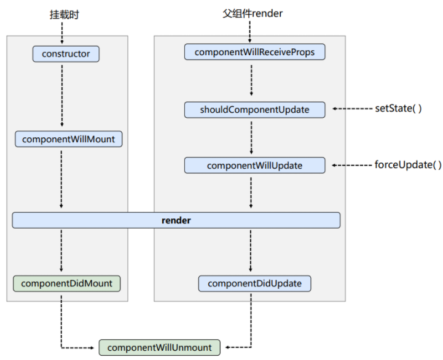
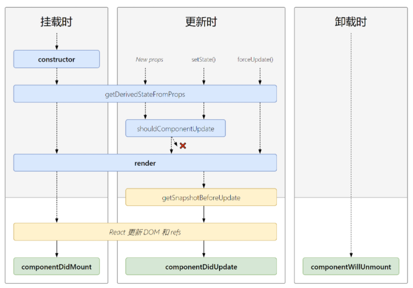
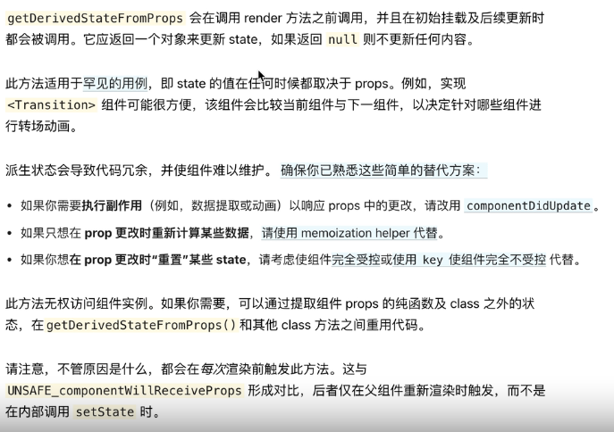
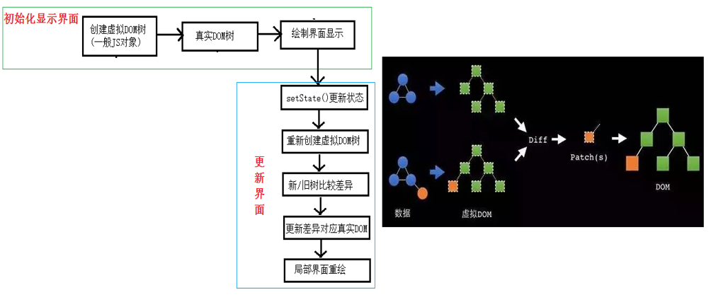

## react

## 学习准备

> ```js
> js基础
> class类的概念
> class的继承（实现类组件的继承）
> this的改变（通过call/bind/apply改变函数组件的this）
> 
> 原型与原型链
> 箭头函数（借助箭头函数的不存在this，使得函数的this指向类本身）
> 展开运算符（展开传入props的参数，不用繁杂的写）
> 
> 阻止默认事件触发event.preventDefault() （为了防止表单提交后自动跳转页面）
> 函数柯里化（使用函数柯里化调用event和传入函数参数，用来表单信息数据的更新；因为函数柯里化可以通过返回函数并调用的方式来执行，所以可以在最底层的返回函数中携带event作为参数使用），因为一般的函数无法在携带参数的情况下使用event参数，而函数柯里化可以
> 对象应用（使用对象来响应式更新变量，因为对象的属性名其实是字符串的，所以可以通过`[属性名]:值`的方式来使用；注意：`属性名:值`与其不同）
> 
> 组件模块化、样式模块化（在CLI中拆分组件，拆分css样式）
> 同步、异步的区别（因为state的更新是异步的，所以需要使用函数来进行数据的更新来防止数据出错）
> 连续解构赋值+重命名：let obj={a:{b:{c:1}}}; const {a: {b:{c:value}}} = obj;=>c重命名为value
> ```
>
> ```js
> 1. 你是怎么学习新知识的？
> 如果有人已经在我们前面走过弯路摸索过，而我们就应该沿着他们摸索出来的道路上前行，而不是多花许多无谓的时间琢磨。
> 直到前面无人探索时或自己有了一定的基础知识后，自己摸索就会相对比较好。
> 这也是我为什么喜欢先看视频学习，因为别人会总结出一些学习的经验，会让我们更容易理解以及避免这些错误。
> 然后可以再看看官网，因为官网是叙述了此框架的知识，是总结，我们可以在其中发现我们在视频中遗漏的知识点。
> 
> 
> 2. 如果在开发过程中遇到问题，你应该怎么解决？
> 可以通过百度去解决问题，先设想能否绕开这个难题，行不通则可引进新技术，行不通则花时间琢磨解决，再行不通就跟别人讨论、研究、请教问题解决方案
>   首先我们先看看这个问题我们能否解决，如果条件允许，我们可以规避、绕开这些问题
>   或者引进新的技术来解决问题
>   如果实在不行，可以跟别人探讨问题的解决方案
> 
> ```
>
> 

## 面向组件编程

> - react是将数据渲染成页面视图的js库，还可在React Native中使用react语法进行移动端开发
> - 特点：采用**组件化**模式、**声明式编码**，提高开发效率及组件复用率。
> - react高效：使用虚拟DOM(不直接操作页面真实DOM)和Diffing算法(最小化页面重绘)，尽量减少与真实DOM的交互
> - 创建虚拟DOM
>   - js：**React.createElement(component, props, ...children)**
>   - JSX：**` const VDOM = <h1>Hello,React</h1>`**
> - 渲染虚拟DOM到页面： **ReactDOM.render(虚拟DOM’virtualDOM’, 容器‘containerDOM’)**
> - 使用React开发者工具调试：`React Developer Tools`
> - `shift + F5`会刷新整个浏览器，

### JSX

> - JSX：JS+XML，XML早期用于存储和传输数据（后来因JSON格式简便且可跟字符串相互转换被JSON替代）
> - 使用JSX的原因：因为用纯js写生成的html代码，当为多层标签嵌套时，会产生很多嵌套循环语句，代码相对不简便
> - jsx语法规则
>   1. 虚拟DOM元素**只能有一个根元素**
>   2. DOM元素标签必须闭合
>   3. 定义虚拟DOM时，不能用引号
>   4. 标签中混入JS**表达式**要用`{}`(注意：只能混入表达式，不能混入语句)
>   5. 样式的类名指定用`className`，而不是class
>   6. 内联样式要用`style={key:value}`的形式写，且样式要用驼峰法
>   7. 标签首字母大小写
>      1. 若小写字母开头，则将该标签转为html中同名标签元素，若html中无该标签对应的同名元素，会导致因该标签不存在Html定义中而报错
>      2. 若大写字母开头，react就会渲染对应的组件，若该组件名没有定义，则报错

### 语句与表达式

> - 表达式：一个表达式会产生一个值，可以放在任何一个需要值的地方`a、a+b、demo(1)、arr.map()、function test(){}`
> - 语句(代码)：`if(){} 、 for(){} 、 switch(){case:xxx}`
> - 虚拟DOM里面只可以放表达式，不能放语句
>
> ```js
> const data = ['Angular', 'React', 'Vue']
> // 创建虚拟DOM  
> const VDOM = (
> 	<div>
>   	<ul>
>   		{ 
>         data.map((item, index) => { 
>   				return <li key={index+item}>item</li> x
> 				}) 
> 			}
>   	</ul>
>   </div>
> )
> // 渲染虚拟DOM到页面
> ReactDOM.render(VDOM, document.getElementById('test'))
> ```

### 模块化与组件化

> - 模块是按功能开发，组件是按区域开发
> - 模块
>   - 向外提供特定功能的js程序, 一般就是一个js文件
>   - 拆成模块原因：随着业务逻辑增加，代码越来越多且复杂
>   - 作用：复用js, 简化js的编写, 提高js运行效率
>   - 模块化：当应用的js都以模块来编写的, 这个应用就是一个模块化的应用
> - 组件
>   - 理解：用来实现局部功能效果的代码和资源的集合(html/css/js/image等等)
>   - 为什么要用组件： 一个界面的功能更复杂
>   - 作用：复用编码, 简化项目编码, 提高运行效率
>   - 组件化：当应用是以多组件的方式实现, 这个应用就是一个组件化的应用

### 组件类型

> #### 函数式组件(适用于简单组件的定义)
>
> > - **函数名开头需要大写**
> > - **函数里面的this是undefined**，因为script中定义的`type='text/babel'`，babel编译后会开启成严格模式
> >
> > ```jsx
> > function Demo() {	// 函数开头需要大写（即Deom是一个组件
> >   console.log(this)		// undefined
> >   return <p>函数式组件[适用于简单组件的定义]</p>
> > }
> > ReactDOM.render(<Demo/>, document.getElementById('app'))
> > ```
>
> #### 类式组件(适用于复杂组件的定义)
>
> > - 类式组件的类必须继承`React.Compoment`，类中render的this指向实例对象
> > -  不写构造器，则不需要写super
> >
> > ```js
> > class MyCompoment extends React.Compoment {
> >   render() {
> >     console.log(this)		// 指向MyCompoment这个实例对象
> >     return <h1>类定义的组件[适用于复杂组件的定义]</h1>
> >   }
> > }
> > ReactDOM.render(<MyCompoment/>, document.getElementById('app'))
> > ```
> >
> > **渲染类组件标签的基本流程**
> >
> > 1. React内部解析组件标签，通过new来创建组件实例对象
> > 2. 通过该实例来调用render()得到虚拟DOM, 并解析为真实DOM
> > 3. 插入到指定的页面元素内部

### 函数组件的props

> > - 函数组件可以使用props属性，但不能使用state和refs（除非使用Hooks）
> > - 函数式组件没有自己的this，this为undefined
> > - props属性中的值只读，不可修改
> >
> > ```js
> > <!-- 准备好一个“容器” -->
> > <div id="test1"></div>
> > 
> > <!-- 引入react核心库 -->
> > <script type="text/javascript" src="../js/react.development.js"></script>
> > <!-- 引入react-dom，用于支持react操作DOM -->
> > <script type="text/javascript" src="../js/react-dom.development.js"></script>
> > <!-- 引入babel，用于将jsx转为js -->
> > <script type="text/javascript" src="../js/babel.min.js"></script>
> > <!-- 引入prop-types，用于对组件标签属性进行限制 -->
> > <script type="text/javascript" src="../js/prop-types.js"></script>
> > 
> > <script type="text/babel">
> > 	//创建组件
> > 	function Person (props){
> > 		const {name,age,sex} = props
> > 		return (
> > 				<ul>
> > 					<li>姓名：{name}</li>
> > 					<li>性别：{sex}</li>
> > 					<li>年龄：{age}</li>
> > 				</ul>
> > 			)
> > 	}
> > 	Person.propTypes = {
> > 		name:PropTypes.string.isRequired, //限制name必传，且为字符串
> > 		sex:PropTypes.string,//限制sex为字符串
> > 		age:PropTypes.number,//限制age为数值
> > 	}
> > 
> > 	//指定默认标签属性值
> > 	Person.defaultProps = {
> > 		sex:'男',//sex默认值为男
> > 		age:18 //age默认值为18
> > 	}
> > 	//渲染组件到页面
> > 	ReactDOM.render(<Person name="jerry"/>,document.getElementById('test1'))
> > </script>
> > ```

### 类组件实例的三大属性

#### constructor

>- 如果不初始化state或不进行方法绑定，则不需要为React组件实现构造函数，但使用则必须要调用super(props)，否则会出现bug
>- 构造函数在react的唯二作用
>  1. 通过给`this.state`赋值对象来初始化内部state
>  2. 为事件处理函数绑定实例

#### state

>- state是组件对象最重要的属性, 值是对象(可以包含多个key-value的组合)；通过更新组件的state来更新对应的页面显示(重新渲染组件)
>- 注意
>   - 组件中render方法中的this为组件实例对象
>   - 组件自定义的方法中this为undefined
>     - **强制绑定this: 通过函数对象的bind()箭头函数**
>     - 因为在类中默认开启局部严格模式，所以在类的html内容中定义的函数通过`oldFun`中的this为undeined（如果使用oldFun()来调用触发onclick事件，则是相当于把该函数当表达式使用，而该函数表达式返回的是undefined，而不是调用该函数）
>     - 所以在构造函数中通过赋值并给函数绑定`this.newFun = this.oldFun.bind(this)`来绑定类中的函数(使得函在函数中的this指向实例对象)，在React渲染中调用则通过`this.newFun`来调用
> - 状态数据不能直接修改或更新，需借助内置API（`this.setState()`）
> - 构造函数执行1次，函数调用几次就执行几次，render()函数为函数调用次数+1(因为有次为初始化渲染)
>
>```js
><script type="text/babel">
>  class Weather extends React.Component {
>    constructor(props) {
>      super(props); //初始化状态
>      this.state = { isHot: false, wind: "微风" };
>      this.oldFun = this.newFun.bind(this); //解决changeWeather中this指向问题
>    }
>
>    render() {
>      const { isHot, wind } = this.state;
>      return (
>        <h1 onClick={this.oldFun}>
>          今天天气很{isHot ? "炎热" : "凉爽"}，{wind}
>        </h1>
>      );
>    }
>
>    newFun() {
>      const isHot = this.state.isHot;
>      this.setState({ isHot: !isHot });
>    }
>  }
>  //2.渲染组件到页面
>  ReactDOM.render(<Weather />, document.getElementById("test"));
></script>
>```
>
>#### 简写
>
>```js
>// 简写
>class Weather extends React.Component{
>	state = {isHot:false,wind:'微风'}
>	render(){
>		const {isHot,wind} = this.state
>		return <h1 onClick={this.change}>今天天气很{isHot ? '炎热' : '凉爽'}，{wind}</h1>
>	}
>	change = ()=>{
>		const isHot = this.state.isHot
>		this.setState({isHot:!isHot})
>	}
>}
>ReactDOM.render(<Weather/>,document.getElementById('test'))
>```

#### props

>- 每个组件对象都会有props(properties)属性
>- 组件标签的所有属性都保存在props
>- 作用：通过标签属性从组件外向组件内传递变化的数据
>
>**注意: 组件内部props数据只读，无法修改**
>
>```js
>// 如果在 16.0之前的版本，则是在React.PropTypes里面添加属性限制，如`name: React.PropTypes.string`，但是如果这么做，会让这些属性存活在React中，导致出现很多冗余，所以在16.0+版本去除了
>// 注意：如果在16.0+版本加上属性限制，需要引入prop-types.js包对组件标签属性限制，让打包后的体积更小
>
>class Person extends React.Component {
>	//对标签属性进行类型、必要性的限制
>	static propTypes = {
>		name: PropTypes.string.isRequired, //限制name必传，且为字符串
>		sex: PropTypes.string,//限制sex为字符串
>		age: PropTypes.number,//限制age为数值
>		speak: PropTypes.func,//限制speak为函数
>	}
>	//指定默认标签属性值
>	static defaultProps = {
>		sex: '男',
>		age: 18
>	}
>
>	render() {
>		const { name, age, sex, speak } = this.props
>		const speaks = speak.bind(this)  // 绑定实例对象的this
>	
>		return (
>			<ul>
>				<li onClick={speaks}>姓名：{name}</li>
>				<li>性别：{sex}</li>
>				<li>年龄：{age + 1}</li>
>			</ul>
>		)
>	}
>}
>
>function speak() {
>	console.log(this,`我说话了`);
>}
>
>// 使用{}来括起属性值，就可以使其属性值的类型变为number数据类型（进行标签属性类型限制）
>ReactDOM.render(<Person name="tom" age={18} sex="女" speak={speak} />, document.getElementById('test1'))
>const p = { name: '老刘', age: 18, sex: '女', speak: speak }
>ReactDOM.render(<Person {...p} />, document.getElementById('test2'))
>```
>
>注意：通过扩展运算符展开的参数是需要与原来传参设定的参数一致才行，且babel中展开运算符只适用于标签属性的展开
>
>#### props传递函数
>
>1. 当方法没有参数时调用：`<button onClick={getFunc}>按钮</button>`
>2. 当方法有参数时调用：`<button onClick={() => getFunc("参数值")}>按钮</button>`

#### refs

> - 组件内的标签通过定义`ref`属性来标识自己（类似于给标签添加id属性），然后通过`this.refs.ref定义的属性名`来访问DOM节点获取其标签（注意：该种定义获取ref的方式已过时，因为string类型的ref存在一些问题）
> - 字符串形式的ref：`<input ref="input1" />`（不建议使用）
>- 绑定class形式的ref：`<input ref={this.input1}>`
> - **回调函数形式的ref**：`<p ref={ currentNode => this.input1 = currentNode} />`（意思是把当前ref的节点挂载到实例自身上并取名为input1）
> - **createRef创建ref容器**，然后绑定函数
>   - `myRef = React.createRef() `
>   - `<input ref={ this.myRef }/>`

### 事件处理

> - 通过onXxx属性指定事件处理函数(注意大小写)
>
>   - React使用的是自定义(合成)事件, 而不是使用的原生DOM事件
>   - React中的事件是通过事件委托方式处理的(委托给组件最外层的元素)
>
> - 通过event.target得到发生事件的DOM元素对象
>
> - > 注意：不要过度使用ref，可以把数据保存在state中
>
> ```js
> myRef = React.createRef()
> //展示左侧输入框的数据
> showData = (event)=>{
>   console.log(event.target);
>   alert(this.myRef.current.value);
> }
> render(){
>   return(
>     <div>
>     	<input ref={this.myRef} type="text" placeholder="点击按钮提示数据"/>&nbsp;
> 			<button onClick={this.showData}>点我提示左侧的数据</button>&nbsp;
> 		</div>
> 	)
> }
> ```

### 受控/非受控组件

> #### **非受控组件**
>
> > - 只能临时存放，在触发按钮时才能得以获取数据（现用现取）
> >
> > ```js
> > handleSubmit = (event)=>{
> > 	event.preventDefault() //阻止表单提交
> > 	const {username,password} = this
> > 	alert(`用户名：${username.value},密码：${password.value}`)
> > }
> > render(){
> > 	return(
> > 		<form onSubmit={this.handleSubmit}>
> > 			用户名：<input ref={c => this.username = c} type="text" name="username"/>
> > 			密码：<input ref={c => this.password = c} type="password" name="password"/>
> > 			<button>登录</button>
> > 		</form>
> > 	)
> > }
> > ```
>
> #### **受控组件(类比vue的数据双向绑定)**
>
> > - 当内容改变时，触发`onChange`事件，改变其存在state中的值；调用时直接调状态的值即可
> >
> > ```js
> > //初始化状态
> > state = {
> > 	username:'', //用户名
> > 	password:'', //密码
> >   account: "", // 账号
> > }
> > 
> > //保存表单数据到状态中
> > saveFormData = (dataType)=>{
> >   return (event)=>{
> >     this.setState({[dataType]:event.target.value})
> >   }
> > }
> > // 保存表单数据的另类写法
> > saveDate = (dataType, event) => {
> >   this.setState({ [dataType]: event.target.value })
> > }
> > 
> > //表单提交的回调
> > handleSubmit = (event)=>{
> > 	event.preventDefault() //阻止表单提交
> > 	const {username,password, account} = this.state
> > 	alert(`用户名：${username},密码：${password},账号：${account}`)
> > }
> > 
> > render(){
> > 	return(
> > 		<form onSubmit={this.handleSubmit}>
> > 			用户名：<input onChange={this.saveFormData('username')} type="text" name="username"/>
> > 			密码：<input onChange={this.saveFormData('password')} type="password" name="password"/>
> >       账号：<input onChange={event => this.saveDate('account', event)} type="text" name="account">
> > 			<button>登录</button>
> > 		</form>
> > 	)
> > }
> > ```

### 组件生命周期

> **重要的钩子函数**
>
> 1. render：初始化渲染或更新渲染调用
> 2. componentDidMount：开启监听, 发送ajax请求
> 3. componentWillUnmount：做一些收尾工作, 如: 清理定时器
>
> **即将废弃的钩子**
>
> 1. componentWillMount
> 2. componentWillReceiveProps
> 3. componentWillUpdate
>
> 注意：现在使用会出现警告，下一个大版本需要加上**UNSAFE_**前缀才能使用，以后可能会被彻底废弃，不建议使用。
>
> #### 旧生命周期
>
> 
>
> ```txt
> 1. 初始化阶段: 由ReactDOM.render()触发---初次渲染
> 					1.	constructor()
> 					2.	componentWillMount()
> 					3.	render()
> 					4.	componentDidMount() =====> 常用
> 									一般在这个钩子中做一些初始化的事，例如：开启定时器、发送网络请求、订阅消息
> 									
> 2. 更新阶段: 由组件内部this.setSate()或父组件render触发 (父组件接收数据)
>           1.	componentWillReceiveProps(props)
> 								注意：第一次接收子组件的数据时会不做处理（不触发该事件）,能接收一个参数
>           2.	shouldComponentWillUpdate()
>           			必须要返回一个boolean, 当返回true时，继续执行下列的钩子函数，否则中断执行
>           3.	componentWillUpdate()	
>           4.	render() =====> 必须使用的一个
>           5.	componentDidUpdate()
> 					
> 3. 卸载组件: 由ReactDOM.unmountComponentAtNode()触发
> 					1.	componentWillUnmount()  =====> 常用
> 									一般在这个钩子中做一些收尾的事，例如：关闭定时器、取消订阅消息
> ```
>
> 注意：componentWillReceiveProps第一次接收子组件的数据时会不做处理（不触发该事件），能接收一个参数
>
> ```js
> //父组件A
> class A extends React.Component{
> 	//初始化状态
> 	state = {carName:'奔驰'}
> 
> 	changeCar = ()=>{
> 		this.setState({carName:'奥拓'})
> 	}
> 
> 	render(){
> 		return(
> 			<div>
> 				<div>我是A组件</div>
> 				<button onClick={this.changeCar}>换车</button>
> 				<B carName={this.state.carName}/>
> 			</div>
> 		)
> 	}
> }
> 
> //子组件B
> class B extends React.Component{
> 	//组件将要接收新的props的钩子
> 	componentWillReceiveProps(props){
> 		console.log('B---componentWillReceiveProps',props);
> 	}
> 
> 	//控制组件更新的“阀门”
> 	shouldComponentUpdate(){
> 		console.log('B---shouldComponentUpdate');
> 		return true
> 	}
> 	//组件将要更新的钩子
> 	componentWillUpdate(){
> 		console.log('B---componentWillUpdate');
> 	}
> 
> 	//组件更新完毕的钩子
> 	componentDidUpdate(){
> 		console.log('B---componentDidUpdate');
> 	}
> 
> 	render(){
> 		console.log('B---render');
> 		return(
> 			<div>我是B组件，接收到的车是:{this.props.carName}</div>
> 		)
> 	}
> }
> 		
> //渲染组件
> ReactDOM.render(<A/>,document.getElementById('test'))
> ```
>
> #### 新生命周期
>
> 
>
> ```txt
> 所有旧生命周期上带上Will的钩子函数都需要加上UNSAFE_前缀
> 
> 1. 初始化阶段: 由ReactDOM.render()触发---初次渲染
> 				1.	constructor()
> 				2.	getDerivedStateFromProps 
> 				3.	render()
> 				4.	componentDidMount() =====> 常用
> 							一般在这个钩子中做一些初始化的事，例如：开启定时器、发送网络请求、订阅消息
> 							
> 2. 更新阶段: 由组件内部this.setSate()或父组件重新render触发
> 				1.	getDerivedStateFromProps(props, state)
> 						必须要返回一个 state Obj（状态对象） 或 null	来更新状态信息
>               此定义的props是：state的值任何时候都取决于 props
>               return props
> 						
> 				2.	控制组件更新的“阀门”：shouldComponentUpdate()
> 				3.	组件渲染：render()
> 				4.	组件更新前：getSnapshotBeforeUpdate(preProps, preState) 
> 				5.	组件更新完毕：componentDidUpdate()
> 				
> 3. 卸载组件: 由ReactDOM.unmountComponentAtNode()触发
> 				1.	componentWillUnmount()  =====> 常用
> 							一般在这个钩子中做一些收尾的事，例如：关闭定时器、取消订阅消息
> ```
>
> 


### 虚拟DOM与Diffing算法

> 
>
> #### key的渲染机制
>
> ```txt
> 1). react/vue中的key有什么作用？（key的内部原理是什么？）
> 2). 为什么遍历列表时，key最好不要用index?
> 
> 1. 虚拟DOM中key的作用：
> 		key是虚拟DOM对象的标识, 当状态中的数据发生变化时，
> 		react会根据【新数据】生成【新的虚拟DOM】, 
> 		随后React进行【新虚拟DOM】与【旧虚拟DOM】的diff比较，比较规则如下：
> 						a. 旧虚拟DOM中找到了与新虚拟DOM相同的key：
> 									(1).若虚拟DOM中内容没变, 直接使用之前的真实DOM
> 									(2).若虚拟DOM中内容变了, 则生成新的真实DOM，随后替换掉页面中之前的真实DOM
> 						b. 旧虚拟DOM中未找到与新虚拟DOM相同的key
> 									根据数据创建新的真实DOM，随后渲染到到页面
> 						
> 2. 用index作为key可能会引发的问题：
> 					1. 若对数据进行：逆序添加、逆序删除等破坏顺序操作:
> 									会产生没有必要的真实DOM更新 ==> 界面效果没问题, 但效率低。
> 					2. 如果结构中还包含输入类的DOM：
> 									会产生错误DOM更新 ==> 界面有问题。
> 									比如用key为index在渲染li列表时，里面都存在一个input标签，则input里面的内容可能或错乱，会渲染到其他内容里面
> 					3. 注意！如果不存在对数据的逆序添加、逆序删除等破坏顺序操作，
> 						仅用于渲染列表用于展示，使用index作为key是没有问题的。
> 		
> 3. 开发中如何选择key?:
> 					1.最好使用每条数据的唯一标识作为key, 比如id、手机号、身份证号、学号等唯一值。
> 					2.如果确定只是简单的展示数据，用index也是可以的。
> ```
>
> ```jsx
> /* 用key为index在渲染li列表时，里面都存在一个input标签，则input里面的内容可能或错乱，会渲染到其他内容里面 */
> class Person extends React.Component{
> 	state = {
> 		persons:[
> 			{id:1,name:'小张',age:18},
> 			{id:2,name:'小李',age:19},
> 		]
> 	}
> 
> 	add = ()=>{
> 		const {persons} = this.state
> 		const p = {id:persons.length+1,name:'小王',age:20}
> 		this.setState({persons:[p,...persons]})
> 	}
> 
> 	render(){
> 		return (
> 			<div>
> 				<h2>展示人员信息</h2>
> 				<button onClick={this.add}>添加一个小王</button>
> 				<h3>使用index（索引值）作为key</h3>
> 				<ul>
> 					{
> 						this.state.persons.map((personObj,index)=>{
> 							return <li key={index}>{personObj.name}---{personObj.age}<input type="text"/></li>
> 						})
> 					}
> 				</ul>
> 				<h3>使用id（数据的唯一标识）作为key</h3>
> 				<ul>
> 					{
> 						this.state.persons.map((personObj)=>{
> 							return <li key={personObj.id}>{personObj.name}---{personObj.age}<input type="text"/></li>
> 						})
> 					}
> 				</ul>
> 			</div>
> 		)
> 	}
> }
> ReactDOM.render(<Person/>,document.getElementById('test'))
> ```

## react CLI

**创建项目**

> 1. 全局安装：`npm i -g create-react-app`
> 2. 创建项目文件夹：`create-react-app 项目名`
> 3. 启动项目：`npm start`
> 4. 使用脚手架开发项目特点：模块化、组件化、工程化
> 5. 项目整体技术架构为：`react + webpack + es6 eslint`
> 6. 清空命令行`cls`
> 7. 在vscode中下载jsx插件，会有react语法提示
> 8. 在vscode安装插件`ES7+ React/Redux/React-Native snippets`，输入`rcc`或`rfc`会快捷生成初始内容
> 9. 生成唯一id标识符的库：`nanoid`和`uuid`库

**脚手架项目结构**

> ```js
> public ---静态资源文件夹
> 	- mainfest.json		---应用加壳的配置文件
> 	- robots.txt			---爬虫协议文件
> src		---源码文件夹
> 	- reportWebVitals.js	---页面性能分析文件（需要web-vitals库的支持）
> 	- setupTests.js				---
> ```

### Json Server(模拟接口数据)

> - JsonServer主要作用是搭建本地的数据接口，创建json文件，便于调试调用
> - 如果只是get数据，需借助`jsonplaceholder`，如果是post请求数据，则可使用json server对数据进行增删改查
> - 全局安装：`npm install -g json-server`
> - 创建文件夹(不能用json-server作为文件夹名，否则会报错)，初始化一个package.json文件`npm init -yes`
> - 安装json-server：`npm i json-server --save`
> - 运行：`npm run json:server`
> - 不需要package.json就能运行：`json-server --watch 文件名.json`

### setupProxy.js

> 在react CLI项目的src文件夹下创建`setupProxy.js`文件进行跨域访问端口设置
>
> 其内部会把这个文件加到webpack配置下，webpack里边用的都是node语法，所以这个文件里要写commonjs语法
>
> node用的是commonjs语法规范，浏览器用 browserify语法规范
>
> 在其文件内可以设置多个代理对象
>
> ```js
> const proxy = require('http-proxy-middleware')	// 请求http代理中间件
> 
> module.exports = function(app) {
>   app.use(
>   	proxy('/api1', {	// 遇见 /api1 前缀的请求，就会触发该代理配置
>       target: "http://localhost:3000",	// 从原求地址转发到该地址
>       changeOrigin: true,	// 控制服务器收到的响应头中Host字段的值（host的字段标识请求是从哪发出的）
>       pathRewrite: { '^api1': "" },	// 重写地址
>     }),
>     proxy('/api1', {
>       target: "http://localhost:3001",
>       changeOrigin: true,
>       pathRewrite: { '^api1': "" },
>     })
>   )
> }
> ```
>
> 还可在package.json文件中增加`proxy: "http://localhost:3000"`的字段进行跨域

### 消息订阅-发布机制

> - 发布订阅者模式是一对多模式，一个发布者多个订阅者可接收。
> - publish发布消息，subscribe订阅消息，需要依赖`pubsub-js`模块，通过`cnpm install pubsub-js --save`，然后通过`import PubSub from 'pubsub-js'`引入模块再进行使用
> - `PubSub.publish(发送消息的名称, 消息的内容)`发布消息
> - `PubSub.subscribe(接收的消息名称eventName, callback(消息名称, 消息内容){})`：订阅消息
> - `PubSub.unsubcribe(eventName, callback)`：解除自定义事件
> - `PubSub.subscribeOne(eventName, callback)`：发布一个只触发一次的自定义事件
> - `PubSub.notify(eventName, callback)`：触发已经发布的自定义事件
>
> ```js
> // 导入模块
> import PubSub from 'pubsub-js'
> // const PubSub  = require('pubsub-js')	// CommonJS
> 
> // 发布消息
> PubSub.publish("emits", { name: "willy", age: 24 })
> 
> // 订阅消息
> PubSub.subscribe("emits", (_, context) => {
>   console.log(_, context)	// emits, {name:"willy",age:24}
> })
> ```

### fetch发送请求（关注分离的设计思想）

> - fetch API是基于promise设计的，因为XMLHttpRequest是一个设计粗糙的API，不符合关注分离的原则，配置和调用方式非常混乱，而且基于事件的异步模型写起来也没现代的`promise、generator/yield、async/await`友好，Fetch的出现就是为了解决XHR的问题
> - Fetch的优点
>   - 语法简洁更加语义化，关注分离的设计思想
>   - 基于Promise实现，支持async/await；
>   - 同构方便，使用`isomorphic-fetch`
> - Fetch的缺点
>   - Fetch请求默认是不带cookie，需要设置`fetch(url, { credentials: "include" })`
>   - 服务器返回400、500错误码并不会reject，只有网络错误这些导致请求不能完成时，fetch才会被reject
> - 
>
> ```js
> // XHR 进行请求
> var xhr = new XMLHttpRequest();
> xhr.open('GET', url);
> xhr.responseType = 'json';
> xhr.onload = function() {
>   console.log(xhr.response);
> };
> xhr.onerror = function() {
>   console.log("Oops, error");
> };
> xhr.send();
> 
> 
> // Fetch 进行请求
> fetch(url).then(function(response) {
>   return response.json();
> }).then(function(data) {
>   console.log(data);
> }).catch(function(e) {
>   console.log("Oops, error");
> });
> 
> 
> // Fetch+ES6箭头函数 进行请求
> fetch(url).then(response => response.json())
>   .then(data => console.log(data))
>   .catch(e => console.log("Oops, error", e))
> 
> 
> // async/await函数+Fetch 进行请求
> async function reqs() {
>   try {
>     let response = await fetch(url);
>     let data = response.json();
>     console.log(data);
>   } catch(e) {
>     console.log("Oops, error", e);
>   }
> }
> reqs();
> ```

### react路由

> - SPA单页面：整个应用只有一个完整的页面，点击页面中的链接不会刷新页面，只会做页面的局部刷新，数据都需要通过ajax请求获取，并在前端异步展现
> - 路由：一个路由就是一个映射关系(key:value)，key为路径，value可能是function或component
>   - 后端路由：value是function，用来处理客户端提交的请求
>     - 注册路由`router.get(path, function(req, res))`
>     - 工作过程：当node接收到一个请求时，根据请求路径找到匹配的路由，调用路由中的函数来处理请求，返回响应数据
>   - 前端路由：浏览器路由，value是component，用于展示页面内容
>     - 注册路由：`<Route path="/test" component={Test}>`
>     - 工作过程：当浏览器的path变为`/test`时，当前路由组件就会变为Test组件
> - 安装路由：`npm i react-router-dom@5`，在2021-11月已经升级为6版本 
> - 注意：为了保证项目的页面的路由跳转复用，把BrowserRouter或HashRouter放在`index.js`中，包住`<App/>`标签
>
> **路由的跳转与改变**
>
> ````js
> // 创建历史记录对象
> let history = History.createBrowserHistory()	// 使用H5推出的history API
> // let history = History.createHashHistory()	// 使用hash值，锚点，兼容性好，但相对不安全
> 
> // 页面跳转
> - history.push(path)
> - history.replace(path)
> - history.goBack()
> - history.goForward()
> ````
>
> **react-router-dom内置API**
>
> ```js
> BrowserRouter	// history模式路由跳转，一般包裹App标签
> HashRouter // hash模式路由跳转，一般包裹App标签
> Route	// 标签包裹的是所跳转的页面内容，path属性代表与Link标签的to的路径进行匹配，component代表所跳转的组件页面/内容
> Redirect	// 重定向
> Link	// 等同a标签，to属性所代表的是跳转的路由地址
> NavLink
> Switch
> ```
>
> 


## TS

> #### 基本数据类型`basic`
>
> ```ts
> // string 
> let s:string = 'aaa'
> 
> // number
> let num:number = 1
> 
> // 不声明具体数据类型，由代码推断出数据类型
> let a = 'aa'
> let num1 = 1
> 
> // 布尔
> let b:boolean = true
> 
> // 数组
> let arr1:string[] = ['a', 'b', 'c']
> let arr2:number[] = [1, 2, 3]
> 
> // void
> function funcA (): void {
>   console.log("void的返回值可以省略不写")
> }
> funcA()
> 
> // 函数返回类型
> function funcB(): number {
>   console.log("返回number数据类型")
>   return 1
> }
> funcB()
> 
> // null
> 
> // undefined
> ```
>
> #### 接口`interface`
>
> ```ts
> // 接口的声明
> interface Lee {
>   ages: number // 接口必选的成员变量
>   names?: string // 接口可选的成员变量
> }
> 
> // 接口复杂使用
> interface Lee1 {
>   name: string
>   age: number
>   say: () => void
>   userList: string[]
> }
> 
> // 接口继承
> // 注意接口继承的父接口中不能出现重复的变量
> interface Lee2 extends Lee1, Lee {
>   
> }
> ```
>
> #### 泛型
>
> 泛型的作用是只需关注所需要的数据，而不需关注具体的数据格式
>
> ```ts
>  // 普通数据类型
> class Lee1 {
>   name: string
>   age: number
> 
>   /* constructor(name:string, age:number) {
>     this.name = name
>     this.age = age
>   } */
> 
>   say(): void {
>     console.log(this.age + " " + this.name)
>   }
> }
> 
> // let lee1 = new Lee('willy', 24)
> let lee1 = new Lee1()
> lee1.name = "willys"
> lee1.age = 25
> lee1.say()
> 
> 
> // 使用泛型的类
> class Lee2<IProps = {}> {
>   user: IProps
> 
>   say():string {
>     console.log(this.user)
>     return `this.age + " " + this.name`
>   }
> }
> interface User {
>   name: string
>   age: number
>   say:() => string
> }
> let lee2 = new Lee2<User>()
> lee2.user = { name: 'willy', age: 24 }
> lee2.say()
> ```
>
> #### 枚举
>
> ```ts
> enum Direction {
>   UP = "UP",
>   DOWN = "DOWN",
>   LEFT = "LEFT",
>   RIGHT = "RIGHT"
> }
> let up = "UP"
> console.log(Direction.UP === up)  // ture
> ```
>
> #### TS初始化项目
>
> - yarn方式：`yarn create react-app react-ts --template=typescript`
> - npx方式：`npx crate-react-app react-ts --template=typescript`

## HOOK

> state的更新是异步的，即this.setState是异步的，所以不要放在for循环里面同步更新，可把`this.setState`当做函数来进行数据更新
>
> ```jsx
> for(let i = 0; i < 100; i++) {
>   console.log(this.state.counter)
>   /* // 错误写法
>   this.setState({
>     counter: this.state.counter + 1
>   }) */
>   // state的更新是异步的，所以把更新放入函数中，这样才不会出错
>   this.setState((state, props) => ({
>     counter: state.counter + 1
>   }))
> }
> ```
>
> 

## 权限判定

> 1. 可在getDruvedStateFromProps里面做判定，如果返回null则不更新任何内容
> 2. 可在shouldComponentUpdate里面做判定，如果返回false则不更新内容

