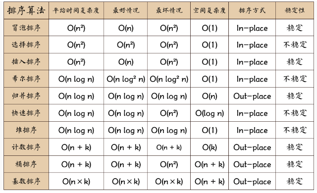
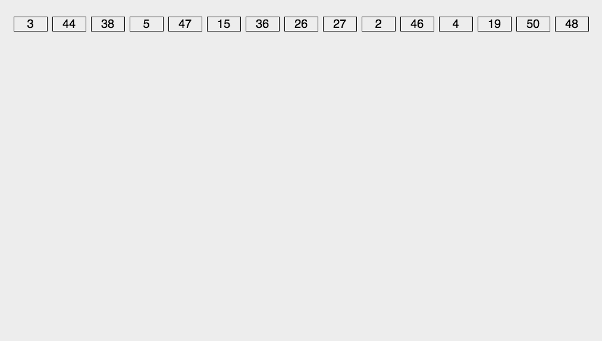

# Echarts

- `Echarts`是使用`JavaScript`实现的开源可视化库，底层依赖矢量图形库`ZRender`，可高度个性化定制数据可视化图表。主要配置：`series 、xAxis 、yAxis 、grid 、tooltip 、title 、legend 、color`
- series：系列列表。每个系列通过 `type` 决定自己的图表类型，可以多个图表重叠。

- xAxis：直角坐标系 grid 中的 x 轴

  - boundaryGap: 坐标轴两边留白策略 true，这时候刻度只是作为分隔线，标签和数据点都会在两个刻度之间的带(band)中间。
- yAxis：直角坐标系 grid 中的 y 轴
- grid：直角坐标系内绘图网格。 
- title：标题组件
- tooltip：提示框组件，用于配置鼠标滑过或点击图标时的显示框
- legend：图例组件(通用配置），用于筛选系列，需和series配合使用
- color：调色盘颜色列表，数据堆叠，同个类目轴上系列配置相同的`stack`值，后一个系列的值会在前一个系列的值上相加。
- toolbox：工具栏（内置导出图片、数据导图、动态类型转换、数据区域缩放、重置五个工具）

#### 注意

- **`legend`内的`data`值与`series`内的`name`值不一致**，将会导致拿到后台传递的数据后，页面依旧不会渲染成功。
- **不给`canvas`（即描绘数据表的div标签）设定宽高值**，将会导致数据表无法显示出来。
- `xAxis或yAxis`里面的值与`series`中的data值（看描述什么图），将会导致数据表无法正确渲染。

#### 建议：

- 数据报表不能`mounted`生命周期中。
- 图标挂载之前判断是否有数据，当数据请求回来以后再进行挂载。或者使用`$nextTick()`方法，让图表在下一个tick或者本轮tick的微任务阶段挂载。
- 父组件要使用中间变量的方式向子组件传递所需要的数据。（即在子组件的data中定义变量，再通过watch侦听父组件传来的值，且把传来的值赋给data的变量中，调用的是data的变量）
- 在父组件数据发生改变后子组件要做到实时更新，就需要子组件用watch来监听数据的变化，而且对象类型和数组类型的监听方式不同。


## demo

### 图表大小随窗口变化自适应

```js
//在方法中编写	
window.onresize = function () {
       this.myChart.resize();
       // .resize后加括号哦，这里还可以写其他的事件
};
```

> 注意：必须要给容器一个高度，否则高度为0，图表不显示
> 一般是把图表写在子组件中，然后把子组件的宽高定义为`100%`，再在父组件中通过`ref属性`绑定子组件，再调用`window.onresize`。

```son.vue
<template>
    <div class="m-box">
        <div>图表<div>
                <div class="m-subject">
                    <div class="m-echarts" ref="myCharts"></div>
                </div>
            </div>
</template>

<script>
    import echarts from 'echarts'
    export default {
        props: { xData: Array, },
        data() {
            return {
                xxData: [],
                xxDataName: [],
                xxDataValue: [],
                instance: {},
            }
        },
        methods: {
            resize() {
                this.instance.echart.resize();
            },
            initEcharts() {
                this.instance.echart = echarts.init(this.$refs.myCharts);
            },
            setEchartsOption() {
                this.instance.echart.setOption({
                    legend: {
                        data: ['DATA1']
                    },
                    xAxis: [{  //x轴坐标数据
                        type: 'category',
                        boundaryGap: false,
                        data: this.xxDataName //['周一','周二','周三','周四','周五','周六','周日']
                    }],
                    yAxis: [{   //y轴坐标数据
                        type: 'value',
                        axisLabel: {
                            formatter: '{value} °'
                        }
                    }],
                    series: [  //驱动图表生成的数据内容数组，几条折现，数组中就会有几个对应对象，来表示对应的折线
                        {
                            name: "DATA1",
                            type: "line",  //pie->饼状图  line->折线图  bar->柱状图
                            data: this.xxDataValue,//[11, 11, 15, 13, 12, 13, 10],
                        },
                    ]
                });
            },
        },
        create() {
            this.yData();
            this.xData();
        },
        mounted() {
            this.initEcharts();
            this.setEchartsOption();
        },
        watch: {
            xData: function (newVal, oldVal) {
                this.xxData = newVal;
                for (let i in this.xxData) {
                    this.xxDataName.push(this.xxData[i].name);
                    this.xxDataValue.push(parseInt(this.xxData[i].value));
                }
                this.setEchartsOption();
            }
        }
    }
</script>
<style lang="less">
    .m-box {
        width: 100%;
        height: 100%;

        .m-subject {
            width: 100%;
            height: 100%;

            .m-echarts {
                width: 100%;
                height: 100%;
            }
        }
    }
</style>
```

```App.vue
<template>
  <div id="app">
    <div class="charts">
      <data-table :xData="xData" class="charts" ref="dataTable"></data-table>
    </div>
  </div>
</template>

<script>
  import { xData } from './components/data.js';
  import dataTable from './components/son'

  export default {
    name: 'App',
    data() {
      return { xData: [], }
    },
    methods: {
      getData() { this.xData = xData; },
    },
    components: { xData, dataTable },
    mounted() {
      this.getData();
      window.onresize = () => {	//通过定义CSS样式宽高100%，和这函数来实现满屏显示图表
        this.$refs.dataTable.resize();
      }
    },
  }
</script>
<style lang="less">
  html,body,#app {
    width: 100%;
    height: 100%;
    margin: 0;
    padding: 0;
  }
  .charts {
    width: 100%;
    height: 100%;
  }
</style>
```


## 图状

#### 柱状图`bar`


#### 折线图`line`

- serires中的type设置为line
- 折线图常见效果
  - 最大值/最小值/平均值：markPoint/ markLine / markArea
  - 线条填充：smooth lineStyle
  - 填充风格：areaStyle
  - 紧挨边缘：boundaryGap
  - 脱离0值比例：scale
  - 堆叠图：stack
- 折线图特点：折线图常用于分析数据随时间的变化趋势


#### 散点图`scatter`

- 基本的散点图
  - x轴和y轴的数据是一个二维数组
  - series中的type设置为scatter
  - xAxis和yAxis中的type设置为value

- 气泡图效果
  - 散点的大小不同：`symbolSize`
  - 散点的颜色不同：`itemStyle.color`
  - 涟漪动画效果：`type:effectScatter,showEffectOn:'emphasis',rippleEffect:{}`
- 散点图特点
  - 散点图可推断出不同维度数据之间的相关性
  - 散点图经常用在地图的标注上

#### 饼图`pie`


#### 直角坐标系

- 直角坐标系图标：柱状图、折线图、散点图
- 配置：网格`grid`、坐标轴`axis`、区域缩放`dataZoom`
- 网格`grid`
  - `grid`是用来控制直角坐标系的布局和大小
  - x轴和y轴是在grid的基础上进行绘制
  - 显示grid：`show`
  - grid的边框：`borderWidth`、`borderColor`
  - grid的位置和大小：`left | top | right | bottom`
- 坐标轴`axis`
  - 坐标轴分x轴`xAxis`和y轴`yAxis`
  - 坐标轴类型type：
    - value：数值轴，自动会从目标数据读取数据
    - category：类目轴，该类型必须通过data设置类目数据
  - 显示位置`position`：
    - xAxis：可取值为top/bottom
    - yAxis：可取值为left/right

- 区域缩放`dataZoom`
  - dataZoom用于区域缩放，对数据范围过滤(x、y轴都可)
  - dataZoom是一个数组，可配置多个区域缩放器
  - 类型type：
    - slider:滑块过滤
    - inside：内置过滤，依赖鼠标滚轮或者双指缩放
  - 指明产生的作用轴：
    - xAxisIndex：设置缩放组件控制的是哪个x轴，一般为0
    - yAxisIndex：设置缩放组件控制的是哪个y轴，一般为0
  - 指明初始状态的缩放情况：start、end（注意：值为百分比的值，100为所有，0为无）


# ag-Grid

### 单元格事件

- onRowClicked行点击事件
- onCellClicked单击单元格事件（放在定义单元格的某列中，就只能该列点击触发该事件；放在定义外面，点击所有列都生效）
- onCellDoubleClicked双击单元格事件（放在定义单元格的某列中，就只能该列点击触发该事件；放在定义外面，点击所有列都生效）
- 全部事件列表

#### `onRowClicked`行点击事件

> 注意：此事件发生在点击表格行的时候，事件写在gridOptions下。

```js
this.personGridOptions = gridOptions();
// 获取左边点击行的数据
this.personGridOptions.onCellClicked = event => {
  //event.data 选中的行内数据，event.event 为鼠标事件，
  console.log(event);
  let itxst = JSON.stringify(event.data);
  console(itxst);
}
```

#### 获取集中的单元格值

1. 通过`let focusCell = gridOptions.getFocusedCell()`获取焦点单元格；
2. 或使用`onCellFocused`事件。
   - 两者都提供了`rowIndex:number, column:column `：行数索引：数字，列：列

```js
// 1.使用行索引检索行节点
let row = gridOptions.api.getDisplayedRowAtIndex(rowIndex);

// 2. 之后，可以使用这些属性来检索单元格的原始值
let cellValue = gridOptions.api.getValue(colkey, row.node);
```


# electron

- 桌面应用开发`electron`，可以理解为把浏览器中的网站通过打包嵌套到app中

```bash
# 安装
npm install electron -g
npm install create-electron-app -g

# 创建项目
create-electron-app app-name

# 启动项目
cd app-name
npm run start
```


# 错误解义

```js
error 1: Out of memory 内存溢出
error 2: Identifier expected 缺标识符
error 3: Unknown identifier 未定义的标识符
error 4: Duplicate identifier 重复定义的标识符
error 5: Syntax error 语法错误
error 6: Error in real constant 实型常量错误
error 7: Error in integer constant 整型常量错误
error 8: String constant exceeds line 字符串常量超过一行
error 10: Unexpected end of file 文件非正常结束
error 11: Line too long 行太长
error 12: Type identifier expected 未定义的类型标识符
error 13: Too many open files 打开文件太多
error 14: Invalid file name 无效的文件名
error 15: File not found 文件未找到
error 16: Disk full 磁盘满
error 17: Invalid compiler directive 无效的编译命令
error 18: Too many files 文件太多
error 19: Undefined type in pointer def 指针定义中未定义类型
error 20: Variable identifier expected 缺变量标识符

error 21: Error in type 类型错误
error 22: Structure too large 结构类型太长
error 23: Set base type out of range 集合基类型越界
error 24: File components may not be files or objectsfile 分量不能是文件或对象
error 25: Invalid string length 无效的字符串长度
error 26: Type mismatch 类型不匹配
error 27：error 27：Invalid subrange base type 无效的子界基类型
error 28：Lower bound greater than upper bound 下界超过上界
error 29：Ordinal type expected 缺有序类型
error 30：Integer constant expected 缺整型常量
error 31：Constant expected 缺常量
error 32：Integer or real constant expected 缺整型或实型常量
error 33：Pointer Type identifier expected 缺指针类型标识符
error 34：Invalid function result type 无效的函数结果类型
error 35：Label identifier expected 缺标号标识符
error 36：BEGIN expected 缺 BEGIN
error 37：END expected 缺 END
error 38：Integer expression expected 缺整型表达式
error 39：Ordinal expression expected 缺有序类型表达式
error 40：Boolean expression expected 缺布尔表达式
error 41：Operand types do not match 操作数类型不匹配

error 42：Error in expression 表达式错误
error 43：Illegal assignment 非法赋值
error 44：Field identifier expected 缺域标识符
error 45：Object file too large 目标文件太大
error 46：Undefined external 未定义的外部过程与函数
error 47：Invalid object file record 无效的 OBJ 文件格式
error 48：Code segment too large 代码段太长
error 49：Data segment too large 数据段太长
error 50：DO expected 缺 DO
error 51：Invalid PUBLIC definition 无效的 PUBLIC 定义
error 52：Invalid EXTRN definition 无效的 EXTRN 定义
error 53: Too many EXTRN definitions 太多的 EXTRN 定义
error 54：OF expected 缺 OF
error 55：INTERFACE expected 缺 INTERFACE
error 56：Invalid relocatable reference 无效的可重定位引用
error 57：THEN expected 缺 THEN
error 58：TO or DOWNTO expected 缺 TO 或 DOWNTO
error 59：Undefined forward 提前引用未经定义的说明
error 61：Invalid typecast 无效的类型转换
error 62：Division by zero 被零除
error 63：Invalid file type 无效的文件类型

error 64：Cannot read or write variables of this type 不能读写此类型变量
error 65：Pointer variable expected 缺指针类型变量
error 66：String variable expected 缺字符串变量
error 67：String expression expected 缺字符串表达式
error 68：Circular unit reference 单元 UNIT 部件循环引用
error 69：Unit name mismatch 单元名不匹配
error 70：Unit version mismatch 单元版本不匹配
error 71：Internal stack overflow 内部堆栈溢出
error 72：Unit file format error 单元文件格式错误
error 73：IMPLEMENTATION expected 缺 IMPLEMENTATION
error 74：Constant and case types do not match 常量和 CASE 类型不匹配
error 75：Record or object variable expected 缺记录或对象变量
error 76：Constant out of range 常量越界
error 77：File variable expected 缺文件变量
error 78：Pointer expression expected 缺指针表达式
error 79：Integer or real expression expected 缺整型或实型表达式
error 80：Label not within current block 标号不在当前块内
error 81：Label already defined 标号已定义
error 82：Undefined label in preceding statement part 在前面未定义标号
error 83：Invalid @ argument 无效的@参数
error 84：UNIT expected 缺 UNIT
博学谷——让 IT 教学更简单，让 IT 学习更有效
5
error 85: ";" expected 缺“；”
error 86： ":" expected 缺“：”
error 87： "," expected 缺“，”
error 88： "(" expected 缺“（”
error 89： ")" expected 缺“）”
error 90： "=" expected 缺“=”
error 91： ":=" expected 缺“:=”
error 92： "[" or "(." Expected 缺“[”或“（.”
error 93: "]" or ".)" expected 缺“］”或“.）”
error 94： "." expected 缺“.”
error 95: ".." expected 缺“..”
error 96：Too many variables 变量太多
error 97：Invalid FOR control variable 无效的 FOR 循环控制变量
error 98：Integer variable expected 缺整型变量
error 99：Files and procedure types are not allowed here 该处不允许文件和过程类型
error 100：String length mismatch 字符串长度不匹配
error 101：Invalid ordering of fields 无效域顺序
error 102：String constant expected 缺字符串常量
error 103：Integer or real variable expected 缺整型或实型变量
error 104：Ordinal variable expected 缺有序类型变量
error 105：INLINE error INLINE 错误
                                  
error 106：Character expression expected 缺字符表达式
error 107：Too many relocation items 重定位项太多
error 108：Overflow in arithmetic operation 算术运算溢出
error 112：CASE constant out of range CASE 常量越界
error 113：Error in statement 表达式错误
error 114：Cannot call an interrupt procedure 不能调用中断过程
error 116：Must be in 8087 mode to compile this 必须在 8087 模式编译
error 117：Target address not found 找不到目标地址
error 118：Include files are not allowed here 该处不允许 INCLUDE 文件
error 119：No inherited methods are accessible here 该处继承方法不可访问
error 121：Invalid qualifier 无效的限定符
error 122：Invalid variable reference 无效的变量引用
error 123：Too many symbols 符号太多
error 124：Statement part too large 语句体太长
error 126：Files must be var parameters 文件必须是变量形参
error 127：Too many conditional symbols 条件符号太多
error 128：Misplaced conditional directive 条件指令错位
error 129：ENDIF directive missing 缺 ENDIF 指令
error 130：Error in initial conditional defines 初始条件定义错误
error 131：Header does not match previous definition 和前面定义的过程或函数不匹配
error 133：Cannot evaluate this expression 不能计算该表达式

error 134：Expression incorrectly terminated 表达式错误结束
error 135：Invalid format specifier 无效格式说明符
error 136：Invalid indirect reference 无效的间接引用
error 137：Structured variables are not allowed here 该处不允许结构变量
error 138：Cannot evaluate without System unit 没有 System 单元不能计算
error 139：Cannot access this symbol 不能存取符号
error 140：Invalid floating point operation 无效的符号运算
error 141：Cannot compile overlays to memory 不能编译覆盖模块至内存
error 142：Pointer or procedural variable expected 缺指针或过程变量
error 143：Invalid procedure or function reference 无效的过程或函数调用
error 144：Cannot overlay this unit 不能覆盖该单元
error 146：File access denied 不允许文件访问
error 147：Object type expected 缺对象类型
error 148：Local object types are not allowed 不允许局部对象类型
error 149：VIRTUAL expected 缺 VIRTUAL
error 150: Method identifier expected 缺方法标识符
error 151：Virtual constructors are not allowed 不允许虚构造函数
error 152：Constructor identifier expected 缺构造函数标识符
error 153：Destructor identifier expected 缺析构函数标识符
error 154：Fail only allowed within constructors 只能在构造函数内使用 Fail 标准过程
error 155：Invalid combination of opcode and operands 操作数与操作符无效组合
error 156：Memory reference expected 缺内存引用指针
error 157：Cannot add or subtract relocatable symbols 不能加减可重定位符号
error 158：Invalid register combination 无效寄存器组合
error 159：286/287 instructions are not enabled 未激活 286/287 指令
error 160：Invalid symbol reference 无效符号指针
error 161：Code generation error 代码生成错误
error 162：ASM expected 缺 ASM
error 166：Procedure or function identifier expected 缺过程或函数标识符
error 167：Cannot export this symbol 不能输出该符号
error 168：Duplicate export name 外部文件名重复
error 169：Executable file header too large 可执行文件头太长
error 170：Too many
```


# 试题

## 概念题

### 同源策略

- 同源策略(Same origin policy)是一种约定，是浏览器最核心也最基本的安全功能，现在所有支持 JavaScript 的浏览器都会使用这个策略。如果缺少了同源策略，浏览器很容易受到 XSS、 CSFR 等攻击。
- 同源是指"协议+域名+端口"三者相同，即便两个不同的域名指向同一个 ip 地址，也非同源。
- 同源策略是为了安全，确保一个应用中的资源只能被本应用的资源访问。
- 若为非同源，则在请求数据时，浏览器会在控制台中报一个异常，提示拒绝访问。

### 盒子模型

- CSS 的盒子模型有两种：标准W3C盒子模型模型、IE盒子模型(怪异盒模型)；本质是盒子，封装周围的HTML元素。

- 盒模型 = 内容(content)、填充(padding)、边界(margin)、边框(border)

- > 注意：IE盒子模型的content部分包含了border和pading

- 两种盒子模型的样式兼容性问题：建议不要给元素添加具有指定宽度的内边距，而是将内边距或外边距添加到元素的父元素和子元素

- **`box-sizing` 属性**：指定盒子模型种类，`content-box`指定盒子模型为标准盒模型，`border-box`为怪异盒模型

```css
box-sizing: content-box;//宽度和高度分别应用到元素的内容框。在宽度和高度之外绘制元素的内边距和边框。

box-sizing: border-box;// 为元素设定的宽度和高度决定了元素的边框盒。即为元素指定的任何内边距和边框都将在已设定的宽度和高度内进行绘制；通过从已设定的宽度和高度分别减去边框和内边距才能得到内容的宽度和高度。

box-sizing: inherit;// 规定应从父元素继承 box-sizing 属性的值。
```


### callback，Promise，async&await三者区别

- callback 经过深层次的嵌套，会产生回调地狱，需手动检查err参数
- promise 通过链式调用，直接在 then 中返回一个 promise 来进行成功之后的回调函数，用 catch 来做错误处理
- async/await 则直接将其变成了同步的写法，既可以用.catch又可以用try-catch捕捉，简洁，可读性强
- **注意：try…catch只能捕获同步函数的异常，不可以捕获promise异常**

### http/https/http2

- http1.0 exprires last-modified 连接无法复用
  http1.1 etag cache-control 支持长连接（connection） 支持文件断点续传
  http2.0 多路复用 首部压缩 server push 传输速度更快了

```js
http1.0
仅支持保持短暂的TCP链接
不追踪ip

http1.1
支持长连接
纯文本报头
增加了更多的请求头和响应头
连接数过多 容易队首阻塞 且串行传输

http2.0
多路复用，并行请求
二进制报头 数据帧
对报头压缩，降低开销
服务器主动推送，减少请求延迟
默认使用加密 增加伪头字段
```


## 编程题

### 回文判断

- 回文是倒转仍然等于原来的字符串

```js
// split() 把字符串转为数组; reverse() 把数组颠倒过来; join()把数组转为字符串
fn = (v) => v == v.split('').reverse().join('')
console.log(fn('manam'))
```

### var定义函数问题

```js
/* 循环中使用闭包解决 var 定义函数的问题 */
for (var i = 1; i <= 5; i++) {
   setTimeout(function timer() {
      console.log(i)
   }, i * 1000)
}
console.log(i); // 先输出（因为i是用var定义，所以存在变量提升）
/* 输出： 第 1 个 3 直接输出，1 秒之后，连续输出 3 个 3
分析：for循环是同步任务，setTimeout是异步任务；
      for循环每次遍历时遇到setTimeout都会先暂留着往后处理；
      等for循环处理完成(此时 i 已为3 )，再处理异步任务(定时器)。
      循环执行过程中，几乎同时设置了3个定时器，这些定时器都会在 1 秒后触发，而循环的输出是立即执行的 */

/* 1. 使用闭包 */
for (var i = 1; i <= 5; i++) {
   (function (j) {
      setTimeout(function timer() {
         console.log(j)
      }, j * 1000)
   })(i)
}

/* 2. 通过定时器的第三个参数（会被当成timer函数的参数传入） */
for (var i = 1; i <= 5; i++) {
   setTimeout(function timer(j) {
      console.log(j)
   }, i * 1000, i)
}

/* 3. 使用 let 定义 i */
for (let i = 1; i <= 5; i++) {
   setTimeout(function timer() {
      console.log(i)
   }, i * 1000)
}
```

### 数字位数固定补零

```js
const addZero1 = (num, len = 2) => (`0${num}`).slice(-len);
const addZero2 = (num, len = 2) => (`${num}`).padStart(len, '0');
addZero1(3);  // 03
addZero2(32, 4);  // 0032
```

```js
formatZero = (num, len) => {
  if (String(num).length > len) return num;
  return (Array(len).join(0) + num).slice(-len);
}
let a = formatZero(123456, 5);
let b = formatZero(123, 5);
console.log(a,b); // 123456 '00123'
```

### id自增

**闭包实现id自增**

```js
function next_id(){
    var current_id = 0;
    return function (){
        return ++current_id;
    }
}
var g =  next_id();
for( let i = 0; i < 10; i++ ){
    console.log(g());
}
```

**迭代器generator实现id自增**

```js
function* next_id(){
    let current_id =0;
    while(true) {
        current_id++;
        yield current_id;
    }
}

let g = next_id();

for( var i = 0; i < 10; i++ ){
    console.log( g.next().value )
}
```

### 数组去重

```js
let arr = [1, 0, 0, 2, 9, 8, 3, 1];
console.log(Array.from(new Set(arr))) // [ 1, 0, 2, 9, 8, 3 ]
console.log(...new Set(arr)); // 1 0 2 9 8 3
```

###  统计相同项的个数

```js
// 统计相同项的个数
let cars = ['BMW','Benz',  'Benz',  'Tesla',  'BMW',  'Toyota'];
let carsObjNum = cars.reduce((objNum, name) => {
  objNum[name] = objNum[name] ? ++objNum[name] : 1
  return objNum
}, {})
console.log(carsObjNum);  // { BMW: 2, Benz: 2, Tesla: 1, Toyota: 1 }
```

### 合并数组并排序

- **把俩个数组` [A1, A2, B1, B2, C1, C2, D1, D2]` 和` [A, B, C, D]`，合并为 `[A1, A2, A, B1, B2, B, C1, C2, C, D1, D2, D]`**

```js
let a1 = ['A1', 'A2', 'B1', 'B2', 'C1', 'C2', 'D1', 'D2']
// 先给['A', 'B', 'C', 'D']数组添加标记 
let a2 = ['A', 'B', 'C', 'D'].map((item) => item + 'flag' )
/* 先排序，然后删除标记 */
let a3 = [...a1, ...a2].sort().map((item) => {
  if (item.includes('flag')) {
    return item.split('')[0]
  }
  return item
})
console.log(a3);
```

### 隐式转换

- 问当a等于什么时，`if (a == 1 && a == 2 && a == 3) { console.log(1); }`恒成立

````js
/* 当a为对象时 */
var a = {
  i: 1,
  toString() {
    return a.i++;
  }
}
if (a == 1 && a == 2 && a == 3) { console.log(1); }
````

```js
/* 当a为数组时 */
var a = [1, 2, 3];
a.join = a.shift;
if (a == 1 && a == 2 && a == 3) { console.log('1'); }
```

```js
/* 当a为es6的symbol时 */
let a = { 
  [Symbol.toPrimitive]: ((i) => () => ++i)(0) 
};
if (a == 1 && a == 2 && a == 3) { console.log('1'); }
```

### 随机数

**随机生成一个长度为 10 的整数类型的数组，例如 `[2, 10, 3, 4, 5, 11, 10, 11, 20]`，将其排列成一个新数组，要求新数组形式如下，例如 `[[2, 3, 4, 5], [10, 11], [20]]`**

```js
// 得到一个两数之间的随机整数，包括两个数在内
function getRandomIntInclusive(min, max) {
  min = Math.ceil(min);
  max = Math.floor(max);
  return Math.floor(Math.random() * (max - min + 1)) + min;
}
// 随机生成10个整数数组, 排序, 去重
let initArr = Array.from({ length: 10 }, (v) => getRandomIntInclusive(0, 99));
initArr.sort((a, b) => a - b);
initArr = [...new Set(initArr)];

// 放入hash表
let obj = {};
initArr.map((i) => {
  const intNum = Math.floor(i / 10);
  if (!obj[intNum]) obj[intNum] = [];
  obj[intNum].push(i);
})

const resArr = [];
for (let i in obj) {
  resArr.push(obj[i]);
}
console.log(resArr);
```

### 旋转数组

```js
function rotate(arr, k) {
  const len = arr.length
  const step = k % len
  return arr.slice(-step).concat(arr.slice(0, len - step))
}
rotate([1, 2, 3, 4, 5, 6], 7) // => [6, 1, 2, 3, 4, 5]
```

### 字符串大小写取反

```js
function processString(str) {
  let arr = str.split('').map(item => item === item.toUpperCase() ? item.toLowerCase() : item.toUpperCase());
  str = arr.join('');
  return str;
}
console.log(processString('Abc'));  // aBC
```

### 不定长参柯里化函数

```js
function add() {
  let args = [].slice.call(arguments);
  let fn = function () {
    let fn_args = [].slice.call(arguments)
    return add.apply(null, args.concat(fn_args))
  }
  fn.toString = function () {
    return args.reduce((a, b) => a + b)
  }
  return fn
}

let a = add(1); 			// 1
let b = add(1)(2);  	// 3
let c = add(1)(2)(3) // 6
let d = add(1)(2, 3); // 6
let f = add(1, 2)(3); // 6
let e = add(1, 2, 3); // 6
console.log(a, b, c, d, e, f);
```


## 逻辑题

### 青蛙跳台阶

**一只青蛙一次可以跳上1级台阶，也可以跳上2级。求该青蛙跳上一个n级的台阶总共有多少种跳法**

1. 原理为使用了斐波那契数列；
2. 当台阶超过三级时，青蛙跳一次台阶有两种跳法；
3. 如果跳1级，则在`(n-1)`级阶梯上跳1级，则有`f(n-1)`种跳法；
4. 如果跳2级，则在`(n-2)`级阶梯上跳2级；
5. 所以该次跳台阶有`f(n) = f(n-1) + f(n-2)`种跳法
   （即当台阶超过3级时跳一次台阶，需要计算(n-1)级的跳法 和 (n-2)级的跳法）

```js
// 有 n 个台阶，你可以选择每次完成一个台阶 或者 两个台阶，试问走完这 n 个台阶有多少种走法
function jumpFloor(n) {
  if (n == 1) return 1;
  else if (n == 2) return 2;
  else if (n >= 3) {
    const arr = [];
    arr[1] = 1, arr[2] = 2;
    for (i = 3; i <= n; i++) {
      // 计算(n-1)级的跳法 和 (n-2)级的跳法
      arr[i] = arr[i - 1] + arr[i - 2];
    }
    return arr[n]
  }
}
console.log(jumpFloor(10)); // 89
```

**一只青蛙一次可以跳上1级台阶，也可以跳上2级……它也可以跳上n级。求该青蛙跳上一个n级的台阶总共有多少种跳法？**

- 因为n级台阶，第一步有n种跳法：跳1级、跳2级、到跳n级
  跳1级，剩下n-1级，则剩下跳法是f(n-1)；
  跳2级，剩下n-2级，则剩下跳法是f(n-2)
  所以`f(n) = f(n-1) + f(n - 2) +...+ f(1)`
  =>`f(n-1) = f(n-2) + f(n-3) +...+ f(1)`
  =>`f(n) = 2 * f(n-1)`
  即求 ` 2 的 (n-1) 次方`
  注意：右移一位相当于除2，右移n位相当于除以2的n次方；左移一位相当于乘以2，左移n为相当于乘以2的n次方

```js
/* 通过左移运算符求解 */
jumpFloor = (n) => 1 << (n - 1)
console.log(jumpFloor(15));

/* 通过Math内置方法求解 2 ^ (n-1) */
jumpFloorII = (n) => Math.pow(2, n - 1)
console.log(jumpFloorII(15));

/* 通过递归求解 */
jumpFloorIII = (n) => {
  if (n <= 0) return;
  else if (n === 1) return 1;
  else if (n === 2) return 2;
  else return 2 * jumpFloorIII(n - 1);
}
console.log(jumpFloorIII(15));
```

### list转换树形菜单

````js
function convert(list) {
  const res = []
  const map = list.reduce((res, v) => (res[v.id] = v, res), {})
  for (const item of list) {
    if (item.parentId === 0) {
      res.push(item)
      continue
    }
    if (item.parentId in map) {
      const parent = map[item.parentId]
      parent.children = parent.children || []
      parent.children.push(item)
    }
  }
  return res
}
let list = [
  { id: 1, name: '部门A', parentId: 0 }, { id: 2, name: '部门B', parentId: 0 },
  { id: 3, name: '部门C', parentId: 1 }, { id: 4, name: '部门D', parentId: 1 },
  { id: 5, name: '部门E', parentId: 2 }, { id: 6, name: '部门F', parentId: 3 },
  { id: 7, name: '部门G', parentId: 2 }, { id: 8, name: '部门H', parentId: 4 }
];
console.log(convert(list));
````

### 数组中第K个最大元素

```js
/*输入: [3,2,1,5,6,4] 和 k = 2；	输出: 5
  输入: [3,2,3,1,2,4,5,5,6] 和 k = 4；		输出: 4*/
function findKthLargest(nums, k) {
  if (1 <= k <= nums.length) {
    nums.sort((a, b) => b - a)	// 从大到小排序(不去重)
    return nums[k - 1]	// 返回第k-1个元素
  }
  return false
};
console.log(findKthLargest([3, 2, 3, 1, 2, 4, 5, 5, 6], 4))
```

### 数组排序

```js
/* 在一个字符串数组中有红、黄、蓝三种颜色的球，且个数不相等、顺序不一致，请为该数组排序。使得排序后数组中球的顺序为:黄、红、蓝。
例如：红蓝蓝黄红黄蓝红红黄红，排序后为：黄黄黄红红红红红蓝蓝蓝。 */
let str = '红蓝蓝黄红黄蓝红红黄红'
let obj = {'黄': 0,'红':1, '蓝': 2}
let arr = str.split('').sort((a, b) => {
  return obj[a] - obj[b]
})
console.log(arr.join(''))  // 黄黄黄红红红红红蓝蓝蓝
```

### 查找数组

```js
/* 给定一个整数数组 nums 和一个整数目标值 target，请你在该数组中找出 和为目标值 target  的那 两个 整数，并返回它们的数组下标。
你可以假设每种输入只会对应一个答案。但是，数组中同一个元素在答案里不能重复出现。
你可以按任意顺序返回答案
输入：nums = [2,7,11,15], target = 9;   输出：[0,1]
输入：nums = [3,2,4], target = 6;   输出：[1,2]
输入：nums = [3,3], target = 6;   输出：[0,1] */
var twoSum = function (nums, target) {
  for (let i = 0; i < nums.length; i++) {
    let a = nums.indexOf(target - nums[i], i + 1)
    if (a > 0) return [i, a]
  }
};
```

### 两数相加

```js
/* 给定一个由 整数 组成的 非空 数组所表示的非负整数，在该数的基础上加一。
最高位数字存放在数组的首位， 数组中每个元素只存储单个数字。
你可以假设除了整数 0 之外，这个整数不会以零开头。
输入：digits = [1,2,3], 输出：[1,2,4]
输入：digits = [4,3,2,1], 输出：[4,3,2,2]
输入：digits = [0], 输出：[1] */
let digits = [4,3,2,1]
((BigInt(digits.join('')) + 1n) +'').split('')	// [4,3,2,2]
```

```js
/* 给你两个 非空 的链表，表示两个非负的整数。它们每位数字都是按照 逆序 的方式存储的，并且每个节点只能存储 一位 数字。
请你将两个数相加，并以相同形式返回一个表示和的链表。
你可以假设除了数字 0 之外，这两个数都不会以 0 开头。
输入：l1 = [2,4,3], l2 = [5,6,4],   输出：[7,0,8]
输入：l1 = [0], l2 = [0],   输出：[0]
输入：l1 = [9,9,9,9,9,9,9], l2 = [9,9,9,9]; 输出：[8,9,9,9,0,0,0,1] */
var addTwoNumbers = function (l1, l2) {
  len = l1.length > l2.length ? l1.length : l2.length	// 获取最长的数组长度
  let l3 = Array(len).fill(0);
  for (let i = 0; i < len; i++) {
    l1[i] = l1[i] || 0, l2[i] = l2[i] || 0;	// 防止超过长度存在数据未定义，导致相加失败
    let flag = l1[i] + l2[i] + l3[i];
    if (flag > 9) {	// 当相加大于9，则向后一位加1，本身取相加所得的个位数
      l3[i] = flag % 10;
      l3[i + 1] = 1;
    } else {
      l3[i] = flag;
    }
  }
  return l3
};

// 优化写法  因为可以看为是两个数相加，然后倒叙即为所求结果
var addTwoNumbers = function (l1, l2) {
  return ((BigInt(l1.join('')) + BigInt(l2.join(''))) + '').split('').reverse().map(Number)
};
let l1 = [0, 1, 1, 3], l2 = [9, 9, 9, 9, 9, 9, 9, 9, 9]
console.log(addTwoNumbers(l1, l2))
```

### 无重复字符的最长子字符串

- 给定一个字符串 s ，请你找出其中不含有重复字符的 最长子串 的长度。

```js
/* 给定一个字符串 s ，请你找出其中不含有重复字符的 最长子串 的长度。
输入: s = "abcabcbb";   输出: 3 
输入: s = "bbbbb";    输出: 1
输入: s = "pwwkew";   输出: 3 
输入: s = "";         输出: 0
思路：如果当前位置的字符重复，则取重复字符后的字符 + 当前位置的字符 */
let s = "abcabcbb"
var lengthOfLongestSubstring = function (s) {
    let sum = '', max = 0;
    for (let i = 0; i < s.length; i++) {
        let current = s.charAt(i);  // 获取当前位置的字符
        sum.indexOf(current) > -1 // 如果当前位置的字符重复，则取重复字符后的字符 + 当前位置的字符
            ? sum = sum.substring(sum.indexOf(current) + 1) + current // 截取出现字符重复之后的所有字符
            : sum += current;
        max = max < sum.length ? sum.length : max;
    }
    return max
};
console.log(lengthOfLongestSubstring(s))
```


# 算法基础

### 堆栈

- 栈是一个线性结构，特点是只能在某一端添加或删除数据，遵循先进后出的原则。
- 对于一个栈，需要实现添加、删除元素、获取栈顶元素、已经是否为空，栈的长度、清除元素等几个基本操作

```js
function Stack() {
  this.items = [];
}
Stack.prototype = {
  constructor: Stack,
  push: function (element) {	// 在栈顶添加数据
    this.items.push(element);
  },
  pop: function () {	// 移除栈顶数据
    return this.items.pop();
  },
  peek: function () {	// 获取栈顶数据
    return this.items[this.items.length - 1];
  },
  isEmpty: function () {	// 判断栈是否为空
    return this.items.length === 0;
  },
  clear: function () {	// 清空栈
    this.items = [];
  },
  size: function () {	// 查看栈的大小
    return this.items.length;
  },
  print: function () {	// 输出栈数据
    console.log(this.items.toString());
  }
}
let stack = new Stack();
stack.items = [1, 2, 3];
stack.push('a');
console.log(stack.isEmpty());
```

#### 例：匹配括号

- 通过栈先进后出的特点来判断是否形成闭环

```js
let isValid = function (str) {
  strArr = str.split('');	// 字符串转数组
  let map = {
    '(': -1, ')': 1,
    '[': -2, ']': 2,
    '{': -3, '}': 3,
  }
  let stack = [];
  for (let i = 0; i < strArr.length; i++) {
    if (map[strArr[i]] < 0) {
      stack.push(strArr[i])  // 左括号入栈
    } else {	
      // 判断是否为右括号 且 是否形成闭环
      // (注意：需要数据是右括号才行，否则会破坏数据结构)
      if (map[strArr[i]] > 0 && map[stack.pop()] + map[strArr[i]] != 0) return false;
    }
  }
  return stack.length == 0
}
console.log(isValid('{9()8}'))  // true
console.log(isValid('{9(])8}'))  // false
console.log(isValid('{222)'))  // false
console.log(isValid('{'))   // false
```


### 队列

- 队列是线性结构，遵循先进先出原则，特点是在某一端添加数据，在另一端删除数据

**单链队列**

```js
class Queue {
  constructor () {
    this.queue = [];
  }
  enQueue(item) {
    this.queue.push(item);
  }
  delQueue() {
    return this.queue.shift();
  }
  getHeader() {
    return this.queue[0]
  }
  getLength() {
    return this.queue.length;
  }
  isEmpty() {
    return this.queue.length === 0;
  }
  clear() {
    return this.queue = []
  }
}
```

**循环队列**

- 因为单链队列出队操作的时间复杂度为O(n)，而循环队列的出队操作的时间复杂度为O(1)

```js
class SqQueue {
  constructor(length) {
    this.queue = new Array(length + 1);
    this.first = 0; // 队头
    this.last = 0;  // 队尾
    this.size = 0;  // 队列大小
  }
  pushQueue(item) {
    //  % this.queue.length 是为了防止数组越界
    if (this.first === (this.last + 1) % this.queue.length) {
      this.resize(this.getLength() * 2 + 1)
    }
    this.queue[this.last] = item;
    this.size++;
    this.last = (this.last + 1) % this.queue.length;
  }
  delQueue() {
    if (this.isEmpty()) {
      throw Error('Queue is empty')
    }
    let r = this.queue[this.first]
    this.queue[this.first] = null
    this.first = (this.first + 1) % this.queue.length
    this.size--
    // 为了保证不浪费空间，在队列空间等于总⻓度四分之⼀且不为2时,缩⼩总⻓度为当前的⼀半
    if (this.size === this.getLength() / 4 && this.getLength() / 2 !== 0) {
      this.resize(this.getLength() / 2)
    }
    return r
  }
  getHeader() {
    if (this.isEmpty()) {
      throw Error('Queue is empty')
    }
    return this.queue[this.first]
  }
  getLength() {
    return this.queue.length - 1;
  }
  isEmpty() {
    return this.first === this.last
  }
  resize(length) {
    let q = new Array(length)
    for (let i = 0; i < length; i++) {
      q[i] = this.queue[(i + this.first) % this.queue.length]
    }
    this.queue = q;
    this.first = 0;
    this.last = this.size;
  }
}
let quese = new SqQueue(10);
quese.pushQueue('a')
console.log(quese)	// SqQueue { queue: [ 'a', <10 empty items> ], first: 0, last: 1, size: 1 }
```


### 链表


### 波兰式/逆波兰式

- 波兰式是在通常的表达式中，二元运算符总是置于与之相关的两个运算对象之前，所以，这种表示法也称为前缀表达式。
- 
- 在后缀表示中，运算符按实际计算顺序从左到右排列，且每一运算符总是跟在其运算对象之后。
  - 
  - 中缀表达式：`A+B*(C-D)-E*F`
  - 前缀表达式(波兰式)：`- + A * B - C D * E F`
  - 后缀表达式(逆波兰式)：`A B C D - * + E F * -`


### 深度优先遍历`DFS`

- DFS 一般是解决连通性问题，而 BFS 一般是解决最短路径问题
- 深度优先遍历是DFS：从图中一个未访问的顶点 V 开始，沿着一条路一直走到底，然后从这条路尽头的节点回退到上一个节点，再从另一条路开始走到底...，不断递归重复此过程，直到所有的顶点都遍历完成，它的特点是不撞南墙不回头，先走完一条路，再换一条路继续走。


```js
/*深度优先遍历三种方式*/
let deepTraversal1 = (node, nodeList = []) => {
  if (node !== null) {
    nodeList.push(node)
    let children = node.children
    if (children == [] && children.length > 0)
      for (let i = 0; i < children.length; i++) {
        deepTraversal1(children[i], nodeList)
      }
  }
  return nodeList
}
let deepTraversal2 = (node) => {
  let nodes = []
  if (node !== null) {
    nodes.push(node)
    let children = node.children
    if (children == [] && children.length > 0)
      for (let i = 0; i < children.length; i++) {
        nodes = nodes.concat(deepTraversal2(children[i]))
      }
  }
  return nodes
}
// 非递归
let deepTraversal3 = (node) => {
  let stack = [], nodes = []
  if (node) {
    // 推入当前处理的node
    stack.push(node)
    while (stack.length) {
      let item = stack.pop()
      let children = item.children
      nodes.push(item)
      if (children == [] && children.length > 0)
        for (let i = children.length - 1; i >= 0; i--) {
          stack.push(children[i])
        }
    }
  }
  return nodes
}
```

####  例：根据子节点寻找父节点

```js
/* 利用遍历来寻找父节点的位置 */
treeFindPath(tree, func, path = []) {
  if (!tree) return []
  for (const data of tree) {
    path.push(data.code)
    if (func(data)) return path
    if (data.children) {
      const findChildren = treeFindPath(data.children, func, path)
      if (findChildren.length) return findChildren
    }
    path.pop()
  }
  return []
};
let ssfj = treeFindPath(treeData,data=> data.code==rows[0].werks && data.type == 30);
```


### 广度优先遍历`BFS`

- 广度优先遍历，指的是从图的一个未遍历的节点出发，先遍历这个节点的相邻节点，再依次遍历每个相邻节点的相邻节点。
- 广度优先遍历`BFS`，会从起点开始“一层一层”扩展的方法来遍历，扩展时每发现一个点就将这个点加入到队列中，知道整张图都被遍历过位置


```js
let widthTraversal2 = (node) => {
  let nodes = []
  let stack = []
  if (node) {
    stack.push(node)
    while (stack.length) {
      let item = stack.shift()
      let children = item.children
      nodes.push(item)
      // 队列，先进先出
      if (children == [] && children.length > 0)
        for (let i = 0; i < children.length; i++) {
          stack.push(children[i])
        }
    }
  }
  return nodes
}
```


# 排序算法



### 冒泡排序

**原理：从第一个元素开始，把当前元素和下一个索引元素进行比较。如果当前元素大，那么就交换位置，重复操作直到比较到最后一个元素**

> 冒泡排序是从低到高（或从高到低）的单向排序。
>
> 注意：一般来说，排好序的元素都是放在数组最后面（因为大的会放后面），所以第二个循环要`-i`


```js
/* 冒泡排序 */
bubbleSort = (arr) => {
  let len = arr.length;
  for (let i = 0; i < len - 1; i++) {
    for (let j = 0; j < len - 1 - i; j++) {	// -i 是因为最后面的元素都已经排好序，不需要再比较
      if (arr[j] > arr[j + 1]) {
        [arr[j], arr[j + 1]] = [arr[j + 1], arr[j]];
      }
    }
  }
    console.log("冒泡排序：", arr);
  return arr;
}
bubbleSort([2, 5, 2, 1, 4, 7, 9, 4, 9, 3, 5, 8, 7]);  // [ 1, 2, 2, 3, 4, 4, 5, 5, 7, 7, 8, 9, 9 ]
```

#### 双向冒泡排序（鸡尾酒排序）

**原理：双向冒泡排序是从2个方向进行排序，“较大气泡从左到右移动，较小气泡从右到左移动”，2边遍历指针相遇时，排序结束。**

```js
/* 鸡尾酒排序 */
// 双向冒泡排序是从2个方向进行排序，奇数趟从低到高，偶数趟从高到底，2边遍历指针相遇时，排序结束。
bothwayBubbleSort = (arr) => {
  let left = 0, right = arr.length - 1;
  while (left < right) {
    for (let i = left + 1; i <= right; i++) { // 较大起泡从左向右移动
      if (arr[left] > arr[i]) {
        [arr[left], arr[i]] = [arr[i], arr[left]];
      }
    }
    left++;
    for (let i = right - 1; i >= left; i--) { // 较小起泡从右向左移动
      if (arr[i] > arr[right]) {
        [arr[right], arr[i]] = [arr[i], arr[right]];
      }
    }
    right--;
  }
  console.log("双向冒泡排序：", arr);
  return arr;
}
bothwayBubbleSort([2, 5, 2, 1, 4, 7, 9, 4, 9, 3, 5, 8, 7]);  // "双向冒泡排序：" [ 1, 2, 2, 3, 4, 4, 5, 5, 7, 7, 8, 9, 9 ]
```

### 选择排序

**原理：遍历数组，设置最小值的索引为 0，如果取出的值比当前最小值小，就替换最小值索引，遍历完成后，将第一个元素和最小值索引上的值交换。如上操作后，第一个元素就是数组中的最小值，下次遍历就可以从索引 1 开始重复上述操作。**


```js
selectionSort = (arr) => {
  for (let i = 0; i < arr.length - 1; i++) {
    let minindex = i;
    for (let j = i + 1; j < arr.length; j++) {
      minindex = arr[j] < arr[minindex] ? j : minindex;
    }
    [arr[i], arr[minindex]] = [arr[minindex], arr[i]]
  }
  console.log(arr);
  return arr;
}
selectionSort([2, 5, 2, 1, 4, 7, 9, 4, 9, 3, 5, 8, 7]);
```

### 插入排序

#### 直接插入排序

**原理：第一个元素默认是已排序元素，取出下一个元素和当前元素比较，如果当前元素大就交换位置。那么此时第一个元素就是当前的最小数，所以下次取出操作从第三个元素开始，向前对比，重复之前的操作。**


```js
/* 插入排序
取后面的数跟前面的数比较，如果比前面的数小，则放到前面去；直到前面没有数比他小为止
如果比前面的数大，则跳出此次，开始下一次循环 */
insertSort = arr => {
  let i = 1;
  for (let i = 1; i < arr.length; i++) {
    for (let j = i; j > 0; j--) {
      if (arr[j] >= arr[j - 1]) {
        break;
      } else {
        [arr[j - 1], arr[j]] = [arr[j], arr[j - 1]];
        console.log("调换顺序的位置：",j,"，值：",arr[j-1],arr[j])
      }
    }
  }
  console.log(arr);
  return arr;
}
insertSort([2, 5, 2, 1, 4, 7, 9, 4, 9, 3, 5, 8, 7]);  // 插入排序： [ 1, 2, 2, 3, 4, 4, 5, 5, 7, 7, 8, 9, 9 ]
```

#### 折半（二分）插入排序

直接插入排序的升级版，插入时与已排序好的序列的中间值（除2向下取整）对比，可缩小一般的对比范围。

```js
function binaryInsertionSort(array){
    var current, i, j, low, high, m;
    for(i = 1; i < array.length; i++){
        low = 0;
        high = i - 1;
        current = array[i];
        
        while(low <= high){            //步骤1&2:折半查找
            m = (low + high)>>1;
            if(array[i] >= array[m]){//值相同时, 切换到高半区，保证稳定性
                low = m + 1;        //插入点在高半区
            }else{
                high = m - 1;        //插入点在低半区
            }
        }
        for(j = i; j > low; j--){     //步骤3:插入位置之后的元素全部后移一位
            array[j] = array[j-1];
        }
        array[low] = current;         //步骤4:插入该元素
    }
    return array;
}
```

`x>>1`是位运算中的右移运算, 表示右移一位, 等同于x除以2再取整, 即`x>>1 == Math.floor(x/2)`.


### 希尔排序

希尔排序，也称递减增量排序算法，是插入排序的一种更高效的改进版本

- 插入排序在对几乎已经排好序的数据操作时，效率高，即可以达到线性排序的效率；
- 但插入排序一般来说是低效的，因为插入排序每次只能将数据移动一位；
- 希尔排序的基本思想是：先将整个待排序的记录序列分割成为若干子序列分别进行直接插入排序，待整个序列中的记录`基本有序`时，再对全体记录进行依次直接插入排序。

原理：

1. 将数组拆分为若干个子分组, 每个分组由相距一定”增量”的元素组成.
2. 然后对每个子分组应用直接插入排序.
3. 逐步减小”增量”, 重复步骤1,2.
4. 直至”增量”为1, 这是最后一个排序, 此时的排序, 也就是对全数组进行直接插入排序.

一般情况下，增量 = 待分组序列长度 / 2 ，向下取整


```js
function shellSort(arr) {
  let gap = arr.length <= 2 ? 1 : Math.floor(arr.length / 2); //动态定义间隔序列
  for (gap; gap > 0; gap = Math.floor(gap / 2)) {
    for (let i = gap; i < arr.length; i++) {
      let temp = arr[i];
      let j = i - gap;
      for (; j >= 0 && arr[j] > temp; j -= gap) {
        arr[j + gap] = arr[j];
      }
      arr[j + gap] = temp;
    }
  }
  console.log(arr)
  return arr;
}
shellSort([2, 5, 2, 1, 4, 7, 9, 4, 9, 3, 5, 8, 7]);
```


### 归并排序

原理：

（1） 把长度为n的输入序列分成两个长度为n/2的子序列；

（2）对这两个子序列分别采用归并排序；

（3） 将两个排序好的子序列合并成一个最终的排序序列。


```js
function mergeSort(arr) {  //采用自上而下的递归方法
  var len = arr.length;
  if (len < 2) {
    return arr;
  }
  var middle = Math.floor(len / 2),
    left = arr.slice(0, middle),
    right = arr.slice(middle);
  return merge(mergeSort(left), mergeSort(right));
}

function merge(left, right) {
  var result = [];
  while (left.length && right.length) {
    // 不断比较left和right数组的第一项，小的取出存入res
    left[0] < right[0] ? result.push(left.shift()) : result.push(right.shift());
  }
  return result.concat(left, right);
}
```

归并排序（Merge sort）是建立在归并操作上的一种有效的排序算法。该算法是采用分治法（Divide and Conquer）的一个非常典型的应用。
将数组拆分为两个子数组, 分别排序, 最后才将两个子数组合并; 拆分的两个子数组, 再继续递归拆分为更小的子数组, 进而分别排序, 直到数组长度为1, 直接返回该数组为止。

归并排序可通过两种方式实现：

1. 自上而下的递归
2. 自下而上的迭代

```js
function mergeSort(arr) {  // 采用自上而下的递归方法
  var len = arr.length;
  if (len < 2) {
    return arr;
  }
  var middle = Math.floor(len / 2),
    left = arr.slice(0, middle),
    right = arr.slice(middle);
  return merge(mergeSort(left), mergeSort(right));
}

function merge(left, right) {
  var result = [];

  while (left.length && right.length) {
    if (left[0] <= right[0]) {
      result.push(left.shift());
    } else {
      result.push(right.shift());
    }
  }

  while (left.length)
    result.push(left.shift());

  while (right.length)
    result.push(right.shift());

  return result;
}
```

### 快速排序

**原理：在数据集之中，找一个基准点，建立两个数组，分别存储左边和右边的数组，利用递归进行下次比较，, 直到数组不可拆分, 排序完成**

1. 从数列中挑出一个元素，称为 "基准"（pivot）;
2. 重新排序数列，所有元素比基准值小的摆放在基准前面，所有元素比基准值大的摆在基准的后面（相同的数可以到任一边）。在这个分区退出之后，该基准就处于数列的中间位置。这个称为分区（partition）操作；
3. 递归地（recursive）把小于基准值元素的子数列和大于基准值元素的子数列排序；


```js
function quickSort(arr) {
  if (!Array.isArray(arr)) return;
  if (arr.length <= 1) return arr;
  let left = [], right = [];
  let num = Math.floor(arr.length / 2);
  let numValue = arr.splice(num, 1)[0];
  for (let i = 0; i < arr.length; i++) {
    if (arr[i] > numValue) {
      right.push(arr[i]);
    } else {
      left.push(arr[i]);
    }
  }
  return [...quickSort(left), numValue, ...quickSort(right)]
}
let arr = quickSort([2, 5, 2, 1, 4, 7, 9, 4, 9, 3, 5, 8, 7]);
console.log(arr)
```


### 堆排序

堆排序（Heapsort）是指利用堆这种数据结构所设计的一种排序算法。堆积是一个近似完全二叉树的结构，并同时满足堆积的性质：即子结点的键值或索引总是小于（或者大于）它的父节点。

1. 大顶堆：每个节点的值都大于或等于其子节点的值，在堆排序算法中用于升序排列；
2. 小顶堆：每个节点的值都小于或等于其子节点的值，在堆排序算法中用于降序排列；

------

1. 比较父节点是否大于叶子节点（把最大的放在父子节点），直到一趟建堆完成，最大的一定在堆顶。
2. 把堆顶和最右下的叶子节点对换，再把右下叶子节点（最大值）抽出。


```js
var len;    // 因为声明的多个函数都需要数据长度，所以把len设置成为全局变量

function buildMaxHeap(arr) {   // 建立大顶堆
  len = arr.length;
  for (var i = Math.floor(len / 2); i >= 0; i--) {
    heapify(arr, i);
  }
}

// 2 * i  非叶子节点
function heapify(arr, i) {     // 堆调整
  var left = 2 * i + 1,
    // 左叶子节点
    right = 2 * i + 2,
    // 右叶子节点
    largest = i;

  if (left < len && arr[left] > arr[largest]) {
    largest = left;
  }

  if (right < len && arr[right] > arr[largest]) {
    largest = right;
  }

  if (largest != i) {
    swap(arr, i, largest);
    heapify(arr, largest);
  }
}

function swap(arr, i, j) {
  var temp = arr[i];
  arr[i] = arr[j];
  arr[j] = temp;
}

function heapSort(arr) {
  buildMaxHeap(arr);

  for (var i = arr.length - 1; i > 0; i--) {
    swap(arr, 0, i);
    len--;
    heapify(arr, 0);
  }
  return arr;
}
```


### 计数排序

计数排序是唯一不基于比较的排序算法。
计数排序不是比较排序，排序的速度快于任何比较排序算法。
适合处理一定范围内的整数排序。
计数排序利用了一个特性, 对于数组的某个元素, 一旦知道了有多少个其它元素比它小(假设为m个), 那么就可以确定出该元素的正确位置(第m+1位)

1. 找出待排序的数组中最大和最小的元素
2. 统计数组中每个值为i的元素出现的次数，存入数组C的第i项
3. 对所有的计数累加（从C中的第一个元素开始，每一项和前一项相加）
4. 反向填充目标数组：将每个元素i放在新数组的第C(i)项，每放一个元素就将C(i)减去1

------

1. 花O(n)时间获取数组A的最小值min，最大值max
2. 开辟新的空间创建新数组B，长度为(`max - min + 1`)
3. B中`index`元素记录的是A中某元素出现的次数
4. 遍历数组B，输出相应的元素及其个数


```js
function countingSort(arr, maxValue) {
  var bucket = new Array(maxValue + 1),
    sortedIndex = 0;
  arrLen = arr.length,
    bucketLen = maxValue + 1;

  for (var i = 0; i < arrLen; i++) {
    if (!bucket[arr[i]]) {
      bucket[arr[i]] = 0;
    }
    bucket[arr[i]]++;
  }

  for (var j = 0; j < bucketLen; j++) {
    while (bucket[j] > 0) {
      arr[sortedIndex++] = j;
      bucket[j]--;
    }
  }

  return arr;
}
```


### 桶排序

桶排序（箱排序）是计数排序的升级版。
它是将数组分配到有限数量的桶子里. 每个桶里再各自排序(因此有可能使用别的排序算法或以递归方式继续桶排序). 当每个桶里的元素个数趋于一致时, 桶排序只需花费O(n)的时间.
桶排序的核心就在于怎么把元素平均分配到每个桶里, 合理的分配将大大提高排序的效率.
当输入的数据可以均匀的分配到每一个桶中的时候最快。


```js
function bucketSort(arr, bucketSize) {
  if (arr.length === 0) {
    return arr;
  }

  var i;
  var minValue = arr[0];
  var maxValue = arr[0];
  for (i = 1; i < arr.length; i++) {
    if (arr[i] < minValue) {
      minValue = arr[i];                // 输入数据的最小值
    } else if (arr[i] > maxValue) {
      maxValue = arr[i];                // 输入数据的最大值
    }
  }

  //桶的初始化
  var DEFAULT_BUCKET_SIZE = 5;            // 设置桶的默认数量为5
  bucketSize = bucketSize || DEFAULT_BUCKET_SIZE;
  var bucketCount = Math.floor((maxValue - minValue) / bucketSize) + 1;
  var buckets = new Array(bucketCount);
  for (i = 0; i < buckets.length; i++) {
    buckets[i] = [];
  }

  //利用映射函数将数据分配到各个桶中
  for (i = 0; i < arr.length; i++) {
    buckets[Math.floor((arr[i] - minValue) / bucketSize)].push(arr[i]);
  }

  arr.length = 0;
  for (i = 0; i < buckets.length; i++) {
    insertionSort(buckets[i]);                      // 对每个桶进行排序，这里使用了插入排序
    for (var j = 0; j < buckets[i].length; j++) {
      arr.push(buckets[i][j]);
    }
  }

  return arr;
}
```


### 基数排序

基数排序是一种非比较型整数排序算法，其原理是将整数按位数切割成不同的数字，然后按每个位数分别比较。由于整数也可以表达字符串（比如名字或日期）和特定格式的浮点数，所以基数排序也不是只能使用于整数。
按照优先从高位或低位来排序有两种实现方案:

- MSD: 由高位为基底, 先按k1排序分组, 同一组中记录, 关键码k1相等, 再对各组按k2排序分成子组, 之后, 对后面的关键码继续这样的排序分组, 直到按最次位关键码kd对各子组排序后. 再将各组连接起来, 便得到一个有序序列. MSD方式适用于位数多的序列.
- LSD: 由低位为基底, 先从kd开始排序，再对kd-1进行排序，依次重复，直到对k1排序后便得到一个有序序列. LSD方式适用于位数少的序列.



```js
function radixSort(array, max) {
  var buckets = [],
    unit = 10,
    base = 1;
  for (var i = 0; i < max; i++, base *= 10, unit *= 10) {
    for (var j = 0; j < array.length; j++) {
      var index = ~~((array[j] % unit) / base);//依次过滤出个位,十位等等数字
      if (buckets[index] == null) {
        buckets[index] = []; //初始化桶
      }
      buckets[index].push(array[j]);//往不同桶里添加数据
    }
    var pos = 0,
      value;
    for (var j = 0, length = buckets.length; j < length; j++) {
      if (buckets[j] != null) {
        while ((value = buckets[j].shift()) != null) {
          array[pos++] = value; //将不同桶里数据挨个捞出来,为下一轮高位排序做准备,由于靠近桶底的元素排名靠前,因此从桶底先捞
        }
      }
    }
  }
  return array;
}
```


# 设计模式

- **创建型模式**，共五种：工厂方法模式、抽象工厂模式、单例模式、建造者模式、原型模式。
- **结构型模式**，共七种：适配器模式、装饰器模式、代理模式、外观模式、桥接模式、组合模式、享元模式。
- **行为型模式**，共十一种：策略模式、模板方法模式、观察者模式、迭代子模式、责任链模式、命令模式、备忘录模式、状态模式、访问者模式、中介者模式、解释器模式。

**设计模式的六大原则**

| 原则                          | 解释                                                         |
| ----------------------------- | ------------------------------------------------------------ |
| **单一原则 （SRP）**          | **一个类只做一件事**                                         |
| **开放-封闭原则（OCP）**      | **软件实体（类、模块、函数）可以拓展，但是不可修改**         |
| **依赖倒转原则（DIP）  **     | **A.高层模块不应该依赖底层，两个都应该依赖抽。B.抽象不应该依赖细节，细节依赖抽象** |
| **里氏代换原则（LSP）**       | **子类型必须能够替换掉它们的父类型**                         |
| **迪米特法则（LoD）**         | **如果两个类不必直接通信，那么这两个类不应当发生直接的相互作用。如果其中一个类需要调用另一个类的某一个方法的话，可通过第三者发起这个调用** |
| **合成/聚合复用原则（CARP）** | **尽量使用合成/聚合，尽量不要使用类继承**                    |

## 创建型模式

### 工厂模式

**工厂模式是一种用来创建对象的设计模式。我们不暴露对象创建的逻辑,而是将逻辑封装在一个函数内,那么这个函数可以成为工厂。**

**工厂模式根据抽象程度的不同可以分为：1.简单工厂 2.工厂方法 3.抽象工厂**

#### 简单工厂模式

```js
let factory = function (role) {
  function superman() {
    this.name = '超级管理员';
    this.role = ['修改密码', '发布消息', '查看主页']
  }

  function commonMan() {
    this.name = '普通游客';
    this.role = ['查看主页']
  }

  switch (role) {
    case 'superman':
      return new superman();
      break;
    case 'man':
      return new commonMan();
      break;
    default:
      throw new Error('参数错误')
  }

}

let superman = factory('superman');
let man = factory('man');
console.log(superman, man)
```

factory就是一个简单的工厂,该工厂中有二个构造函数分别对应不同的权限。我们只需要传递相应的参数就可以获取一个实例对象了。工厂内部的构造函数有相似的地方,还可以进一步优化。

#### 简单工厂优化

```js
let factory = function (role) {
  function User(obj) {
    this.name = obj.name;
    this.role = obj.role;
  }
  switch (role) {
    case 'superman':
      return new User({ name: '平台用户', role: ['主页', '登录页'] })
      break;
    case 'man':
      return new User({ name: '游客', role: ['登录页'] })
      break;
    default:
      throw new Error('参数错误')
  }
}

let superman = factory('superman');
let man = factory('man');
console.log(superman, man)
```

简单工厂的优点: 你只需要传递一个合法的参数,就可以获取到你想要的对象,而无需知道创建的具体的细节。
简单工厂的缺点：但是在函数内包含了所有对象的构造函数和判断逻辑的代码, 每次如果需要添加一个对象,那么则需要新增一个构造函数,当我们需要维护的对象过多,那么这个函数将会成为超级函数,使得我们难以维护。
所以简单工厂模式只适用于在创建时对象数量少,以及逻辑简单的情况。

#### 工厂方法

工厂方法模式本意是将实际创造的对象推迟到子类中,这样核心类就变成了抽象类。但是在js中很难像那些传统面向对象语言那样去实现抽象类,所以在js中我们只需要参考他的思想即可。

我们可以把工厂函数看成是一个工厂类。在简单模式我们,我们添加一个新的对象需要修改二处地方,在加入工厂方法模式以后,我们只需要修改一处即可。工厂方法的工厂类,他只做实例化这一件事情。我们只需要修改他的原型类即可。我们采用安全模式创建工厂对象。

```js
let factory = function (role) {
  if (this instanceof factory) {
    var s = new this[role]();
    return s;
  } else {
    return new factory(role);
  }
}

factory.prototype = {
  admin: function () {
    this.name = '平台用户';
    this.role = ['登录页', '主页']

  },
  common: function () {
    this.name = '游客';
    this.role = ['登录页']
  },
  test: function () {
    this.name = '测试';
    this.role = ['登录页', '主页', '测试页'];
    this.test = '我还有一个测试属性哦'
  }
}

let admin = new factory('admin');
let common = new factory('common');
let test = new factory('test');
```


### 单例模式

- 单例模式的核心是保证全局只有一个对象可以访问。因为JS不存在类，所以其他语言实现单例的方式不能套入JS中，我们只需用一个变量确保实例只创建一次就行
- 如全局缓存、全局状态管理等等这些只需要一个对象，就可以使用单例模式

```js
class Singleton {
   constructor() {}
}
Singleton.getInstance = (function() {
   let instance
   return function() {
      if(!instance) {
         instance = new Singleton()
      }
      return instance
   }
})()
let s1 = Singleton.getInstance()
let s2 = Singleton.getInstance()
console.log(s1 === s2) // true
```

```js
// 如：VUEX中使用单例模式
let Vue
export function install(_Vue) {
  if(Vue && _Vue === Vue) {
    // 如果发现Vue有值,就不重新创建实例
    return
  }
  Vue = _Vue
  applyMixin(Vue)
}
```

### 适配器模式


### 装饰模式

- 装饰模式不需要改变已有的接口，作用是给对象添加功能。如给手机戴保护套防摔，不改变手机自身而给手机添加保护套提供防摔功能。

```js
// 使用 ES7 中装饰器语法（React中使用）
function readonly(target, key, descriptor) {
  descriptor.writable = false
  return descriptor
}
class Test {
  // 使用装饰器
  @readonly
  name = 'willy'
}
let t = new Test()
// t.name = '1'	// 不可修改
```

```js
//  React中随处可见的装饰模式
import { connect } from 'react-redux'
class MyComponent extends React.Component {
  // ...具体逻辑
}
export default connect(mapStateToProps)(MyComponent)
```


### 代理模式

- 代理是为了控制对对象的访问，不让外部直接访问到对象。如需要买国外的产品可通过代购来购买产品。
- 如：事件代理就用到代理模式（通过给父节点绑定一个事件，让父节点作为代理去拿到真实点击的结点）

```html
<ul id="ul">
  <li>1</li>
  <li>2</li>
</ul>
<script>
	let ul = document.querySelector("#ul");
  ul.addEventListener('click', (event) => {
    console.log(event.target);
  })
</script>
```


### 发布-订阅模式

- 发布-订阅模式也叫观察者模式。通过一对一或者一对多的依赖关系，当对象发生改变时，订阅方都会受到通知。
- 如点击一个按钮触发了点击事件就是使用该模式；
  还有vue的响应式也是使用该模式，在get时会进行依赖更新，当改变了对象的属性时，就会触发派发更新。

```html
<ul id="ul"></ul>
<script>
	let ul = document.querySelector("#ul");
  ul.addEventListener('click', (event) => {
    console.log(event.target);
  })
</script>
```


### 外观模式

- 外观模式提供了一个接口，隐藏了内部的逻辑，更加方便外部调用
- 如实现一个兼容多种浏览器的添加事件方法

```js
function addEvent(elm, evType, fn, useCapture) {
  if (elm.addEventListener) {
    ele.addEventListener(evType, fn, useCapture);
    return true;
  } else if (elm.attachEvent) {
    return ele.attachEvent("on" + evType, fn);
  } else {
    elm["on" + evType] = fn;
  }
}
```

