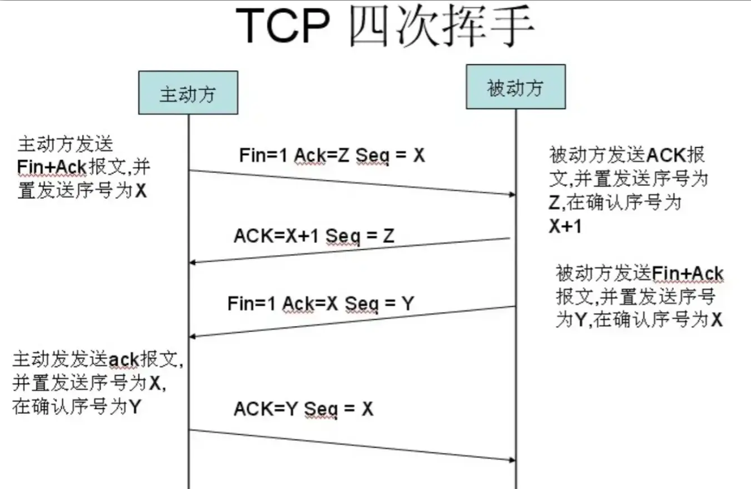

## 待复习

> ````js
> onclick的绑定有多少种
> 
> module.export 跟 export
> 
> 跨域，解决方案：NGINX，给路由设置线上的路径
> 
> 导入导出excel：content-type解释
> 
> 
> 数据转换是三层的，然后还有一些数据的筛选，导致处理的过程比较复杂
> 还有携带值到弹层，并截取成一个个数据放到设定的内容中，然后显示默认行数据，不够则为0
> 
> 
> 原型对象中，如果number原型通过toString()转换，是否会变换，是否仍是number
> 
> js的精度问题：是怎么通过toFixed()来进行计算，因为是四舍五入，是否会缺失精度。
> 如果通过*100然后再除以100，是否可以达到这样的效果
> 
> provide和inject的使用：由于vue有$parent属性可以让子组件访问父组件。但孙组件想要访问祖先组件就比较困难。通过provide/inject可以轻松实现跨级访问父组件的数据
> 在父组件中使用provide属性，在子/孙组件中通过inject注入provide中的变量值
> 
> 
> hash和history
> 
> 
> 树形菜单转换
> 
> HTML5新特性
> 
> 
> 作用域和作用域链
> 
> 数组拉伸：通过把数组转换为字符串，然后消去'['和']'符号。
> 
> 求和函数sum(1,2,3) sum(1,2,3,45,6,false)
> 
> 岛屿数量，第k个缺失的正整数
> ````
> 

> ```js
> .sync修饰符
> http请求：http请求头
> 
> 协商缓存，DNS缓存
> 手写ajax请求
> 
> 伪类选择器的先后顺序
> a:link,     a:visited,	a:hover,	a:active
> 
> 两个div重叠
> 	BFC可以解决外边距重叠。
> 	产生BFC的元素：
>      根元素；
>      float不为none
>      overflow不为visible
>      position不为static和relative
>      disaplay为inline-block/flex/inline-flex/table-cell/table-caption 
> 
> 定位
> 1. 绝对定位：定位是相对于离自己最近设置了相对或绝对定位的父元素定位；
>    若没有，则以浏览器窗口Body的左上角定位；绝对定位的元素会脱标，不占位置
> 2. 相对定位：相对于自身进行定位，元素仍然占据原来的位置
>    当元素设置了transform属性，该元素会具备相对定位的特性
> 3. 固定定位：始终以浏览器窗口的可视区域定位，元素不占位置
> 4. 静态定位：元素的标准流显示方式，不可移动元素
> 5. 可通过z-index进行定位元素的上下层级移动(静态定位不能设置)
> 
> 清除浮动
> 1. 给设置浮动元素标签最后面新增一个标签，并设置属性`clear:both;`    clear:both的本质是闭合浮动，让父盒子闭合出口和入口，不让子盒子出来
> 2. 给设置浮动的父级添加overflow属性
> 3. 给设置浮动的父元素中使用after伪元素清除浮动，在:after中添加设置模式为块元素，并通过clear:both清除浮动
> 4. 给设置浮动的父元素中使用before和after双伪元素清除浮动，设置模式为table元素，并在after中清除浮动
>     注意：为了兼容ie浏览器，需要给父元素添加属性 *zoom: 1;
> 
> 垂直居中的方式
> 1. flex布局：设置display:flex和align-item:center;
> 2. margin和transform配合，margin:50% auto，transform:translateY(-50%);
> 3. 设置模式为行内块和垂直居中属性：display:inline-block;vertical-align:middle;
> 4. 设置绝对定位和负margin：position:absolute;margin-left:-50%;margin:-50%;
> 5. 设置绝对定位和margin:auto；	当宽度和高度未知时使用
> 6. 设置绝对定位和transform：position:absolute;left:50%;right:50%; transform: translate(-50%, -50%)
> 7. 网格布局：设置display:grid;align-self:center
> 
> css选择器类型
> 1. 元素选择器
> 2. 类选择器
> 3. ID选择器
> 4. 属性选择器
> 5. 派生选择器
> 
> this指向
> 1. 函数调用时，指向window
> 2. 以方法调用时，指向调用该方法的对象
> 3. 使用new创建一个对象时，指向该对象
> 4. call、apply、bind可以改变this指向，其区别是传参不同或执行时间不同
> 
> 闭包
> 1. 闭包产生条件：内部函数调用外部变量
> 2. 闭包的应用场景：函数柯里化、立即执行函数、防抖节流
> 
> 数据类型
> 基本数据类型：Number、String、Boolean、Null、undefined、Symbol、BigInt
>   存储在栈中，数据大小确定、可以直接操作保存在变量中的实际值
> 引用数据类型：object。引用地址存储在堆内存中，变量是保存的在栈内存中的一个指针，这个指针指向堆内存
>   引用类型数据在栈内存中保存的实际上是对象在堆内存中的引用地址
> 
> promise.any：只要一个成功就返回成功，如果所有的都是失败，则失败；如果any接收的是一个非promise数组，则返回成功
> promise.race：看第一个执行完成的promise，且状态跟第一个执行完成的状态一致；一般用作超时处理
> promise.all：所有执行成功才会返回成功，否则返回失败
> 
> get和post请求
>   1. get浏览器回退是无害的，而post需要再次提交请求
>   2. get只能进行url编码，而post支持多种编码方式
>   3. get请求参数会保存到历史记录中，post请求的参数不会保留
>   4. get在url中参数有长度限制，post没有
>   5. get比post更不安全
> 
> cookies、sessionStorage、localStorage
> 1. 都是保存在客户端，并且同源
> 2. cookie是大小有限制，一般为4kb左右，每个站点最多只能存放20个cookies左右；而其他两个有5M左右，可以忽略这种存放的限制
> 3. sessionstorage只要关闭网页或浏览器就失效；localstorage如果不手动清除，永久保存； cookies如果设置保存时间，则在过期时间内有效，否则关闭网页或浏览器就失效
> 
> 
> vue2的数据双向绑定原理
> 1. 通过监听器Observer：劫持并监听对象所有属性，利用Object.definedProperty()对属性加上setter和getter方法
> 2. 通过解析器Compile：解析Vue模板指令，将模板的变量替换为数据，然后渲染页面视图，并对每个指令节点绑定更新函数，添加监听数据的订阅者，当数据有变动，就会调动更新函数进行数据更新
> 3. 订阅者Watcher：是监听器和解析器之间通信的桥梁，主要是订阅监听器中的属性值变化，当发生变化，就会触发解析器中对应的更新函数
> 4. 订阅器Dep：订阅器采用 发布-订阅 模式，用来收集订阅者，对监听器和解析器进行统一管理。
> 
> v-show与v-if的区别 ？ 
>    v-show：初始渲染高，等同display:none，适用于频繁切换的；
>    v-if：按条件渲染，每次都删除或创建元素，适用于运行时很少改变条件的
> computed与watch的区别?
>    computed：依赖其他属性值，并且computed有缓存，只有依赖值发生改变，下一次获取才会改变； 会产生一个新的属性值
>    watch：监听其他数据的变化，并且监听的值必须存在data中，不支持缓存，每当数据变化后回调执行
> 父子组件生命周期
>   父beforeCreate->父created->父beforeMounted->子beforeCreate->子created->子beforeMount->子mounted->父mounted
> 组件生命周期
>   beforeCreated：vue实例的el挂载元素和数据对象data都是undefined，还未初始化
>   created：vue实例的数据data加载，但是挂载元素el还没初始化
>   beforeMounted：挂载元素已经初始化，但是还没挂载前都是虚拟的demo阶段，data和message还未替换
>   mounted：vue实例挂载完成，data中的数据渲染到页面上
>   当data数据发生变化时，触发beforeUpdate和updated
> 组件间的通信
>    1. props / $emit 适用父子组件通信
>    2. ref 与 $parent / $children 适用于父子组件通信
>    3. 事件总线 适用于父子、隔代、兄弟组件通信
>    4. $attrs / $listeners 适用于隔代组件通信
>    5. provide / inject 适用于隔代组件通信
>    6. Vuex 适用于父子、隔代、兄弟组件通信
> 
> 
> 全局变量实现的方式
> 1. vuex
> 2. 通过module.exports：可在一个js文件中定义变量，然后通过module.exports暴露出去，最后通过入口文件全局挂载到Vue.protype中；通过this来进行引用
> 3. 通过export default：可在一个js文件中定义变量，然后通过export default暴露出去，最后通过入口文件全局挂载到Vue.protype中；通过this来进行引用
> Vuex刷新时数据会消失，那如何解决？为什么还要使用Vuex
> 	在vue项目中用vuex来做全局的状态管理， 发现当刷新网页后，保存在vuex实例store里的数据会丢失。
> 	原因：因为store里的数据是保存在运行内存中的,当页面刷新时，页面会重新加载vue实例，store里面的数据就会被重新赋值初始化
> 
> vue的key值使用场景
> 1. v-for：key是虚拟DOM对象的表示。在数据发生变化时，新旧虚拟DOM会根据diff算法对比，若kye值找到，就判断数据是否相同；key值不同，则创建一个
>    所以一般不用索引下标来当做key值，因为Key值很容易相同，但是内容不同
> 2. 动态路由中添加key，管理可复用元素：Vue会尽可能高效的渲染元素，通常会复用已有元素，但此时会带来一些不好的副作用，所以通过key来辨识他们不一样
>  主要作用是为了高效的更新虚拟DOM，以便它能跟踪每个节点的身份，从而重用和重新排序现有元素
> 
> 
> 跨域与jsonp
> 0. JOSNP是什么？
>   JSONP是一种非正式传输协议，主要利用script标签没有跨域限制的漏洞来解决跨域通信，
>    该协议允许用户传递一个回调参数给服务器，然后服务器返回数据时会将这个callback参数作为函数名包裹JSON数据
> 1. 什么叫跨域？
>    跨越域名，通常两个域名不同会无法进行通信，浏览器会采用同源策略对其限制
> 2. 什么同源？
>   同源是指“协议、域名、端口号”相同，
>   同源是为了保护用户信息的安全，防止恶意网站窃取数据，确保一个应用中的资源只能被本应用访问
> 3. 同源的限制
>    cookie、localstorage、indexDB无法读取，DOM无法获得，AJAX请求不能发送
> ```

## CSS

### html标签语义化

> - h、p、header、nav、article、aside、footer
> - HTML标签语义化让页面的内容结构化，结构更清晰，便于对浏览器、搜索引擎解析
> - 有利于开发和维护
> - 有利于SEO
> - 提升用户体验，比如title、alt

### 对h5的理解

> - 新标签可读性高，有助于开发
> - 提供了更多的媒体标签（audio、video）
> - 很好的替代了flash
>
> #### HTML5新特性
>
> - 绘画canvas
> - 用于媒介回放的video和audio元素
> - 本地离线存储localstorage长期存储数据，浏览器关闭后数据不丢失
> - sessionstorage的数据在浏览器关闭后自动删除
> - 语义化更好的内容元素，比如`article、footer、header、nav、section`
> - 表单控件`calendar、date、time、email、url、search`
> - 地图和拖放
> - 新的技术webworker、websocket、Geolocation
>
> #### 处理兼容
>
> - IE8/IE7/IE6支持通过document.createElement方法产生的标签，可以利用这一特性让这些浏览器支持HTML5新标签，浏览器支持新标签后，还需添加标签默认的样式
> - 还可用成熟的框架，比如html5shim
>
> ```html
> <!-- [if lt IE 9]>
> 	<script src="http://html5shim.googlecode.come/svn/trunk/html5.js"></script>
> <![endif]-->
> ```

### script标签defer和async的区别

> 1. 没有defer和async，浏览器会立即加载并执行指定的脚本，“立即”是指在渲染该script标签之下的文档元素之前，就是说不等待后续载入的文档元素，读到加载并立即执行
> 2. 有async，加载和渲染后续文档元素的过程将和js脚本文件的加载与执行并行进行（异步）
> 3. 有defer，加载后续文档元素的过程将和js脚本文件的加载并行进行（异步），但js脚本文件的执行要在所有元素解析完成后，`DOMContentLoaded`事件触发之前完成
> 4. 从实用角度来说，把所有脚本都丢到`</body>`之前是最佳实践，因为对于旧浏览器来说这是唯一的优化选择，此法可保证非脚本的其他一切元素能够以最快的速度得到加载和解析
>
> 
>
> - defer和async在网络读取(下载)都是异步的（相较于HTML解析）
> - defer是按照加载顺序执行脚本
> - async是乱序执行的，脚本的加载完会立刻执行
> - async对于应用脚本用处不大，因为它不考虑依赖；对于不依赖任何脚本或不被任何脚本依赖的脚本非常适合，如`Google Analytics`
> - 即操作DOM的脚本不要使用`async或defer`


### 页面导入样式时，使用link和@import的区别

> 1. link是XHTML标签，除了加载CSS外，还能用于定义RSS，定义rel链接属性等作用；而@import是CSS提供，只能用于加载CSS
> 2. link引用CSS时，在页面载入时同时加载，@import需要页面网页完全载入以后加载
> 3. link是XHTML标签，无兼容性问题；@import是在CSS2.1提出，低版本(IE5及以下)的浏览器不支持
> 4. link支持使用JavaScript控制DOM去改变样式；而@import不支持

### CSS加载会造成阻塞吗？

> - css加载不会阻塞DOM的解析
> - css加载会阻塞DOM的渲染
> - CSS加载会阻塞js的执行


### 样式的继承

> 并不是所有的样式都会被子元素所继承，如：背景相关的、边框相关的、定位相关的样式都不会被子元素所继承。
>
> 可以继承的有：字体系列的属性、文本系列的属性、元素的可见性、表格布局属性、列表属性、页面样式属性

### 元素优先级

> - 内联样式，优先级1000
> - id选择器，优先级100
> - 类和伪类，优先级10
> - 元素选择器，优先级1
> - 通配选择器，优先级0
>
> 当选择器包含多种选择器时，需要将多种选择器的优先级相加然后进行比较。但是注意，选择器的优先级计算不会超过它的最大数量级，如果选择器的优先级一样，则使用靠后的样式
>
> 伪类的顺序：`:link  、 :visited 、 :hover 、 :active`

### 浮动

> - **浮动**：当父元素不给高度时，内部元素不浮动会撑开；而浮动时，父元素会变成一条线。
> - **使用clear清除浮动的原理**：元素盒子的边不能和前面的浮动元素相邻，对元素设置clear属性是为了避免浮动元素对该元素的影响，而不是清除掉浮动
> - `clear:both`：本质是闭合浮动，即是让父盒子闭合出口和入口，不让子盒子出来。
>
> ### 去浮动
>
> 1. 额外标签法：在后面添加一个新标签，并定义样式为clear:both
> 2. 给父元素添加overflow:hidden或overflow:auto，并添加高度height属性。通过触发BFC清除浮动
> 3. 给父元素添加after伪元素：然后在after中定义属性`diplay:block;content:'';height:0;clear:both;overflow:hidden;`并给父元素添加属性`*zoom:1;`
> 4. 使用before和after双伪元素：在双伪元素中定义属性`content:0;display:table;`，在after中定义属性`clear:both`，在父元素中定义`*zoom:1;`(由于IE6-7不支持 :after，使用 zoom:1 触发 hasLayout)
>
> 注意：即使清除浮动，当超出父元素的内容还是会溢出，所以建议在父元素中定义`overflow:hidden/auto`；且在定义浮动后，若子盒子宽度超出父盒子宽度，超出部分的子盒子会换行显示（是超出部分的整个子盒子，而不是子盒子的内容）

### 取消行内元素间的间隙

> - 行内元素产生间隙的原因：存在“回车键”、空格、“tab”时就会出现间隙
>
> 1. 将元素写成一行，中间不换行(代码不美观)
> 2. 给父元素设置font-size:0(其他字符尺寸也被设为0，需要额外重新设定其他字符尺寸，且在Safari浏览器依然会出现空白间隔)
> 3. 为元素设置负margin值，但是会根据父元素定义的font-size大小而变化
> 4. 设置浮动，需要给父元素设置宽高(有些容器是不能设置浮动，如左右切换的焦点图等)
> 5. 给父元素设置word-space或letter-space值为负数(这也设置了`<li>`内的字符间隔，因此需要将`<li>`内的字符间隔设为默认letter-spacing:normal)

### 盒模型

> ```js
> - 盒模型本质是盒子，封装周围的HTML元素
> - CSS 的盒子模型有两种：标准W3C盒子模型模型、IE盒子模型(怪异盒模型)
> - 盒模型 = 内容、内边距、边框、外边距（注意：IE盒模型的内容包括border跟padding）
> - box-sizing
> 	- inherit为从父元素继承box-sizing属性的值
> 	- content-box指定盒子模型为标准盒模型
> 	- border-box 为怪异盒模型
> 
> - 标准盒模型的 content 为 width 和 height
> - 怪异盒模型的 content 为 width 和 height、border及padding
> 
> - 标准盒模型： 一个块的总宽度 = width+margin(左右)+padding(左右)+border(左右)
> - 怪异盒模型： 一个块的总宽度 = width+margin（左右）（既 width 已经包含了 padding 和 border 值）
> ```

### 文本溢出

> ````js
> // 单行溢出显示省略号
> display: block;
> white-space:nowrap;	// 文本不换行，只显示一行文字
> overflow:hidden;	// 超出内容框的隐藏
> text-overflow:ellipsis;	// 用省略号显示超出的部分
> 
> //两行超出隐藏
> overflow: hidden;	// 超出的隐藏显示
> text-overflow:ellipsis;	// 省略号显示溢出部分
> display:-webkit-box;	// 弹性伸缩盒子模型显示
> -webkit-line-clamp:2;	// 限制在一个块元素显示的文本行数
> -webkit-box-orient:vertical;	// 设置或检索伸缩盒对象的子元素的排列顺序
> word-wrap: break-word;	//换行（若不设置会不换行，从而导致只显示一行）
> line-height: 30rpx;
> height: 60rpx;	// 一般来说，应设定高度=行高*显示的行数,防止超出的文字露出
> ````

### 定位

> - 相对定位：相对于自身位置进行定位，元素仍然占据原来的位置
> - 绝对定位：相对于离自己最近的定义非静态定位的父元素位置定位，若没有，则相对于body左上角定位，会脱标，不占位置
> - 固定定位：以body左上角作定位，元素不占位
> - 静态定位：元素的标准流显示方式，没有定位
> - 可通过z-index来进行定位元素的上下层级调整（静态定位不能设置）

### flex布局

> **flex**属性是`flex-grow、flex-shrink、flex-basis`三个属性的缩写
>
> **flex-grow**：定义项目的的放大比例；
>
> - ​    默认为0，即 即使存在剩余空间，也不会放大；
> - ​    所有项目的flex-grow为1：等分剩余空间（自动放大占位）；
> - ​    flex-grow为n的项目，占据的空间（放大的比例）是flex-grow为1的n倍。
>
> **flex-shrink**：定义项目的缩小比例；
>
> - ​     默认为1，即 如果空间不足，该项目将缩小；
> - ​     所有项目的flex-shrink为1：当空间不足时，缩小的比例相同；
> - ​     flex-shrink为0：空间不足时，该项目不会缩小；
> - ​     flex-shrink为n的项目，空间不足时缩小的比例是flex-shrink为1的n倍。
>
> **flex-basis**： 定义在分配多余空间之前，项目占据的主轴空间（main size），浏览器根据此属性计算主轴是否有多余空间，
>
> - ​     默认值为auto，即 项目原本大小；
> - ​     设置后项目将占据固定空间。  
>
>  所以flex属性的默认值为：0 1 auto （不放大会缩小）
>
>   **flex为none**：0 0 auto  （不放大也不缩小）
>
>   **flex为auto**：1 1 auto  （放大且缩小）
>
>   **flex为一个非负数字n**：该数字为flex-grow的值，
>
>   **flex：n**；=  flex-grow：n；
>
> ​          			 flex-shrink：1；
>
> ​          			 flex-basis：0%；
>
>   **flex为两个非负数字n1**，**n2**： 分别为flex-grow和flex-shrink的值，
>
>   **flex：n1 n2**; = flex-grow：n1；
>
> ​              				flex-shrink：n2；
>
> ​              				flex-basis：0%；
>
>   **flex为一个长度或百分比L**：视为flex-basis的值，
>
>   **flex: L**; =  flex-grow：1；
>
> ​          		  flex-shrink：1；
>
> ​          		  flex-basis：L；
>
>   **flex为一个非负数字n和一个长度或百分比L**：分别为flex-grow和flex-basis的值，
>
>   **flex：n L**；= flex-grow：n；
>
> ​            flex-shrink：1；
>
> ​            flex-basis：L;
>
>   可以发现，flex-grow和flex-shrink在flex属性中不规定值则为1，flex-basis为0%。
>
>  flex：1即为flex-grow：1，经常用作自适应布局，将父容器的display：flex，侧边栏大小固定后，将内容区flex：1，内容区则会自动放大占满剩余空间。

### 垂直水平居中

> 1. 父元素设置flex或grid布局：`display:flex/grid;justify-content:center;align-items:center;`
> 2. 父元素设置flex或grid布局+margin:auto：`display:flex/gird;margin:auto;`
> 3. 子元素通过margin和transform配合：`margin:50% auto;transform:translateY(-50%);`
> 4. 使用table-cell：父元素设置`display:table-cell;vertical-align:middle;text-align:center;`，子元素设置`display:inline-block;`
> 5. 设置定位和transform：父元素设置相对定位，子元素设置`position:absolute;left:50%;right:50%; transform: translate(-50%, -50%)`
> 6. 使用伪元素，在父级最后增加一个空的文本元素，将文本元素的行高设置成父元素content的高度，当这个父元素的空的文本元素与其直接子元素的font-size一样高时，由于基线对齐，实现了垂直居中`.father{width: 50px;height: 50px;text-align: center;} .father::after{content:"";line-height:50px;} .son{display:inline-block;}`

### BFC

> **BFC（Block formatting contexts）：块级格式上下文**
>
> - 块级元素才会产生BFC，且BFC仍属于文档中的普通流，是一个独立隔离的渲染区域，不影响区域与外部
>
> - **产生BFC的元素**(脱离文档流)
>
>   1. 根元素
>   2. float属性不为none；
>   3. position不为static和relative；
>   4. overflow不为visible；
>   5. display为inline-block, flex, inline-flex，table-cell, table-caption
>
> - **BFC的特点**
>
>   1）内部的Box会在垂直方向，一个接一个地放置。
>   2）Box垂直方向的距离由margin决定。属于同一个BFC的两个相邻Box的margin会发生重叠
>   3）每个元素的margin box的左边， 与包含块border box的左边相接触(对于从左往右的格式化，否则相反)。即使存在浮动也是如此。
>   4）BFC的区域不会与float box重叠。
>   5）**BFC就是页面上的一个隔离的独立容器，容器里面的子元素不会影响到外面的元素。反之也如此。**
>   6）计算BFC的高度时，浮动元素也参与计算
>
> - **BFC作用**
>
>   - **解决外边距重叠问题**：由于BFC是一个独立的区域，内部的元素和外部的元素互不影响，将两个元素变为两个BFC，就解决了margin重叠的问题。
>
>     **解决高度塌陷的问题（清除浮动影响）**：在对子元素设置浮动后，父元素会发生高度塌陷，也就是父元素的高度变为0。解决这个问题，只需要把父元素变成一个BFC。常用的办法是给父元素设置`overflow:hidden`。
>
>     **创建自适应两栏布局**：可以用来创建自适应两栏布局：左边的宽度固定，右边的宽度自适应（利用浮动导致内容坍塌，然后让中间的设置margin:auto）
>
> ```css
> 关于div外边距重叠的发生条件
> 情况一：两个div垂直边界相邻，margin会等于二者中margin较大的值
>               解决方案 1.position：absolute
>                       2.float：left
> 
> 情况二：子元素在父元素内，子元素的margin-top会与父元素的margin-top重叠，值等于二者中较大的，如果只有子元素设置了margin-top，则显示为父元素的margin-top
>               解决方案 1.给父元素设置border（给子元素设置边框没有用）
>                             2.给父元素设置padding值
>                             3.给父元素或子元素添加float：left
>                             4.给父元素或子元素添加position：absolute
>                             5.给父元素添加overflow：hidden
>                             6.给子元素添加display：inline-block
> 
> 情况三：一个空白元素自身的margin-top和margin-bottom会重叠，值为而这种较大的
>              解决方案 1.设置透明border
> ```

### display、float、position的关系

> （1）首先判断display属性是否为none，如果为none，则position和float属性的值不影响元素最后的表现。
>
> （2）然后判断position的值是否为absolute或者fixed，如果是，则float属性失效，并且display的值应该被设置为table或者block，具体转换需要看初始转换值。
>
> （3）如果position的值不为absolute或者fixed，则判断float属性的值是否为none，如果不是，则display的值则按上面的规则转换。注意，如果position的值为relative并且float属性的值存在，则relative相对于浮动后的最终位置定位。
>
> （4）如果float的值为none，则判断元素是否为根元素，如果是根元素则display属性按照上面的规则转换，如果不是，则保持指定的display属性值不变。
>
> 可以看作是一个类似优先级的机制，"position:absolute"和"position:fixed"优先级最高，有它存在的时候，浮动不起作用，'display'的值也需要调整；其次，元素的'float'特性的值不是"none"的时候或者它是根元素的时候，调整'display'的值；最后，非根元素，并且非浮动元素，并且非绝对定位的元素，'display'特性值同设置值

### inline、inline-block、block的区别

> - 行内元素一般是内容的容器（适合显示具体内容），而块级元素一般是其他容器的容器（适合做布局）
> - **块级元素**`block`：独占一行，对宽高属性生效；如果不给宽度，块级元素默认为浏览器的宽度100%宽
> - **行内元素**`inline`：可以多标签存在一行，对宽高属性值不生效，完全靠内容撑开宽高
> - **行内块元素**`inline-block`：可设置长宽，可让padding和margin生效，又可和其他行内元素并排
> - 行内元素：`a、b、strong、span、img、label、button、input、select、textarea`（其中img和input为行内块元素）
> - 块级元素：`header、form、ul、ol、table、article、div、hr、aside、figure、canvas、video、audio、footer`
>
> **行内元素与块元素的转换**
>
> - **float**：当把行内元素设置浮动后，该行内元素的display属性会被赋予block属性，且拥有浮动特性。行内元素去除了之间的莫名空白
> - **position:** 当为行内元素进行定位时，position:absolute与position:fixed都会使得原先的行内元素变为块级元素
> - **display:`inline/inline-block/block`**
>
> **特性**
>
> - text-align属性对块级元素起作用，对行内元素不起作用
> - 块级元素独自占一行且宽度默认会占满父元素宽度，行内元素不会独占一行，相邻行内元素可以排在同一行
> - 块级元素可以设置weith和height，行内元素设置width和height无效，而且块级元素即使设置宽度也还是独占一行。

## display:none、visibility:hidden、opacity:0 区别(元素隐藏)

> - `opacity:0`：本质上是将元素的透明度将为0，但依然占据空间且可以交互；可以跟transition搭配；重建图层，性能较高
> - `visibility:hidden`: **占据空间且不可交互**；显示不会导致页面结构发生变动，不会撑开；**重绘**操作 比回流操作性能高
> - `overflow:hidden`:只隐藏元素溢出的部分，**占据空间且不可交互**
> - `display:none`: 元素从文档流中消失，**不占据空间、不交互也不影响布局**；显示出原来这里不存在的结构，会**重排**操作，性能开销较大
> - `z-index:-9999`: 将层级放到底部，这样就会被其他元素被覆盖，**占据空间不一定能交互**(没有背覆盖部分能交互)
> - `transform: scale(0,0)`: 平面变换，将元素缩放为0，**占据空间且不可交互**
>
> #### display:none
>
> 1. DOM结构：浏览器不会渲染display属性为none的元素，不占据空间
> 2. 事件监听：无法进行DOM事件监听
> 3. 性能：动态改变此属性时会引起重排，性能较差
> 4. 继承：不会被子元素继承，子类也不会被渲染
> 5. transition：transition不支持display
>
> #### visibility:hidden
>
> 1. DOM结构：元素被隐藏，但是会被渲染不会消失，占据空间
> 2. 事件监听：无法进行DOM事件监听
> 3. 性能：动态改变此属性时会引起重绘，性能较高
> 4. 继承：会被子元素继承，子元素可以通过设置`visibility:visible`来取消隐藏
> 5. transition：visibility会立即显示，隐藏时会延时
>
> #### opacity:0
>
> 1. DOM结构：透明度为100%，元素隐藏，占据空间
> 2. 事件监听：可以进行DOM事件监听
> 3. 性能：提升为合成层，不会触发重绘，性能较高
> 4. 继承：会被子元素继承，且子元素并不能通过opacity:1来取消隐藏
> 5. transition：opacity可以延时显示和隐藏
>
> #### 区别
>
> - `visibility:hidden`和`display:none`的区别仅仅在于`display:none`隐藏后不占据任何空间，而`visibility:hidden`隐藏后的元素依旧保留
> - `visibility`具有继承性，给父元素设置`visibility:hidden`子元素也会继承这个属性，但是如果重新给子元素设置`visibility:visible`，则子元素又会显示出来。这个和`display:none`不同
> - css3的`transition`支持`visibility`属性，但并不支持display，由于transition可以延迟执行，因此可以配合visibility使用纯css实现hover延时显示效果
> - `visibility:hidden`不会影响计数器的计数，`visibility:hidden`虽然让一个元素不见了，但是其计数器仍在运行，而`display:none`则不是

### css模块化

> 
>
> - 就是通过每个页面根节点唯一类名，然后加上CSS后代选择器的方式来实现私有样式，这种方式是最简单，基本上和模块化不搭边，他只适合在比较小的前端中使用。
> - Vue中scoped方案，通过给每个模块生成一个唯一的属性值，然后将该属性添加到每个dom节点上，然后配合CSS的属性选择器来时实现私有样式，这种方式只能解决样式私有化的问题，但是也架不住被其他样式文件干扰
> - 开启css-loader的modules,使用CSS Modules方案，它不仅能实现样式的私有化，还能有效的避免被其他样式文件干扰，只是他需要借助webpack进行进行编译，写法上也有点不一样。

### 实现三列布局

> **实现左右两侧宽度固定，中间自适应**：BFC块级布局，flex布局，table布局,css计算宽度布局
>
> - 绝对定位+中间版块不给宽度
> - 两侧浮动+中间自动撑开（使用calc动态计算宽度，设置对应宽度margin）
> - flex，左右设置flex-basis，中间设置flex-grow
>
> **calc计算**
>
> ```css
> <div class= "main">
>     <div class="left"></div>
>     <div class="right"></div>
>     <div class="center"></div>
> </div>
> <style>
>     .main{
>         width:100%;height:400px;border:1px solid red;
>     }
>     .left{
>         width:100px;height:100%;background:gray;
>         float:left;
>     }
>     .center{
>         width:calc(100% - 100px);
>         height: 100%;
>         background: red;
>     } 
>     .right{
>         height:400px;background:green;
>         float:right;
>         width:100px;
>     }
> </style>
> ```
>
> **float布局**
>
> ```css
> .left{
>     float: left;
>     width: 300px;
>     height: 100px;
>     background: #631D9F;
> }
> .right{
>     float: right;
>     width: 300px;
>     height: 100px;
>     background: red;
> }
> .center{
>     margin-left: 300px;
>     margin-right: 300px;
>     background-color: #4990E2;
> }
> .main::after{
>     content:'';
>     display: block;
>     clear: both;
> }
> ```
>
> **position布局**
>
> ```css
> .left{
>     position: absolute;
>     left: 0;
>     width: 300px;
>     background-color: red;
> }
> .center{
>     position: absolute;
>     left: 300px;
>     right: 300px;
>     background-color: blue;
> }
> .right{
>     position: absolute;
>     right: 0;
>     width: 300px;
>     background-color: #3A2CAC;
> }
> ```
>
> **flex布局**
>
> > - 注意：当子元素的宽度大于父元素的宽度时，左右两边的子盒子会平分父元素宽度显示，中间的内容不显示。
> >
> > ```css
> > .main {
> >   width: 300px;
> >   height: 200px;
> >   display: flex;
> > }
> > .left {
> >   width: 400px;
> >   height: 100px;
> >   background-color: red;
> > }
> > .center {
> >   height: 100px;
> >   background-color: blue;
> >   flex: 1;
> > }
> > .right {
> >   height: 100px;
> >   background-color: green;
> >   width: 400px;
> > }
> > ```
>
> **table布局**
>
> ````css
> .main{
>     width: 100%;
>     display: table;
> }
> .left,.center,.right{
>     display: table-cell;
> }
> .left{
>     width: 300px;
>     background-color: red;
> }
> .center{
>     background-color: blue;
> }
> .right{
>     width: 300px;
>     background-color: red;
> }
> ````
>
> **grid布局**
>
> ```css
> .div{
>     width: 100%;
>     display: grid;
>     grid-template-rows: 100px;
>     grid-template-columns: 300px auto 300px;
> }
> ```

## JS

### DOM节点增删改查

> **查找节点**：`getElementById()、getElementsByClassName()、getElementsByTagName()、querySelector()、querySelectorAll()`
>
> **创建节点**：`createElement()`
>
> **插入节点：**
>
> - `appendChild()`：子节点末尾添加
> - `insertBefore()`：同级指定位置添加，但需要知道父节点
>
> **替换节点**：`replaceChild(newChild, oldChild)`：第一个为要插入的结点，第二个为要替换的结点
>
> **移除节点**：`removeChild()`
>
> ```js
> document.createElement('div');
> 
> const element = document.createElement('div');
> document.body.appendChild(element);
> 
> const newNode = document.createElement('div');
> document.body.insertBefore(newNode);
> 
> const newNode=document.createElement('span');
> const oldNode=document.querySelector('#root');
> document.body.replaceChild(newNode,oldNode);
> 
> const element=document.querySeletor('#root');
> document.body.removeChild(element);
> ```
>
> **综合案例**
>
> ```html
> <!DOCTYPE html>
> <html lang="en">
>   <head>
>     <meta charset="utf-8" />
>     <title>DOM CRUD</title>
>     <style></style>
>   </head>
>   <body>
>     <div id="root"></div>
>     <script>
>       /**
>        * 查找节点
>        * @param {*} name
>        * name: id,class,tagname
>        * 调用示例 findNode('#root')或者findNode('div')
>        */
>       const findNode = function (name) {
>         return document.querySelector(name);
>       };
>       /**
>        * 创建一个节点
>        * @param {*} tagName, attrObj
>        * name: 标签名
>        * attrObj: 属性名
>        * 调用示例: createNode('div'), createNode('div',{id:'first',innerHTML:'helloworld'})
>        */
>       const createNode = function (tagName, attrObj) {
>         let node = document.createElement(tagName);
>         for (let key in attrObj) {
>           node[key] = attrObj[key];
>         }
>         return node;
>       };
>       /**
>        * 插入一个节点
>        * @param {*} parentNode,newNode
>        * parentNode: 要插入的父节点
>        * newNode: 要插入的节点
>        * 调用示例: insertNode(root,node2)
>        */
>       const insertNode = function (parentNode, newNode) {
>         // appendChild
>         // insertBefore
>         parentNode.appendChild(newNode);
>       };
>       /**
>        * 替换一个节点
>        * @param {*} parentNode,newNode,oldNode
>        * parentNode: 要替换节点的父节点
>        * newNode: 替换后的节点
>        * oldNode: 替换前的节点
>        * 调用示例: replaceNode(root,node1,node2);
>        * 注意：第二个参数和第三个参数不可调换位置
>        */
>       const replaceNode = function (parentNode, newNode, oldNode) {
>         parentNode.replaceChild(newNode, oldNode);
>       };
>       /**
>        * 移除一个节点
>        * @param {*} sourceNode,targetNode
>        * sourceNode: 要移除节点的父节点
>        * targetNode: 需要被移除的节点
>        * 调用示例: removeNode(root,node1);
>        */
>       const removeNode = function (sourceNode, targetNode) {
>         sourceNode.removeChild(targetNode);
>       };
>       /**
>        * 渲染一段dom
>        * @param {*} node htmlStr
>        * node: 需要插入的父节点
>        * htmlStr: dom字符串
>        * 调用示例: renderDom(findNode('#root'),'<div id="myDiv">myDiv</div>');
>        */
>       const renderDom = function (node, htmlStr) {
>         node.innerHTML = htmlStr;
>       };
> 
>       //测试
>       const root = findNode("#root");
>       const node1 = createNode("div", { id: "n1", innerHTML: "节点1" });
>       const node2 = createNode("div", { id: "n2", innerHTML: "节点2" });
>       const node3 = createNode("div", { id: "n3", innerHTML: "节点3" });
>       const node4 = createNode("div", { id: "n4", innerHTML: "节点4" });
> 
>       const htmlStr = `<div id="myDiv">mydiv</div>`;
> 
>       //  insertNode(root,node1);
>       //  insertNode(root,node2);
>       //  insertNode(root,node3);
> 
>       // replaceNode(root,node4,node1);
> 
>       // removeNode(root,node1)
> 
>       renderDom(findNode("#root"), htmlStr);
>     </script>
>   </body>
> </html>
> ```
>
> 

### 冒泡事件

> - **不支持冒泡的事件：**focus、blur、mouseenter、mouseleave、load、unload、resize
> - **支持冒泡的事件：**scroll、click
> - addEventListener的第三个参数默认为false，在冒泡执行；true为在捕获时执行（即可理解为是否在捕获时执行）

### 事件

> - 事件捕获：是从document到触发事件的那个节点，即自上而下的去触发事件
>
> - 事件冒泡：IE提出的事件流，和事件捕获相反，即事件开始时由**最具体的元素接收，然后逐级向上传播到较为不具体的节点，是由下而上的去触发事件**
>
> - **事件委托：事件委托是利用事件冒泡，只指定一个事件处理程序来管理某一类型的所有事件。**
>
> - **为什么要用事件委托？**
>
>   1.在JavaScript中添加到页面上的事件处理程序的个数直接关系到页面的整体运行性能。为什么呢？因为，每个事件处理函数都是对象，对象会占用内存，内存中的对象越多，性能就越差。此外，必须事先指定所有的事件处理程序而导致的DOM访问次数，会延迟整个页面的交互就绪时间。
>
>   2.对有很多个数据的表格以及很长的列表逐个添加事件，简直就是噩梦。所以事件委托，能极大地提高页面的运行性能，减少开发人员的工作量。

### 类型转换/判断

>```js
>// ""、[]、0的数据类型转换
>	!!String("")	// true
>!!Number("")	// true
>!!Boolean("")	// false
>
>!!String([])	// false
>!!Number([])	// false
>!!Boolean([])	// true
>
>!!String(0)		// true
>!!Number(0)		// false
>!!Boolean(0)	// false
>注意：[] 转为字符串时是 "", 转为数字是 0, 转为布尔值是 true
>
>
>[] == ![]	// true
>![] == "" // true
>[] == 0	// true
>[] == []	// false
>[] == {}	// false
>([]) ? true : false	// true
>{} == false	//  false
>[] == false // true
>
>undefined == undefined	//true
>undefined == null	// true
>null == null	// true
>NaN == null		// false
>Infinity + 1 === Infinity // true
>
>// 先比较 第一位字符串，如果为true，则继续比较第二位
>"abc" > "b"	// false
>"abc" > "aad"	// true
>Number('a') == Number('a')	// false
>[1,2] == 1,2	// true
>
>// 需要一个小数点作为隔开
>3.toString();	// 解析成 (3.)toString() 报错
>3..toString();	// 解析成 (3.).toString() "3"
>3...toString();	// 解析成 (3.)..toString() 报错
>(3).toString()	// "3"
>
>
>const set = new Set([0,2,2,0,false, 5,9,{},[],{},NaN,NaN])
>console.log(set.size)  // 9
>```
>

### this指向

> - 普通函数、定时器函数、立即执行函数的this指向window
> - 以对象方法调用时this指向对象本身
> - 构造函数的this指向实例对象
> - 绑定事件函数的this指向函数的调用者
> - 还可通过call、bind、apply改变this的指向，区别是传参方式或执行时间不同
>
> ````js
> var uname = "window";
> var object = {
>   uname: "object",
>   fun:function() {
>     console.log(this.uname);
>     return function() {
>       console.log(this.uname);
>     }
>   }
> }
> object.fun()();	// 输出 object window
> // 因为第一个函数是由object对象调用，this指向object对象；第二个是普通函数调用，指向window
> ````

### 闭包

> - **闭包是指有权访问另一个函数作用域中变量的函数**(常见的是在函数内部创建函数调用该函数的)
> - 闭包用途：在函数外部能访问到函数内部的变量，函数执行完后变量对象继续保存在内存中，不会被回收掉
> - 闭包的缺点：不会自动销毁，所以可能会导致内存泄漏，因此可以在使用完成后将变量对象定义为null，使得js垃圾回收机制回收该变量。

### 模块化

> ### CMD与AMD
>
> > - CMD依赖就近，SeaJS遵循CMD规范为通用模块规范
> > - AMD依赖前置，RequireJS遵循AMD规范为异步模块规范
> >
> > ```js
> > // CMD Common Moudle Definition
> > define(function(require, exports, module) {
> >   var a = require("./a")
> >   a.doSomething()
> >   var b = require("./b")
> >   b.doSomething()
> > })
> > 
> > // AMD Asyncchronous Module Definition
> > define(["./a", "./b"].function(a, b) {
> > 	a.doSomething()
> > 	b.doSomething()
> > })
> > ```
> >

### 数据类型

> - 原始数据类型：`Undefined、Null、Boolean、Number、String、Symbol、BigInt`
> - 引用数据类型：`Object`
> - 栈：存储基本数据类型和执行代码的环境
> - 堆：存储引用类型值的空间（对象、数组和函数）
>
> ### **数据存储位置**
>
> - 原始数据类型直接存储在栈（stack）中的简单数据段，占据空间小、大小固定，属于被频繁使用数据，所以放入栈中存储
> - 引用数据类型存储在堆（heap）中的对象，占据空间大、大小不固定。如果存储在栈中，将会影响程序运行的性能；引用数据类型在栈中存储了指针，该指针指向堆中该实体的起始地址。当解释器寻找引用值时，会首先检索其在栈中的地址，取得地址后从堆中获得实体。
>
> 堆和栈的概念存在于数据结构和操作系统内存中，在数据结构中：
>
> - 在数据结构中，栈中数据的存取方式为先进后出。
> - 堆是一个优先队列，是按优先级来进行排序的，优先级可以按照大小来规定。
>
> 在操作系统中，内存被分为栈区和堆区：
>
> - 栈区内存由编译器自动分配释放，存放函数的参数值，局部变量的值等。其操作方式类似于数据结构中的栈。
> - 堆区内存一般由开发着分配释放，若开发者不释放，程序结束时可能由垃圾回收机制回收。
>
> ### 数据类型判断：typeof、instanceof、constructor、Object.prototype.toString.call()
>
> - **type**：主要用作基础数据类型的判定，其中数组、对象、null都会被判断为object，但function还是会判断出为function类型
> - **instanceof**：只能正确判断引用数据类型(复杂数据类型，如对象)，而不能判断基本数据类型，其内部运行机制是判断一个对象在其原型链中能否找到该类型的原型(构造函数的 `prototype` 属性)
> - **constructor**：一是判断数据的类型，二是对象实例通过 `constrcutor` 对象访问它的构造函数。需要注意，如果创建一个对象来改变它的原型，`constructor`就不能用来判断数据类型
> - **Object.prototype.toString.call()**： 使用 Object 对象的原型方法 toString 来判断数据类型
> - **封装方法获取所有类型**：**`const getType = (obj) => Object.prototype.toString.call(obj).slice(8, -1);console.log(getType(new Map()))`**
>
> ```js
> /* typeof */
> console.log(typeof 2);               // number
> console.log(typeof true);            // boolean
> console.log(typeof 'str');           // string
> console.log(typeof []);              // object    
> console.log(typeof function(){});    // function
> console.log(typeof {});              // object
> console.log(typeof undefined);       // undefined
> console.log(typeof null);            // object
> 
> /* instanceof */
> console.log(2 instanceof Number);                    // false
> console.log(true instanceof Boolean);                // false 
> console.log('str' instanceof String);                // false 
> console.log([] instanceof Array);                    // true
> console.log(function(){} instanceof Function);       // true
> console.log({} instanceof Object);                   // true
> 
> /* constructor */
> console.log((2).constructor === Number); // true
> console.log((true).constructor === Boolean); // true
> console.log(('str').constructor === String); // true
> console.log(([]).constructor === Array); // true
> console.log((function() {}).constructor === Function); // true
> console.log(({}).constructor === Object); // true
> /* 给对象修改原型 */
> function Fn(){};
> Fn.prototype = new Array();
> var f = new Fn();
> console.log(f.constructor===Fn);    // false
> console.log(f.constructor===Array); // true
> 
> /* Object.prototype.toString.call() */
> var a = Object.prototype.toString;
> console.log(a.call(2)); 					// [object Number]
> console.log(a.call(true));  			// [object Boolean]
> console.log(a.call('str')); 			// [object String]
> console.log(a.call([]));  				// [object Array]
> console.log(a.call(function(){ })); // [object Function]
> console.log(a.call({}));  				// [object Object]
> console.log(a.call(undefined)); 	// [object Undefined]
> console.log(a.call(null));  			// [object Null]
> 
> /* 获取数据类型 */
> const getType = (obj) => Object.prototype.toString.call(obj).slice(8, -1)
> console.log(getType(new Map()))
> ```
>
> ### **判断数组的类型**
>
> - 通过Object.prototype.toString.call()：`Object.prototype.toString.call(obj).slice(8,-1) === 'Array'`
> - 通过原型链判断：`obj.__proto__ === Array.prototype`
> - 通过ES6的Array.isArray()判断：`Array.isArrray(obj)`
> - 通过instanceof做判断：`obj instanceof Array`
> - 通过Array.prototype.isPrototypeOf：`Array.prototype.isPrototypeOF(obj)`
> - 通过constructor判断
>
> ### **Null和Undefined的区别**
>
> - undefined表示未定义，null表示空对象。一般声明未赋值则为undefined，null主要用于赋值给一些可能会返回对象的变量作为初始化
> - null主要作用
>   - 解除对象引用，便于垃圾回收；
>   - 作为对象原型链的终点；
>   - 作为函数的参数表示该函数的参数是正常或意料之中的值空缺
> - undefined的主要作用
>   - 作判断变量是否声明；
>   - 函数调用应提供的参数没有提供，该参数则为undefined；
>   - 对象中没有赋值的属性的值为undefined
>   - 函数没有返回值，默认为undefined

### 计算问题

> ### **为什么0.1+0.2 !== 0.3，如果让他们相等？**
>
> - 因为计算机是通过二进制的方式存储数据，Number类型相加的实现遵循IEEE 754标准，使用64位固定长度来表示，也就是标准的double双精度浮点数。在二进制科学表示法中，双精度浮点数的小数部分最多只能保留52位，再加上前面的1，其实就是保留53位有效数字，剩余的需要舍去，遵从“0舍1入”的原则
> - 可通过Math.toFixed()函数对结果四舍五入，`(0.1 + 0.2).toFixed(2)`
>
> ### **== 和 === 的区别**
>
> - **==**如果两边变量的类型不同，会类型转换后再比较；**===**会直接判断，如果类型不同，则直接返回false
>   - 首先会判断两者类型是否相同，相同则比较两者的大小；
>   - 若类型不同，就会进行类型转换；
>   - 会先判断是否在对比 `null` 和 `undefined`，是的话就会返回 `true`
>   - 判断两者类型是否为 `string` 和 `number`，是的话就会将字符串转换为 `number`
>   - 判断其中一方是否为 `boolean`，是的话就会把 `boolean` 转为 `number` 再进行判断
>   - 判断其中一方是否为 `object` 且另一方为 `string`、`number` 或者 `symbol`，是的话就会把 `object` 转为原始类型再进行判断
>
> ### **数字类型转换**
>
> - Undefined 类型的值转换为 NaN。
> - Null 类型的值转换为 0。
> - Boolean 类型的值，true 转换为 1，false 转换为 0。
> - String 类型的值转换如同使用 Number() 函数进行转换，如果包含非数字值则转换为 NaN，空字符串为 0。
> - Symbol 类型的值不能转换为数字，会报错。
> - 对象（包括数组）会首先被转换为相应的基本类型值，如果返回的是非数字的基本类型值，则再遵循以上规则将其强制转换为数字
> - 假值的布尔类型的转换结果为false，假值有：`空格、undefined、null、false、+0、-0、NaN、""`
>
> ### **转换规则**
>
> - 当拿不到真实数据时，就会调用ValueOf()和toString()方法
> - 为了将值转换为相应的基本类型值，抽象操作 ToPrimitive 会首先（通过内部操作 DefaultValue）检查该值是否有valueOf()方法。如果有并且返回基本类型值，就使用该值进行强制类型转换。如果没有就使用 toString() 的返回值（如果存在）来进行强制类型转换。
> - 如果 valueOf() 和 toString() 均不返回基本类型值，会产生 TypeError 错误
>
> ### **|| 和 && 操作符的返回值**
>
> - || 和 && 首先会对第一个操作数执行条件判断，如果其不是布尔值就先强制转换为布尔类型，然后再执行条件判断
> - 对于 || 来说，如果条件判断结果为 true 就返回第一个操作数的值，如果为 false 就返回第二个操作数的值。
> - && 则相反，如果条件判断结果为 true 就返回第二个操作数的值，如果为 false 就返回第一个操作数的
> - 注意：|| 和 && 返回它们其中一个操作数的值，而非条件判断的结果
>
> ### **隐式类型转换**
>
> 1. 当`type`为`number`时规则如下：
>    - 调用`obj`的`valueOf`方法，如果为原始值，则返回，否则下一步；
>    - 调用`obj`的`toString`方法，后续同上；
>    - 抛出`TypeError` 异常。
> 2. 当`type`为`string`时规则如下：
>    - 调用`obj`的`toString`方法，如果为原始值，则返回，否则下一步；
>    - 调用`obj`的`valueOf`方法，后续同上；
>    - 抛出`TypeError` 异常。
> 3. 两者的主要区别在于调用`toString`和`valueOf`的先后顺序。默认情况下：
>    - 如果对象为 Date 对象，则`type`默认为`string`；
>    - 其他情况下，`type`默认为`number`：`var objToNumber = value => Number(value.valueOf().toString())`
>
> - **`+`操作符**：的两边有至少一个`string`类型变量时，两边的变量都会被隐式转换为字符串；其他情况下两边的变量都会被转换为数字
> - **`-`、`*`、`\`操作符**：会转换为数字类型
>
> #### 操作符优先级
>
> > 算数操作符 > 比较操作符 > 布尔(逻辑)操作符 > “=”赋值运算符
> >
> > 逻辑与`&&`优先级高于逻辑或`||`

### null和undefined

> - null和undefined共同点是都是原始类型，保存在栈中变量本地，且在if判断语句中值都为false
> - **undefined表示变量声明但并未赋值**
> - null是主动释放一个变量引用的对象，表示一个变量不再指向任何对象地址，常作为参数传入(说明该参数不是对象)，null会被内存收集器回收
> - null转为数字类型值为0，而undefined转为数字类型NaN
>
> - **延伸——>垃圾回收机制**：当一个对象不再被任何变量引用时，才释放

### **深浅拷贝**

> - 引用赋值是地址的赋值，将对象指针赋值给一个变量，将此变量指向对象
> - 浅拷贝只会将对象的各个属性进行依次复制，并不会进行递归复制；而JS存储对象都是存地址的，所以会导致共用同一内存地址
> - 深拷贝不仅复制对象的各个属性，同时也将原对象各个属性所包含的子对象也递归地复制到新对象上（不共用内存地址）
> - 浅拷贝实现
>   - Object.assign()
>   - 扩展运算符
>   - for…in遍历赋值
>   - Array.from()，只适用于类数组对象并返回新数组
>   - Array.prototype.concat()，合并多个数组并返回新数组
>   - Array.prototype.slice()，截取并返回新数组
> - 深拷贝实现
>   - JSON.parse()和JSON.stringify()：但能处理的只能被JSON直接表示的数据结构（Number、String、Boolean、Array、扁平对象），会忽略Undefined、symbol、不能序列化函数、不能解决循环引用的对象
>   - 浅拷贝+递归：当遇到子对象是引用对象时，采用递归层层复制

### ES6新特性

> ### **var、let和const的区别**
>
> - var会变量提升和重复声明，let和const不会
> - let和const存在暂时性死区和块级作用域，var没有（暂存性死区：声明前变量不可用）
> - const必须设置初始值，var和let可以不用(此时值默认为undefined)
>
> - 通过Object.definePrototype限制属性不可修改或冻结对象，可**使得通过const定义的对象里面的数据不能修改**
>
> ### var(函数和变量提升)
>
> - 通过var定义的声明会提升到作用域的最顶部
> - 同一个变量只会声明一次，其他的会被忽略或覆盖
> - 函数声明的优先级高于变量声明的优先级，并且函数声明和函数定义的部分一起被声明
>
> ```js
> console.log(a); 	// 输出 ƒ a() { var a = 2;}
> var a=1; 
> var a = function(){ var a = 3; }; 
> function a(){ var a = 2; }
> console.log(a);		// 输出 ƒ () { var a = 3; }
> ```
>
> > ```js
> > console.log(a);
> > console.log(a());
> > var a = function () {
> > console.log('a');
> > }
> > function a () {
> > console.log('function');
> > }
> > console.log(a);
> > console.log(a());
> > 
> > // 编译后
> > function a () {                      // 函数提升在最前面
> > console.log('function');
> > }
> > var a                                // 变量提升跟在后面
> > console.log(a);                      // 打印 a () { console.log('function')}
> > console.log(a());                    // 打印 undefined
> > a = function () {                    // 变量赋值
> > console.log('a');          
> > }
> > console.log(a);                      // a () { console.log('a')}
> > console.log(a());                    //  打印 undefined
> > ```
>
> ### **箭头函数**
>
> > - 箭头函数不会创建自己的this，所以没有自己的this；它会捕获自己在**定义时**（不是调用时）所处的外层执行环境（作用域链的上一层）的this并继承，且该this用不会改变
> > - 注意：定义对象的大括号`{}`是无法形成一个单独的执行环境的，它依旧是处于全局执行环境中，所以在对象中的箭头函数的this仍然是指向window
> > - call、bind、apply无法改变箭头函数this的指向；因为call、bind、apply方法是动态修改函数执行时this的指向，但由于箭头函数的this定义时就已确定且永远不，所以无法修改，但此操作不会报错
> > - 箭头函数不能作为构造函数使用，即不能通过new的方式来创建箭头函数；因为箭头函数this是继承外城执行环境的，且this指向永远不会随在哪调用、被谁调用而改变，所以箭头函数不能作为构造函数使用，或者说构造函数不能定义成箭头函数，否则用new调用时会报错
> > - 箭头函数自身没有arguments，所以在箭头函数中访问的arguments实际是外层函数的arguments值；可以使用rest参数(剩余参数)代替arguments对象，来访问箭头函数的参数列表
> > - 箭头函数不能用作Generator函数，不能使用yeild关键字
> > - 箭头函数位于构造函数内部，它定义生效时是在构造函数执行时；此时箭头函数所在的运行环境肯定是实例对象，所以this总是指向实例对象
> >
> > **构造函数**
>>
> > - 构造函数是通过new关键字来生成对象实例，生成对象实例的过程也是通过构造函数给实例绑定this的过程，而箭头函数没有自己的this。
>> - 创建对象过程，new首先会创建一个空对象，并将这个空对象的`___propto__`指向构造函数的prototype，从而继承原型上的方法，但箭头函数没有prototype。因此不能使用箭头函数作为构造函数，也就不能通过new操作符来调用箭头函数。
> >
> > **构造函数的new做了什么**
> >
> > 1. JS内部首先会生成一个对象
> > 2. 再把函数中的this指向该对象
> > 3. 然后执行构造函数中的语句
> > 4. 最后返回该对象实例
> 
> 
> 
> ### Map和Set
> 
> 
> 
> ### for…in（ES3）和for…of（ES6）
> 
> - for…of 遍历获取的是对象的键值，for…in 获取的是对象的键名；
> - for… in 会遍历对象的整个原型链，性能非常差不推荐使用，而 for … of 只遍历当前对象不会遍历原型链；
> - 对于数组的遍历，for…in 会返回数组中所有可枚举的属性(包括原型链上可枚举的属性)，for…of 只返回数组的下标对应的属性值
>- for...in 循环主要是为了遍历对象而生，不适用于遍历数组；for...of 循环可以用来遍历数组、类数组对象，字符串、Set、Map 以及 Generator 对象

### 类数组转换为数组

> - 通过 call 调用数组的 slice 方法来实现转换：`Array.prototype.slice.call(arrayLike)`
> - 通过 call 调用数组的 splice 方法来实现转换：`Array.prototype.splice.call(arrayLike, 0)`
> - 通过 apply 调用数组的 concat 方法来实现转换：`Array.prototype.concat.apply([], arrayLike)`
> - 通过 Array.from 方法来实现转换：`Array.from(arrayLike)`

### 迭代数组方法

> - **forEach()**：不改变原数组，没有返回值（不可通过break和return中断循环）
> - **map()**：当数组中元素是值类型时不改变原数组，当数组是引用类型则可以改变原数组。通过return返回调用函数处理后的新数组，可链式调用(但是可以在回调函数执行时改变原数组)
> - **filter()**：过滤数组，返回包含符合条件的元素的数组，可链式调用
> - **for..of**：遍历具有迭代器对象的属性，返回的是数组元素、对象的属性值，不能遍历普通obj对象，将异步循环变成同步循环
> - **every()、some()**：some()只要有一个符合条件便返回ture，而every()需要每条数据都符合条件才返回true，否则返回false
> - **find()、findIndex()**：find()返回的是第一个符合条件的值，findIndex()返回的是第一个返回条件的值的索引值
> - **reduce()、reduceRight()**：reduce()对数组正序操作，reduceRight()对数组逆序操作，默认从数组第二个值开始，可以通过在后面定义初始条件以此从第一个值开始

### 原型与原型链

> ### `__proto__、prototype、constructor`
>
> > - 通过new出来的实例对象的`__proto__ `等于对象的prototype，`实例对象.__proto__ = 实例对象.constructor.prototype`
> > - 使用后`hasOwnProperty()`方法来判断属性是否属于原型链的属性
> > - `__proto__`属性的作用：当对象查找一个属性时，如果没有在自身找到，则会通过`__proto__`属性逐级向上查找自身的原型，直到找到 Object.prototype 原型为 null 时查找停止，再往上找就相当于在null上取值，会报错。这种通过`__proto__`属性逐级向上查找原型链称为原型链
> > - prototype属性的作用：让该函数所实例化的对象们都可以找到公用的属性和方法，即`f1.__proto__ === Foo.prototype`
> > - constructor属性的含义：指向该对象的构造函数，所有函数（此时看成对象）最终的构造函数都指向Function
> > - 原型继承：一个对象可以使用另一个对象的属性或者方法称为继承。具体是通过将这个对象的原型设置为另外一个对象，这样根据原型链的规则，如果查找一个对象属性且在自身不存在时，就会查找另外一个对象，相当于一个对象可以使用另外一个对象的属性和方法了
>
> > **`__proto__`**
> >
> > - `__proto__`读作`dunder proto`，由`__proto__`属性来连接对象，直到null，即是所谓的“原型链”
> > - 对象的`__proto__`链接到最后两个节点应是`前面N层 -> Object.protype -> null`，即`Object.prototype.__proto__ === null`
> >
> > **prototype**
> >
> > > - prototype属性在函数创建时已经生成，它是函数实例化的对象，即是当前函数new出来的对象指向当前函数的prototype。`fn.prototype.constructor === fn`
> >
> > **constructor**
> >
> > - 只有prototype对象才会拥有constructor属性，constructor属性指向对象的构造函数，`fn.prototype.constructor === fn`
> > - 如果一个对象没有prototype的话，那么寻找它的`__proto__`….
> >
> > **总结**
> >
> > > - 对象包含：`__proto__、constructor`
> > > - 函数包含：`__proto__、constructor、prototype`
> > > - `__proto__和constructor`属性是对象独有的，`prototype`属性是函数所独有的，因为函数也是一种对象，所以函数也拥有`__proto__和constructor`
> >
> > **原型继承**
> >
> > > - 原型链继承：
> > >   - 在子函数中通过`this.constructor=子函数本身`来改变子函数的构造函数（为了防止构造函数指向父函数），然后把子函数原型指向父函数`子函数.prototype=new 父函数()`
> > >   - 缺点：无法向父构造函数传参，因为prototype的原型共享会使得所有的子函数实例都会共享父函数实例的属性
> > > - 构造函数继承：
> > >   -  在子函数中使用call()或apply()调用父函数的构造函数`父函数.call(this)`，使得父构造函数的this指向子函数并在子函数中自执行
> > >   - 缺点：只能继承父构造函数的属性，无法实现构造函数复用，每个实例都有父构造函数的副本
> > > - 原型链+构造函数组合继承：
> > >   - 在子函数中通过`子函数.prototype=new 父函数()`把子函数原型指向父函数，然后在子函数中使用`父函数.call(this)`
>
> ```js
> （1）原型链
> 当访问一个对象的某个属性时，会先在这个对象本身的属性上找；
> 如果没有找到，会去这个属性的__proto__属性上找，即这个构造函数的prototype；
> 如果还没找到，就会继续在__proto__上查找，直到最顶层，找不到即为undefined。
> 这样一层一层往上找，彷佛是一条链子串起来，所以叫做原型链。
> 
> （2）作用域链
> 变量取值会到创建这个变量的函数的作用域中取值；
> 如果找不到，就会向上级作用域去查，直到查到全局作用域。
> 这么一个查找过程形成的链条就叫做作用域链。
> 
> （3）区别
> 作用域是对变量而言，原型链是对于对象的属性而言
> 作用域链的顶层是window，原型链的顶层是Object
> ```
>
> 

### Promise

> - Promise是异步编程的一种解决方案，是一个对象，可以获取异步操作的消息，改善了回调地狱问题。
> - Promise有等待、满足和拒绝状态，且状态不可变
> - promise.any：只要一个执行成功就返回成功，如果所有都执行失败才返回失败；如果any接收的是一个纯数组，则返回成功
> - promise.race：看执行最快完成的promise，且状态与其一致；常用作超时处理
> - promise.all：所有执行成功才会返回成功，否则返回失败
> - async/await：其实是generator的语法糖，能优化then链，看似是异步，其实是同步；await等的是async函数的返回值，若等到的是一个Promise，则会阻塞后面的代码，等着Promise对象resolve，然后得到resolve的值作为await表达式的运算结果。
>
> ```js
> /* 回调函数 */
> ajax(url, () => {
>   // 处理逻辑
>   ajax(url1, () => {
>     // 处理逻辑
>     ajax(url2, () => {
>       // 处理逻辑
>     })
>   })
> })
> 
> ```


### 垃圾回收

> - 浏览器通常使用的垃圾回收方法有两种：标记清除，引用计数
>   - 标记清除是当变量进入执行环境时，就标记这个变量“进入环境”，被标记为“进入环境”的变量是不能被回收的，因为他们正在被使用。当变量离开环境时，就会被标记为“离开环境”，被标记为“离开环境”的变量会被内存释放。
>   - 引用计数就是跟踪记录每个值被引用的次数，引用次数为0时，该变量内存会被释放。
> - 虽然浏览器可以进行垃圾自动回收，但是当代码比较复杂时，垃圾回收所带来的代价比较大，所以应该尽量减少垃圾回收。
>   - **对数组进行优化：** 在清空一个数组时，最简单的方法就是给其赋值为[ ]，但是与此同时会创建一个新的空对象，可以将数组的长度设置为0，以此来达到清空数组的目的。
>   - **对**`object`**进行优化：** 对象尽量复用，对于不再使用的对象，就将其设置为null，尽快被回收。
>   - **对函数进行优化：** 在循环中的函数表达式，如果可以复用，尽量放在函数的外面
>
> ### **内存泄露**
>
> - **意外的全局变量：** 由于使用未声明的变量，而意外的创建了一个全局变量，而使这个变量一直留在内存中无法被回收。
> - **被遗忘的计时器或回调函数：** 设置了 setInterval 定时器，而忘记取消它，如果循环函数有对外部变量的引用的话，那么这个变量会被一直留在内存中，而无法被回收。
> - **脱离 DOM 的引用：** 获取一个 DOM 元素的引用，而后面这个元素被删除，由于一直保留了对这个元素的引用，所以它也无法被回收。
> - **闭包：** 不合理的使用闭包，从而导致某些变量一直被留在内存当中

### 手写函数

> ### 手写Promise
>
> ```js
> class MyPromise {
> constructor(fn) {
> this.resolvedCallbacks = [];
> this.rejectedCallbacks = [];
> this.state = 'PENDING';
> this.value = '';
> fn(this.resolve.bind(this), this.reject.bind(this));
> }
> 
> resolve(value) {
> if (this.state === 'PENDING') {
>   this.state = 'RESOLVED';
>   this.value = value;
>   this.resolvedCallbacks.map(cb => cb(value));
> }
> }
> 
> reject(value) {
> if (this.state === 'PENDING') {
>   this.state = 'REJECTED';
>   this.value = value;
>   this.rejectedCallbacks.map(cb => cb(value));
> }
> }
> 
> then(onFulfilled, onRejected) {
> if (this.state === 'PENDING') {
>   this.resolvedCallbacks.push(onFulfilled);
>   this.rejectedCallbacks.push(onRejected);
> }
> if (this.state === 'RESOLVED') {
>   onFulfilled(this.value);
> }
> if (this.state === 'REJECTED') {
>   onRejected(this.value);
> }
> }
> }
> ```
>
> ### 手写Promise.all
>
> ```js
> /***
>  * 手写Promise.all
>  *
>  * 编写思维：
>  * Promise.all返回的肯定是一个promise对象，所以使用 return new Promise((resolve, reject) => {})
>  * 遍历传入的参数，用Promise.resolve()将参数“包一层”，使其变成一个Promise对象
>  * 通过计数器resolve出去，每个内部promise对象决议后将计数器加一，并判断加以后的大小是否与传入的数量相等；如果相等则调用resolve()，如果任何一个promise对象失败，则调用reject()方法
>  *
>  * 注意：
>  * Promise.all()接收的参数时一个可遍历的参数，所以未必是一个数组，可通过Array.from()转化
>  * 使用for...of进行遍历，因为凡是可遍历的变量应该都是部署了iterator方法，使用for...of遍历最安全
>  */
> 
> Promise.all = function (iterator) {
>   let count = 0, //用于计数，当等于len时就resolve
>     len = iterator.length,
>     res = []; //用于存放结果
>   return new Promise((resolve, reject) => {
>     for (let i in iterator) {
>       Promise.resolve(iterator[i]) //先转化为Promise对象
>         .then((data) => {
>           res[i] = data;
>           if (++count === len) {
>             resolve(res);
>           }
>         })
>         .catch((e) => {
>           reject(e);
>         });
>     }
>   });
> };
> var promise1 = Promise.resolve(3);
> var promise2 = new Promise(function (resolve, reject) {
>   setTimeout(resolve, 100, "foo");
> });
> var promise3 = 42;
> 
> Promise.all([promise1, promise2, promise3]).then(function (values) {
>   console.log(values);
> });
> 
> ```
>
> ### 手写Promise.race
>
> ```js
> /* 谁先决议那么就返回谁，所以将all的计数器和逻辑判断全部去除掉就可以了 */
> Promise.race = function (iterators) {
>   return new Promise((resolve, reject) => {
>     for (const p of iterators) {
>       Promise.resolve(p)
>         .then((res) => {
>           resolve(res)
>         })
>         .catch(e => {
>           reject(e)
>         })
>     }
>   })
> 
> }
> var promise1 = new Promise(function (resolve, reject) {
>   setTimeout(resolve, 500, 'one');
> });
> 
> var promise2 = new Promise(function (resolve, reject) {
>   setTimeout(resolve, 100, 'two');
> });
> 
> Promise.race([promise1, promise2]).then(function (value) {
>   console.log(value); // Both resolve, but promise2 is faster
> });
> 
> ```
>
> ### 手写Proxy响应式改变数据
>
> - 之所以 Vue3.0 要使用 `Proxy` 替换原本的 API 原因在于 `Proxy` 无需一层层递归为每个属性添加代理，一次即可完成以上操作，性能上更好，并且原本的实现有一些数据更新不能监听到，但是 `Proxy` 可以完美监听到任何方式的数据改变，唯一缺陷就是浏览器的兼容性不好
>
> ```js
> let onWatch = (obj, setBind, getLogger) => {
>   let handler = {
>     get(target, property, receiver) {
>       getLogger(target, property)
>       return Reflect.get(target, property, receiver)
>     },
>     set(target, property, value, receiver) {
>       setBind(value, property)
>       return Reflect.set(target, property, value)
>     }
>   }
>   return new Proxy(obj, handler)
> }
> let obj = { a: 1 }
> let p = onWatch(
>   obj,
>   (v, property) => {
>     console.log(`监听到属性${property}改变为${v}`)
>   },
>   (target, property) => {
>     console.log(`'${property}' = ${target[property]}`)
>   }
> )
> p.a = 2 // 监听到属性a改变
> p.a // 'a' = 2
> ```

### callback，Promise，async &await三者区别

> - callback 经过深层次的嵌套，会产生回调地狱，需手动检查err参数
> - promise 通过链式调用，直接在 then 中返回一个 promise 来进行成功之后的回调函数，用 catch 来做错误处理
> - async/await 则直接将其变成了同步的写法，既可以用.catch又可以用try-catch捕捉，简洁，可读性强
> - **注意：try…catch只能捕获同步函数的异常，不可以捕获promise异常**
>
> 
>
> - async/await是基于Promise实现的，是Generater的语法糖，将异步强行转换为同步处理，它返回的是一个Promise对象
> - async用于申明一个function是异步的，而await可认为是async await的简写，等待一个异步方法执行完成
> - async/await相对于Promise来说写法更加有呀
> - Promise的出现解决了传统的回调函数导致的回调地狱问题，但它的语法导致了它向纵向发展行成了一个回调链，遇到复杂的业务场景，这样的语法会不美观。而async await代码看起来会简洁些，使得异步代码看起来像同步代码，await的本质是可以提供等同“同步效果”的等待异步返回能力的语法糖
> - async await与promise一样是非阻塞的

### cookie、localstorage、sessionstorage

> ```js
> sessionStorage： 仅在当前浏览器窗口关闭前有效，自然也就不可能持久保持，
> localStorage：始终有效，窗口或浏览器关闭也一直保存，因此用作持久数据；
> cookie 只在设置的cookie过期时间之前一直有效，即使窗口或浏览器关闭。（key：本身就是一个回话过程，关闭浏览器后消失，session 为一个回话，当页面不同即使是同一页面打开两次，也被视为同一次回话）。
> 
> Cookie、sessionStorage、localStorage共同点：都是保存在浏览器端，在所有同源窗口中都是共享的（key：同源窗口都会共享并且不会失效，不管窗口或者浏览器关闭与否都会始终生效）
> 
> 1. 生命周期不同
>   - Cookie：可设置失效时间，否则默认为关闭浏览器后失效
>   - Localstorage:除非被手动清除，否则永久保存
>   - Sessionstorage：仅在当前网页会话下有效，关闭页面或浏览器后就会被清除
> 2. 数据存放大小不同
>   - Cookie：4k 左右，一般一个站点可以存放20条cookie
>   - Localstorage 和sessionstorage：可以保存5M 的信息
> 3. http 请求中存放位置不同
>   - Cookie：每次都会携带在http 头中，如果使用cookie 保存过多数据会带来性能问题
>   - 其他两个：仅在客户端即浏览器中保存，不参与和服务器的通信
> 4. 易用性
>   - Cookie：需要程序员自己封装，原生的cookie 接口不友好
>   - 其他两个：即可采用原生接口，亦可再次封装
> 
> 5、应用场景：
> 从安全性来说，因为每次http 请求都回携带cookie 信息，这样子浪费了带宽，所以cookie应该尽可能的少用，此外cookie 还需要指定作用域，不可以跨域调用，限制很多，但是用户识别用户登陆来说，cookie 还是比storage 好用，其他情况下可以用storage，localstorage可以用来在页面传递参数，sessionstorage 可以用来保存一些临时的数据，防止用户刷新页面后丢失了一些参数。
> ```
>
> ### location存储的是什么数据
>
> ```js
> localStorage存储的是JSON字符串对象，存储之前需要通过JSON.stringify()把对象转化为JSON字符串，后续操作该JSON对象，要将存储的JSON字符串转化为JSON对象再进行操作
> var obj = {"a": 1,"b": 2};
> obj = JSON.stringify(obj);           //转化为JSON字符串
> localStorage.setItem("temp", obj);   //返回{"a":1,"b":2}
> obj=JSON.parse(localStorage.getItem("temp"));
> ```
>
> 

### html5

> ```css
> 说一下web worker
> 	在HTML 页面中，如果在执行脚本时，页面的状态是不可相应的，直到脚本执行完成后，页面才变成可相应。web worker 是运行在后台的js，独立于其他脚本，不会影响页面你的性能。并且通过postMessage 将结果回传到主线程。这样在进行复杂操作的时候，就不会阻塞主线程了。 如何创建web worker：检测浏览器对于web worker 的支持性，创建web worker 文件（js，回传函数等），创建web worker 对象。
> 
> 
> HTML5 和CSS3 用的多吗？你了解它们的新属性吗？有在项目中用过吗？
> html5：
>  8 个语义元素header section footer aside nav main article figure
>  内容元素mark 高亮progress 进度
>  新的表单控件calander date time email url search
>  新的input 类型color date datetime datetime-local email
>  移除过时标签big font frame frameset
>  canvas 绘图，支持内联SVG。支持MathML
>  多媒体audio video source embed track
>  本地离线存储，把需要离线存储在本地的文件列在一个manifest 配置文件
>  web 存储。localStorage、SessionStorage
> css3：
>  CSS3 边框如border-radius，box-shadow等；
>  CSS3 背景如background-size，background-origin等；
>  CSS3 2D，3D 转换如transform 等；
>  CSS3 动画如animation 等。
> ```

### new生成一个对象的过程

> ```css
> var obj = new Base();    所做过程:==> var obj = {}; obj.__proto__ = Base.prototype; Base.call(obj); 
> 
> 1. 创建一个空对象
> 3. 将构造函数的原型链赋给obj	
> 4. 使用call改变构造函数this指向，指向obj对象
> 5. 将初始化完毕的新对象地址，保存到等号左边的变量中
>    - 注意： 	在构造函数中是不用写return语句的，因为它会默认返回新创建的对象。
> 						但是如果在构造函数中写了return语句而且return的是一个对象，那么函数就会覆盖掉新创建的对象，而返回此对象；
> 						如果return的是基本类型如字符串、数字、布尔值等，那么函数会忽略掉return语句，还是返回新创建的对象。
> ```

> ### 跨域解决方法
>
> ```js
>1、 通过jsonp跨域
> 2、 document.domain + iframe跨域
> 3、 location.hash + iframe
> 4、 window.name + iframe跨域
> 5、 postMessage跨域
> 6、 跨域资源共享（CORS）
> 7、 nginx代理跨域
> 8、 nodejs中间件代理跨域
> 9、 WebSocket协议跨域
> ```
> 
> 

### 浏览器哪些地方用到异步

> JS是一门脚本语言，他的执行顺序是自上到下的，浏览器只有一个javascript引擎，所以浏览器同时只能执行一个任务，那么异步操作的实现原理是什么呢？
> 浏览器的javascript引擎是单线程的，但浏览器本身是多线程的，浏览器包含***javascript引擎线程、界面渲染线程、浏览器事件触发线程、Http请求线程***
> 所以触发异步操作时，会有单独的线程去做操作，javascript引擎线程不会受到阻塞，依然继续解析js代码。
> **浏览器用到异步的地方是：promise的回调函数、定时器和计时器的回调函数、process.nextTick**

### 浏览器事件循环

> 1. 首先**执行同步代码**(宏任务：`script、setTimeout、setInterval、setImmediate、I/O、UI rendering`)
> 2. 当执行完所有同步代码后，执行栈为空，查询是否有异步代码需要执行
> 3. **执行所有微任务**(`process.nextTick、promise、MutationObserver`)
> 4. 当执行完所有微任务后，如有必要，会渲染页面
> 5. 然后开始下一轮`Event Loop`，**执行宏任务的异步代码**，即`setTimeout、setInterval`中的回调函数
>
> ```js
> 第一次事件循环中，JavaScript 引擎会把整个 script 代码当成一个宏任务执行，
> 执行完成之后，再检测本次循环中是否存在微任务，存在的话就依次从微任务的任务队列中读取执行完所有的微任务，
> 再读取宏任务的任务队列中的任务执行，再执行所有的微任务，如此循环。
> JS 的执行顺序就是每次事件循环中的宏任务-微任务。
> 
> 宏任务（macro-task）包括：script(整体代码), setTimeout, setInterval, setImmediate, I/O, UI rendering。
> 微任务（micro-task）包括：process.nextTick, Promises, Object.observe, MutationObserver。
> 
> 第一次时间循环，整段script代码作为宏任务进入主线程
> 遇到setTimeout，就会等到了指定的时间后将回调函数放入宏任务的任务队列中
> 遇到Promise，将then函数放入微任务的任务队列中
> 整个事件循环完成后，会去检测微任务的任务队列中是否存在任务，存在就执行
> 接着再到宏任务的任务队列中按顺序取出一个宏任务到栈中让主程序执行，那么此次循环中的宏任务就是setTimeout注册的回调函数，执行完这个回调函数，发现在这次循环中并不存在微任务，则准备进行下一次事件循环
> 检测到宏任务队列中已经没有要执行的任务，则结束事件循环
> ```

### setTimeout的运行机制

>在现有浏览器环境中，Javascript执行引擎是单线程的，主线程的语句和方法会阻塞定时任务的运行，在Javascript执行引擎之外，存在一个任务队列，当在代码中调用setTimeout()方法时，注册的延时方法会挂到浏览器内核其他模块处理，当延时方法到达触发条件，即到达设置的延时时间时，该模块再将要执行的方法添加至该模块的任务队列中。这一过程与执行引擎主线程独立，执行引擎在主线程方法执行完毕，到达空闲状态时，才会从该模块的任务队列中顺序提取任务来执行，这期间的时间，可能大于注册任务时设置的延时时间；
>浏览器在空闲状态下，会不断的尝试从模块的任务队列中提取任务，这称为事件循环模型；

### 浏览器渲染原理

> - 渲染流程：`解析html以构建DOM树/CSS RULE TREE -> 构建render树 -> 布局render树 -> 绘制render树`
>
> ```txt
> 解析过程：
>   1. DOM Tree：浏览器会将HTML解析成一个DOM树
>   2. CSS rule tree：将CSS解析成树形的数据结构
>   3. Render Tree: 根据DOM树和CSSOM来构造Render Tree
>   	 此时浏览器已经能知道网页中有哪些节点、各个节点的CSS定义以及他们的从属关系；
> 		 但并不知道节点的位置，需要依靠接下来的layout
>   4. layout：计算出每个节点在屏幕中的位置(宽高、颜色等)
>   5. 绘制(painting)：即遍历render树，并使用UI后端层绘制每个节点到页面上
> ```


## http

### xml

> - xml是可扩展标记语言，类似HTML，
> - XML设计宗旨是传输数据，而非显示数据
> - XML标签没有被预定义，需自行定义标签
> - XML具有自我描述性
>
> ### XML与HTML的主要差异
>
> - XML不是HTML的替代，XML旨在传输信息，HTML旨在显示信息；
>
> - XML被设计为传输和存储数据，其焦点是数据内容；
>
> - HTML是被设计用来显示数据，其焦点是数据的外观；
>

### get和post的区别

> - get浏览器回退是无害的，而post请求需要再次提交请求数据
> - get只能进行url编码传参，而post支持多种编码方式
> - get请求参数会保存在历史记录中，post请求的参数不会保留
> - get在URL中参数有长度限制，post没有
> - get比post更安全，因为参数直接暴露在URL上，所以不能用来传递敏感信息
> - GET参数通过URL传递，POST放在Request body中

### http状态码

> - 200：请求成功
> - 202：服务器无内容返回
> - 301：请求的网页永久移动
> - 302：临时移动， 服务器目前从不同位置的网页响应请求，但请求者应继续使用原有位置来进行以后的请求
> - 304：未修改， 自从上次请求后，请求的网页未修改过。 服务器返回此响应时，不会返回网页内容。
> - 400：错误请求，一般为参数错误
> - 401：用户未授权，需要身份认证
> - 403：禁止访问，一般为用户权限不足
> - 404：未找到该网页

### WebSocket 的实现和应用

> ```css
> WebSocket 是HTML5 中的协议，支持持久连续，http 协议不支持持久性连接。Http1.0 和HTTP1.1 都不支持持久性的链接，HTTP1.1 中的keep-alive，将多个http 请求合并为 1 个。
> 
> WebSocket的优点：
> HTTP 的生命周期通过Request 来界定，也就是Request 一个Response，那么在Http1.0 协议中，这次Http 请求就结束了。在Http1.1 中进行了改进，是的有一个connection： Keep-alive，也就是说，在一个Http 连接中，可以发送多个Request，接收多个Response。 但是必须记住，在Http 中一个Request 只能对应有一个Response，而且这个Response 是被动的，不能主动发起。
> 
> WebSocket 是基于Http 协议的，或者说借用了Http 协议来完成一部分握手，在握手阶段 与Http 是相同的。
> 我们来看一个websocket 握手协议的实现，基本是2 个属性，upgrade， connection。
> ```

### 从输入URL到页面展示的过程

> 1. 首先在浏览器中输入URL
> 2. **DNS查询（查找缓存）**
>    1. 浏览器首先搜索浏览器自身缓存的DNS记录（浏览器会记录DNS一段时间，因此是第一个地方解析DNS请求）
>    2. 如果浏览器缓存中没有找到需要的记录或记录已过期，则搜索hosts文件和操作系统缓存
>    3. 如果在hosts文件和操作系统缓存中没有需要的记录或记录已过期，则向域名解析服务器发送解析请求
>    4. 如果域名解析服务器也没有该域名的记录，则开始递归+迭代解析
>    5. 获取域名对应的IP后，一步步向上返回，直到返回给浏览器
> 3. **发起TCP三次握手建立TCP连接**
>    1. 解析出IP地址后，根据IP地址和默认80端口，和服务器建立TCP连接
>    2. 第一次握手：建立连接时，客户端向服务端发送请求报文
>    3. 第二次握手：服务器收到报文后，如果同意连接，则向客户端发送确认报文
>    4. 第三次握手：客户端收到服务器的确认后，再次向服务器给出确认报文，完成连接
> 4. **浏览器向web服务器发起http请求**
>    - 浏览器发起读取文件的HTTP请求，，该请求报文作为TCP三次握手的第三次数据发送给服务器
>    - 请求行：指定http请求的方法、url、http协议版本等
>    - 请求头：描述浏览器的相关信息，如语言、编码等
>    - 请求正文：当发送POST、PUT请求时，通常需要向服务器传递数据，这些数据就储存在请求正文中
> 5. **服务器处理HTTP请求，并返回响应报文**(状态码、响应头、响应正文)
>    - 服务器响应请求并返回结果：服务器对浏览器请求做出响应，并把对应的html文件发送给浏览器
>    - 响应头：包含了响应的相关信息，如日期等
>    - 响应正文：服务器返回给浏览器的文本信息，通常html、js、css和图片等就包含在里面
> 6. **发起TCP四次挥手关闭TCP连接**
>    1. 客户端发送数据并关闭数据传送通道， 
>    2. 服务端接发回确认收到数据
>    3. 服务端发送完数据并关闭数据传送通道
>    4. 客户端发回确认收到数据
> 7. **浏览器解析HTML内容，进行页面渲染**
>    - 客户端（浏览器）接受到http服务器发送过来的响应报文，并开始解析html文档并渲染页面。
>    - 浏览器接收到数据包后的解析流程为：构建DOM树、构建CSS规则树、构建render树、进行页面布局、遍历render树绘制页面元素
>      - 构建DOM树：词法分析然后解析成DOM树（dom tree），是由dom元素及属性节点组成，树的根是document对象
>      - 构建CSS规则树：生成CSS规则树（CSS Rule Tree）
>      - 构建render树：Web浏览器将DOM和CSSOM结合，并构建出渲染树（render tree）
>      - 布局（Layout）：计算出每个节点在屏幕中的位置
>      - 绘制（Painting）：即遍历render树，并使用UI后端层绘制每个节点。
>
> #### 重绘和回流(重排)  
>
> > 1. `重排/回流（Reflow）`：当`DOM`的变化影响了元素的几何信息，浏览器需要重新计算元素的几何属性，将其安放在界面中的正确位置，这个过程叫做重排。表现为重新生成布局，重新排列元素。如浏览器页面初始化、添加/删除可见的DOM元素、元素位置、尺寸、内容改变、窗口尺寸改变
> > 2. `重绘(Repaint)`: 当一个元素的外观发生改变，但没有改变布局,重新把元素外观绘制出来的过程叫重绘。表现为某些元素的外观被改变；如不影响页面布局的操作：css改动、改变某个元素的背景色、文字颜色、边框颜色
> > 3. **注意：『重排』必将引起『重绘』，『重绘』不一定会引起『重排』**
> >
> > 单单改变元素的外观，肯定不会引起网页重新生成布局，但当浏览器完成重排之后，将会重新绘制受到此次重排影响的部分
> >
> > 重排和重绘代价是高昂的，它们会破坏用户体验，并且让UI展示非常迟缓，而相比之下重排的性能影响更大，在两者无法避免的情况下，一般我们宁可选择代价更小的重绘。
> >
> > #### 如何触发回流和重绘？
> >
> > 任何改变用来构建渲染树的信息都会导致一次回流或重绘：
> >
> > - 添加、删除、更新DOM节点
> > - 通过display: none隐藏一个DOM节点-触发回流和重绘
> > - 通过visibility: hidden隐藏一个DOM节点-只触发重绘，因为没有几何变化
> > - 移动或者给页面中的DOM节点添加动画
> > - 添加一个样式表，调整样式属性
> > - 用户行为，例如调整窗口大小，改变字号，或者滚动。
> >
> > #### 如何避免回流和重绘？
> >
> > 不在布局信息改变时做 DOM 查询、提前定义class类定义要修改的dom属性。对于重排的元素使其脱离文档流再改变
> >
> > - `集中改变样式`，不要一条一条地修改 DOM 的样式。
> >
> > - 不要把 DOM 结点的属性值放在循环里当成循环里的变量。
> >
> > - 尽可能在 DOM 树的最末端改变 class。
> >
> > - 避免设置多层内联样式
> >
> > - 为动画的 HTML 元件使用 `fixed` 或 `absoult` 的 `position`，那么修改他们的 CSS 是不会 reflow 的。
> >
> > - 不使用 table 布局。因为可能很小的一个小改动会造成整个 table 的重新布局。
> >
> > - 尽量只修改`position：absolute`或`fixed`元素，对其他元素影响不大
> >
> > - 动画开始`GPU`加速，`translate`使用`3D`变化
> >
> > - 提升为合成层
> >
> >   将元素提升为合成层有以下优点：
> >
> >   - 合成层的位图，会交由 GPU 合成，比 CPU 处理要快
> >   - 当需要 repaint 时，只需要 repaint 本身，不会影响到其他的层
> >   - 对于 transform 和 opacity 效果，不会触发 layout 和 paint

### DNS

> - DNS(Domain Name System)域名系统，即根据服务器根据域名的层级来查找IP地址。
>
> - `主机名.次级域名.顶级域名.根域名`
>
> - 解析过程
>
>   - 从"根域名服务器"查到"顶级域名服务器"的NS记录和A记录（IP地址）
>
>   2. 从"顶级域名服务器"查到"次级域名服务器"的NS记录和A记录（IP地址）
>   3. 从"次级域名服务器"查出"主机名"的IP地址

### TCP和UDP的区别

> - TCP是面向连接，UDP是面向无连接的（即发送数据前不需要简历连接）
> - TCP提供可靠的服务；通过TCP连接传送的数据，无差错，不丢失，不重复，且按需到达；UDP尽最大努力交付，即不保证可靠交付；因TCP可靠、面向连接且不会丢失数据，因此不适合大数据量的交换。
> - TCP是面向字节流，UDP面向报文，并且网络出现拥塞不会使得发送速率降低（因此会出现丢包，所以常用于实时的应用，如IP电话和视屏会议等）
> - TCP只能1对1，UDP支持1对1和1对多
> - TCP的首部较大为20字节，而UDP只有8字节
> - TCP是面向连接的可靠传输，而UDP是不可靠的
> - **TCP是可靠传输的原因**：数据报校验, 失序数据重排序, 丢弃重复数据,应答机制,超时重发,流量控制等

### TCP三次握手

> - 客户端和服务端都需要各自收发，因此需要三次握手（C 发起请求连接S 确认，也发起连接C）
>
> - 第一次握手：S 只可以确认自己可以接受C 发送的报文段
>   第二次握手：C 可以确认S 收到了自己发送的报文段，并且可以确认自己可以接受S 发送的报文段。
>   第三次握手：S 可以确认C 收到了自己发送的报文段。
>
> - ###### 第一次握手服务端
>
> 

### TCP四次挥手

> 由于TCP连接是全双工的，因此每个方向都必须单独进行关闭。这原则是当一方完成它的数据发送任务后就能发送一个FIN来终止这个方向的连接。收到一个 FIN只意味着这一方向上没有数据流动，一个TCP连接在收到一个FIN后仍能发送数据。首先进行关闭的一方将执行主动关闭，而另一方执行被动关闭。
>
> TCP客户端发送一个FIN，用来关闭客户到服务器的数据传送。
> 服务器收到这个FIN，它发回一个ACK，确认序号为收到的序号加1。和SYN一样，一个FIN将占用一个序号。
> 服务器关闭客户端的连接，发送一个FIN给客户端。
> 客户端发回ACK报文确认，并将确认序号设置为收到序号加1。
>
> 
>
> 1. `客户端进程发出连接释放报文`，并且停止发送数据。释放数据报文首部，FIN=1，其序列号为seq=u（等于前面已经传送过来的数据的最后一个字节的序号加1），此时，`客户端进入FIN-WAIT-1（终止等待1）状态`。 TCP规定，FIN报文段即使不携带数据，也要消耗一个序号。
> 2. `服务器收到连接释放报文，发出确认报文`，ACK=1，ack=u+1，并且带上自己的序列号seq=v，此时，`服务端就进入了CLOSE-WAIT（关闭等待）状态`。TCP服务器通知高层的应用进程，客户端向服务器的方向就释放了，这时候处于半关闭状态，即客户端已经没有数据要发送了，但是服务器若发送数据，客户端依然要接受。这个状态还要持续一段时间，也就是整个CLOSE-WAIT状态持续的时间。
> 3. 客户端收到服务器的确认请求后，此时，`客户端就进入FIN-WAIT-2（终止等待2）状态`，等待服务器发送连接释放报文（在这之前还需要接受服务器发送的最 后的数据）。
> 4. `服务器将最后的数据发送完毕后，就向客户端发送连接释放报文`，FIN=1，ack=u+1，由于在半关闭状态，服务器很可能又发送了一些数据，假定此时的序列号为seq=w，此时，`服务器就进入了LAST-ACK（最后确认）状态`，等待客户端的确认。
> 5. `客户端收到服务器的连接释放报文后，必须发出确认`，ACK=1，ack=w+1，而自己的序列号是seq=u+1，此时，`客户端就进入了TIME-WAIT（时间等待）状态`。注意此时TCP连接还没有释放，必须经过2∗∗MSL（最长报文段寿命）的时间后，`当客户端撤销相应的TCB后，才进入CLOSED状态`。
> 6. 服务器只要收到了客户端发出的确认，`立即进入CLOSED状态`。同样，撤销TCB后，就结束了这次的TCP连接。可以看到，`服务器结束TCP连接的时间要比客户端早一些`。
>
> 


### http1 、http2、http3

> http 协议是应用层协议，都是建立在传输层之上的。我们也都知道传输层上面不只有 TCP 协议，还有另外一个强大的协议 **UDP 协议**，2.0 和 1.0 都是基于 TCP 的，因此都会有 TCP 带来的硬伤以及局限性。而 Http3.0 则是建立在 UDP 的基础上。所以其与 Http2.0 之间有质的不同。

> ```js
> http1.0 exprires last-modified 连接无法复用
> http1.1 etag cache-control 支持长连接（connection） 支持文件断点续传
> http2.0 多路复用 首部压缩 server push 传输速度更快了
> 
> http1.0
> 仅支持保持短暂的TCP链接
> 不追踪ip
> 
> http1.1
> 支持长连接
> 纯文本报头
> 增加了更多的请求头和响应头
> 连接数过多 容易队首阻塞 且串行传输
> 
> http2.0
> 多路复用，并行请求
> 二进制报头 数据帧：HTTP2.0 会将所有的传输信息分割为更小的信息或者帧，并对他们进行二进制编码首部压缩服务器端推送
> 对报头压缩，降低开销
> 服务器主动推送，减少请求延迟
> 默认使用加密 增加伪头字段
> 
> http3.0
>   - 连接迁移
>   - 无队头阻塞
>   - 自定义的拥塞控制
>   - 前向安全和前向纠错
> ```

### http和https

> - 综述：http 传输的数据都是明文(未加密)，网景公司设置了 ssl 协议来对 http 协议传输的数据进行加密处理，简单来说 https 协议是由 http 和 ssl 协议构建的可进行加密传输和身份认证的网络协议，比 http 协议的安全性更高。
> - https 协议需要 ca 证书，费用较高。
> - http 是超文本传输协议，信息是明文传输，https 则是具有安全性的 ssl 加密传输协议。
> - http 协议的端口为80，https 的端口为443.
> - http 的链接是无状态的；https 协议是由 ssl+http 协议构建的可进行加密传输、身份认证的网络协议，比 http 协议安全。
>
> ```js
> https 协议的工作原理 客户端在使用 https 方式与 web 服务器通信时有以下几个步骤：
>   客户使用 https url 访问服务器，则要求 web 服务器建立 ssl 链接。
>   web 服务器接收到客户端的请求之后，会将网站的证书(证书中包含了公钥)，返回或者说传输给客户端。
>   客户端和 web 服务器端开始协商 ssl 链接的安全等级，也就是加密等级。
>   客户端浏览器通过双方协商一致的安全等级，建立会话密钥，然后通过网站的公钥来加密会话密钥，并传输给网站。
>   web 服务器通过自己的私钥解密出会话密钥。
>   服务器通过会话密钥加密与客户端之间的通信。
> 
> https 协议的优点
>   使用 https 协议可认证用户和服务器，确保数据发送到正确的客户机和服务器。
>   https 协议是由 ssl+http 协议构建的可进行加密传输、身份认证的网络协议，要比 http 协议安全，可防止数据在传输过程中不被窃取、改变，确保数据的完整性。
>   https 是现行架构下最安全的解决方案，虽然不是绝对安全，但是它大幅增加了中间人攻击的成本。
> 
> https 协议的缺点
>   https 握手比较费时，会使页面加载时间延长 50%，增加 10%~20% 的耗电。
>   https 缓存不如 http 高效，会增加数据开销。
>   ssl 证书也需要钱，功能越强大的证书费用越高。
>   ssl 证书需要绑定 ip，不能同一个 ip 上绑定多个域名，ipv4 资源支持不了这种消耗
> ```

### http缓存

> - http缓存分为强缓存与协商缓存；http缓存是在第一次获取资源后，根据返回的信息来告诉如何缓存资源
> - 强缓存是直接从缓存中获取资源不经过服务器，状态码是200（设置缓存有效时间，超出有效时间则发送请求到服务器来获取资源）
> - 协商缓存是由服务器来确定缓存志愿是否可用，状态码是304（）

### FTP协议

>- FTP允许用户以文件操作的方式(如文件的增、删、改、查、传送等)与另一主机相互通信。然而，用户并不真正登录到自己想要存取的计算机上面而成为完全用户，可用FTP程序访问远程资源，实现用户往返传输文件、目录管理以及访问电子邮件等，即是双方计算机可能配有不同的操作系统和文件存储方式。
>- FTP是应用层的一个文件传输协议，使用了两个并行的TCP来传输文件，一个是**控制连接(21端口)**，一个是**数据连接(20端口)** 
>  在介绍FTP的工作原理时候，通常会讲到两个信道(控制信道、数据信道)和两种模式(主动模式、被动模式)
>- **控制信道和数据信道**：
> - 控制信道是创建会话的必要条件,通常传输控制信息，如口令，用户标识，存放、获取文件等命令
> - 数据信道则是临时创立的，它通常被用来传输文件。当发送完文件之后数据连接会自动关闭
>- **主动模式(服务器主动发起请求)**：
> - 控制信道：客户端(端口随机) -----> 服务器21端口
> - 数据信道：客户端(端口随机) <----- 服务器20端口
> - 在主动模式下，客户端向服务器的FTP端口21发起连接请求，服务器接收连接后，创建一条命令链路。当需要传输数据时，客户端在链路上用PORT命令告诉服务器:"我打开了X端口，需要你连接我"。接着服务器从20端口向客户端的X端口发起连接请求，之后双方可以利用数据通道来传输数据
>- **被动模式(服务器被动响应请求):**
> - 控制信道：客户端(端口随机) -----> 服务器21端口
> - 数据信道：客户端(端口随机) <----- 服务器随机端口
> - 被动模式下控制信道的传输方式和主动一致，但是在需要数据传输的时候，服务器在控制信道上用PASV的命令告诉客户端，我开启了XX端口，你过来连接我，之后服务器被动等待客户端连接它的XX端口，创建连接后开始传输数据
>- 在创建连接的过程中，有很多FTP独有的命令。例如在被动模式下的控制信道，经过三次握手后，客户端会向服务器发送PASV命令，意为：你是否支持被动模式，服务器如果支持则会返回227:a,b,c,d,e,f。其中a,b,c,d为IP地址。端口为e*256+f，到了第二信道，双方的通信端口都是随机的，这样较为安全。
>- 当有防火墙的时候，需要转换IP端口，防火墙做了什么？

### AJAX

> AJAX能提高页面载入速度的主要原因是通过ajax减少了重复数据的载入，即在载入数据的同时将数据缓存到内存中，一旦数据被加载其中，只要我们没有刷新页面，这些数据就会一直被缓存在内存中，使得当我们提交的URL与历史URL一致时，就不需要提交给服务器，虽然如此可以降低服务器的负载以提高用户的体验，但会让我们无法获取最新的数据信息。
>
> 为了保证我们读取的信息都是正确的，就需要禁止ajax的缓存功能。
>
> 1. 可在ajax发送请求前添加`anyAjaxObj.setRequestHeader("If-Modified-Since", "0")`
> 2. 或者在ajax发送请求前加上`anyAjaxObj.setRequestHeader("Cache-Control", "no-cache")`

### AJAX、Fetch和Axios的区别

> **Ajax**
>
> > - AJAX的核心是就是对象的xmlHttprequest对象，AJAX全称为async JavaScript and XML，即是异步的js和xml。
> > - AJAX的优点是可以实现局部刷新，进行异步网络请求。
> > - 拥有打开ajax、设置http请求头、发送ajax请求的方法，有属性获取返回的回调函数、和返回的状态
> > - ajax基于原生的XHR开发，多个请求之间如果有先后关系的话，就会出现回调地狱问题
>
> **Fetch**
>
> > - Fetch是基于promise设计的。Fetch的代码结构比ajax简单，参数类似jQuery ajax。但是fetch不是ajax的进一步封装，而是原生js，没有使用XMLHttpRequert对象
> > - 语法简洁，更加语义化
> > - 脱离xhr，是ES规范里的新实现方式
> > - fetch只对网络请求报错，对400、500都当成成功的请求
> > - fetch默认不会带cookie，需要添加配置项
>
> **axios**
>
> > axios既提供了并发的封装，也美而有fetch的各种问题，而且包体积小，所以现在大多选用axios作为请求的方式

### 对跨域了解吗，jsonp 的限制

> Q:为什么要跨域
> A:跨域，通常情况下是说在两个不通过的域名下面无法进行正常的通信，或者说是无法获取其他域名下面的数据，这个主要的原因是，浏览器出于安全问题的考虑，采用了同源策略，通过浏览器对JS的限制，防止恶意用户获取非法的数据。
>
> Q:同源策略
> A:限制从一个源加载的文档或脚本如何与来自另一个源的资源进行交互。这是一个用于隔离潜在恶意文件的关键的安全机制(降低XSS/CSFR等攻击)，是浏览器最核心最基本的安全功能
>
> Q:“同源”
> A:同源是指"协议+域名+端口"三者相同，即便两个不同的域名指向同一个 ip 地址，也非同源
>
> Q:同源政策的目的
> A:是为了保证用户信息的安全，防止恶意的网站窃取数据，确保一个应用中的资源只能被本应用的资源访问。
>
> Q:同源的限制范围
> A:Cookie、LocalStorage 和 IndexDB 无法读取；DOM 无法获得；AJAX 请求不能发送
>
> **JSONP的问题**
> 1.**只支持GET请求而不支持POST等其它类型的HTTP请求**（虽然采用post+动态生成iframe是可以达到post 跨域的目的，但不建议采用）
> 2.`<script src="http://xxx/getson.php?name=Hi&age=18"></script>`
> 3.JSONP易于实现，但受信任的双方传递数据，否则如果第三方的脚本随意地执行,它就可以篡改页面内容，截获敏感数据。

## VUE

### vue的特点

> - 数据双向绑定，数据响应式改变
> - 组件化开发，使得代码量减少
> - vue内置指令：可以达到对页面效果处理的行为
> - 客户端路由；相对于传统的页面通过超链接实现页面的切换和跳转，vue路由不会刷新页面
> - vuex状态管理，减少对数据的重复性定义和处理

### vue生命周期

> - **beforeCreate** ：在实例初始化之后，数据观测(data observer) 和 event/watcher 事件配置之前被调用。在当前阶段 data、methods、computed 以及 watch 上的数据和方法都不能被访问
> - **created** 实例已经创建完成之后被调用。此时实例已完成数据观测(data observer)、属性和方法的运算、watch/event 事件回调。此时没有$el（还未进入浏览器render阶段），但可通过 vm.$nextTick 来访问 Dom
> - **beforeMount**：在挂载开始之前被调用：此时已经完成模板的编译（相关的 render 函数首次被调用），但是还没挂载到页面中
> - **mounted**： 在挂载完成后发生，此时真实的 Dom 挂载完毕，数据完成双向绑定，可以访问到 Dom 节点；一般发送ajax请求、启动定时器、绑定自定义事件、订阅消息等【初始化操作】
> - **beforeDestroy**：一般清除定时器、解除自定义事件、取消订阅消息等【收尾工作】
>
> #### 关于销毁Vue实例
>
> - 销毁后借助Vue开发者工具看不到任何消息
> - 销毁后自定义事件会失效，但原生DOM事件依然有效（只是消除其绑定的模板与methods方法与钩子函数等）
> - 一般不会在beforeDestroy操作数据，因为即便可操作数据，也不会再触发数据更新流程

### vue

> ````js
> 对vue的理解
> Vue 是一个构建数据驱动的渐进性框架，它的目标是通过API 实现响应数据绑定和视图更新。 
> 优点：
> 数据驱动视图，对真实dom 进行抽象出virtual dom（本质就是一个js对象），并配合diff 算法、响应式和观察者、异步队列等手段以最小代价更新dom，渲染页面。
> 组件化，组件用单文件的形式进行代码的组织编写，使得我们可以在一个文件里编写html\css（scoped 属性配置css 隔离）\js 并且配合Vue-loader 之后，支持更强大的预处理器等功能。
> 由于采用虚拟dom，让Vue ssr 先天就足，强大且丰富的API 提供一系列的api 能满足业务开发中各类需求。
> 生命周期钩子函数，选项式的代码组织方式，写熟了还是蛮顺畅的，但仍然有优化空间（Vue3 composition-api）
> 缺点：
> 由于底层基于Object.defineProperty（vue3.0采用 new Proxy()） 实现响应式，而这个api 本身不支持IE8及以下浏览器
> csr 的先天不足，首屏性能问题（白屏）
> 由于百度等搜索引擎爬虫无法爬取js 中的内容，故spa 先天就对seo 优化心有余力不足（谷歌的puppeteer 就挺牛逼的，实现预渲染底层也是用到了这个工具）
> 
> 什么是虚拟DOM？
> 虚拟dom 是相对于浏览器所渲染出来的真实dom 的，在react，vue 等技术出现之前， 我们要改变页面展示的内容只能通过遍历查询dom 树的方式找到需要修改的dom 然 后修改样式行为或者结构，来达到更新ui 的目的。 这种方式相当消耗计算资源，因为每次查询dom 几乎都需要遍历整颗dom 树，如果 建立一个与dom 树对应的虚拟dom 对象（ js 对象），以对象嵌套的方式来表示dom 树，那么每次dom 的更改就变成了js 对象的属性的更改，这样一来就能查找js 对象 的属性变化要比查询dom 树的性能开销小
> 
> Vue 双向绑定原理
> Vue 数据双向绑定是通过数据劫持结合发布者-订阅者模式的方式来实现的。利用了 Object.defineProperty() 这个方法重新定义了对象获取属性值(get)和设置属性值(set)。
> Vue3.0采用了 new Proxy() 。
> 
> vue2中的Object.definedProperty是否可以实现数组的响应式变化。为什么不可以？
> Object.definedProperty可以实现这样的效果，但是vue2为了优化性能而不实现这样的功能；因为这样不断的监听数组，是会消耗很多不必要的性能，所以在vue2中不这么做。
> 而vue3的proxy是代理数据，vue2是劫持数据。
> 
> 
> watch 和计算属性有什么区别？
> 通俗来讲，既能用computed 实现又可以用watch 监听来实现的功能，推荐用computed， 重点在于computed 的缓存功能
> computed 计算属性是用来声明式的描述一个值依赖了其它的值，当所依赖的值或者变量 改变时，计算属性也会跟着改变；
> watch 监听的是已经在data 中定义的变量，当该变量变化时，会触发watch 中的方法。
> 
> 
> 说一下axios怎么用？ 怎么解决跨域的问题？
> axios 的是一种异步请求，用法和ajax 类似，安装npm install axios --save 即可使用，请求中包括get,post,put, patch ,delete 等五种请求方式，解决跨域可以在请求头中添加 Access-Control-Allow-Origin，也可以在index.js 文件中更改proxyTable 配置等解决跨域问题。
> 
> 
> 渲染一个列表时，何为key？设置key 的目的是什么
> Keys 会有助于React 识别哪些items 改变了，被添加了或者被移除了。Keys 应该被赋 予数组内的元素以赋予(DOM)元素一个稳定的标识，选择一个key 的最佳方法是使用一 个字符串，该字符串能惟一地标识一个列表项。很多时候你会使用数据中的IDs 作为 keys，当你没有稳定的IDs 用于被渲染的items 时，可以使用项目索引作为渲染项的 key，但这种方式并不推荐，如果items 可以重新排序，就会导致re-render 变慢
> ````

### vue的全局变量配置

> ```js
> vue项目中全局配置变量
> 在项目中api管理需要用到全局变量,创建全局变量的方式也有很多。
> 
> 1.通过export default
> 　　const BASEURL = "http://localhost:3333/"
> 　　const URL = {
> 　　　　getCategory:BASEURL+'category',
> 　　　　getGoodsInfo:BASEURL+'getGoodsInfo'
> 　　}
> 　　export default URL
> 
> 　　在入口文件中引入
> 　　import url from './api/api'
> 　　Vue.prototype.URL=url;
> 
> 2.通过module.exports
> const BASEURL = "http://localhost:3333/"
> const URL = {
> getCategory:BASEURL+'category',
> getGoodsInfo:BASEURL+'getGoodsInfo'
> }
> module.exports = URL;
> 
> 在入口文件中引入Vue.prototype.URL=require('./api/api.js');
> 其实以上两种都是Vue.prototype原型引入；
> 
> 3.通过node.js的global全局变量
> global.apiBase={}
> apiBase.baseUrl='http://localhost:3333/'
> 
> apiBase.getBanner="/banners"
> apiBase.getcategory="/category"
> 
> export default {
> 　　apiBase
> };
> 
> 在路口文件中直接引入
> import  ApiBase from './api/api'
> 
> 4.通过VUEX的状态管理
> 　  import Vue from 'vue';
> 　　 import Vuex from 'vuex';Vue.use(Vuex);
> const state = {}
> 　　直接定义在state状态里面
> 
> 5.通过window对象设置
> ```
>

### vue-router原理

> 用于与服务器交互，通过不同的路径请求不同的资源
>
> **hash模式的实现主要基于下面几个特点：**
>
> - URL中的hash值只是客户端的一种状态，即当服务器端发出请求时，hash部分不会被发送
> - hash值的改变都会在浏览器的访问历史中增加一个记录，因此我们通过浏览器的回退、前进按钮可以控制hash的切换
> - 可通过a标签并设置href属性，当用户点击标签后，URL的hash值会发生改变，或者使用JavaScript来对location.hash进行赋值，改变URL的hash值
> - 可使用hashchange事件来监听hash值的变化，从而对页面进行跳转（渲染）
>
> **history路由模式的实现主要基于存在下面几个特性：**
>
> - pushState和replaceState两个API来操作实现URL的变化
> - 可以使用popstate事件来监听URL的变化，从而对页面进行跳转（渲染）
> - history.pushState()和history.replaceState()不会触发popstate事件，此时我们需要手动触发页面跳转（渲染）

### vue路由有几种模式

> - hash模式（window.location.hash）
>   - location.hash的值实际就是url中#后面的字符串，它的特点在于hash 虽然出现 URL 中，但不会被包含在 HTTP 请求中，对后端完全没有影响，因此改变 hash 不会重新加载页面
>   - 可以为 hash 的改变添加监听事件`window.addEventListener("hashchange", funcRef, false);`
>   - 每一次改变 hash（window.location.hash），都会在浏览器的访问历史中增加一个记录利用 hash 的以上特点，就可以来实现前端路由“更新视图但不重新请求页面”的功能了
> - history模式（HTML5的history模式）
>   - 主要是利用pushState和replaceState方法实现页面路由的跳转
>   - 这两个方法应用于浏览器的历史记录站，在当前已有的 back、forward、go 的基础之上，它们提供了对历史记录进行修改的功能。这两个方法有个共同的特点：当调用他们修改浏览器历史记录栈后，虽然当前 URL 改变了，但浏览器不会刷新页面，这就为单页应用前端路由“更新视图但不重新请求页面”提供了基础。
>
> ````js
> Hash:      使用URL的hash值来作为路由。支持所有浏览器。
> History:   以来HTML5 History API 和服务器配置。参考官网中HTML5 History模式
> Abstract： 支持所有javascript运行模式。如果发现没有浏览器的API，路由会自动强制进入这个模式。
> 
> hash模式
>   url路径会出现#字符，
>   hash值不包括在http请求中，是由前端路由处理，所以改变Hash值时不会刷新页面，也不会向服务器发送请求
>   hash值的改变会触发hashcchange时间
> 
> history模式
>   整个地址重新加载，可以保存历史记录，方便前进后退
>   使用html5和http服务端配置，没有后台配置的话，页面刷新会出现404页面
> ````
>

### vue路由组件复用导致路由参数失效问题

> 问题：虽然路由参数已发生改变，但是vue-router会以为仍然是上一次访问的组件内容，由于之前已经渲染过该组件，所以会直接复用之前的组件，并且不会执行组件中的任何操作包括mounted之类的生命周期函数
>
> 1.使用`watch`侦听器来监听路由的变化情况，根据路由参数的变化来响应相应的数据，
>
> ```js
> watch: {
>   "$route": function() {
>     this.getData(this.$route.params.xxx)
>   }
>   "$route": handle(n) {
>     // n为路由
>   },
>     deep: true // 深度监听
> }
> ```
>
> 2.用`:key`来阻止复用
>
> ```js
> <router-view :key="$route.fullPath" />
>   
> ```
>
> 

### vuex

> ````js
> 有state、mutation、action、getter、module函数，具有数据响应式、刷新页面数据会销毁
> 
> 每一个Vuex应用的核心就是store(仓库),store基本上就是一个容器，它包含着你的应用中大部分的状态 (state)。
> const store = new Vuex.Store({
> state, // 共同维护的一个状态，state里面可以是很多个全局状态
> getters, // 获取数据并渲染
> actions, // 数据的异步操作
> mutations // 处理数据的唯一途径，state的改变或赋值只能在这里
> })
> 
> 注意：mutations必须是同步函数，因为异步方法不知道什么时候状态会改变，就无法追踪了（若使用异步，需要使用actions）
> export default {
>        // type(事件类型)： 其值为setResturantName
>        // payload：官方给它还取了一个高大上的名字：载荷，其实就是一个保存要传递参数的容器
>    setResturantName: (state, payload) => { state.resturantName = payload.resturantName; }
> }
> 不能直接调用this.$store.mutations.setResturantName('KFC')，
> 必须使用如下方式调用：this.$store.commit(type,payload);
> // 1、把载荷和type分开提交
> store.commit('setResturantName',{ resturantName:'KFC' })
> // 2、载荷和type写到一起
> store.commit({ type: 'setResturantName', resturantName: 'KFC' })
> 
> actions:
>  同步模式，即上述所说的单线程模式，一次只能执行一个任务，函数调用后需等到函数执行结束，
>  			返回执行的结果，才能进行下一个任务。如果这个任务执行的时间较长，就会导致「线程阻塞」
>  异步模式，即与同步模式相反，可以一起执行多个任务，函数调用后不会立即返回执行的结果，
>  			如果任务A需要等待，可先执行任务B，等到任务A结果返回后再继续回调。
> ````
>

### VUEX与本地存储

> - vuex存储在内存，localstorage(本地存储)则以文件的方式永久存储在本地；sessionstorage(会话存储)临时保存在缓存中。
> - localStorage和sessionStorage只能存储字符串类型，对于复杂的对象可以使用ECMAScript提供的JSON对象的stringify和parse来处理
> - vuex用于组件之间的传值，localstorage，sessionstorage则主要用于不同页面之间的传值。
> - 永久性：当刷新页面（这里的刷新页面指的是 --> F5刷新,属于清除内存了）时vuex存储的值会丢失，sessionstorage页面关闭后就清除掉，localstorage不会清除
> - vuex会响应式处理数据，本地存储不会响应式

## react

### 对react的理解

> react起源于Facebook，react是一个用于构建用户界面的js库
>
> - 声明式设计：react采用范式声明，开发者只需声明显示内容，react就会自动完成
> - 高效：react通过对DOM的模拟（即虚拟DOM）最大限度减少与dom的交互
> - 灵活：react可和已知的库或框架很好配合
> - 组件：通过react构建组件，让代码更容易复用，能很好应用在大型项目开发中，把页面功能拆分成小模块，每个小模块即是组件
> - 单项数据流：react是单向数据流，数据通过props从父节点传递到子节点，如果父级的某个props改变，react会重新渲染所有的子节点

### vue和react的区别

> **相同点**
>
> - 都支持服务器渲染
> - 都有虚拟dom、组件化开发、通过props参数进行父子组件数据传递
> - 都实现webcomponent规范
> - 都是数据驱动视图
> - 都有状态管理，react有redux，vue有vuex
> - 都支持native的方案，react有react native，vue有weex
>
> **不同点**
>
> - react严格上只针对mvc的view层，vue是mvvm模式
> - 虚拟dom不一样，vue会跟踪每一个组件的依赖关系，不需要重新渲染整个dom组件树；react当应用的状态被改变时，全部组件都会重新渲染，所以react中用`shouldComponentUpdate`钩子函数来控制
> - 组件写法不同，react是jsx+inline style，即把html和css都写进js；vue则是html、css、js在同一个文件
> - 数据绑定一样，vue实现数据双向绑定，react数据流动是单项的
> - 在react中state需要用setstate方法进行更新状态；在vue中state对象不是必须的，数据由data属性在vue对象中管理

### 虚拟dom与diff算法

> - 虚拟DOM及虚拟节点，是通过js的object对象模拟DOM中的节点，然后通过特定的渲染方法将其渲染成真实的DOM节点。频繁的操作DOM，或大量造成页面的重绘和回流
> - DIFF算法：把树形结构按照层级分解，只比较同级元素，给列表结构的每个单元添加唯一的key值，可以方便比较，防止不必要的重新赋值渲染
>
> #### 为什么虚拟DOM会提高性能？
>
> - 因为虚拟DOM相当于在js和真实DOM中间加入一个缓存，利用DOM diff算法避免了没有必要的DOM操作，从而提高性能
>
> #### 调用setState之后发生了什么？
>
> - react在调用setstate后，react会将传入的参数对象和组件当前的状态合并，触发调和过程，在调和过程中，react会根据新的状态构建react元素树重新渲染整个UI界面，在得到元素树后，react会自动计算新老节点的差异，根据差异对界面进行最小化重新渲染

### react的生命周期函数

> - componentWillMount：组件渲染前调用
> - componentDidMount：在第一次渲染后调用
> - componentWillReceiveProps：在组件接收到一个新的props时调用
> - shouldComponentUpdate：判断组件是否更新html
> - componentWillUpdate：组件即将更新html时调用
> - componentDidUpdate：在组件完成更新后立即调用
> - componentWillUnmount：在组件移除前调用
>
> #### shouldCoponentUpdate是做什么的？
>
> 该钩子函数是为了解决：在更新数据时用setState修改整个数据，数据改变后，遍历时所有内容都要被重新渲染，若数据量庞大则会严重影响性能
>
> 1. 使用`shouldComponentUpdate`在渲染前进行判断组件是否更新，更新了再渲染
> 2. 使用`purecomponent(纯组件)`省去虚拟DOM生成和对比的过程，在类组件中使用
> 3. 使用`react.memo()`，类似于纯组件，在无状态组件中使用
>
> #### 在react组件的何处发起ajax请求？
>
> 在react组件中，应在componentDidMount钩子函数中发起网络请求。这个方法会在组件第一次挂载(被添加到DOM)时执行，在组件的生命周期中仅会执行一次。更重要的是，你不能保证在组件挂载之前ajax请求已经完成，如果是这样，即以为着将尝试在一个未挂载的组件上调用setState，这将不起作用。在componentDidMount中发起网络请求将保证这一个组件可以更新

### 组件的状态state和属性props间的区别

> props是一个从外部传进组件的参数，主要作用是父组件向子组件传递数据，但props对于使用它的组件来说是只读的，一旦赋值则不能修改，只能通过外部组件主动传入新的props来重新渲染子组件
>
> state 一个组件的显示形态可以由数据状态和外部参数决定，外部参数是props，数据状态就是state。在组件初始化时，用`this.state`给组件设定一个初始的state，在第一次渲染时就会用这个数据来渲染组件，state不同于props是state可修改数据，通过`this.setState()`方法来修改state

### 调用super(props)的目的是什么

> super()调用父类的构造方法，有super组件才有自己的this，在组件全局中都可使用this，如果只是constructor而不执行super，之后的this都是错误的，super继承父组件的this

### react组件间的数据传递

> - 正向传值用props
> - 逆向传值用函数传值，通过事件调用函数传递
> - 同级传值用pubsub-js
> - 用`pubsub.publish(事件名, 数据)`来抛出数据
> - 用`pubsub.subscribe(监听的事件, ()=>{})`接收数据
> - 跨组件传递数据使用context：要使用context进行跨组件传值就需要使用createContext()方法，此方法有两个对象，provider是生产者，Consumer是消费者

### 事件处理-修改this指向

> 1. 通过bind方法进行原地绑定，从而改变this的指向
> 2. 通过创建箭头函数
> 3. 在constructor中提前对事件进行绑定（即通过在构造函数中对事件绑定，但会替换掉原来的事件名称，且给其事件的this会改变，因为调用时是在类中调用）
> 4. 将事件调用的写法改成箭头函数的形式，因为箭头函数没有自身的this，调用的this会是上层作用域的this


## 中阶

### 回文判断

- 回文是倒转仍然等于原来的字符串

```js
// split() 把字符串转为数组; reverse() 把数组颠倒过来; join()把数组转为字符串
fn = (v) => v == v.split('').reverse().join('')
console.log(fn('manam'))
```

### var定义函数问题

```js
/* 循环中使用闭包解决 var 定义函数的问题 */
for (var i = 1; i <= 5; i++) {
   setTimeout(function timer() {
      console.log(i)
   }, i * 1000)
}
console.log(i); // 先输出（因为i是用var定义，所以存在变量提升）
/* 输出： 第 1 个 3 直接输出，1 秒之后，连续输出 3 个 3
分析：for循环是同步任务，setTimeout是异步任务；
      for循环每次遍历时遇到setTimeout都会先暂留着往后处理；
      等for循环处理完成(此时 i 已为3 )，再处理异步任务(定时器)。
      循环执行过程中，几乎同时设置了3个定时器，这些定时器都会在 1 秒后触发，而循环的输出是立即执行的 */

/* 1. 使用闭包 */
for (var i = 1; i <= 5; i++) {
   (function (j) {
      setTimeout(function timer() {
         console.log(j)
      }, j * 1000)
   })(i)
}

/* 2. 通过定时器的第三个参数（会被当成timer函数的参数传入） */
for (var i = 1; i <= 5; i++) {
   setTimeout(function timer(j) {
      console.log(j)
   }, i * 1000, i)
}

/* 3. 使用 let 定义 i */
for (let i = 1; i <= 5; i++) {
   setTimeout(function timer() {
      console.log(i)
   }, i * 1000)
}
```

### 数字位数固定补零

```js
const addZero1 = (num, len = 2) => (`0${num}`).slice(-len);	// 缺点是超过长度的部分会被砍掉
const addZero2 = (num, len = 2) => (`${num}`).padStart(len, '0');
addZero1(3);  // 03
addZero2(32, 4);  // 0032
```

```js
formatZero = (num, len) => {
  if (String(num).length > len) return num;
  return (Array(len).join(0) + num).slice(-len);
}
let a = formatZero(123456, 5);
let b = formatZero(123, 5);
console.log(a,b); // 123456 '00123'
```

### id自增

**闭包实现id自增**

```js
function next_id(){
    var current_id = 0;
    return function (){
        return ++current_id;
    }
}
var g =  next_id();
for( let i = 0; i < 10; i++ ){
    console.log(g());
}
```

**迭代器generator实现id自增**

```js
function* next_id(){
    let current_id =0;
    while(true) {
        current_id++;
        yield current_id;
    }
}

let g = next_id();

for( var i = 0; i < 10; i++ ){
    console.log( g.next().value )
}
```

### 数组去重

> ```js
> let arr = [1, 0, 0, 2, 9, 8, 3, 1];
> arr1 = Array.from(new Set(arr))
> arr2 = [...new Set(arr)]
> arr3 = arr.filter((n, i) => arr.indexOf(n) === i )	// 判断这个不重复数的下标是否跟是当前数的下标一致，一致则认为该数是第一次出现，则存入新数组；不一致则说明该数非第一次出现，跳过
> arr4 = arr.sort().filter((n, i) => n != arr[i+1] )	// 先排序，然后判断前后两个数是否相同，不同则存到新数组里面
> arr5 = arr.reduce((acc, n, i) => [].concat(acc, arr.indexOf(n) === i ? n : []))
> ```

###  统计相同项的个数

```js
// 统计相同项的个数
let cars = ['BMW','Benz',  'Benz',  'Tesla',  'BMW',  'Toyota'];
let carsObjNum = cars.reduce((objNum, name) => {
  objNum[name] = objNum[name] ? ++objNum[name] : 1
  return objNum
}, {})
console.log(carsObjNum);  // { BMW: 2, Benz: 2, Tesla: 1, Toyota: 1 }
```

### 合并数组并排序

- **把俩个数组` [A1, A2, B1, B2, C1, C2, D1, D2]` 和` [A, B, C, D]`，合并为 `[A1, A2, A, B1, B2, B, C1, C2, C, D1, D2, D]`**

```js
let a1 = ['A1', 'A2', 'B1', 'B2', 'C1', 'C2', 'D1', 'D2']
// 先给['A', 'B', 'C', 'D']数组添加标记 
let a2 = ['A', 'B', 'C', 'D'].map((item) => item + 'flag' )
/* 先排序，然后删除标记 */
let a3 = [...a1, ...a2].sort().map((item) => {
  if (item.includes('flag')) {
    return item.split('')[0]
  }
  return item
})
console.log(a3);
```

### 隐式转换

- 问当a等于什么时，`if (a == 1 && a == 2 && a == 3) { console.log(1); }`恒成立

````js
/* 当a为对象时 */
var a = {
  i: 1,
  toString() {
    return a.i++;
  }
}
if (a == 1 && a == 2 && a == 3) { console.log(1); }
````

```js
/* 当a为数组时 */
var a = [1, 2, 3];
a.join = a.shift;
if (a == 1 && a == 2 && a == 3) { console.log('1'); }
```

```js
/* 当a为es6的symbol时 */
let a = { 
  [Symbol.toPrimitive]: ((i) => () => ++i)(0) 
};
if (a == 1 && a == 2 && a == 3) { console.log('1'); }
```

### 随机数

**随机生成一个长度为 10 的整数类型的数组，例如 `[2, 10, 3, 4, 5, 11, 10, 11, 20]`，将其排列成一个新数组，要求新数组形式如下，例如 `[[2, 3, 4, 5], [10, 11], [20]]`**

```js
// 得到一个两数之间的随机整数，包括两个数在内
function getRandomIntInclusive(min, max) {
  min = Math.ceil(min);
  max = Math.floor(max);
  return Math.floor(Math.random() * (max - min + 1)) + min;
}
// 随机生成10个整数数组, 排序, 去重
let initArr = Array.from({ length: 10 }, (v) => getRandomIntInclusive(0, 99));
initArr.sort((a, b) => a - b);
initArr = [...new Set(initArr)];

// 放入hash表
let obj = {};
initArr.map((i) => {
  const intNum = Math.floor(i / 10);
  if (!obj[intNum]) obj[intNum] = [];
  obj[intNum].push(i);
})

const resArr = [];
for (let i in obj) {
  resArr.push(obj[i]);
}
console.log(resArr);
```

### 旋转数组

```js
function rotate(arr, k) {
  const len = arr.length
  const step = k % len
  return arr.slice(-step).concat(arr.slice(0, len - step))
}
rotate([1, 2, 3, 4, 5, 6], 7) // => [6, 1, 2, 3, 4, 5]
```

### 字符串大小写取反

```js
function processString(str) {
  let arr = str.split('').map(item => item === item.toUpperCase() ? item.toLowerCase() : item.toUpperCase());
  str = arr.join('');
  return str;
}
console.log(processString('Abc'));  // aBC
```

### 不定长参柯里化函数

```js
function add() {
  let args = [].slice.call(arguments);
  let fn = function () {
    let fn_args = [].slice.call(arguments)
    return add.apply(null, args.concat(fn_args))
  }
  fn.toString = function () {
    return args.reduce((a, b) => a + b)
  }
  return fn
}

let a = add(1); 			// 1
let b = add(1)(2);  	// 3
let c = add(1)(2)(3) // 6
let d = add(1)(2, 3); // 6
let f = add(1, 2)(3); // 6
let e = add(1, 2, 3); // 6
console.log(a, b, c, d, e, f);
```

### js统计html中标签出现次数最多的标签

> 
>
> ```js
> var root = document.getElementsByTagName("html")[0];
> var tags = [];
> //这个函数用来统计子节点中各个标签出现的数量，参数是要统计的子节点的父节点
> function build(root) {
>   var childs = root.children;
>   for (var i = 0; i < childs.length; i++) {
>     var flag = 0;
>     for (var j = 0; j < tags.length; j++) {
>       if (tags[j].name === childs[i].tagName) {
>         tags[j].num++;
>         flag = 1;
>         break;
>       }
>     }
>     if (!flag) {
>       var temp = {};
>       temp.name = childs[i].tagName;
>       temp.num = 1;
>       tags.push(temp);
>     }
>     build(childs[i]);
>   }
> }
> 
> build(root);
> //假设出现最多的标签数是0，下标为-1
> var max = 0;
> var index = -1;
> //遍历获取标签出现次数最多的一个
> tags.forEach(function (v, i, tags) {
>   if (v.num > max) {
>     max = v.num;
>     index = i;
>   }
> });
> console.log("标签出现最多的是：" + tags[index].name + "\n出现的次数为：" + tags[index].num);
> ```
>


##  高阶

### 青蛙跳台阶

> **一只青蛙一次可以跳上1级台阶，也可以跳上2级。求该青蛙跳上一个n级的台阶总共有多少种跳法**
>
> 1. 原理为使用了斐波那契数列；
> 2. 当台阶超过三级时，青蛙跳一次台阶有两种跳法；
> 3. 如果跳1级，则在`(n-1)`级阶梯上跳1级，则有`f(n-1)`种跳法；
> 4. 如果跳2级，则在`(n-2)`级阶梯上跳2级；
> 5. 所以该次跳台阶有`f(n) = f(n-1) + f(n-2)`种跳法
>    （即当台阶超过3级时跳一次台阶，需要计算(n-1)级的跳法 和 (n-2)级的跳法）
>
> ```js
> // 有 n 个台阶，你可以选择每次完成一个台阶 或者 两个台阶，试问走完这 n 个台阶有多少种走法
> function jumpFloor(n) {
>   if (n == 1) return 1;
>   else if (n == 2) return 2;
>   else if (n >= 3) {
>     const arr = [];
>     arr[1] = 1, arr[2] = 2;
>     for (i = 3; i <= n; i++) {
>       // 计算(n-1)级的跳法 和 (n-2)级的跳法
>       arr[i] = arr[i - 1] + arr[i - 2];
>     }
>     return arr[n]
>   }
> }
> console.log(jumpFloor(10)); // 89
> ```
>
> **一只青蛙一次可以跳上1级台阶，也可以跳上2级……它也可以跳上n级。求该青蛙跳上一个n级的台阶总共有多少种跳法？**
>
> - 因为n级台阶，第一步有n种跳法：跳1级、跳2级、到跳n级
>   跳1级，剩下n-1级，则剩下跳法是f(n-1)；
>   跳2级，剩下n-2级，则剩下跳法是f(n-2)
>   所以`f(n) = f(n-1) + f(n - 2) +...+ f(1)`
>   =>`f(n-1) = f(n-2) + f(n-3) +...+ f(1)`
>   =>`f(n) = 2 * f(n-1)`
>   即求 ` 2 的 (n-1) 次方`
>   注意：右移一位相当于除2，右移n位相当于除以2的n次方；左移一位相当于乘以2，左移n为相当于乘以2的n次方
>
> ```js
> /* 通过左移运算符求解 */
> jumpFloor = (n) => 1 << (n - 1)
> console.log(jumpFloor(15));
> 
> /* 通过Math内置方法求解 2 ^ (n-1) */
> jumpFloorII = (n) => Math.pow(2, n - 1)
> console.log(jumpFloorII(15));
> 
> /* 通过递归求解 */
> jumpFloorIII = (n) => {
>   if (n <= 0) return;
>   else if (n === 1) return 1;
>   else if (n === 2) return 2;
>   else return 2 * jumpFloorIII(n - 1);
> }
> console.log(jumpFloorIII(15));
> ```
>
> 

### 雨点游戏

> 先正向遍历，根据前一个的值和原数组当前位置的值两者取最大值；
> 然后逆向遍历，根据后一个的值与原数组当前位置的值两者取最大值；
> 把正向跟逆向遍历的两个数组取最小值再减去原数组的值，把所有值想加则为雨水存储量
>
> ```js
> var trap = function(height) {
>     const n = height.length;
>     if (n == 0) {
>         return 0;
>     }
> 
>     const leftMax = new Array(n).fill(0);
>     leftMax[0] = height[0];
>     for (let i = 1; i < n; ++i) {
>         leftMax[i] = Math.max(leftMax[i - 1], height[i]);
>     }
> 
>     const rightMax = new Array(n).fill(0);
>     rightMax[n - 1] = height[n - 1];
>     for (let i = n - 2; i >= 0; --i) {
>         rightMax[i] = Math.max(rightMax[i + 1], height[i]);
>     }
> 
>     let ans = 0;
>     for (let i = 0; i < n; ++i) {
>         ans += Math.min(leftMax[i], rightMax[i]) - height[i];
>     }
>     return ans;
> };
> ```
>
> 

### 扁平结构数据转树形结构

> 当数据比较大时，会比较耗性能。所以我采用的是先通过reduce对数据进行去重（因为他有多个属性依赖），然后通过for循环把里面每条数据的子数据放入新添加的children属性中，然后再通过两层的for循环再次添加到最里层的children属性中
>
> ````js
> function tree(arr, id=1) {
>   const o = {}
>   arr.forEach(item => {
>    	const pItem = o[item.pid] || (o[item.pid] = {children:[]})
>      o[item.id] = {
>          ...item,
>          children: o[item.id] && o[item.id].chidren || []
>      };
>      pItem.children.push(o[item.id])
> 	})
> 	return o[id];
> }
> ````
>
> https://juejin.cn/post/6983904373508145189?share_token=ecdf12ab-ac14-49d8-8d62-c71b3f9ab487
>
> ```js
> function convert(list) {
>     const res = []
>     const map = list.reduce((res, v) => (res[v.id] = v, res), {})
>     for (const item of list) {
>       if (item.parentId === 0) {
>         res.push(item)
>         continue
>       }
>       if (item.parentId in map) {
>         const parent = map[item.parentId]
>         parent.children = parent.children || []
>         parent.children.push(item)
>       }
>     }
>     return res
> }
> let list = [
>     { id: 1, name: '部门A', parentId: 0 }, { id: 2, name: '部门B', parentId: 0 },
>     { id: 3, name: '部门C', parentId: 1 }, { id: 4, name: '部门D', parentId: 1 },
>     { id: 5, name: '部门E', parentId: 2 }, { id: 6, name: '部门F', parentId: 3 },
>     { id: 7, name: '部门G', parentId: 2 }, { id: 8, name: '部门H', parentId: 4 }
> ];
> console.log(convert(list));
> ```
>
> 
>
> 递归问题（递归怎么停止，为什么会内存泄露）
>
> 

### 消除连续字符串

> - 输入一个数组或字符串，相邻相同的字符串消除，输出剩下的数组段或字符串，注意消除相邻的字符串后相邻位置可能产生新的相同字符串（类似开心消消乐）
> - 示例：输入[1, 2, 3, 4, 4, 4, 3, 1, 2]，输出为[1, 2, 1, 2]。即先消除三个4，然后两个3相邻，再消除两个3。输出为[1, 2, 1, 2]
> - 思路：新建一个数组，用以存放元素，并将原数组的第一位放入新数组的第一位；
>   循环遍历原数组，注意此处移位操作放在for循环里面（避免指针移动情况与期望的不一致）；
>   依次判断原数组和新数组最后一位，如果不相同，将该字符放入新数组；如果相同，指针后移，直至遇到不相同的元素退出while循环，同时删除新数组的最后一个字符；
>   继续重复该判断，i++放在for循环里面就是为了让上一次判断结束之后直接进行下一次判断，指针不进行移位，否则将不能完整遍历整个原数组。
>   返回新数组。
>
> ```js
> function delChar(arr) {
>   let newArr = [arr[0]];
>   for (let i = 1; i < arr.length;) {
>     if (newArr[newArr.length - 1] == arr[i]) {
>       while (newArr[newArr.length - 1] == arr[i]) {
>         i++;
>       }
>       newArr.pop();
>     } else {
>       newArr.push(arr[i])
>       i++;
>     }
>   }
>   return newArr;
> }
> console.log(delChar([1, 2, 3, 4, 4, 4, 3, 1, 2]))
> ```

### 数组中第K个最大元素

```js
/*输入: [3,2,1,5,6,4] 和 k = 2；	输出: 5
  输入: [3,2,3,1,2,4,5,5,6] 和 k = 4；		输出: 4*/
function findKthLargest(nums, k) {
  if (1 <= k <= nums.length) {
    nums.sort((a, b) => b - a)	// 从大到小排序(不去重)
    return nums[k - 1]	// 返回第k-1个元素
  }
  return false
};
console.log(findKthLargest([3, 2, 3, 1, 2, 4, 5, 5, 6], 4))
```

### 数组排序

> /* 在一个字符串数组中有红、黄、蓝三种颜色的球，且个数不相等、顺序不一致，请为该数组排序。使得排序后数组中球的顺序为:黄、红、蓝。
> 例如：红蓝蓝黄红黄蓝红红黄红，排序后为：黄黄黄红红红红红蓝蓝蓝。 */
>
> ```js
> let str = '红蓝蓝黄红黄蓝红红黄红'
> let obj = {'黄': 0,'红':1, '蓝': 2}
> let arr = str.split('').sort((a, b) => {
>   return obj[a] - obj[b]
> })
> console.log(arr.join(''))  // 黄黄黄红红红红红蓝蓝蓝
> ```

### 查找数组

> - 给定一个整数数组 nums 和一个整数目标值 target，请你在该数组中找出和为目标值 target  的那两个整数，并返回它们的数组下标。
>   你可以假设每种输入只会对应一个答案。但是，数组中同一个元素在答案里不能重复出现。
>   你可以按任意顺序返回答案
>   输入：nums = [2,7,11,15], target = 9;   输出：[0,1]
>   输入：nums = [3,2,4], target = 6;   输出：[1,2]
>   输入：nums = [3,3], target = 6;   输出：[0,1]
>
> ```js
> var twoSum = function (nums, target) {
>   for (let i = 0; i < nums.length; i++) {
>     let a = nums.indexOf(target - nums[i], i + 1)
>     if (a > 0) return [i, a]
>   }
> };
> ```

### 两数相加

```js
/* 给定一个由 整数 组成的 非空 数组所表示的非负整数，在该数的基础上加一。
最高位数字存放在数组的首位， 数组中每个元素只存储单个数字。
你可以假设除了整数 0 之外，这个整数不会以零开头。
输入：digits = [1,2,3], 输出：[1,2,4]
输入：digits = [4,3,2,1], 输出：[4,3,2,2]
输入：digits = [0], 输出：[1] */
let digits = [4,3,2,1]
((BigInt(digits.join('')) + 1n) +'').split('')	// [4,3,2,2]
```

```js
/* 给你两个 非空 的链表，表示两个非负的整数。它们每位数字都是按照 逆序 的方式存储的，并且每个节点只能存储 一位 数字。
请你将两个数相加，并以相同形式返回一个表示和的链表。
你可以假设除了数字 0 之外，这两个数都不会以 0 开头。
输入：l1 = [2,4,3], l2 = [5,6,4],   输出：[7,0,8]
输入：l1 = [0], l2 = [0],   输出：[0]
输入：l1 = [9,9,9,9,9,9,9], l2 = [9,9,9,9]; 输出：[8,9,9,9,0,0,0,1] */
var addTwoNumbers = function (l1, l2) {
  len = l1.length > l2.length ? l1.length : l2.length	// 获取最长的数组长度
  let l3 = Array(len).fill(0);
  for (let i = 0; i < len; i++) {
    l1[i] = l1[i] || 0, l2[i] = l2[i] || 0;	// 防止超过长度存在数据未定义，导致相加失败
    let flag = l1[i] + l2[i] + l3[i];
    if (flag > 9) {	// 当相加大于9，则向后一位加1，本身取相加所得的个位数
      l3[i] = flag % 10;
      l3[i + 1] = 1;
    } else {
      l3[i] = flag;
    }
  }
  return l3
};

// 优化写法  因为可以看为是两个数相加，然后倒叙即为所求结果
var addTwoNumbers = function (l1, l2) {
  return ((BigInt(l1.join('')) + BigInt(l2.join(''))) + '').split('').reverse().map(Number)
};
let l1 = [0, 1, 1, 3], l2 = [9, 9, 9, 9, 9, 9, 9, 9, 9]
console.log(addTwoNumbers(l1, l2))
```

### 无重复字符的最长子字符串

> - 给定一个字符串 s ，请你找出其中不含有重复字符的 最长子串 的长度
>
> ```js
> /* 给定一个字符串 s ，请你找出其中不含有重复字符的 最长子串 的长度。
> 输入: s = "abcabcbb";   输出: 3 
> 输入: s = "bbbbb";    输出: 1
> 输入: s = "pwwkew";   输出: 3 
> 输入: s = "";         输出: 0
> 思路：如果当前位置的字符重复，则取重复字符后的字符 + 当前位置的字符 */
> let s = "abcabcbb"
> var lengthOfLongestSubstring = function (s) {
>   let sum = '', max = 0;
>   for (let i = 0; i < s.length; i++) {
>     let current = s.charAt(i);  // 获取当前位置的字符
>     // 如果当前位置的字符重复，则取重复字符后的字符 + 当前位置的字符
>     if (sum.indexOf(current) > -1) {
>       sum = sum.substring(sum.indexOf(current) + 1) + current // 截取出现字符重复之后的所有字符
>     } else {
>       sum += current;
>     }
>     max = max < sum.length ? sum.length : max;
>   }
>   return max
> };
> console.log(lengthOfLongestSubstring(s))
> ```
>
> ```js
> function lengthOfLongestSubstring(string) {
>   const stArr = string.split('')
>   let contArr = []
>   stArr.forEach((item, index) => {
>     let itemArr = []  // 进入下次循环时清空数组盒子从头开始
>     for (var i = index; i < stArr.length; i++) {
>       // 如果没有重复的就放到内容数组
>       if (!itemArr.includes(stArr[i])) {
>         itemArr.push(stArr[i])
>       } else {
>         // 查看在if中收集的最终内容数据
>         // 如果有重复的了就先把之前的放到数组盒子,清空内容数组重新赋值
>         contArr.push(itemArr)
>         itemArr = []
>         itemArr.push(stArr[i])
>       }
>     }
>   })
>   contArr.sort((a, b) => b.length - a.length) // 将最长的放到第一位
>   return contArr[0].join('').length // 返回最长字符串的长度
> }
> console.log(lengthOfLongestSubstring('widoiadiaoewole'))
> ```

### 寻找两个正序整数的中位数

```js
/* 给定两个大小分别为 m 和 n 的正序（从小到大）数组 nums1 和 nums2。请你找出并返回这两个正序数组的 中位数
输入：nums1 = [1,3], nums2 = [2];	输出：2.00000
输入：nums1 = [1,2], nums2 = [3,4];	输出：2.50000
*/
var findMedianSortedArrays = function(nums1, nums2) {
    let nums = [...nums1, ...nums2].sort((a,b) => a - b)
    let len = nums.length
    return len % 2 === 0 ? (nums[len/2] + nums[len/2 -1])/2 : nums[Math.floor(len/2)]
};
let nums1 = [1,2], nums2 = [3,4]
console.log(findMedianSortedArrays(nums1, nums2))
```

### 手写红绿灯

> 使用callbak、promise、async…await、genteror编写 3秒打印一个红 二秒绿 1秒黄
>
> ```js
> // promise
> new Promise((resolve, reject) => {
>   setTimeout(() => {
>   console.log('red')
>    return Promise.resolve('green').then(res => {
>      setTimeout(() => {
>        console.log(res)
>          return Promise.resolve('yellow').then(res => {
>             setTimeout(() => {
>               console.log(res)
>             }, 1000)
>           })
>         }, 2000)
>       })
>      }, 3000)
>    })
>    ```
>    
>    ```js
>   // async...await
> const changeColor = (color, timer) => {
> return new Promise((resolve, reject) => {
> setTimeout(() => {
>    console.log(color)
>    resolve(color)
>  }, timer)
>   })
>    }
>    const getColor = async () => {
>    try {
>     await changeColor('red', 3000);
>    await changeColor('green', 2000);
>  await changeColor('yellow', 1000)
> } catch (err) { }
>   }
>    getColor()
>    ```
>    
>   ```js
> // generaotor
> function* showColor() {
> yield getColor('red', 3000)
>yield getColor('green', 2000)
> yield getColor('yellow', 1000)
> }
> function getColor(color, timer) {
> setTimeout(() => {
> console.log(color)
> }, timer)
> }
> let arr = showColor();
> arr.next();
>  arr.next();
> arr.next();
> ```
> 

### 设置缓存有效时间

> ```js
> /* 实现使用localStorage时有数据过期时间功能
>     ->存储记录下有效截止时间
>  取数据时判断是否超过有效时间，在有效时间内则返回
>    不在则提示或返回空并且将其删除*/
>   class MyStorage {
>     get(key) {
>       const wrapValue = localStorage.getItem(key);
>       if (wrapValue == null) {
>         return undefined
>        }
>    
>        const { value, expires } = JSON.parse(wrapValue);
>        if (!expires || Date.now() < expires) {
>          return value
>        } else {
>          localStorage.removeItem(key)
>          return undefined
>        }
>      }
>      set(key, value, period) {
>        const wrapValue = { value };
>        if (period != null) {
>          wrapValue.expires = Date.now() + period;
>       }
>     localStorage.setItem(key, JSON.stringify(wrapValue))
>     }
>   }
>    let storageInstance = new MyStorage();
>    // 设置本地缓存
>    storageInstance.set(
>      "web",
>      { url: "willy.com" },
>      5000
>    );
>    // 获取本地缓存
>    let a = storageInstance.get('web')
>    console.log(a)
>    ```

### 手写PipeLine类

> ```js
> class PipeLine {
>     constructor() {
>       	/**
>       * 使用Map来存放指令-函数映射
>       * 执行的时候遍历出来依次执行
>       * Map遍历的时候会按照set的顺序来，而不是按照hash大小的顺序
>       */
>       this.cmdMap = new Map()
>     }
>   /**
>    * @param {String} cmdName 命令名称
>    * @param {Function} callback 执行回调
>    */
>   on(cmdName, callback) {
>     this.cmdMap.set(cmdName, callback)
>   }
>   /**
>    * 依次执行命令
>    */
>   run() {
>     const cmdMap = this.cmdMap
> 
>     function* orderExe() {
>       yield* cmdMap.entries()
>     }
>     const iterator = orderExe()
> 
>     function loop() {
>       const [name, callback] = iterator.next().value
>       callback({
>         name
>       }, function() {
> 				loop()
>       })
>     }
> 		loop()
>   }
> }
> 
> const pipe = new PipeLine()
> pipe.on('start', (ctx, next) => {
>   console.log(ctx.name)
>   next()
> })
> pipe.on('progress', (ctx, next) => {
>   console.log(ctx.name)
> })
> pipe.on('end', (ctx, next) => {
>   console.log(ctx.name)
> })
> pipe.run()
> ```
>
> 


# 算法基础

### 堆栈

- 栈是一个线性结构，特点是只能在某一端添加或删除数据，遵循先进后出的原则。
- 对于一个栈，需要实现添加、删除元素、获取栈顶元素、已经是否为空，栈的长度、清除元素等几个基本操作

```js
function Stack() {
  this.items = [];
}
Stack.prototype = {
  constructor: Stack,
  push: function (element) {	// 在栈顶添加数据
    this.items.push(element);
  },
  pop: function () {	// 移除栈顶数据
    return this.items.pop();
  },
  peek: function () {	// 获取栈顶数据
    return this.items[this.items.length - 1];
  },
  isEmpty: function () {	// 判断栈是否为空
    return this.items.length === 0;
  },
  clear: function () {	// 清空栈
    this.items = [];
  },
  size: function () {	// 查看栈的大小
    return this.items.length;
  },
  print: function () {	// 输出栈数据
    console.log(this.items.toString());
  }
}
let stack = new Stack();
stack.items = [1, 2, 3];
stack.push('a');
console.log(stack.isEmpty());
```

#### 例：匹配括号

- 通过栈先进后出的特点来判断是否形成闭环

```js
let isValid = function (str) {
  strArr = str.split('');	// 字符串转数组
  let map = {
    '(': -1, ')': 1,
    '[': -2, ']': 2,
    '{': -3, '}': 3,
  }
  let stack = [];
  for (let i = 0; i < strArr.length; i++) {
    if (map[strArr[i]] < 0) {
      stack.push(strArr[i])  // 左括号入栈
    } else {	
      // 判断是否为右括号 且 是否形成闭环
      // (注意：需要数据是右括号才行，否则会破坏数据结构)
      if (map[strArr[i]] > 0 && map[stack.pop()] + map[strArr[i]] != 0) return false;
    }
  }
  return stack.length == 0
}
console.log(isValid('{9()8}'))  // true
console.log(isValid('{9(])8}'))  // false
console.log(isValid('{222)'))  // false
console.log(isValid('{'))   // false
```


### 队列

- 队列是线性结构，遵循先进先出原则，特点是在某一端添加数据，在另一端删除数据

**单链队列**

```js
class Queue {
  constructor () {
    this.queue = [];
  }
  enQueue(item) {
    this.queue.push(item);
  }
  delQueue() {
    return this.queue.shift();
  }
  getHeader() {
    return this.queue[0]
  }
  getLength() {
    return this.queue.length;
  }
  isEmpty() {
    return this.queue.length === 0;
  }
  clear() {
    return this.queue = []
  }
}
```

**循环队列**

- 因为单链队列出队操作的时间复杂度为O(n)，而循环队列的出队操作的时间复杂度为O(1)

```js
class SqQueue {
  constructor(length) {
    this.queue = new Array(length + 1);
    this.first = 0; // 队头
    this.last = 0;  // 队尾
    this.size = 0;  // 队列大小
  }
  pushQueue(item) {
    //  % this.queue.length 是为了防止数组越界
    if (this.first === (this.last + 1) % this.queue.length) {
      this.resize(this.getLength() * 2 + 1)
    }
    this.queue[this.last] = item;
    this.size++;
    this.last = (this.last + 1) % this.queue.length;
  }
  delQueue() {
    if (this.isEmpty()) {
      throw Error('Queue is empty')
    }
    let r = this.queue[this.first]
    this.queue[this.first] = null
    this.first = (this.first + 1) % this.queue.length
    this.size--
    // 为了保证不浪费空间，在队列空间等于总⻓度四分之⼀且不为2时,缩⼩总⻓度为当前的⼀半
    if (this.size === this.getLength() / 4 && this.getLength() / 2 !== 0) {
      this.resize(this.getLength() / 2)
    }
    return r
  }
  getHeader() {
    if (this.isEmpty()) {
      throw Error('Queue is empty')
    }
    return this.queue[this.first]
  }
  getLength() {
    return this.queue.length - 1;
  }
  isEmpty() {
    return this.first === this.last
  }
  resize(length) {
    let q = new Array(length)
    for (let i = 0; i < length; i++) {
      q[i] = this.queue[(i + this.first) % this.queue.length]
    }
    this.queue = q;
    this.first = 0;
    this.last = this.size;
  }
}
let quese = new SqQueue(10);
quese.pushQueue('a')
console.log(quese)	// SqQueue { queue: [ 'a', <10 empty items> ], first: 0, last: 1, size: 1 }
```


### 链表


### 波兰式/逆波兰式

- 波兰式是在通常的表达式中，二元运算符总是置于与之相关的两个运算对象之前，所以，这种表示法也称为前缀表达式。
- 
- 在后缀表示中，运算符按实际计算顺序从左到右排列，且每一运算符总是跟在其运算对象之后。
  - 
  - 中缀表达式：`A+B*(C-D)-E*F`
  - 前缀表达式(波兰式)：`- + A * B - C D * E F`
  - 后缀表达式(逆波兰式)：`A B C D - * + E F * -`


### 深度优先遍历`DFS`

- DFS 一般是解决连通性问题，而 BFS 一般是解决最短路径问题
- 深度优先遍历是DFS：从图中一个未访问的顶点 V 开始，沿着一条路一直走到底，然后从这条路尽头的节点回退到上一个节点，再从另一条路开始走到底...，不断递归重复此过程，直到所有的顶点都遍历完成，它的特点是不撞南墙不回头，先走完一条路，再换一条路继续走。


```js
/*深度优先遍历三种方式*/
let deepTraversal1 = (node, nodeList = []) => {
  if (node !== null) {
    nodeList.push(node)
    let children = node.children
    if (children == [] && children.length > 0)
      for (let i = 0; i < children.length; i++) {
        deepTraversal1(children[i], nodeList)
      }
  }
  return nodeList
}
let deepTraversal2 = (node) => {
  let nodes = []
  if (node !== null) {
    nodes.push(node)
    let children = node.children
    if (children == [] && children.length > 0)
      for (let i = 0; i < children.length; i++) {
        nodes = nodes.concat(deepTraversal2(children[i]))
      }
  }
  return nodes
}
// 非递归
let deepTraversal3 = (node) => {
  let stack = [], nodes = []
  if (node) {
    // 推入当前处理的node
    stack.push(node)
    while (stack.length) {
      let item = stack.pop()
      let children = item.children
      nodes.push(item)
      if (children == [] && children.length > 0)
        for (let i = children.length - 1; i >= 0; i--) {
          stack.push(children[i])
        }
    }
  }
  return nodes
}
```

####  例：根据子节点寻找父节点

```js
/* 利用遍历来寻找父节点的位置 */
treeFindPath(tree, func, path = []) {
  if (!tree) return []
  for (const data of tree) {
    path.push(data.code)
    if (func(data)) return path
    if (data.children) {
      const findChildren = treeFindPath(data.children, func, path)
      if (findChildren.length) return findChildren
    }
    path.pop()
  }
  return []
};
let ssfj = treeFindPath(treeData,data=> data.code==rows[0].werks && data.type == 30);
```


### 广度优先遍历`BFS`

- 广度优先遍历，指的是从图的一个未遍历的节点出发，先遍历这个节点的相邻节点，再依次遍历每个相邻节点的相邻节点。
- 广度优先遍历`BFS`，会从起点开始“一层一层”扩展的方法来遍历，扩展时每发现一个点就将这个点加入到队列中，知道整张图都被遍历过位置


```js
let widthTraversal2 = (node) => {
  let nodes = []
  let stack = []
  if (node) {
    stack.push(node)
    while (stack.length) {
      let item = stack.shift()
      let children = item.children
      nodes.push(item)
      // 队列，先进先出
      if (children == [] && children.length > 0)
        for (let i = 0; i < children.length; i++) {
          stack.push(children[i])
        }
    }
  }
  return nodes
}
```


# 排序算法


### 冒泡排序

**原理：从第一个元素开始，把当前元素和下一个索引元素进行比较。如果当前元素大，那么就交换位置，重复操作直到比较到最后一个元素**

> 冒泡排序是从低到高（或从高到低）的单向排序。
>
> 注意：一般来说，排好序的元素都是放在数组最后面（因为大的会放后面），所以第二个循环要`-i`


```js
/* 冒泡排序 */
bubbleSort = (arr) => {
  let len = arr.length;
  for (let i = 0; i < len - 1; i++) {
    for (let j = 0; j < len - 1 - i; j++) {	// -i 是因为最后面的元素都已经排好序，不需要再比较
      if (arr[j] > arr[j + 1]) {
        [arr[j], arr[j + 1]] = [arr[j + 1], arr[j]];
      }
    }
  }
    console.log("冒泡排序：", arr);
  return arr;
}
bubbleSort([2, 5, 2, 1, 4, 7, 9, 4, 9, 3, 5, 8, 7]);  // [ 1, 2, 2, 3, 4, 4, 5, 5, 7, 7, 8, 9, 9 ]
```

#### 双向冒泡排序（鸡尾酒排序）

**原理：双向冒泡排序是从2个方向进行排序，“较大气泡从左到右移动，较小气泡从右到左移动”，2边遍历指针相遇时，排序结束。**

```js
/* 鸡尾酒排序 */
// 双向冒泡排序是从2个方向进行排序，奇数趟从低到高，偶数趟从高到底，2边遍历指针相遇时，排序结束。
bothwayBubbleSort = (arr) => {
  let left = 0, right = arr.length - 1;
  while (left < right) {
    for (let i = left + 1; i <= right; i++) { // 较大起泡从左向右移动
      if (arr[left] > arr[i]) {
        [arr[left], arr[i]] = [arr[i], arr[left]];
      }
    }
    left++;
    for (let i = right - 1; i >= left; i--) { // 较小起泡从右向左移动
      if (arr[i] > arr[right]) {
        [arr[right], arr[i]] = [arr[i], arr[right]];
      }
    }
    right--;
  }
  console.log("双向冒泡排序：", arr);
  return arr;
}
bothwayBubbleSort([2, 5, 2, 1, 4, 7, 9, 4, 9, 3, 5, 8, 7]);  // "双向冒泡排序：" [ 1, 2, 2, 3, 4, 4, 5, 5, 7, 7, 8, 9, 9 ]
```

### 选择排序

**原理：遍历数组，设置最小值的索引为 0，如果取出的值比当前最小值小，就替换最小值索引，遍历完成后，将第一个元素和最小值索引上的值交换。如上操作后，第一个元素就是数组中的最小值，下次遍历就可以从索引 1 开始重复上述操作。**


```js
selectionSort = (arr) => {
  for (let i = 0; i < arr.length - 1; i++) {
    let minindex = i;
    for (let j = i + 1; j < arr.length; j++) {
      minindex = arr[j] < arr[minindex] ? j : minindex;
    }
    [arr[i], arr[minindex]] = [arr[minindex], arr[i]]
  }
  console.log(arr);
  return arr;
}
selectionSort([2, 5, 2, 1, 4, 7, 9, 4, 9, 3, 5, 8, 7]);
```

### 插入排序

#### 直接插入排序

**原理：第一个元素默认是已排序元素，取出下一个元素和当前元素比较，如果当前元素大就交换位置。那么此时第一个元素就是当前的最小数，所以下次取出操作从第三个元素开始，向前对比，重复之前的操作。**


```js
/* 插入排序
取后面的数跟前面的数比较，如果比前面的数小，则放到前面去；直到前面没有数比他小为止
如果比前面的数大，则跳出此次，开始下一次循环 */
insertSort = arr => {
  let i = 1;
  for (let i = 1; i < arr.length; i++) {
    for (let j = i; j > 0; j--) {
      if (arr[j] >= arr[j - 1]) {
        break;
      } else {
        [arr[j - 1], arr[j]] = [arr[j], arr[j - 1]];
        console.log("调换顺序的位置：",j,"，值：",arr[j-1],arr[j])
      }
    }
  }
  console.log(arr);
  return arr;
}
insertSort([2, 5, 2, 1, 4, 7, 9, 4, 9, 3, 5, 8, 7]);  // 插入排序： [ 1, 2, 2, 3, 4, 4, 5, 5, 7, 7, 8, 9, 9 ]
```

#### 折半（二分）插入排序

直接插入排序的升级版，插入时与已排序好的序列的中间值（除2向下取整）对比，可缩小一般的对比范围。

```js
function binaryInsertionSort(array){
    var current, i, j, low, high, m;
    for(i = 1; i < array.length; i++){
        low = 0;
        high = i - 1;
        current = array[i];
        
        while(low <= high){            //步骤1&2:折半查找
            m = (low + high)>>1;
            if(array[i] >= array[m]){//值相同时, 切换到高半区，保证稳定性
                low = m + 1;        //插入点在高半区
            }else{
                high = m - 1;        //插入点在低半区
            }
        }
        for(j = i; j > low; j--){     //步骤3:插入位置之后的元素全部后移一位
            array[j] = array[j-1];
        }
        array[low] = current;         //步骤4:插入该元素
    }
    return array;
}
```

`x>>1`是位运算中的右移运算, 表示右移一位, 等同于x除以2再取整, 即`x>>1 == Math.floor(x/2)`.


### 希尔排序

希尔排序，也称递减增量排序算法，是插入排序的一种更高效的改进版本

- 插入排序在对几乎已经排好序的数据操作时，效率高，即可以达到线性排序的效率；
- 但插入排序一般来说是低效的，因为插入排序每次只能将数据移动一位；
- 希尔排序的基本思想是：先将整个待排序的记录序列分割成为若干子序列分别进行直接插入排序，待整个序列中的记录`基本有序`时，再对全体记录进行依次直接插入排序。

原理：

1. 将数组拆分为若干个子分组, 每个分组由相距一定”增量”的元素组成.
2. 然后对每个子分组应用直接插入排序.
3. 逐步减小”增量”, 重复步骤1,2.
4. 直至”增量”为1, 这是最后一个排序, 此时的排序, 也就是对全数组进行直接插入排序.

一般情况下，增量 = 待分组序列长度 / 2 ，向下取整


```js
function shellSort(arr) {
  let gap = arr.length <= 2 ? 1 : Math.floor(arr.length / 2); //动态定义间隔序列
  for (gap; gap > 0; gap = Math.floor(gap / 2)) {
    for (let i = gap; i < arr.length; i++) {
      let temp = arr[i];
      let j = i - gap;
      for (; j >= 0 && arr[j] > temp; j -= gap) {
        arr[j + gap] = arr[j];
      }
      arr[j + gap] = temp;
    }
  }
  console.log(arr)
  return arr;
}
shellSort([2, 5, 2, 1, 4, 7, 9, 4, 9, 3, 5, 8, 7]);
```


### 归并排序

原理：

（1） 把长度为n的输入序列分成两个长度为n/2的子序列；

（2）对这两个子序列分别采用归并排序；

（3） 将两个排序好的子序列合并成一个最终的排序序列。


```js
function mergeSort(arr) {  //采用自上而下的递归方法
  var len = arr.length;
  if (len < 2) {
    return arr;
  }
  var middle = Math.floor(len / 2),
    left = arr.slice(0, middle),
    right = arr.slice(middle);
  return merge(mergeSort(left), mergeSort(right));
}

function merge(left, right) {
  var result = [];
  while (left.length && right.length) {
    // 不断比较left和right数组的第一项，小的取出存入res
    left[0] < right[0] ? result.push(left.shift()) : result.push(right.shift());
  }
  return result.concat(left, right);
}
```

归并排序（Merge sort）是建立在归并操作上的一种有效的排序算法。该算法是采用分治法（Divide and Conquer）的一个非常典型的应用。
将数组拆分为两个子数组, 分别排序, 最后才将两个子数组合并; 拆分的两个子数组, 再继续递归拆分为更小的子数组, 进而分别排序, 直到数组长度为1, 直接返回该数组为止。

归并排序可通过两种方式实现：

1. 自上而下的递归
2. 自下而上的迭代

```js
function mergeSort(arr) {  // 采用自上而下的递归方法
  var len = arr.length;
  if (len < 2) {
    return arr;
  }
  var middle = Math.floor(len / 2),
    left = arr.slice(0, middle),
    right = arr.slice(middle);
  return merge(mergeSort(left), mergeSort(right));
}

function merge(left, right) {
  var result = [];

  while (left.length && right.length) {
    if (left[0] <= right[0]) {
      result.push(left.shift());
    } else {
      result.push(right.shift());
    }
  }

  while (left.length)
    result.push(left.shift());

  while (right.length)
    result.push(right.shift());

  return result;
}
```

### 快速排序

**原理：在数据集之中，找一个基准点，建立两个数组，分别存储左边和右边的数组，利用递归进行下次比较，, 直到数组不可拆分, 排序完成**

1. 从数列中挑出一个元素，称为 "基准"（pivot）;
2. 重新排序数列，所有元素比基准值小的摆放在基准前面，所有元素比基准值大的摆在基准的后面（相同的数可以到任一边）。在这个分区退出之后，该基准就处于数列的中间位置。这个称为分区（partition）操作；
3. 递归地（recursive）把小于基准值元素的子数列和大于基准值元素的子数列排序；


```js
var quickSort = function (arr) {
  if (!Array.isArray(arr)) return;
  if (arr.length <= 1) return arr;
  let left = [], right = [];
  let num = Math.floor(arr.length / 2);
  let current = arr.splice(num, 1)[0];
  for (let i = 0; i < arr.length; i++) {
    if (arr[i] > current) {
      right.push(arr[i]);
    } else {
      left.push(arr[i]);
    }
  }
  return [...quickSort(left), current, ...quickSort(right)]
}
console.log(quickSort([2, 5, 2, 1, 4, 7, 9, 4, 9, 3, 5, 8, 7]))
```

### 堆排序

堆排序（Heapsort）是指利用堆这种数据结构所设计的一种排序算法。堆积是一个近似完全二叉树的结构，并同时满足堆积的性质：即子结点的键值或索引总是小于（或者大于）它的父节点。

1. 大顶堆：每个节点的值都大于或等于其子节点的值，在堆排序算法中用于升序排列；
2. 小顶堆：每个节点的值都小于或等于其子节点的值，在堆排序算法中用于降序排列；

------

1. 比较父节点是否大于叶子节点（把最大的放在父子节点），直到一趟建堆完成，最大的一定在堆顶。
2. 把堆顶和最右下的叶子节点对换，再把右下叶子节点（最大值）抽出。


```js
var len;    // 因为声明的多个函数都需要数据长度，所以把len设置成为全局变量

function buildMaxHeap(arr) {   // 建立大顶堆
  len = arr.length;
  for (var i = Math.floor(len / 2); i >= 0; i--) {
    heapify(arr, i);
  }
}

// 2 * i  非叶子节点
function heapify(arr, i) {     // 堆调整
  var left = 2 * i + 1,
    // 左叶子节点
    right = 2 * i + 2,
    // 右叶子节点
    largest = i;

  if (left < len && arr[left] > arr[largest]) {
    largest = left;
  }

  if (right < len && arr[right] > arr[largest]) {
    largest = right;
  }

  if (largest != i) {
    swap(arr, i, largest);
    heapify(arr, largest);
  }
}

function swap(arr, i, j) {
  var temp = arr[i];
  arr[i] = arr[j];
  arr[j] = temp;
}

function heapSort(arr) {
  buildMaxHeap(arr);

  for (var i = arr.length - 1; i > 0; i--) {
    swap(arr, 0, i);
    len--;
    heapify(arr, 0);
  }
  return arr;
}
```


### 计数排序

计数排序是唯一不基于比较的排序算法。
计数排序不是比较排序，排序的速度快于任何比较排序算法。
适合处理一定范围内的整数排序。
计数排序利用了一个特性, 对于数组的某个元素, 一旦知道了有多少个其它元素比它小(假设为m个), 那么就可以确定出该元素的正确位置(第m+1位)

1. 找出待排序的数组中最大和最小的元素
2. 统计数组中每个值为i的元素出现的次数，存入数组C的第i项
3. 对所有的计数累加（从C中的第一个元素开始，每一项和前一项相加）
4. 反向填充目标数组：将每个元素i放在新数组的第C(i)项，每放一个元素就将C(i)减去1

------

1. 花O(n)时间获取数组A的最小值min，最大值max
2. 开辟新的空间创建新数组B，长度为(`max - min + 1`)
3. B中`index`元素记录的是A中某元素出现的次数
4. 遍历数组B，输出相应的元素及其个数


```js
function countingSort(arr, maxValue) {
  var bucket = new Array(maxValue + 1),
    sortedIndex = 0;
  arrLen = arr.length,
    bucketLen = maxValue + 1;

  for (var i = 0; i < arrLen; i++) {
    if (!bucket[arr[i]]) {
      bucket[arr[i]] = 0;
    }
    bucket[arr[i]]++;
  }

  for (var j = 0; j < bucketLen; j++) {
    while (bucket[j] > 0) {
      arr[sortedIndex++] = j;
      bucket[j]--;
    }
  }

  return arr;
}
```


### 桶排序

桶排序（箱排序）是计数排序的升级版。
它是将数组分配到有限数量的桶子里. 每个桶里再各自排序(因此有可能使用别的排序算法或以递归方式继续桶排序). 当每个桶里的元素个数趋于一致时, 桶排序只需花费O(n)的时间.
桶排序的核心就在于怎么把元素平均分配到每个桶里, 合理的分配将大大提高排序的效率.
当输入的数据可以均匀的分配到每一个桶中的时候最快。


```js
function bucketSort(arr, bucketSize) {
  if (arr.length === 0) {
    return arr;
  }

  var i;
  var minValue = arr[0];
  var maxValue = arr[0];
  for (i = 1; i < arr.length; i++) {
    if (arr[i] < minValue) {
      minValue = arr[i];                // 输入数据的最小值
    } else if (arr[i] > maxValue) {
      maxValue = arr[i];                // 输入数据的最大值
    }
  }

  //桶的初始化
  var DEFAULT_BUCKET_SIZE = 5;            // 设置桶的默认数量为5
  bucketSize = bucketSize || DEFAULT_BUCKET_SIZE;
  var bucketCount = Math.floor((maxValue - minValue) / bucketSize) + 1;
  var buckets = new Array(bucketCount);
  for (i = 0; i < buckets.length; i++) {
    buckets[i] = [];
  }

  //利用映射函数将数据分配到各个桶中
  for (i = 0; i < arr.length; i++) {
    buckets[Math.floor((arr[i] - minValue) / bucketSize)].push(arr[i]);
  }

  arr.length = 0;
  for (i = 0; i < buckets.length; i++) {
    insertionSort(buckets[i]);                      // 对每个桶进行排序，这里使用了插入排序
    for (var j = 0; j < buckets[i].length; j++) {
      arr.push(buckets[i][j]);
    }
  }

  return arr;
}
```


### 基数排序

基数排序是一种非比较型整数排序算法，其原理是将整数按位数切割成不同的数字，然后按每个位数分别比较。由于整数也可以表达字符串（比如名字或日期）和特定格式的浮点数，所以基数排序也不是只能使用于整数。
按照优先从高位或低位来排序有两种实现方案:

- MSD: 由高位为基底, 先按k1排序分组, 同一组中记录, 关键码k1相等, 再对各组按k2排序分成子组, 之后, 对后面的关键码继续这样的排序分组, 直到按最次位关键码kd对各子组排序后. 再将各组连接起来, 便得到一个有序序列. MSD方式适用于位数多的序列.
- LSD: 由低位为基底, 先从kd开始排序，再对kd-1进行排序，依次重复，直到对k1排序后便得到一个有序序列. LSD方式适用于位数少的序列.


```js
function radixSort(array, max) {
  var buckets = [],
    unit = 10,
    base = 1;
  for (var i = 0; i < max; i++, base *= 10, unit *= 10) {
    for (var j = 0; j < array.length; j++) {
      var index = ~~((array[j] % unit) / base);//依次过滤出个位,十位等等数字
      if (buckets[index] == null) {
        buckets[index] = []; //初始化桶
      }
      buckets[index].push(array[j]);//往不同桶里添加数据
    }
    var pos = 0,
      value;
    for (var j = 0, length = buckets.length; j < length; j++) {
      if (buckets[j] != null) {
        while ((value = buckets[j].shift()) != null) {
          array[pos++] = value; //将不同桶里数据挨个捞出来,为下一轮高位排序做准备,由于靠近桶底的元素排名靠前,因此从桶底先捞
        }
      }
    }
  }
  return array;
}
```


# 设计模式

- **创建型模式**，共五种：工厂方法模式、抽象工厂模式、单例模式、建造者模式、原型模式。
- **结构型模式**，共七种：适配器模式、装饰器模式、代理模式、外观模式、桥接模式、组合模式、享元模式。
- **行为型模式**，共十一种：策略模式、模板方法模式、观察者模式、迭代子模式、责任链模式、命令模式、备忘录模式、状态模式、访问者模式、中介者模式、解释器模式。

**设计模式的六大原则**

| 原则                          | 解释                                                         |
| ----------------------------- | ------------------------------------------------------------ |
| **单一原则 （SRP）**          | **一个类只做一件事**                                         |
| **开放-封闭原则（OCP）**      | **软件实体（类、模块、函数）可以拓展，但是不可修改**         |
| **依赖倒转原则（DIP）  **     | **A.高层模块不应该依赖底层，两个都应该依赖抽。B.抽象不应该依赖细节，细节依赖抽象** |
| **里氏代换原则（LSP）**       | **子类型必须能够替换掉它们的父类型**                         |
| **迪米特法则（LoD）**         | **如果两个类不必直接通信，那么这两个类不应当发生直接的相互作用。如果其中一个类需要调用另一个类的某一个方法的话，可通过第三者发起这个调用** |
| **合成/聚合复用原则（CARP）** | **尽量使用合成/聚合，尽量不要使用类继承**                    |

## 创建型模式

### 工厂模式

**工厂模式是一种用来创建对象的设计模式。我们不暴露对象创建的逻辑,而是将逻辑封装在一个函数内,那么这个函数可以成为工厂。**

**工厂模式根据抽象程度的不同可以分为：1.简单工厂 2.工厂方法 3.抽象工厂**

#### 简单工厂模式

```js
let factory = function (role) {
  function superman() {
    this.name = '超级管理员';
    this.role = ['修改密码', '发布消息', '查看主页']
  }

  function commonMan() {
    this.name = '普通游客';
    this.role = ['查看主页']
  }

  switch (role) {
    case 'superman':
      return new superman();
      break;
    case 'man':
      return new commonMan();
      break;
    default:
      throw new Error('参数错误')
  }

}

let superman = factory('superman');
let man = factory('man');
console.log(superman, man)
```

factory就是一个简单的工厂,该工厂中有二个构造函数分别对应不同的权限。我们只需要传递相应的参数就可以获取一个实例对象了。工厂内部的构造函数有相似的地方,还可以进一步优化。

#### 简单工厂优化

```js
let factory = function (role) {
  function User(obj) {
    this.name = obj.name;
    this.role = obj.role;
  }
  switch (role) {
    case 'superman':
      return new User({ name: '平台用户', role: ['主页', '登录页'] })
      break;
    case 'man':
      return new User({ name: '游客', role: ['登录页'] })
      break;
    default:
      throw new Error('参数错误')
  }
}

let superman = factory('superman');
let man = factory('man');
console.log(superman, man)
```

简单工厂的优点: 你只需要传递一个合法的参数,就可以获取到你想要的对象,而无需知道创建的具体的细节。
简单工厂的缺点：但是在函数内包含了所有对象的构造函数和判断逻辑的代码, 每次如果需要添加一个对象,那么则需要新增一个构造函数,当我们需要维护的对象过多,那么这个函数将会成为超级函数,使得我们难以维护。
所以简单工厂模式只适用于在创建时对象数量少,以及逻辑简单的情况。

#### 工厂方法

工厂方法模式本意是将实际创造的对象推迟到子类中,这样核心类就变成了抽象类。但是在js中很难像那些传统面向对象语言那样去实现抽象类,所以在js中我们只需要参考他的思想即可。

我们可以把工厂函数看成是一个工厂类。在简单模式我们,我们添加一个新的对象需要修改二处地方,在加入工厂方法模式以后,我们只需要修改一处即可。工厂方法的工厂类,他只做实例化这一件事情。我们只需要修改他的原型类即可。我们采用安全模式创建工厂对象。

```js
let factory = function (role) {
  if (this instanceof factory) {
    var s = new this[role]();
    return s;
  } else {
    return new factory(role);
  }
}

factory.prototype = {
  admin: function () {
    this.name = '平台用户';
    this.role = ['登录页', '主页']

  },
  common: function () {
    this.name = '游客';
    this.role = ['登录页']
  },
  test: function () {
    this.name = '测试';
    this.role = ['登录页', '主页', '测试页'];
    this.test = '我还有一个测试属性哦'
  }
}

let admin = new factory('admin');
let common = new factory('common');
let test = new factory('test');
```


### 单例模式

- 单例模式的核心是保证全局只有一个对象可以访问。因为JS不存在类，所以其他语言实现单例的方式不能套入JS中，我们只需用一个变量确保实例只创建一次就行
- 如全局缓存、全局状态管理等等这些只需要一个对象，就可以使用单例模式

```js
class Singleton {
   constructor() {}
}
Singleton.getInstance = (function() {
   let instance
   return function() {
      if(!instance) {
         instance = new Singleton()
      }
      return instance
   }
})()
let s1 = Singleton.getInstance()
let s2 = Singleton.getInstance()
console.log(s1 === s2) // true
```

```js
// 如：VUEX中使用单例模式
let Vue
export function install(_Vue) {
  if(Vue && _Vue === Vue) {
    // 如果发现Vue有值,就不重新创建实例
    return
  }
  Vue = _Vue
  applyMixin(Vue)
}
```

### 适配器模式


### 装饰模式

- 装饰模式不需要改变已有的接口，作用是给对象添加功能。如给手机戴保护套防摔，不改变手机自身而给手机添加保护套提供防摔功能。

```js
// 使用 ES7 中装饰器语法（React中使用）
function readonly(target, key, descriptor) {
  descriptor.writable = false
  return descriptor
}
class Test {
  // 使用装饰器
  @readonly
  name = 'willy'
}
let t = new Test()
// t.name = '1'	// 不可修改
```

```js
//  React中随处可见的装饰模式
import { connect } from 'react-redux'
class MyComponent extends React.Component {
  // ...具体逻辑
}
export default connect(mapStateToProps)(MyComponent)
```


### 代理模式

- 代理是为了控制对对象的访问，不让外部直接访问到对象。如需要买国外的产品可通过代购来购买产品。
- 如：事件代理就用到代理模式（通过给父节点绑定一个事件，让父节点作为代理去拿到真实点击的结点）

```html
<ul id="ul">
  <li>1</li>
  <li>2</li>
</ul>
<script>
	let ul = document.querySelector("#ul");
  ul.addEventListener('click', (event) => {
    console.log(event.target);
  })
</script>
```


### 发布-订阅模式

- 发布-订阅模式也叫观察者模式。通过一对一或者一对多的依赖关系，当对象发生改变时，订阅方都会受到通知。
- 如点击一个按钮触发了点击事件就是使用该模式；
  还有vue的响应式也是使用该模式，在get时会进行依赖更新，当改变了对象的属性时，就会触发派发更新。

```html
<ul id="ul"></ul>
<script>
	let ul = document.querySelector("#ul");
  ul.addEventListener('click', (event) => {
    console.log(event.target);
  })
</script>
```


### 外观模式

- 外观模式提供了一个接口，隐藏了内部的逻辑，更加方便外部调用
- 如实现一个兼容多种浏览器的添加事件方法

```js
function addEvent(elm, evType, fn, useCapture) {
  if (elm.addEventListener) {
    ele.addEventListener(evType, fn, useCapture);
    return true;
  } else if (elm.attachEvent) {
    return ele.attachEvent("on" + evType, fn);
  } else {
    elm["on" + evType] = fn;
  }
}
```


# 错误解义

```js
error 1: Out of memory 内存溢出
error 2: Identifier expected 缺标识符
error 3: Unknown identifier 未定义的标识符
error 4: Duplicate identifier 重复定义的标识符
error 5: Syntax error 语法错误
error 6: Error in real constant 实型常量错误
error 7: Error in integer constant 整型常量错误
error 8: String constant exceeds line 字符串常量超过一行
error 10: Unexpected end of file 文件非正常结束
error 11: Line too long 行太长
error 12: Type identifier expected 未定义的类型标识符
error 13: Too many open files 打开文件太多
error 14: Invalid file name 无效的文件名
error 15: File not found 文件未找到
error 16: Disk full 磁盘满
error 17: Invalid compiler directive 无效的编译命令
error 18: Too many files 文件太多
error 19: Undefined type in pointer def 指针定义中未定义类型
error 20: Variable identifier expected 缺变量标识符

error 21: Error in type 类型错误
error 22: Structure too large 结构类型太长
error 23: Set base type out of range 集合基类型越界
error 24: File components may not be files or objectsfile 分量不能是文件或对象
error 25: Invalid string length 无效的字符串长度
error 26: Type mismatch 类型不匹配
error 27：error 27：Invalid subrange base type 无效的子界基类型
error 28：Lower bound greater than upper bound 下界超过上界
error 29：Ordinal type expected 缺有序类型
error 30：Integer constant expected 缺整型常量
error 31：Constant expected 缺常量
error 32：Integer or real constant expected 缺整型或实型常量
error 33：Pointer Type identifier expected 缺指针类型标识符
error 34：Invalid function result type 无效的函数结果类型
error 35：Label identifier expected 缺标号标识符
error 36：BEGIN expected 缺 BEGIN
error 37：END expected 缺 END
error 38：Integer expression expected 缺整型表达式
error 39：Ordinal expression expected 缺有序类型表达式
error 40：Boolean expression expected 缺布尔表达式
error 41：Operand types do not match 操作数类型不匹配

error 42：Error in expression 表达式错误
error 43：Illegal assignment 非法赋值
error 44：Field identifier expected 缺域标识符
error 45：Object file too large 目标文件太大
error 46：Undefined external 未定义的外部过程与函数
error 47：Invalid object file record 无效的 OBJ 文件格式
error 48：Code segment too large 代码段太长
error 49：Data segment too large 数据段太长
error 50：DO expected 缺 DO
error 51：Invalid PUBLIC definition 无效的 PUBLIC 定义
error 52：Invalid EXTRN definition 无效的 EXTRN 定义
error 53: Too many EXTRN definitions 太多的 EXTRN 定义
error 54：OF expected 缺 OF
error 55：INTERFACE expected 缺 INTERFACE
error 56：Invalid relocatable reference 无效的可重定位引用
error 57：THEN expected 缺 THEN
error 58：TO or DOWNTO expected 缺 TO 或 DOWNTO
error 59：Undefined forward 提前引用未经定义的说明
error 61：Invalid typecast 无效的类型转换
error 62：Division by zero 被零除
error 63：Invalid file type 无效的文件类型

error 64：Cannot read or write variables of this type 不能读写此类型变量
error 65：Pointer variable expected 缺指针类型变量
error 66：String variable expected 缺字符串变量
error 67：String expression expected 缺字符串表达式
error 68：Circular unit reference 单元 UNIT 部件循环引用
error 69：Unit name mismatch 单元名不匹配
error 70：Unit version mismatch 单元版本不匹配
error 71：Internal stack overflow 内部堆栈溢出
error 72：Unit file format error 单元文件格式错误
error 73：IMPLEMENTATION expected 缺 IMPLEMENTATION
error 74：Constant and case types do not match 常量和 CASE 类型不匹配
error 75：Record or object variable expected 缺记录或对象变量
error 76：Constant out of range 常量越界
error 77：File variable expected 缺文件变量
error 78：Pointer expression expected 缺指针表达式
error 79：Integer or real expression expected 缺整型或实型表达式
error 80：Label not within current block 标号不在当前块内
error 81：Label already defined 标号已定义
error 82：Undefined label in preceding statement part 在前面未定义标号
error 83：Invalid @ argument 无效的@参数
error 84：UNIT expected 缺 UNIT
博学谷——让 IT 教学更简单，让 IT 学习更有效
5
error 85: ";" expected 缺“；”
error 86： ":" expected 缺“：”
error 87： "," expected 缺“，”
error 88： "(" expected 缺“（”
error 89： ")" expected 缺“）”
error 90： "=" expected 缺“=”
error 91： ":=" expected 缺“:=”
error 92： "[" or "(." Expected 缺“[”或“（.”
error 93: "]" or ".)" expected 缺“］”或“.）”
error 94： "." expected 缺“.”
error 95: ".." expected 缺“..”
error 96：Too many variables 变量太多
error 97：Invalid FOR control variable 无效的 FOR 循环控制变量
error 98：Integer variable expected 缺整型变量
error 99：Files and procedure types are not allowed here 该处不允许文件和过程类型
error 100：String length mismatch 字符串长度不匹配
error 101：Invalid ordering of fields 无效域顺序
error 102：String constant expected 缺字符串常量
error 103：Integer or real variable expected 缺整型或实型变量
error 104：Ordinal variable expected 缺有序类型变量
error 105：INLINE error INLINE 错误
                                  
error 106：Character expression expected 缺字符表达式
error 107：Too many relocation items 重定位项太多
error 108：Overflow in arithmetic operation 算术运算溢出
error 112：CASE constant out of range CASE 常量越界
error 113：Error in statement 表达式错误
error 114：Cannot call an interrupt procedure 不能调用中断过程
error 116：Must be in 8087 mode to compile this 必须在 8087 模式编译
error 117：Target address not found 找不到目标地址
error 118：Include files are not allowed here 该处不允许 INCLUDE 文件
error 119：No inherited methods are accessible here 该处继承方法不可访问
error 121：Invalid qualifier 无效的限定符
error 122：Invalid variable reference 无效的变量引用
error 123：Too many symbols 符号太多
error 124：Statement part too large 语句体太长
error 126：Files must be var parameters 文件必须是变量形参
error 127：Too many conditional symbols 条件符号太多
error 128：Misplaced conditional directive 条件指令错位
error 129：ENDIF directive missing 缺 ENDIF 指令
error 130：Error in initial conditional defines 初始条件定义错误
error 131：Header does not match previous definition 和前面定义的过程或函数不匹配
error 133：Cannot evaluate this expression 不能计算该表达式

error 134：Expression incorrectly terminated 表达式错误结束
error 135：Invalid format specifier 无效格式说明符
error 136：Invalid indirect reference 无效的间接引用
error 137：Structured variables are not allowed here 该处不允许结构变量
error 138：Cannot evaluate without System unit 没有 System 单元不能计算
error 139：Cannot access this symbol 不能存取符号
error 140：Invalid floating point operation 无效的符号运算
error 141：Cannot compile overlays to memory 不能编译覆盖模块至内存
error 142：Pointer or procedural variable expected 缺指针或过程变量
error 143：Invalid procedure or function reference 无效的过程或函数调用
error 144：Cannot overlay this unit 不能覆盖该单元
error 146：File access denied 不允许文件访问
error 147：Object type expected 缺对象类型
error 148：Local object types are not allowed 不允许局部对象类型
error 149：VIRTUAL expected 缺 VIRTUAL
error 150: Method identifier expected 缺方法标识符
error 151：Virtual constructors are not allowed 不允许虚构造函数
error 152：Constructor identifier expected 缺构造函数标识符
error 153：Destructor identifier expected 缺析构函数标识符
error 154：Fail only allowed within constructors 只能在构造函数内使用 Fail 标准过程
error 155：Invalid combination of opcode and operands 操作数与操作符无效组合
error 156：Memory reference expected 缺内存引用指针
error 157：Cannot add or subtract relocatable symbols 不能加减可重定位符号
error 158：Invalid register combination 无效寄存器组合
error 159：286/287 instructions are not enabled 未激活 286/287 指令
error 160：Invalid symbol reference 无效符号指针
error 161：Code generation error 代码生成错误
error 162：ASM expected 缺 ASM
error 166：Procedure or function identifier expected 缺过程或函数标识符
error 167：Cannot export this symbol 不能输出该符号
error 168：Duplicate export name 外部文件名重复
error 169：Executable file header too large 可执行文件头太长
error 170：Too many
```

# 

