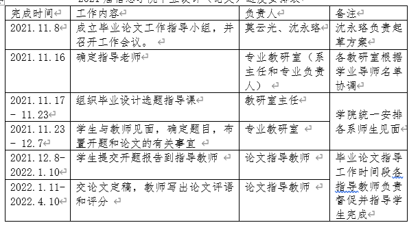
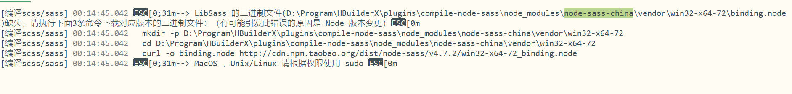

# 预约挂号诊疗系统



## 参考

> ```js
> 聊天系统
> https://juejin.cn/post/6844904109795983374?share_token=8e70cd10-6260-4735-9007-7969507a5c3f
> 基于vue，node的聊天系统
> https://juejin.cn/entry/6844903479094280200?share_token=e073135c-4ca2-4f50-b5d5-aa46a2a9916d
> 仿微信客户端聊天
> https://juejin.cn/post/6844904042221535240?share_token=a900d303-15e1-4a80-bdf0-6f1720f4f199
> 
> 病历系统
> https://juejin.cn/post/6951282178751725599?share_token=0340e85e-e4d0-4457-9834-e0cc92591a54
> 
> 在线医疗的发展与优势
> https://juejin.cn/post/6906673133371588616?share_token=cd955063-c7f6-4cdc-8a4e-1b5bc17943f4
> 
> 论文大纲与数据库，流程图
> https://juejin.cn/post/6844904198392250376?share_token=944824b0-7f33-4c07-be92-3c0b2eb5ffc5
> 
> 
> node+vue+MySQL搭建项目
> https://juejin.cn/post/6914891222884564999?share_token=b12f678d-cf04-434c-a427-f13682502e8f
> 
> 医疗信息化报告
> https://baijiahao.baidu.com/s?id=1664566707092139483&wfr=spider&for=pc&searchword=%E5%8C%BB%E7%96%97%E4%BF%A1%E6%81%AF%E5%8C%96
> 
> 医疗未来走向
> https://www.zhihu.com/question/321798753
> 
> 
> https://github.com/gjy0712/hospital-system
> https://github.com/Rain-Ricky/cloud
> 项目名称：云医疗管理系统，IDEA+MySQL8.0+SpringBoot+Generator逆向工程+前后端分离；本系统是一个面向大众用户和医护工作者的健康诊疗平台，为患者提供网上挂号、在线问诊、诊断报告查询、线上复诊,网络预约手术、住院出院手续办理、费用缴纳、查看健康资讯等全方位服务，同时也为医护工作人员提供了在线咨询解答、健康档案管理、在线开具电子处方、电子病历管理、病人的住院、出院流程的办理以及药品的管理和采购等功能。
> 
> https://github.com/JavaGithubMoney/hospital
> 
> 
> 在线聊天窗口：患者需要什么问题，打开聊天窗口，问医生就可以了。例如下面，患者打开窗口咨询，然后医生，收到患者的留言通知，用APP回复给患者。
> 
> 论坛交流咨询：论坛这一种形式比起单纯的聊天更有效，因为论坛可以沉淀优质问答，可以聚合人气，就算是没有医生的主动回复，患者也能通过论坛积累的帖子，通过搜索等形式找到答案。论坛可以拉近和患者的距离，增加一种信任感和性，通过论坛形式，把业务建立起来的，一个是魅族一个是小米，这两个公司的创始人，这两个的论坛动作就很很活跃。下面是微观商城的论坛的解决方案，可以看到论坛可以很好的聚合人气。微观商城的论坛功能齐全，颜值高，常用的发帖、回帖、论坛版块功能都有的。
> 
> 
> 参考文献记录
> [1] 程东萍. 医院网上预约挂号系统[J]. 医学信息 (西安上半月), 2007, 20(11): 1930-1931.
> https://mp.weixin.qq.com/s/8hJbl5N_G2EszRqxohbdfg
> https://zhuanlan.zhihu.com/p/381190215
> https://zhuanlan.zhihu.com/p/359007870
> https://zhuanlan.zhihu.com/p/385664738
> https://zhuanlan.zhihu.com/p/450784617
> http://baogao.chinabaogao.com/yiliaoqixie/546853546853.html
> https://zhuanlan.zhihu.com/p/385662785
> https://www.vzkoo.com/document/086d63b07a530b5885a83d9880203248.html?keyword=%E5%8C%BB%E7%96%97%E4%BF%A1%E6%81%AF%E5%8C%96%E4%BA%A7%E4%B8%9A%E4%B8%93%E9%A2%98%E6%8A%A5%E5%91%8A
> https://baijiahao.baidu.com/s?id=1664566707092139483&wfr=spider&for=pc&searchword=%E5%8C%BB%E7%96%97%E4%BF%A1%E6%81%AF%E5%8C%96
> https://kns.cnki.net/kcms/detail/detail.aspx?dbcode=CMFD&dbname=CMFDTEMP&filename=1021744481.nh&uniplatform=NZKPT&v=oVYmOFjjW05witnaKwORGCfAQeD0crsv-U37kLNp70yLQMyzBl1JlhBVb1-9KZPX
> 
> 
> 待添加的数据表
> 病房表：病房编号、床位数、科室名、病人编号、病人姓名、病人性别、病人入住时间、病人离院时间、病房楼层、住院费用、剩余床位数
> 药品库存表：药品编号、存储编号、药品数量、存储位置、存储时间、取药实际、取药数量
> 护士表：护士编号、姓名、性别、出生日期、所属科室编号、职称（实习护士、护士、护士长）、入职(注册)时间、登录账号、登录密码
> ```
>


## 所遇问题


> ### 问题1：uni-app运行时报错：cd E:\HBuilderX\plugins\compile-node-sass\node_modules\node-sass-china\vendo
>
> **2022年1月6日00:43:13**
>
> ```js
> 1. 在 HBuilderX 安装目录下，进入\plugins\compile-node-sass\node_modules\node-sass-china\vendor 目录
> 2. 手动创建 win32-x64-64 目录
> 3. 然后到 github node-sass https://github.com/sass/node-sass/releases 手动下载 win32-x64-64_binding.node
> 4. 把下载的文件放到 win32-x64-64 目录，然后重命名为：binding.node
> 5. 重启 hx
> ```
>

> ### 问题2：node服务端的get与post获取到携带参数的区别
>
> **2022年1月25日22:15:17**
>
> - get请求是在res.query中获取所有的请求参数
> - post请求时再res.body中获取所有的请求参数

> ### 问题3：uni-app切换到tabBar页面不刷新
>
> **2022年1月27日22:43:06**
>
> - 问题原因：因为在退出登录后清除用户本地缓存信息和把用户的登录状态记录为否，然后再点击头部的登录进入登录页面进行登录后，通过`uni.switchTab()`进行跳转到登录页，发现登录页仍然为退出登录的状态（即不显示用户的信息及改变页面的效果）
> - 解决方法：通过替换方法：`uni.reLaunch()`进行页面的跳转，因为这个方法会先关闭销毁所有页面，然后再进行打开所设定的页面。

> ### 问题4：CSS文字内容两端对齐
>
> **2022年1月28日09:49:04**
>
> - 问题需求：在修改uniapp的个人信息时，每个字段头因为文字长度存在差异，所以使得两端对齐比较美观
> - 需求解决：给文字主体盒子设定高度和文字高度后，除了要在块级元素加text-align:justify样式外，还需要在里面加一个空的span元素，并应用样式。另外，对于中文还必须用空格隔开汉字，否则也没有两端对齐的效果。英文每个单词都有空格隔开，所以没问题。
>
> ```css
> <div class="justify">hello, text justify.</div><br/>
> <div class="justify"> hello, text justify.<span></span></div><br/>
> <div class="justify">中 文 两 端 对 齐</div><br/>
> <div class="justify">中 文 两 端 对 齐<span></span></div>
> 
> div.justify { 
>   text-align: justify; 
>   width:200px; 
>   font-size:15px; 
>   color:red; 
>   border:1px solid blue; 
>   height:18px;
> }
> div.justify > span { 
>   display: inline-block /* Opera */; 
>   padding-left: 100%; 
> }
> ```
>
> ```js
> upi-app个人信息的修改
> 因为要设置保存和编辑按钮，以及要设置个人信息，但是uni-app不支持在页面导航栏修改内容，所以我们要自定义导航栏。
> 需要先取消uniapp默认的导航栏样式，在pages.json中该页面的样式中设置如下
> {
>   "path": "pages/mine/userInformation",
>   "style": {
>     "navigationStyle": "custom",
>     "app-plus": { "titleNView": false  }
>   }
> }
> 
> 然后再在页面中自定义样式
> ```
>
> 


## 自述

```js
在通过判定一个条件来处理事件的时候，但是那个条件具有很多个状态（7、8个左右），我就比较喜欢用switch语句来做处理，
因为if的话，可能就会比较消耗循环判定，
而查找表的话，可能会让后期的维护比较麻烦。因为他所有的值都需要在预定好的，就可能会存在不在预定之中的条件，如果后期维护突然加多几个条件，而我那时候突然忘了那里没有修改，我就可能需要花一些时间来查找在哪里出问题，
所有通过switch语句的话，先预定一个default输出问题，就会让我更快速的进行处理


```


## 收集的资料

> ```js
> 链接：https://juejin.cn/post/6906673133371588616
> 在线医疗的发展和优势
> 在线预约挂号为医院医院减负分流，优化了医疗资源配置，完善病人分级，提高诊疗针对性。
> 
> 在线医疗的现状
> 疫情爆发使得广大群众认识并使用在线医疗平台，在线医疗普及度与大众认知大幅提升，推动行业在用户中逐步渗透。当下正处在线医疗行业快速增长阶段，此时在线医疗产品的占据用户时长会 得到较大提升，群众对各种在线医疗产品的关注度和使用频率预期会创下纪录，有利于行业龙头的多个营运数据的向好，从而有助提升在线医疗公司的估值水平，为行业整体迎来跳跃式增长奠定底层基础。
> 
> 在线医疗的优势
> 1. 远程诊疗，随时随地咨询医生
> 很多时候人们生病无法对自身判断的时候，则需要专业的医生帮助，线上问诊可以通过图片，语音，电话等方式咨询医生，节省了大量盲目去医院的时间。患者与医生远程视频连线，可视频共享病例，医学影像，大大降低看病成本，提高看病效率，提升医生出诊率。医生根据病人的病症描述给予科学的建议，或进一步去医院检查治疗，或根据医生意见在家服药自治。叮当国医上病人与医生直接沟通，既让消费者充分了解自己的病症，同时节省了大量盲目去医院的时间，也许未来视频诊疗会让治疗更简捷。
> 2. 提高医疗效率，减少等待时间
> 互联网医疗改变了就医方式，让医生能利用工作、生活中的碎片时间，为患者答疑解惑；同时避免了患者等候看病时间长、问诊咨询时间短的困扰。人们需要去医院就诊时，各项目的排队等待时间成了病人最头痛的问题，这时可以使用导诊类应用，通过手机在线选择医院预约合适的专家，让病人能够快速找到对症的专家医生，在候诊期间还会有排队人数提醒和诊区位置提示，极大的节省了挂号排队和候诊等待的时间，一切都让人们在更轻松的环境里获得医疗服务。
> 4. 医学教学，随时学习新知识
> 	医学教学通过多人视频会议，大频道直播，跨频道直播实现名医授课，医学教授讲学，护士培训，大查房等多种场景的直播。学员在时间上更加灵活，地点不固定，随时可以学习。在线学习可以通过网络和老师进行互动与交流，可以将自己所学的知识更多，自由的选择自己想学的课程，学习中简单重复操作各种内容，都可以让自己的技能得到提升。
> ```
> 

## 论文

> ```js
> 绪论
> 随着我国的信息化快速发展，人口的日益增长，基于医院现场及电话预约模式已经无法满足用户追求快速、便捷的需求，而医院的线上小程序预约挂号功能则优化了用户这方面的功能，使得用户不用四处奔波，也不用打电话预约挂号和取消预约，节约了用户的时间成本和医院的管理成本，随时随地轻松挂号，不用排长队。相对于传统的纯线下预约及电话预约方式，一站式预约诊疗系统更显著的提高了医生处理门诊病嘱和书写电子病历的速度、缩短了病人预约及就诊的时间，提高了医院的工作效率，简化了管理员的管理效率，因而具有较高的实用性和创新性。且在2019年新冠疫情的爆发使得广大群众认识并使用在线预约就诊的医疗平台，在线医疗普及与大众的认知大幅度提升，推动了医疗行业在用户中逐步渗透，加快了医疗信息化的步伐。当下正在处于疫情防范意识不断升高的期间，在线预约挂号可以降低患者在医院中人流，提高了医疗安全。
> 
> 1 引言
> 1.1 选题背景
> 随着计算机的普遍化与信息技术的不断快速发展，人们的生活也发生了日新月异的变化，各类计算机软件逐渐渗透到了社会的每个角落，大大地改善了人们的生活质量，提高了人们的工作效率。而当前国外的一些发达国家，在医疗信息化这已经有了标准的制度和规范，医疗信息的开发技术也相对比较成熟，而我国医疗信息化建设从90年代开始起步，经过20多年的发展，各级医院在基础的信息化应用，如挂号、收费、检查、药房管理等领域都实现了较高的普及率，但是医疗信息化在普及度与应用深度方面相对于国外的一些发达国家还有很大的提升空间[1]。
> 国内医疗信息化行业经历了3个发展阶段[2]：
> 1）HIS阶段：目标是提升医院管理效率，以HIS建设为主。HIS系统以经济核算为主轴，主要是实现对医院人流、物流、财流的综合管理。主要模块包括门诊挂号系统、门诊收费系统、出入院管理系统、药房管理系统等。
> 2）CIS阶段：主要内容是各类临床应用，是以病人为核心、对诊疗流程进行管理的系统，主要模块包括：电子病历系统（EMR）、医疗影像系统（PACS）、化验系统（LIS），手术麻醉系统等。
> 3）数据整合阶段：随着医院各个科室的信息化建设成熟，一方面将医院内部的数据互联互通，通过共享与数据价值挖掘进一步提升医院管理和临床决策水平；不同医疗机构的数据互通将有助于分工协作，提升整体效率。
> 未来医疗IT还将进入智能化阶段，从信息化到智能化，通过大数据、人工智能等技术，实现辅助诊断、健康管理等，进一步解决医疗资源供给短缺的核心问题。根据IDC预测，我国医疗信息化市场规模稳步增长，订单加速转化，医疗信息化板块营收保持稳定增长，医疗信息化行业持续高景气[3]。
> 2020年上半年，世界面临多种挑战。经济和社会活动受限堪称其中最为艰巨的一项。但在2020年下半年，中国成功从疫情冲击中恢复，成为全球唯一实现经济正增长的主要经济体，增长率达到2.3%[4]。在国内结构性改革的持续推进下，受此次疫情影响，中国医疗卫生行业在2020年加速发展。人们开始更加关注传染病早期防控，大力开展疫苗研发。医疗设备需求和线上医疗应用案例增加，2020年上半年新增互联网医院中“医院+互联网”模式占比更高达77.2%[5]。同时，由于海内外对医疗及防疫产品的需求激增，且国内经济恢复迅速，中国在这样的大背景下成为全球领先的医疗及防疫产品供应商和制造基地。2021年，中国步入“十四五”（2021-2025）开局之年。“十四五”规划将确保人民健康作为国家首要任务[6]。由于目前医疗卫生行业监管环境利好、行业结构不断升级、技术日益创新，加之中国在全球医疗供应链中逐渐承担更为重要的作用，线上医疗行业有望展现良好业绩，带来更多商业机会。
> 受新冠疫情等因素影响，中国的医疗服务从传统形态转变为依托先进技术的全面数字化模式的进程不断加速。经社会与公共力量双向快跑，随着政策鼓励实体简历互联网医院，为实现现有医疗服务的线上延伸，形成大量的“医院+互联网”模式医院，线上预约挂号医疗已大势所趋。
> 
> 1.2 系统开发意义
> 本预约挂号诊疗系统期望通过以患者预约挂号、医护人员便于就诊管理为核心开发，通过为服务患者线上预约诊疗为基础不断的扩散业务，完成患者从预约到就诊完成都为统一系统管理的一站式，从而达到降低患者预约及就诊时间，提高医护人员工作效率的目的。
> 在患者需要就诊时，可以先通过小程序搜索查看医院的科室信息，选择相应科室查看医生，根据该医生的排版信息进行预约挂号。医护人员也可以通过给患者发送一些注意事项来让用户达到解决患者的就医疑惑。用户可以通过小程序简单的操作即可进行线上预约挂号，不用下载多余的APP或网站，不占用手机过多的内存，而且相对节约电话预约及时间成本。而且微信的用户群体基数庞大，增大患者使用该小程序的人群基数及使用概率。
> 因为在诊间的医患沟通时间是非常短暂的，本系统可让医生通过查看患者的历史病例和诊断结果等提前发现患者的身体的其他状况，预防患者自述问题不足。医生在给患者看病时可以录入看病结果、给患者编写电子病历、下达医嘱给患者提供反馈，让患者在诊后可以在系统中得到良好的沟通反馈，还可以给所预约的医生进行评价与接收到医生发送的注意事项，从而提高沟通率，也提高患者的满意率。
> 1.可让患者更方便获得该医院所需要的信息，找到可以直接求助的专科医生或全科医生，知道疾病后，能够进行预约挂号，并且可在诊后可获得医生的反馈意见与对治疗过程进行评价反馈，全过程的辅助。
> 2.可让医生可以便于对挂号的患者进行诊断管理、反馈以及编写患者病历，让患者可以和每一位患者及时的交接，管理医患事务。
> 3.可让医院管理员对掌握患者与医生间诊疗的每个流程，提高管理医院事务的效率。
> 
> 
> 2 开发工具和环境介绍
> 2.1 系统概述
> 该系统是基于模拟用户到医院预约挂号及办理挂号的医院人员的一系列全套流程作为研究对象，然后再根据参考其他医院的预约挂号方式与现状进行分析探索，再进行基于Vue+小程序架构的软件系统开发，实现快速便捷、高效率、组件化开发的医院预约挂号诊疗系统，以使得降低用户对挂号预约诊疗服务的长时间操作等问题而抱怨概率。
> 
> 2.2 系统运行环境
> 开发平台：windows10
> 开发工具：VSCode、HBuilder X、微信开发者工具
> 数据库：MySQL5.6或以上
> 运行环境：node 12.1.0
> 
> 2.3 开发语言
> 2.3.1 JavaScript语言
> 2.3.2 Vue语言
> 2.3.3 Node语言
> 2.3.4 MySQL语言
> 
> 
> 3 需求分析
> 3.1 系统可行性分析
> （1）人性化: 系统的建设应本着以人为本，以病人为中心的原则，在系统的每个细节都应该体现人文关怀主义，考虑到了如何更加地方便患者，方便医护人员，方便经营管理者，更加地人性化。
> （2）智能化:整个系统的建设突出了智能化的特点，尽量减少避免了不必要的人工环节，增强自动化合智能化的程度，增加辅助决策支持的功能。
> （3）无纸化:系统具有电子处方、电子病历、电子报告等模块，逐步走向医疗服务过程，使得医院的管理过程具备无纸化特点
> （4）系统建设原则是：整体规划、分布实施；信息规范、特色；先进可靠、经济实用；资源共享、开放互联
> 
> 3.1.1 系统可行性
> (1)易用性：该系统根据了现实的实用性与先进性相互结合，体现出了易于理解掌握、操作简单、提示清晰、逻辑性强，直观简洁、帮助信息丰富，而且针对医院输出输入项目的特点对输入顺序专门定制，保证了医护操作人员可以用最快的速度和最少的点击次数来完成工作。
> （2）安全性：
> 		操作员的权限验证：系统拥有能根据员工的职务和所承担的工作进行角色划分，通过角色划分进行权限分配显示不同的系统页面，当操作人员超越权限进行登录时，系统可以拒绝登录并提示相应的错误。
> 		数据加密:除了以上所属的登录/使用验证以外，系统还能采取了对某些关键数据（如用户代码和密码）进行加密的方法，来提高安全性。
> （3）数据完整性：医院数据库是以病人医疗数据为主，并包括相关的各种经济数据以及各类行政管理等数据的完整集合。数据库应包含医院全部资源的信息，便于快速查询，数据共享。
> （4）稳定性：系统能保证不因操作人员的误操作导致系统的崩溃。
> （5）灵活性、易维护性：为适应将来的发展，系统使用基于vue框架进行开发，具备前后端分离、组件化开发、渐进式开发的特点，使得系统模块具有良好的可裁减性、可扩充性和可移植性；且系统的操作使用简单方便，可管理性、可维护性强。
> （6）扩展性：系统采用模块化架构开发，确保了系统可灵活地扩充其他业务功能，并可与其他业务系统进行无缝互连，还可快速移植到其他系统。
> （7）先进性：系统采用IT界近年来热门、先进、成熟的软件开发技术和系统结构。
> （8）一体化：系统保证了数据由采集、存储、整理、分析到提取、应用的一体化，实现数据发生地一次性录入，然后被所有对该数据有需求的单位多次重复，不同层次使用，各模块之间要实现数据共享，互联互通，清晰体现内在逻辑联系，并且数据之间必须相互关联，相互制约。
> （9）数据准确性：系统是为采集、加工、存储、检索、传递病人医疗信息及相关的管理信息而建立的，数据的管理是医院信息系统成功的关键，所以数据准确、可信、可用、完整、规范及安全可靠，数据之间无歧义
> 
> 3.1.2 经济可行性
> 因为系统是基于vue+uni-app的模块组件化开发的，具备高效、便于管理以及移植模块，且该框架现在在IT界中处于热门状态，所以可让系统后期的维护相对简便，可以减少维护系统的时间成本、维护人员的开发成本。而且uni-app具有可以生成小程序、app及网页的特色，一套代码可以对多端兼容，可以减少对多端系统的开发成本。
> 
> 3.1.3 操作可行性
> 相对于传统的线下和电话预约挂号，该系统优化许多繁杂的操作，如下：
> （1）让患者不需要在医院中排长队、四处奔跑，一键操作即可完成预约挂号。且在预约挂号后去医院就诊后可以在系统中查看到医生对患者的反馈信息。
> （2）让医生不需要填写纸质版的病历，在系统中直接填写即可，便于病历的保存和查看；还可以让医生中给患者回馈诊疗信息，便于医生与患者间的信息沟通。
> （3）可让管理者对医院的预约挂号诊疗业务管理有序，更方便的维护医生跟患者的数据信息。
> 
> 3.2 系统模块分析
> 该系统分为两个客户端：C端供管理员和医生使用，小程序端供患者使用。
> 该系统具有三个角色：患者、医生及管理员角色。
> 管理员角色所拥有的模块：科室信息管理、排版信息管理、留言信息管理、医生信息管理、患者信息管理、预约信息管理、电子病历管理
> 患者角色所拥有的模块：
> 医生角色所拥有的模块：患者队列模块、个人信息管理、报告查询模块、患者病历增加、患者病情解答、患者模块
> 患者角色所拥有的模块：个人信息管理、预约挂号模块、就诊记录管理、查看医生模块、预约订单评价、个人电子病历。（医生信息查询、查看挂号记录、挂号留言、病人对医生和医院评价、复诊、个人病历信息）
> 
> 3.3 数据流分析
> 
> 
> 4 系统功能需求分析
> 4.1 开发与设计总体思想
> 系统用户按权限分为三种，即管理员，医生，患者。不同的用户拥有不同的权限，各自完成各自的功能，不同的用户看到不同的系统功能。
> PC端（管理员和医生使用）和小程序端（患者使用）
> 权限控制是通过控制登录时所选的角色类型设置一个本地存储信息，然后通过路由导航守卫来判断是否存在，否则跳转到403页面
> 
> 4.2 系统模块结构
> 4.2.1 系统角色功能图
> 
> 4.2.2 登录流程图
> 4.2.3 注册流程图
> 4.2.4 预约挂号流程图
> 4.2.5 电子病历流程图
> 4.2.6 就诊流程图
> 
> 4.3 登录模块
> 前端取用户的账号、密码与后端判断，需要根据用户类别来更改查询用户密码语句；后端返回的是该用户的所有信息（该用户所在数据库字段）：result字段里面包含该用户信息（用户类型、用户名）
> 登录前前密码判定：
> 1) 密码必须满足字母、数字、特殊字符中的两个条件。
> 2) 长度必须为8-16个字符。
> 3) 特殊字符仅包括 '!@#$%^&*'
> 
> 4.3.1 患者登录
> 用户在我的页面中点击登录，就可进去登录页面，然后输入账号密码即可进行登录。当输入的账号密码不符合要求时，会弹出相应的提示，以此引导用户进行正确的登录。当用户登录后，登录与注册按钮会替换为自己的姓名，达到提示用户已经登录的目的。
> 事务处理：获取用户输入的账号与密码信息，然后将用户的账号密码与数据库的患者信息表进行校检，如果与表中数据存在一致则显示跳转成功，否则提示用户输入的账号或密码错误。
> 
> 4.3.2 医患人员登录
> 用户只有通过输入正确的账号、密码进行登录才可进入系统的操作界面，否则无论在网址中改变网址地址都无法跳转，一直停留在登录页面。
> 用户进入系统登录页面，首先需要在页面的最下方选择自己的身份，切换不同的身份时进入的系统页也会随之改变。选择好用户身份后依次输入登录的账号密码。登录还会存在校检功能，当输入的信息不符合要求时，系统会进行登录校检然后显示相应的提示，引导用户正确登录。
> 事务处理：获取用户输入的账号和密码信息，然后系统根据用户所选择的用户身份，将用户的账号、密码以及该用户的工作状态与数据库表中的医生信息表/管理员信息表进行校检，如果账号或密码与表中数据不一致，则返回账号或密码错误信息；如果与表中数据一致，则根据此数据行中的用户权限来跳转相应的页面，并把后端返回的用户信息存储到本地缓存和挂载到全局变量vuex中，以供其他页面提取用户信息及记录用户已登录。
> 当医患人员的工作状态为离职时，则提示该用户不存在，需要联系管理员进行改变工作状态才能进行登录。
> 
> 4.3.3 医患人员的密码修改
> 用以提供用户修改原密码。
> 事务处理：获取用户输入的原密码、新密码及用户账号与数据库的用户表的用户账号相匹配数据行进行修改密码字段，然后给前端返回修改成功的信息。
> 1) 修改密码需要输出正确的原始密码
> 2) 新密码必须满足字母、数字、特殊字符中的两个条件。
> 3) 新密码长度必须为8-16个字符。
> 4) 新密码可使用的特殊字符仅包括 '!@#$%^&*'
> 5) 新密码与再次确认新密码必须一致
> 
> 4.4 注册模块
> 用户公共的校检判定及提示如下：
> 1) 如果电话号码已经存在，则显示该用户已经注册。
> 2) 用户名为手机号码，手机号码长度限制为11位且必须满足手机号的格式，不符合会弹出提示。
> 3) 密码长度必须满足字母、数字、特殊字符中的两个条件及长度需在8-16个字符。
> 4) 姓名长度必须为2-15个字符，可以是中文和英文，允许输入点号和空格，中英文不能同时出现
> 5) 身份证号码长度可为15位或者18位字符，15位时必须全都为数字，18位时前17位只能为数字，最后一位是校验位，可以为数字或大写字母X，否则会提示所填写的身份证号格式错误。
> 6) 邮箱的格式必须为“名称@域名的格式”，即必须包含一个且只有一个“@”符号，第一个字符不得是“@”或者“.”，不允许出现“@.”或者“.@”，结尾不得是字符“@”或者“.”，允许“@”前的字符中出现“＋”，不允许“＋”在最前面，或者“＋@”，否则会提示邮箱格式错误。
> 7) 所有的注册信息都不能为空，有空白时提交会提示输入信息告诉用户存在信息尚未填写。
> 姓名正则：/^([\\u4e00-\\u9fa5]{1,20}|[a-zA-Z\\.\\s]{2,15})$/
> 密码正则：/^(?![a-zA-z]+$)(?!\d+$)(?![!@#$%^&*]+$)[a-zA-Z\d!@#$%^&*]{8,16}$/
> 电话正则：/^1[3|5|7|8]\d{9}$/
> 邮箱正则：/^[a-zA-Z0-9_-]+@[a-zA-Z0-9_-]+(\.[a-zA-Z0-9_-]+)+$/
> 身份证号正则：/(^\d{15}$)|(^\d{18}$)|(^\d{17}(\d|X|x)$)/
> 
> 待用到：
> 密码强度正则（最少6位，包括至少1个大写字母，1个小写字母，1个数字，1个特殊字符）：/^.*(?=.{6,})(?=.*\d)(?=.*[A-Z])(?=.*[a-z])(?=.*[!@#$%^&*? ]).*$/
> 正数正则：/^\d*\.?\d+$/
> 负数正则：/^-\d*\.?\d+$/
> 数字正则：/^-?\d*\.?\d+$/
> 邮箱正则：/^([A-Za-z0-9_\-\.])+\@([A-Za-z0-9_\-\.])+\.([A-Za-z]{2,4})$/
> 手机正则：/^((13[0-9])|(14[5|7])|(15([0-3]|[5-9]))|(18[0,5-9]))\d{8}$/
> 身份证正则（18位）：/^[1-9]\d{5}(18|19|([23]\d))\d{2}((0[1-9])|(10|11|12))(([0-2][1-9])|10|20|30|31)\d{3}[0-9Xx]$/
> URL正则：((http|ftp|https)://)(([a-zA-Z0-9\._-]+\.[a-zA-Z]{2,6})|([0-9]{1,3}\.[0-9]{1,3}\.[0-9]{1,3}\.[0-9]{1,3}))(:[0-9]{1,4})*(/[a-zA-Z0-9\&%_\./-~-]*)?
> 
> 
> 4.4.1 患者注册
> 患者需要自己去注册账号密码，然后才能有权限进行登录该小程序进行医疗预约挂号。
> 事务处理：游客通过个人中心页面上方的注册按钮进入注册页面，游客通过输入自己个人信息，然后系统通过判断用户是否存在，来进行给用户注册登录。
> 
> 4.4.2 医患人员注册
> 医护人员第一次使用该系统，需要通过管理员去注册才能成为该系统的用户，才有权限去登录进去该系统。
> 事务处理：管理员在用户管理的医生列表中添加填写该医生的信息，如果在填写信息时与校检内容不符合则会跳出提示以来规范用户的操作。且基于为了保护医生的人身安全及预防无理取闹患者的骚扰，所以医生无需填写个人住址。
> 
> 
> 4.5 管理系统的公共模块
> 4.5.1 分页功能
> 可以通过切换页面表格下方的每页数据量及切换分页来变换当前页面的数据
> 分页功能的处理逻辑是：
> 1) 如果“每页所能容纳数据量*当前页”大于等于“所有数据总量”，则“当前页面的数据”为“在截取所有数据量中”，从 “每页所能容纳数据量*(当前所在页-1)” 到 “每页所能容纳数据量*当前所在页 - 1”，否则截取到“所有数据总量”即可。
> 2) 每次切换每页所能容纳数据量的大小，会重新定位到获取第一页的数据，此为预防所在页的数据不够显示出错或存在没有数据渲染到页面的情况。
> 3) 当搜索框的内容为空时，默认为搜索所有数据信息；在每次搜索时都需要重置到第一页，然后再显示相应的数据。
> 4.5.2 编辑功能
> 通过传递表中的主键字段到服务器中，然后根据主键字段搜索到相应的数据条，然后再修改相应的字段
> 4.5.3 添加功能
> 通过直接添加到所设定的数据库表中，然后自定义默认字段和自增id以来记录编号
> 
> 
> 4.5 管理员模块
> 4.5.1 科室信息管理
> 可以对医院的科室进行维护管理，可以增加科室信息、修改科室信息以及修改科室的状态
> 添加科室
> 需要填写科室名、科室电话、科长编号、科长姓名、科室地址及科室简介
> 科室名：2-15个字符
> 姓名：2-15个字符
> 科室地址：小于150个字符
> 科室简介：小于150个字符
> 注意：添加科室时，需要先判定科室名是否存在，然后再判断科长编号是否存在，最后基于科室名不存在于科长编号存在的情况下方可添加科室成功
> 
> 
> 4.5.2 排版信息管理
> 对医生的排班状况进行维护管理，可进行添加、修改、删除、查看医生的排班状况。
> 
> 4.5.3 留言信息管理
> 对患者预约挂号诊疗后的留言评价进行维护管理。
> 
> 4.5.4 医生信息管理
> 对医生的个人信息进行维护管理，可以添加新医生的信息以及编辑原有医生的信息及状态
> 添加医生信息注意：需要先判定医生的账号是否存在，只有基于医生账号不存在方可进行患者注册
> 
> 4.5.5 患者信息管理
> 对患者的个人信息进行维护管理，可进行患者的信息查询、修改
> 添加患者注意：需要先判定该患者的账号是否存在，只有患者账号没注册的情况下方可进行添加患者
> 
> 4.5.6 预约信息管理
> 可以查看所有病人预约所有医生的信息。
> 
> 4.5.7 电子病历管理
> 添加的病历信息只能是给用户添加病历到待缴预约费和待诊断阶段，因为可能存在用户不会操作使用该套系统（所以可以管理员来代理操作，即可付费给管理员，然后管理员添加信息进行预约等），但是不能跳过诊断阶段，因为需要医生诊断才可进行下一步的操作。
> 编辑可以修改用户信息、改换科室、改换医生、改换预约时间，还可修改用户的两个状态（从预约待缴费到待诊断，及从诊疗待缴费到待评价）两个阶段的改变。
> 
> 
> 4.5.8 医院公告管理
> 发布公告：新增一条公告表的数据，包含公告内容、公告编号、发布人员编号、发布人员的姓名、发布时间
> 修改公告：根据该公告的编号来修改该条公告，修改字段为：公告编号、公告内容、修改时间、修改的发布人员姓名和编号
> 删除公告：根据该公告的编号来删除该条公告
> 查看公告：列表显示公告信息
> 
> 
> 4.6 医生模块
> 4.6.1 患者队列模块
> 可以对患者队列进行管理，可以查看所预约该医生的患者队列，支持病人基本信息的更正，记录病人生理状态，记录病人过敏史
> 	点击查看患者病历信息
> 处理病人挂号信息
> 医嘱留言医生发表记录药方给病人看（记录到当次病情中）
> 医生跟踪患者病情（复诊推荐、需要跟医生交互）
> 提醒病人医院复诊（再次记录）
> 医嘱留言
> 关闭预约（可能会存在患者不来，就需要点击患者不在，下一位）
> 就诊咨询
> 电子病历
> 报告查询
> 患者病例管理：可以对患者病例进行管理
> 
> 4.6.2 个人信息管理
> 可以对自己的个人信息进行修改
> 
> 4.6.3 报告查询模块
> 4.6.4 患者病历增加
> 4.6.5 患者病情解答
> 
> 
> 4.7 患者模块
> 4.7.1 个人信息管理
> 可以查看个人的信息，然后还可以修改个人信息
> 点击编辑时，会弹出取消按钮和保存按钮，以及个人的信息可以编辑。
> 点击取消按钮，该次修改的数据不做保存
> 点击编辑按钮，该次修改的数据会保存到数据库中，然后再次调用数据库中修改的数据，最后刷新页面数据
> 注意：点击编辑时，除了地址，其他内容都不可为空
> 账号不可修改
> 密码：8-16位且满足字母、数字、特殊字符中的两个条件
> 身份证号为18位，且满足身份证号的格式
> 姓名2-15位
> 性别可选男、女
> 出生日期格式为yyyy-MM-dd
> 邮箱需要满足邮箱格式要求
> 手机号码为11位长度，需满足手机号码格式
> 联系地址小于150个长度字符限制
> 预约记录不可修改
> 
> 
> 4.7.2 挂号预约模块
> 可以按照科室，诊室，医生进行挂号预约，可以查看我的个人预约
> 点击预约按钮进入预约界面，选择挂号类型（住院、看病、体检），然后会跳出相应的信息行列，然后点中选中行的预约按钮就可以进行预约
> 	
> 
> 4.7.3 就诊记录管理
> 显示就诊、预约记录。
> 诊疗状态不可逆，存在的诊疗状态有：预约待缴费、取消预约、完成预约、诊疗爽约、诊疗待缴费、诊疗完成
> 诊疗状态流程：点击预约-》预约待缴费（可取消预约）-》完成预约=待诊断 -》诊断中（患者没来，医生可以进行修改为爽约）-》诊疗待缴费（医生诊疗完成，但是患者没付钱）-》诊疗完成（诊疗完成的标志是用户已付费）
> 最终时间:每次时间发生改变，都会同时改变最终时间，一般会永久性停在取消预约、诊疗爽约、诊疗完成
> 4.7.3.1 查看显示预约挂号就诊记录
> 在页面中呈现出一些关键的字段，如预约类型、诊疗状态、病历编号、预约用户、医生姓名及科室类别等，当点击所选择的卡片时，会跳转到该卡片的记录详情
> 
> 4.7.3.2 预约挂号就诊记录详情
> 根据就诊记录列表中点击卡片触发跳转到该详情页面，在点击卡片时会携带参数内容到该页面中，所以该页面需要做的是接收传递到该页面的参数，然后渲染到页面上去。
> 而在该页面特别需要做特定处理的是对预约就诊的状态进行信息筛选显示
> （1）如果用户仅仅是点击了预约，但没有缴纳预约费，则只显示预约的时间信息及医生及科室信息等
> （2）若用户缴纳了预约挂号费用，但是还没去就诊，显示（1）中的内容及缴纳预约挂号费用的信息
> （3）编写药方的内容及医生医嘱的内容需要先缴纳了诊疗费用及医生编写后才能显示，若用户去就诊但没有缴纳诊疗费用，则显示（2）中的内容及缴纳诊疗费用的信息
> （4）若用户取消预约，则只显示（1）中的内容
> （5）若用户预约挂号的当天没去就诊，则只显示（2）中的内容
> （6）若用户诊疗完成后并对医生进行评价，则显示所有的内容
> 
> 
> 4.7.4 查看医生模块
> 
> 
> 4.7.5 预约订单评价
> 可以对所预约挂号就诊的医生进行留言评价以及打评分
> 
> 4.7.6 个人电子病历
> 显示自己的个人以前所预约、挂号、就诊的记录，里面记录了自己对医生的评价以及医生对自己的反馈建议等
> 
> 
> 4.8 数据库设计
> 4.8.1 数据库E-R图设计
> 患者病历表通过绑定患者编号来确定该条病历属于哪位用户，该患者每创建一条病历，则会给用户信息表的预约挂号诊疗记录字段+1。
> 
> 
> 4.8.2 数据库表结构
> -----------------------------------
> 患者信息表（patient）：
> 患者编号（patient_id）、
> 身份证号（id_card）、
> 姓名（name）、
> 性别（sex）、
> 出生日期（birth）、
> 邮箱（email）、
> 联系电话（phone）、
> 住址（address）、
> 注册时间（register_time）、
> 登录账号（account）、
> 登录密码（password）、
> 预约挂号记录（booking_record：默认为0）、
> 病历编号(medical_record_id：如果没有，则创建一个编号)、
> 用户状态（state：停用、启用，默认启用）
> ---------------------------------------------
> 医生信息表（doctor）：
> 医生编号（doctor_id）、
> 医生姓名（name）、
> 该医生所属科室编号（department_id）、
> 所属科室名（department_name）、
> 挂号费用（registration_fee）、
> 医生职称（title：见习医生、医师、副主任、主任、副科长、科长、副院长、院长）、
> 医生个人介绍（personal_introduce）、
> 身份证号(id_card)、
> 出生日期（birth）、
> 性别（sex）、
> 邮箱（email）、
> 联系电话（phone）、
> 工作状态(state：离职、在职、休息、停职)、
> 入职/注册时间（register_time）、
> 登录账号（account）、
> 登录密码（password）、
> 医生被评价的星级（evaluation_level：1~5星）、
> 医生被评价的次数(evaluation_number)、
> 医生被评价总星（evaluation_all_start）、
> 用户状态（state：停用/启用，默认启用）
> -----------------------------------------------
> 管理员信息表（admin）：
> 管理员登录账号（account）、
> 登录密码（password）、
> 管理员姓名（name）
> ----------------------------------------------
> 科室信息表（department）：
> 科室编号（department_id）、
> 科室名（name）、
> 科长编号（section_chief_id）、
> 科长姓名（section_chief）、
> 科室电话（phone）、
> 科室状态（state：停用、启用）、
> 科室简介（profile）、
> 科室创建时间（register_time）、
> 科室地址（address）
> ------------------------------------------
> 医生排班信息表（scheduling）：科室编号（department_id）、科室名（department_name）、所安排医生上班时间/时间段（work_shift）、医生编号（doctor_id）、医生姓名（doctor_name）。注意：这主要通过查询医生表的状态（在职的获取的医生）
> ------------------------------------
> 患者病历表（medical_record）：
> 病历编号（medical_record_id）、
> 患者编号（patient_id）、
> 预约的账号（booking_account）、
> 预约的用户姓名（booking_name）、
> 患者联系电话（booking_phone）、
> 诊断的医生编号（doctor_id）、
> 诊断的医生姓名（doctor_name）、
> 科室编号（department_id）、
> 科室名称（department_name）、
> 
> 创建时间（create_time）、
> 预约挂号时间（booking_time）、
> 预约挂号费用（registration_fee）、
> 预约费缴纳状态（booking_fee_pay_state：待缴费、已缴费）、
> 预约费缴纳时间（booking_fee_pay_time）、
> 诊疗费用（diagnose_fee）、
> 诊疗费缴纳状态（diagnose_fee_pay_state：待缴费、已缴费）、
> 诊疗费缴纳时间（diagnose_fee_pay_time）、
> 
> 病例类别（case：门诊、住院、体检、拍片）、
> 预约挂号诊疗状态（state：待缴预约费、取消预约、待诊疗、诊疗爽约、待缴诊疗费、待评价、已评价）、
> 患者病因（pathogeny）、
> 医嘱（medical_advice）、
> 治疗药方（perscription）、
> 诊疗时间（diagnose_time）、
> 
> 患者评价留言（patient_message）、
> 患者对医生的评价星级（patient_star）、
> 评价留言时间（patient_message_time）、
> 最后更新时间（last_update_medical_time）
> 注意：每次看病记录一次病历，复诊也会创建新的记录，每次医生都可以在他看的患者里面发表医嘱跟药方
> ------------------------------------------
> 公告表（notice）：
> 公告编号（notice_ud）、
> 公告内容（content）、
> 发布公告的管理员编号（admin_id）、
> 发布公告的管理员姓名（admin_name）、
> 发布时间（release_time）
> 
> 
> 5 系统详细设计
> 5.1 注册与登录模块
> 5.1.1 模块描述
> 5.1.2 算法逻辑设计
> 5.2 患者模块
> 5.2.1 模块描述
> 5.2.2 算法逻辑设计
> 5.3 医生模块
> 5.3.1 模块描述
> 5.3.2 算法逻辑设计
> 5.4 管理员模块
> 5.4.1 模块描述
> 5.4.2 算法逻辑设计
> 6 界面设计
> 7 系统测试与应用
> 7.1 系统测试和应用
> 7.2 系统功能测试
> 7.3 系统应用
> 8 总结与展望
> 参考文献
> 致谢
> ```

## 开题报告

> ````js
> 一、意义与目的
> 随着我国的信息化快速发展，人口的日益增长，基于医院现场及电话预约模式已经无法满足用户追求快速、便捷的需求，而医院的线上小程序预约挂号功能则优化了用户这方面的功能，使得用户不用四处奔波，也不用打电话预约挂号和取消预约，节约了用户的时间成本和医院的管理成本，随时随地轻松挂号，不用排长队。相对于传统的纯线下预约及电话预约方式，一站式预约诊疗系统更显著的提高了医生处理门诊病嘱和书写电子病历的速度、缩短了病人预约及就诊的时间，提高了医院的工作效率，简化了管理员的管理效率，因而具有较高的实用性和创新性。且在2019年新冠疫情的爆发使得广大群众认识并使用在线预约就诊的医疗平台，在线医疗普及与大众的认知大幅度提升，推动了医疗行业在用户中逐步渗透，加快了医疗信息化的步伐。当下正在处于疫情防范意识不断升高的期间，在线预约挂号可以降低患者在医院中人流，提高了医疗安全。
> 
> 二、文献综述及研究现状
> 当前国外的一些发达国家，在医疗信息化这已经有了标准的制度和规范，医疗信息的开发技术也相对比较成熟，而我国医疗信息化建设从90年代开始起步，经过20多年的发展，各级医院在基础的信息化应用，如挂号、收费、检查、药房管理等领域都实现了较高的普及率，但是核心临床应用在普及度与应用深度方面相对于国外的一些发达国家还有很大的提升空间。
> 国内医疗信息化行业经历了3个发展阶段：
> 1）HIS阶段：目标是提升医院管理效率，以HIS建设为主。HIS系统以经济核算为主轴，主要是实现对医院人流、物流、财流的综合管理。主要模块包括门诊挂号系统、门诊收费系统、出入院管理系统、药房管理系统等。
> 2）CIS阶段：主要内容是各类临床应用，是以病人为核心、对诊疗流程进行管理的系统，主要模块包括：电子病历系统（EMR）、医疗影像系统（PACS）、化验系统（LIS），手术麻醉系统等。
> 3）数据整合阶段：随着医院各个科室的信息化建设成熟，一方面将医院内部的数据互联互通，通过共享与数据价值挖掘进一步提升医院管理和临床决策水平；不同医疗机构的数据互通将有助于分工协作，提升整体效率。
> 未来医疗IT还将进入智能化阶段，从信息化到智能化，通过大数据、人工智能等技术，实现辅助诊断、健康管理等，进一步解决医疗资源供给短缺的核心问题。根据IDC预测，我国医疗信息化市场规模稳步增长，订单加速转化，医疗信息化板块营收保持稳定增长，医疗信息化行业持续高景气。
> 2020年上半年，世界面临多种挑战。经济和社会活动受限堪称其中最为艰巨的一项。但在2020年下半年，中国成功从疫情冲击中恢复，成为全球唯一实现经济正增长的主要经济体，增长率达到2.3%。在国内结构性改革的持续推进下，受此次疫情影响，中国医疗卫生行业在2020年加速发展。人们开始更加关注传染病早期防控，大力开展疫苗研发。医疗设备需求和线上医疗应用案例增加，2020年上半年新增互联网医院中“医院+互联网”模式占比更高达77.2%。同时，由于海内外对医疗及防疫产品的需求激增，且国内经济恢复迅速，中国在这样的大背景下成为全球领先的医疗及防疫产品供应商和制造基地。2021年，中国步入“十四五”（2021-2025）开局之年。“十四五”规划将确保人民健康作为国家首要任务。由于目前医疗卫生行业监管环境利好、行业结构不断升级、技术日益创新，加之中国在全球医疗供应链中逐渐承担更为重要的作用，线上医疗行业有望展现良好业绩，带来更多商业机会。
> 受新冠疫情等因素影响，中国的医疗服务从传统形态转变为依托先进技术的全面数字化模式的进程不断加速。经社会与公共力量双向快跑，随着政策鼓励实体简历互联网医院，为实现现有医疗服务的线上延伸，形成大量的“医院+互联网”模式医院，线上预约挂号医疗已大势所趋。
> 
> 
> 三、创新思路
> 本预约挂号诊疗系统期望通过以患者预约挂号、医护人员便于就诊管理为核心开发，通过为服务患者线上预约诊疗为基础不断的扩散业务，完成患者从预约到就诊完成都为统一系统管理的一站式，从而达到降低患者预约及就诊时间，提高医护人员工作效率的目的。
> 医护人员可以通过给患者发送一些注意事项来让用户达到解决患者的就医疑惑。患者可以通过小程序来进行线上预约，不用下载多余的APP或网站，不占用手机过多的内存，而且比较节省时间。而且微信的用户群体基数庞大，增大患者使用该小程序的概率。
> 在患者需要就诊时，可以先通过小程序搜索查看医院的科室信息，选择相应科室查看医生，根据该医生的排版信息进行预约挂号。医生在给患者看病时可以录入看病结果、给患者编写电子病历、下达医嘱。患者看完病后可以给所预约的医生进行评价，还可以接收到医生发送的注意事项。
>  
> 
> 
> 四、论文提纲
> 文章主体部分包括系统开发工具及环境、功能需求分析、系统总体设计、系统功能设计、界面设计、数据库设计。
> 1 引言
>  1.1 选题背景
>  1.2 系统开发意义
> 2 开发工具和环境介绍
>  2.1 系统概述
>  2.2 系统运行环境
>  2.2.1 硬件环境
>  2.2.2 软件环境
>  2.3 开发语言
>  2.3.1 JavaScript语言
>  2.3.2 Vue语言
>  2.3.3 Node语言
>  2.3.4 MySQL语言
> 3 需求分析
>  3.1 系统可行性分析
>  3.1.1 系统可行性
>  3.1.2 经济可行性
>  3.1.3 操作可行性
>  3.2 系统模块分析
>  3.3 数据流分析
> 4 系统功能需求分析
>  4.1 开发与设计总体思想
>  4.2 系统模块结构
>  4.2.1 系统角色功能图
>  4.2.2 登录流程图
>  4.2.3 注册流程图
>  4.2.4 预约挂号流程图
>  4.2.5 电子病历流程图
>  4.2.6 就诊流程图
>  4.3 登录模块
>  4.3.1 患者登录
>  4.3.2 医患人员登录
>  4.4 注册模块
>  4.4.1 患者注册
>  4.4.2 医患人员注册
>  4.5 管理员模块
>    4.5.1 科室信息管理
>    4.5.2 排版信息管理
>    4.5.3 留言信息管理
>    4.5.4 医生信息管理
>    4.5.5 患者信息管理
>    4.5.6 预约信息管理
>    4.5.7 电子病历管理
>  4.6 医生模块
>    4.6.1 患者队列模块
>    4.6.2 个人信息管理
>    4.6.3 报告查询模块
>    4.6.4 患者病历增加
>    4.6.5 患者病情解答
>  4.7 患者模块
>    4.7.1 个人信息管理
>    4.7.2 挂号预约模块
>    4.7.3 就诊记录管理
>    4.7.4 查看医生模块
>    4.7.5 预约订单评价
>    4.7.6 个人电子病历
>  4.8 数据库设计
>    4.8.1 数据库E-R图设计
>    4.8.2 数据库表结构
> 5 系统详细设计
>  5.1 注册与登录模块
>  5.1.1 模块描述
>  5.1.2 算法逻辑设计
>  5.2 患者模块
>    5.2.1 模块描述
>    5.2.2 算法逻辑设计
>  5.3 医生模块
>    5.3.1 模块描述
>    5.3.2 算法逻辑设计
>  5.4 管理员模块
>    5.4.1 模块描述
>    5.4.2 算法逻辑设计
> 6 界面设计
> 7 系统测试与应用
>  7.1 系统测试和应用
>  7.2 系统功能测试
>  7.3 系统应用
> 8 总结与展望
> 参考文献
> 致谢
> 
> 五、进度安排
> 2021.12.01 确定选题
> 2021.12.10 提交选题到毕业设计管理系统
> 2021.12.30 提交开题报告给指导老师审核
> 2022.01.09 提交开题报告到毕业设计管理系统
> 2022.01.10~2022.01.17 规划设计毕设的数据库
> 2022.01.10~2022.03.15 设计开发毕业设计
> 2022.01.10~2022.03.10 编写毕业设计论文
> 2020.03.10~2022.03.17 提交毕业论文给指导老师审核
> 2022.03.17~2022.03.30 毕业论文修改查重
> 2022.03.27~2022.03.30	提交毕业论文初稿到毕业设计管理系统
> 2022.04.01~2022.04.07 确定毕业论文
> 2022.04	论文毕设答辩
> 
> 
> 六、参考文献
> [1] 朱晓勃. 我国医院信息化建设现状与发展对策研究[J]. 现代仪器与医疗, 2015, 21(1): 76-79.
> [2] 观研天下.2021年中国互联网诊疗市场分析报告-行业调研与市场商机研究[R].[出版者不详], 2021.546853.
> [3] 崔昕睿. 我国在线医疗服务行业研究报告[D].北京外国语大学,2021.DOI:10.26962/d.cnki.gbjwu.2021.000735. 
> [4] EMIS Insights.中国医疗卫生行业研究报告(2021年第一季度)[R]
> [5] 跃马檀溪 中国互联网+医疗行业研究报告 2020年[C]//艾瑞咨询系列研究报告（2020年第9期）.[出版者不详],2020:627-696.
> [6] Nicholas C Z. JavaScript 高级程序设计[J]. 2012.
> [7] 朴灵. 深入浅出 Node. js[M]. BEIJING BOOK CO. INC., 2013.
> [8] 唐汉明. 深入浅出 MySQL 数据库开发, 优化与管理维护[M]. Ren min you dian chu ban she, 2008.
> [9] 叶基林. 某医院挂号预约管理系统设计与实现[D].电子科技大学,2021.DOI:10.27005/d.cnki.gdzku.2021.002694.
> [10] 米春香, 高凌云. 藏区医院信息化建设的现状及未来发展方向[J]. 中国医疗设备, 36(9): 163-165.
> ````

## 立题理由

> ```js
> 系统主要以信息化医院预约挂号为核心，以优化医院预约挂号流程为重点，构件以医疗服务为核心的医疗信息平台，为更方便患者、医生、医院管理者的方向去进行，可以实时提供挂号的信息。开发该系统的服务理念是为医护人员营造一个便捷、高效的工作环境，提高医疗护理的质量，减轻医护人员的劳动；为病人营造一个舒适、方便、安全的就医环境，提供更加方便快捷的医疗服务，建立合理有效的病人就诊流程，简化病人就诊过程，方便病人看病，包括门诊流程、住院等流程优化，节约能源，降低有料成本；为经营、管理层营造一个高效、低耗、智能的经营环境，使得医院的管理更加的人性化。技术理念是构筑一个满足医院数字化、信息化、智能化发展的长、短期目标可持续发展的支撑系统平台。
> 
> 
> 随着我国的信息化快速发展，人口的日益增长，基于医院现场及电话预约模式已经无法满足用户追求快速、便捷的需求，而医院的线上小程序预约挂号功能则优化了用户这方面的功能，使得用户不用四处奔波，也不用打电话预约挂号和取消预约，节约了用户的时间成本和医院的管理成本，随时随地轻松挂号，不用排长队。相对于传统的纯线下预约及电话预约方式，预约挂号诊疗系统更显著的提高了医生处理门诊病嘱和书写电子病历的速度、缩短了病人预约及就诊的时间，提高了医院的工作效率，简化了管理员的管理效率，因而具有较高的实用性和创新性。且在2019年底新冠疫情的爆发推动了医疗行业的快速发展，本轮新冠疫情也充分说明了医疗信息化医院信息化建设仍是基石，医疗信息化建设将得到更强的重视。而对于医疗来说，预约挂号是医疗系统中所有业务的核心和源头，只有用户挂号和预约才能进行其他流程。实际上，在线预约挂号并不是新事物，已成为互联网医疗领域使用最频繁、发展最成熟的服务。有数据显示，在互联网医疗中，使用线上预约的活跃用户数占比超过半数。在线预约挂号系统能够帮助医院节省很多人力物力，同时也能给医院带来更多的订单和客户。医院拓客和拉新必须依靠此才能完成线上引流，形成交易闭环。
> 随着疫情不断的反复出现，使得广大群众认识并使用在线预约就诊的医疗平台，在线医疗普及与大众的认知大幅度提升，推动了医疗行业在用户中逐步渗透，加快了医疗信息化的步伐。当下正在处于疫情防范意识不断升高的期间，“宅在家中足不出户”已经成为褒义词，而线上预约挂号再去医院就诊可以让减少患者外出的烦恼，减少患者在医院中的人流，降低频繁走动接触感染的概率，提高了医疗安全。也弥补线下预约挂号的短板，囊括智慧医疗、智慧服务、智慧管理的线上预约系统可以更好推动医院的发展，使用IT的力量可以更好提升医院的医疗水平、管理效率、服务体验。
> 
> 
> 
> 该系统是基于模拟用户到医院预约挂号及办理挂号的医院人员的一系列流程，进行基于Vue+小程序架构的软件系统开发，实现快速便捷、高效率、组件化开发的医院预约挂号诊疗系统。
> 本预约挂号诊疗系统期望通过以患者预约挂号、医护人员便于就诊管理为核心开发，通过为服务患者线上预约诊疗为基础不断的扩散业务，完成患者从预约到就诊完成都为统一系统管理的一站式，从而达到降低患者预约及就诊时间，提高医护人员工作效率的目的。
> 医护人员可以通过给患者发送一些注意事项来让用户达到解决患者的就医疑惑。用户可以通过小程序简单的操作即可进行线上预约挂号，不用下载多余的APP或网站，不占用手机过多的内存，而且相对节约电话预约及时间成本。而且微信的用户群体基数庞大，增大患者使用该小程序的人群基数及使用概率。
> 在患者需要就诊时，可以先通过小程序搜索查看医院的科室信息，选择相应科室查看医生，根据该医生的排版信息进行预约挂号。
> 因为在诊间的医患沟通时间是非常短暂的，本系统可让医生通过查看患者的历史病例和诊断结果等提前发现患者的身体的其他状况，预防患者自述问题不足。医生在给患者看病时可以录入看病结果、给患者编写电子病历、下达医嘱给患者提供反馈，让患者在诊后可以在系统中得到良好的沟通反馈，还可以给所预约的医生进行评价与接收到医生发送的注意事项，从而提高沟通率，也提高患者的满意率。
> （1）可让患者更方便获得该医院所需要的信息，找到可以直接求助的专科医生或全科医生，知道疾病后，能够进行预约挂号，并且可在诊后可获得医生的反馈意见与对治疗过程进行评价反馈，全过程的辅助。
> （2）可让医生可以便于对挂号的患者进行诊断管理、反馈以及编写患者病历，让患者可以和每一位患者及时的交接，管理医患事务。
> （3）可让医院管理员对掌握患者与医生间诊疗的每个流程，提高管理医院事务的效率。
> 
> 
> 系统大致内容：分为PC端（管理员和医生使用）和小程序端（患者使用）
> 患者：个人病历信息、医生信息查询、预约挂号、查看挂号记录、挂号留言、病人对医生和医院评价、复诊
> 医生：查看患者病历信息、处理病人挂号信息、医生跟踪患者病情、医嘱留言、提醒病人医院复诊、医生发表记录药方给病人看
> 管理员：科室信息管理、诊室信息管理、排班信息管理、医生信息管理、用户账号管理
> ```
>