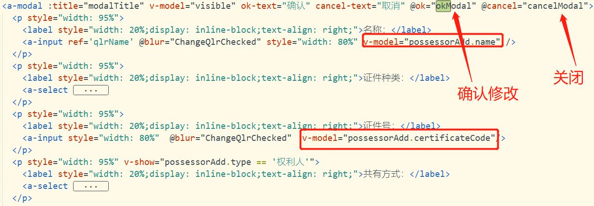

### 问题

- purchaseInsbill.vue文件需要修改接口  ————>  getQmTblPurchaseInsbill
  - 传过来的数据是 purchDataForm   是一个数组对象
  - 只传了一行数据过来
- 在created()钩子函数中：this.purdetailData = Object.assign({}, this.purchBillFormData);
  - 通过浅拷贝，拷贝传来的数据指针，共享内存
- 测试：物料凭证-》        5001739115

### 需要做的

- 把选中行的数据传入弹层，其中的实测值是多个数据通过`,`分隔开，点击行，弹出弹层
  - 我们要把实测值一个个截取出来，放到每个`input`中去
  - 然后在`beforeMount()`中判断是否有数据，如果没有，则显示8行空行，如果有，则显示数据（不足8行，需要添加空行补足）
  - 判断每行数据是否在每行中的数据是否在该范围内，如果是，则显示合格；如果不是，则显示不合格；如果范围为0，则显示不判定
- 当点击弹层的保存按钮后，
  - 修改的值要传回给选中行的要通过`,`合并成一个字符串
  - 判定范围是否为0，如果是，则返回不判定（2）；否则，如果存在有个值为不合格，则返回不合格（）；最后，返回合格
- 把值绑定返回测试值的`td`中。
  - （通过深拷贝的方式，拷贝td中的值；然后给其赋予弹层保存的值）

## 问题：

2021年7月30日17:05:46

#### `<el-input>`点击事件

`<el-input>` 组件取消了onclick事件，如果想监听点击事件我们可以给组件绑定原生事件。
在`<el-input>`上使用修饰符 .native如下实现

```vue
<el-input  v-on:click.native="handleClick" />
```

其他elmentui控件同样处理

#### 使input文本框不可编辑的3种方法

1. disabled 属性规定应该禁用 input 元素，被禁用的 input 元素，不可编辑，不可复制，不可选择，不能接收焦点,后台也不会接收到传值。设置后文字的颜色会变成灰色。disabled 属性无法与 `<input type="hidden"> `一起使用。

   ```vue
   <input type="text" disabled="disabled" />
   ```

2. readonly 属性规定输入字段为只读可复制，但是，用户可以使用Tab键切换到该字段，可选择,可以接收焦点，还可以选中或拷贝其文本。后台会接收到传值. readonly 属性可以防止用户对值进行修改。

   readonly 属性可与 `<input type="text"> `或` <input type="password">` 配合使用。

   ```vue
   <input type="text" readonly="readonly">
   ```

3. readonly unselectable="on" 该属性跟disable类似，input 元素，不可编辑，不可复制，不可选择，不能接收焦点，设置后文字的颜色也会变成灰色，但是后台可以接收到传值。

   ```vue
   <input type="text"  readonly  unselectable="on" >

### 赋值

```js
this.purdetailData.itemList.forEach((i) => {
    if(i.IIType == "尺寸类") {
        this.dataResource = Object.assign({}, i.detailList);	//浅拷贝
        this.dataResource = [...i.detailList];	// 三点运算符，算是深拷贝
    }
})
let newArr =  this.purdetailData.itemList.filter((item)=>{	// 过滤
    return item.IIType == "尺寸类"
})
```

#### vue中响应式值变化处理

##### 对于对象

- 对于已经创建的实例，Vue 不允许动态添加根级别的响应式 property。

- 但可使用`this.$set(object, propertyName, value)`、`Vue.set(object, propertyName, value)`方法向嵌套对象添加响应式proterty。

- 当为已有对象赋值多个新的property，如使用 `Object.assign()` 或 `_.extend()`。但是，这样添加到对象上的新 property 不会触发更新。在这种情况下，应该用原对象与要混合进去的对象的 property 一起创建一个新的对象。

  ```vue
  // 代替 `Object.assign(this.someObject, { a: 1, b: 2 })`
  this.someObject = Object.assign({}, this.someObject, { a: 1, b: 2 })
  ```

##### 对于数组

- Vue 不能检测以下数组的变动：
  1. 当你利用索引直接设置一个数组项时，例如：`vm.items[indexOfItem] = newValue`
  2. 当你修改数组的长度时，例如：`vm.items.length = newLength`
- `vm.$set(arrayName, indexOfItem, newValue)`

```vue
const vm = new Vue({
  data: {
    items: ['a', 'b', 'c']
  }
})
vm.items[1] = 'x' // 不是响应性的
vm.items.length = 2 // 不是响应性的
```

```vue
Vue.set(vm.items, indexOfItem, newValue)	// Vue.set
vm.items.splice(indexOfItem, 1, newValue)	// Array.prototype.splice

vm.items.splice(newLength)	//修改数组长度
vm.$set(vm.items, indexOfItem, newValue)
```

##### 对于 数组中嵌套对象

- `this.$set( 数组名, 索引, { 该列数组中对象的属性名 : 该属性赋予的值，可以是方法或者是函数 })`

```vue
data(){
	return {
		filldata: [
			{inputValue: "", result: "2", //0/1/2},
			{inputValue: "", result: "2", //0/1/2},
			{inputValue: "", result: "2", //0/1/2},
		]
	}
},
methods: {
	updateData(i) {
		this.$set(
          this.fillData,
          index,
          { result:this.fillData[index].inputValue, result: "1" }
        )
		this.$set( this.fillData, index, { result: "1" })
	}
	
}
```

#### 字符串与数组转换

- `split()`方法是将一个字符串按照某一分隔符进行拆分为数组，而`join()`则正好相反。
  `join()`方法用于把数组中的所有元素放入一个字符串，元素是通过指定的分隔符进行分隔的。
- 使用``concat`函数,在字符串后面追加一个或多个字符

```js
let arr = [1,2,3];	
let res = arr.join(",");	// 1,2,3

let str = "13"
let strAdd = srt.concat("-123","-456");
```

#### 循环

- `arr.forEach(callback(currentValue [, index [, array]])[, thisArg])`

#### 解决VUE中采用`v-model`双向绑定数据时导致修改了数据后取消编辑，原有数据改变的问题

- 

- 思路就是，文本框的值进行修改时不改变原有的值，只有当点击确认时才对原值进行修改。

  ```vue
  // 表格点击编辑事件：
  EditQlr (index, type) {
                  this.isEdit = index
                  if (type === 0) {
                      this.modalTitle = '编辑权利人'
                      //this.possessorAdd = this.dsQlr[index]
                      //使用Object.assign()防止原值被修改
  					let copy = Object.assign({}, this.dsQlr[index])
  					this.possessorAdd = copy
                  }
                  this.showModal()
  },
  ```

- 这样修改后就会发现无论点确认还是取消还是关闭模态框，修改过后的值都不能改变原值。那再处理一下模态框的点击确认事件。**$.set的使用方法**

  ```vue
  okModal () { 
        //this.isEdit指的是编辑的第几项，
        //默认值为-1，表示是添加时点击确认按钮，
        //>-1表示在编辑时点击确认按钮需要做的操作
  	if(this.isEdit>-1){
  	   //this.dsQlr：表格的数据源
  	   //this.isEdit：表示当前编辑的第几项
  	   //this.possessorAdd：模态框绑定的数据
  		this.$set(this.dsQlr,this.isEdit,this.possessorAdd)
      }
  	//其他操作
  	......
  }
  ```

- 点击取消和关闭模态框不会改变原值，只有点击确认才会修改。	

