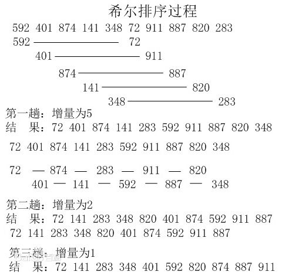

# 排序算法

### 冒泡排序

**原理：从第一个元素开始，把当前元素和下一个索引元素进行比较。如果当前元素大，那么就交换位置，重复操作直到比较到最后一个元素**

> 冒泡排序是从低到高（或从高到低）的单向排序。
>
> 注意：一般来说，排好序的元素都是放在数组最后面（因为大的会放后面），所以第二个循环要`-i`


```js
/* 冒泡排序 */
bubbleSort = (arr) => {
  let len = arr.length;
  for (let i = 0; i < len - 1; i++) {
    for (let j = 0; j < len - 1 - i; j++) {	// -i 是因为最后面的元素都已经排好序，不需要再比较
      if (arr[j] > arr[j + 1]) {
        [arr[j], arr[j + 1]] = [arr[j + 1], arr[j]];
      }
    }
  }
    console.log("冒泡排序：", arr);
  return arr;
}
bubbleSort([2, 5, 2, 1, 4, 7, 9, 4, 9, 3, 5, 8, 7]);  // [ 1, 2, 2, 3, 4, 4, 5, 5, 7, 7, 8, 9, 9 ]
```

#### 双向冒泡排序（鸡尾酒排序）

**原理：双向冒泡排序是从2个方向进行排序，“较大气泡从左到右移动，较小气泡从右到左移动”，2边遍历指针相遇时，排序结束。**

```js
/* 鸡尾酒排序 */
// 双向冒泡排序是从2个方向进行排序，奇数趟从低到高，偶数趟从高到底，2边遍历指针相遇时，排序结束。
bothwayBubbleSort = (arr) => {
  let left = 0, right = arr.length - 1;
  while (left < right) {
    for (let i = left + 1; i <= right; i++) { // 较大起泡从左向右移动
      if (arr[left] > arr[i]) {
        [arr[left], arr[i]] = [arr[i], arr[left]];
      }
    }
    left++;
    for (let i = right - 1; i >= left; i--) { // 较小起泡从右向左移动
      if (arr[i] > arr[right]) {
        [arr[right], arr[i]] = [arr[i], arr[right]];
      }
    }
    right--;
  }
  console.log("双向冒泡排序：", arr);
  return arr;
}
bothwayBubbleSort([2, 5, 2, 1, 4, 7, 9, 4, 9, 3, 5, 8, 7]);  // "双向冒泡排序：" [ 1, 2, 2, 3, 4, 4, 5, 5, 7, 7, 8, 9, 9 ]
```

### 选择排序

**原理：遍历数组，设置最小值的索引为 0，如果取出的值比当前最小值小，就替换最小值索引，遍历完成后，将第一个元素和最小值索引上的值交换。如上操作后，第一个元素就是数组中的最小值，下次遍历就可以从索引 1 开始重复上述操作。**


```js
selectionSort = (arr) => {
  let n = 0;
  for (let i = 0; i < arr.length - 1; i++, n++) {
    let minindex = i;
    for (let j = i + 1; j < arr.length; j++) {
      minindex = arr[j] < arr[minindex] ? j : minindex;
    }
    [arr[i], arr[minindex]] = [arr[minindex], arr[i]]
  }
  console.log(n, "选择排序：", arr);
  return arr;
}
selectionSort([2, 5, 2, 1, 4, 7, 9, 4, 9, 3, 5, 8, 7]);	// 12 '选择排序：' [ 1, 2, 2, 3, 4, 4, 5, 5, 7, 7, 8, 9, 9 ]
```

### 插入排序

#### 直接插入排序

**原理：第一个元素默认是已排序元素，取出下一个元素和当前元素比较，如果当前元素大就交换位置。那么此时第一个元素就是当前的最小数，所以下次取出操作从第三个元素开始，向前对比，重复之前的操作。**


```js
/* 插入排序
取后面的数跟前面的数比较，如果比前面的数小，则放到前面去；直到前面没有数比他小为止
如果比前面的数大，则跳出此次，开始下一次循环 */
insertSort = arr => {
  let i = 1;
  for (let i = 1; i < arr.length; i++) {
    for (let j = i; j > 0; j--) {
      if (arr[j] >= arr[j - 1]) {
        break;
      } else {
        [arr[j - 1], arr[j]] = [arr[j], arr[j - 1]];
        console.log("调换顺序的位置：",j,"，值：",arr[j-1],arr[j])
      }

    }
    console.log("插入排序：", arr);
  }
  console.log("插入排序：", arr);
  return arr;
}
insertSort([2, 5, 2, 1, 4, 7, 9, 4, 9, 3, 5, 8, 7]);  // 插入排序： [ 1, 2, 2, 3, 4, 4, 5, 5, 7, 7, 8, 9, 9 ]
```

#### 折半（二分）插入排序

直接插入排序的升级版，插入时与已排序好的序列的中间值（除2向下取整）对比，可缩小一般的对比范围。

```js
function binaryInsertionSort(array){
    var current, i, j, low, high, m;
    for(i = 1; i < array.length; i++){
        low = 0;
        high = i - 1;
        current = array[i];
        
        while(low <= high){            //步骤1&2:折半查找
            m = (low + high)>>1;
            if(array[i] >= array[m]){//值相同时, 切换到高半区，保证稳定性
                low = m + 1;        //插入点在高半区
            }else{
                high = m - 1;        //插入点在低半区
            }
        }
        for(j = i; j > low; j--){     //步骤3:插入位置之后的元素全部后移一位
            array[j] = array[j-1];
        }
        array[low] = current;         //步骤4:插入该元素
    }
    return array;
}
```

`x>>1`是位运算中的右移运算, 表示右移一位, 等同于x除以2再取整, 即`x>>1 == Math.floor(x/2)`.


### 希尔排序

原理：

选择一个增量序列 t1，t2，……，tk，其中 ti > tj, tk = 1；

按增量序列个数 k，对序列进行 k 趟排序；

每趟排序，根据对应的增量 ti，将待排序列分割成若干长度为 m 的子序列，分别对各子表进行直接插入排序。仅增量因子为 1 时，整个序列作为一个表来处理，表长度即为整个序列的长度。



```js
function shellSort(arr) {
  var len = arr.length,
    temp,
    gap = 1;
  // 动态定义间隔序列，也可以手动定义，如 gap = 5；
  while (gap < len / 5) {
    gap = gap * 5 + 1;
  }
  for (gap; gap > 0; gap = Math.floor(gap / 5)) {
    for (var i = gap; i < len; i++) {
      temp = arr[i];
      for (var j = i - gap; j >= 0 && arr[j] > temp; j -= gap) {
        arr[j + gap] = arr[j];
      }
      arr[j + gap] = temp;
    }
  }
  return arr;
}
```

希尔排序，也称递减增量排序算法，是插入排序的一种更高效的改进版本

1. 将数组拆分为若干个子分组, 每个分组由相距一定”增量”的元素组成.
2. 然后对每个子分组应用直接插入排序.
3. 逐步减小”增量”, 重复步骤1,2.
4. 直至”增量”为1, 这是最后一个排序, 此时的排序, 也就是对全数组进行直接插入排序.

增量 = 待分组序列长度 / 2 ，向下取整 （常规）

------

1. 选择一个增量序列 t1，t2，……，tk，其中 ti > tj, tk = 1；
2. 按增量序列个数 k，对序列进行 k 趟排序；
3. 每趟排序，根据对应的增量 ti，将待排序列分割成若干长度为 m 的子序列，分别对各子表进行直接插入排序。仅增量因子为 1 时，整个序列作为一个表来处理，表长度即为整个序列的长度。

```js
function shellSort(arr) {
  for(let gap = Math.floor(arr.length/2); gap > 0; gap = Math.floor(gap/2)) {
    // 内层循环与插入排序的写法基本一致，只是每次移动的步长变为 gap
    for(let i = gap; i < arr.length; i++) {
      let j = i;
      let temp = arr[j];
      for(; j> 0; j -= gap) {
        if(temp >= arr[j-gap]) {
          break;
        }
        arr[j] = arr[j-gap];
      }
      arr[j] = temp;
    }
  }
  return arr;
}
```


### 归并排序

原理：

（1） 把长度为n的输入序列分成两个长度为n/2的子序列；

（2）对这两个子序列分别采用归并排序；

（3） 将两个排序好的子序列合并成一个最终的排序序列。


```js
function mergeSort(arr) {  //采用自上而下的递归方法
  var len = arr.length;
  if (len < 2) {
    return arr;
  }
  var middle = Math.floor(len / 2),
    left = arr.slice(0, middle),
    right = arr.slice(middle);
  return merge(mergeSort(left), mergeSort(right));
}

function merge(left, right) {
  var result = [];
  while (left.length && right.length) {
    // 不断比较left和right数组的第一项，小的取出存入res
    left[0] < right[0] ? result.push(left.shift()) : result.push(right.shift());
  }
  return result.concat(left, right);
}
```

归并排序（Merge sort）是建立在归并操作上的一种有效的排序算法。该算法是采用分治法（Divide and Conquer）的一个非常典型的应用。
将数组拆分为两个子数组, 分别排序, 最后才将两个子数组合并; 拆分的两个子数组, 再继续递归拆分为更小的子数组, 进而分别排序, 直到数组长度为1, 直接返回该数组为止。

归并排序可通过两种方式实现：

1. 自上而下的递归
2. 自下而上的迭代

```js
function mergeSort(arr) {  // 采用自上而下的递归方法
  var len = arr.length;
  if (len < 2) {
    return arr;
  }
  var middle = Math.floor(len / 2),
    left = arr.slice(0, middle),
    right = arr.slice(middle);
  return merge(mergeSort(left), mergeSort(right));
}

function merge(left, right) {
  var result = [];

  while (left.length && right.length) {
    if (left[0] <= right[0]) {
      result.push(left.shift());
    } else {
      result.push(right.shift());
    }
  }

  while (left.length)
    result.push(left.shift());

  while (right.length)
    result.push(right.shift());

  return result;
}
```


### 快速排序

**原理：在数据集之中，找一个基准点，建立两个数组，分别存储左边和右边的数组，利用递归进行下次比较。**


```js
function quickSort(arr) {
  if (!Array.isArray(arr)) return;
  if (arr.length <= 1) return arr;
  var left = [], right = [];
  var num = Math.floor(arr.length / 2);
  var numValue = arr.splice(num, 1)[0];
  for (var i = 0; i < arr.length; i++) {
    if (arr[i] > numValue) {
      right.push(arr[i]);
    } else {
      left.push(arr[i]);
    }
  }
  return [...quickSort(left), numValue, ...quickSort(right)]
}
```

1. 从数列中挑出一个元素，称为 "基准"（pivot）;
2. 重新排序数列，所有元素比基准值小的摆放在基准前面，所有元素比基准值大的摆在基准的后面（相同的数可以到任一边）。在这个分区退出之后，该基准就处于数列的中间位置。这个称为分区（partition）操作；
3. 递归地（recursive）把小于基准值元素的子数列和大于基准值元素的子数列排序；

它将数组拆分为两个子数组, 其中一个子数组的所有元素都比另一个子数组的元素小, 然后对这两个子数组再重复进行上述操作, 直到数组不可拆分, 排序完成。


```js
function quickSort(arr, left, right) {
  var len = arr.length,
    partitionIndex,
    left = typeof left != 'number' ? 0 : left,
    right = typeof right != 'number' ? len - 1 : right;

  if (left < right) {
    partitionIndex = partition(arr, left, right);
    quickSort(arr, left, partitionIndex - 1);
    quickSort(arr, partitionIndex + 1, right);
  }
  return arr;
}

function partition(arr, left, right) {     // 分区操作
  var pivot = left,                      // 设定基准值（pivot）
    index = pivot + 1;
  for (var i = index; i <= right; i++) {
    if (arr[i] < arr[pivot]) {
      swap(arr, i, index);
      index++;
    }
  }
  swap(arr, pivot, index - 1);
  return index - 1;
}

function swap(arr, i, j) {
  var temp = arr[i];
  arr[i] = arr[j];
  arr[j] = temp;
}

// or

function partition2(arr, low, high) {
  let pivot = arr[low];
  while (low < high) {
    while (low < high && arr[high] > pivot) {
      --high;
    }
    arr[low] = arr[high];
    while (low < high && arr[low] <= pivot) {
      ++low;
    }
    arr[high] = arr[low];
  }
  arr[low] = pivot;
  return low;
}

function quickSort2(arr, low, high) {
  if (low < high) {
    let pivot = partition2(arr, low, high);
    quickSort2(arr, low, pivot - 1);
    quickSort2(arr, pivot + 1, high);
  }
  return arr;
}

// or 

// 快排
function quickSort(arr, i, j) {
  if (i < j) {
    let left = i;
    let right = j;
    let pivot = arr[left];
    while (i < j) {
      while (arr[j] >= pivot && i < j) {  // 从后往前找比基准小的数
        j--;
      }
      if (i < j) {
        arr[i++] = arr[j];
      }
      while (arr[i] <= pivot && i < j) {  // 从前往后找比基准大的数
        i++;
      }
      if (i < j) {
        arr[j--] = arr[i];
      }
    }
    arr[i] = pivot;
    quickSort(arr, left, i - 1);
    quickSort(arr, i + 1, right);
    return arr;
  }
}
```


### 堆排序

堆排序（Heapsort）是指利用堆这种数据结构所设计的一种排序算法。堆积是一个近似完全二叉树的结构，并同时满足堆积的性质：即子结点的键值或索引总是小于（或者大于）它的父节点。

1. 大顶堆：每个节点的值都大于或等于其子节点的值，在堆排序算法中用于升序排列；
2. 小顶堆：每个节点的值都小于或等于其子节点的值，在堆排序算法中用于降序排列；

------

1. 比较父节点是否大于叶子节点（把最大的放在父子节点），直到一趟建堆完成，最大的一定在堆顶。
2. 把堆顶和最右下的叶子节点对换，再把右下叶子节点（最大值）抽出。


```js
var len;    // 因为声明的多个函数都需要数据长度，所以把len设置成为全局变量

function buildMaxHeap(arr) {   // 建立大顶堆
  len = arr.length;
  for (var i = Math.floor(len / 2); i >= 0; i--) {
    heapify(arr, i);
  }
}

// 2 * i  非叶子节点
function heapify(arr, i) {     // 堆调整
  var left = 2 * i + 1,
    // 左叶子节点
    right = 2 * i + 2,
    // 右叶子节点
    largest = i;

  if (left < len && arr[left] > arr[largest]) {
    largest = left;
  }

  if (right < len && arr[right] > arr[largest]) {
    largest = right;
  }

  if (largest != i) {
    swap(arr, i, largest);
    heapify(arr, largest);
  }
}

function swap(arr, i, j) {
  var temp = arr[i];
  arr[i] = arr[j];
  arr[j] = temp;
}

function heapSort(arr) {
  buildMaxHeap(arr);

  for (var i = arr.length - 1; i > 0; i--) {
    swap(arr, 0, i);
    len--;
    heapify(arr, 0);
  }
  return arr;
}
```


### 计数排序

计数排序是唯一不基于比较的排序算法。
计数排序不是比较排序，排序的速度快于任何比较排序算法。
适合处理一定范围内的整数排序。
计数排序利用了一个特性, 对于数组的某个元素, 一旦知道了有多少个其它元素比它小(假设为m个), 那么就可以确定出该元素的正确位置(第m+1位)

1. 找出待排序的数组中最大和最小的元素
2. 统计数组中每个值为i的元素出现的次数，存入数组C的第i项
3. 对所有的计数累加（从C中的第一个元素开始，每一项和前一项相加）
4. 反向填充目标数组：将每个元素i放在新数组的第C(i)项，每放一个元素就将C(i)减去1

------

1. 花O(n)时间获取数组A的最小值min，最大值max
2. 开辟新的空间创建新数组B，长度为(`max - min + 1`)
3. B中`index`元素记录的是A中某元素出现的次数
4. 遍历数组B，输出相应的元素及其个数


```js
function countingSort(arr, maxValue) {
  var bucket = new Array(maxValue + 1),
    sortedIndex = 0;
  arrLen = arr.length,
    bucketLen = maxValue + 1;

  for (var i = 0; i < arrLen; i++) {
    if (!bucket[arr[i]]) {
      bucket[arr[i]] = 0;
    }
    bucket[arr[i]]++;
  }

  for (var j = 0; j < bucketLen; j++) {
    while (bucket[j] > 0) {
      arr[sortedIndex++] = j;
      bucket[j]--;
    }
  }

  return arr;
}
```


### 桶排序

桶排序（箱排序）是计数排序的升级版。
它是将数组分配到有限数量的桶子里. 每个桶里再各自排序(因此有可能使用别的排序算法或以递归方式继续桶排序). 当每个桶里的元素个数趋于一致时, 桶排序只需花费O(n)的时间.
桶排序的核心就在于怎么把元素平均分配到每个桶里, 合理的分配将大大提高排序的效率.
当输入的数据可以均匀的分配到每一个桶中的时候最快。


```js
function bucketSort(arr, bucketSize) {
  if (arr.length === 0) {
    return arr;
  }

  var i;
  var minValue = arr[0];
  var maxValue = arr[0];
  for (i = 1; i < arr.length; i++) {
    if (arr[i] < minValue) {
      minValue = arr[i];                // 输入数据的最小值
    } else if (arr[i] > maxValue) {
      maxValue = arr[i];                // 输入数据的最大值
    }
  }

  //桶的初始化
  var DEFAULT_BUCKET_SIZE = 5;            // 设置桶的默认数量为5
  bucketSize = bucketSize || DEFAULT_BUCKET_SIZE;
  var bucketCount = Math.floor((maxValue - minValue) / bucketSize) + 1;
  var buckets = new Array(bucketCount);
  for (i = 0; i < buckets.length; i++) {
    buckets[i] = [];
  }

  //利用映射函数将数据分配到各个桶中
  for (i = 0; i < arr.length; i++) {
    buckets[Math.floor((arr[i] - minValue) / bucketSize)].push(arr[i]);
  }

  arr.length = 0;
  for (i = 0; i < buckets.length; i++) {
    insertionSort(buckets[i]);                      // 对每个桶进行排序，这里使用了插入排序
    for (var j = 0; j < buckets[i].length; j++) {
      arr.push(buckets[i][j]);
    }
  }

  return arr;
}
```


### 基数排序

基数排序是一种非比较型整数排序算法，其原理是将整数按位数切割成不同的数字，然后按每个位数分别比较。由于整数也可以表达字符串（比如名字或日期）和特定格式的浮点数，所以基数排序也不是只能使用于整数。
按照优先从高位或低位来排序有两种实现方案:

- MSD: 由高位为基底, 先按k1排序分组, 同一组中记录, 关键码k1相等, 再对各组按k2排序分成子组, 之后, 对后面的关键码继续这样的排序分组, 直到按最次位关键码kd对各子组排序后. 再将各组连接起来, 便得到一个有序序列. MSD方式适用于位数多的序列.
- LSD: 由低位为基底, 先从kd开始排序，再对kd-1进行排序，依次重复，直到对k1排序后便得到一个有序序列. LSD方式适用于位数少的序列.


```js
function radixSort(array, max) {
  var buckets = [],
    unit = 10,
    base = 1;
  for (var i = 0; i < max; i++, base *= 10, unit *= 10) {
    for (var j = 0; j < array.length; j++) {
      var index = ~~((array[j] % unit) / base);//依次过滤出个位,十位等等数字
      if (buckets[index] == null) {
        buckets[index] = []; //初始化桶
      }
      buckets[index].push(array[j]);//往不同桶里添加数据
    }
    var pos = 0,
      value;
    for (var j = 0, length = buckets.length; j < length; j++) {
      if (buckets[j] != null) {
        while ((value = buckets[j].shift()) != null) {
          array[pos++] = value; //将不同桶里数据挨个捞出来,为下一轮高位排序做准备,由于靠近桶底的元素排名靠前,因此从桶底先捞
        }
      }
    }
  }
  return array;
}
```


# 设计模式


